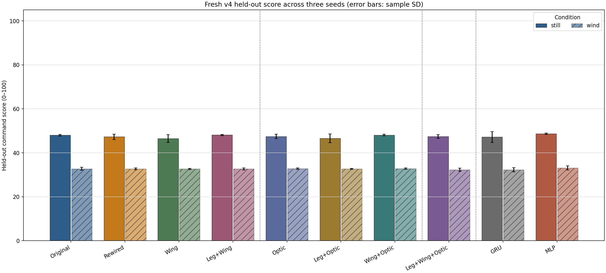
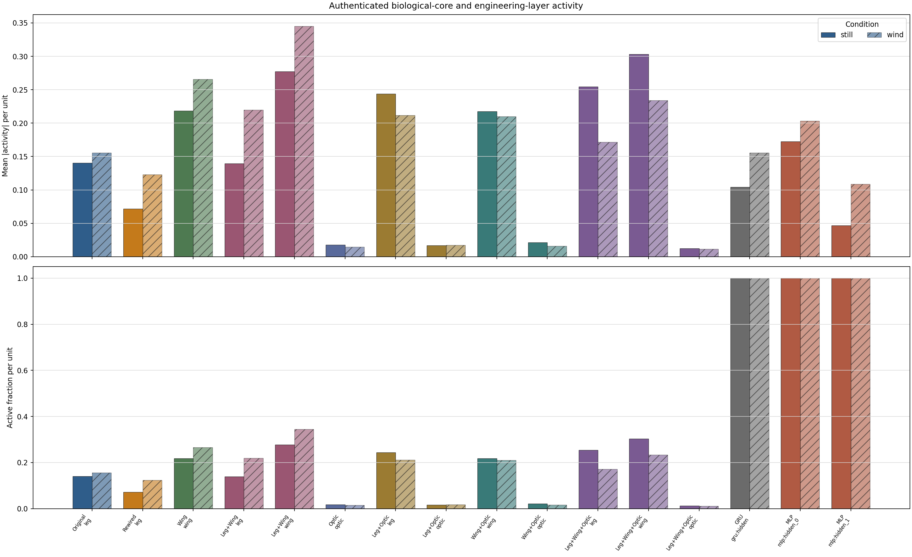

# Crazyflie learned keyboard-command control

Simulation-only Isaac Lab research comparing frozen MaleCNS-derived spiking
controllers with GRU and MLP baselines for direct, body-relative Crazyflie
velocity control. The current main study is complete: **60/60 training and
evaluation jobs passed independent artifact validation**.

## Main result

Revision 4 trained 10 controllers in still air and deterministic physical wind
for seeds 0, 1, and 2. Every job used 1,000,000 environment interactions, and
every checkpoint was tested on 16 deterministic 600-step held-out episodes.
That is **60,000,000 training interactions and 960 evaluation episodes**.

The values below are mean ± sample standard deviation across three seeds. The
score is a custom bounded 0–100 control-quality index, **not an accuracy or
success percentage**. It combines velocity/yaw tracking, direction, response,
braking, hover, survival, action effort, and smoothness.

| Controller | Capacity tier | Actor parameters | Still score | Wind score | Wind − still | Wind survival (%) |
| --- | --- | ---: | ---: | ---: | ---: | ---: |
| Original leg LIF | one core | 4,776 | 48.039 ± 0.361 | 32.747 ± 0.709 | −15.292 ± 1.062 | 67.962 ± 1.281 |
| Degree-rewired leg LIF | one core | 4,776 | 47.271 ± 1.154 | 32.710 ± 0.370 | −14.560 ± 1.169 | 66.396 ± 1.234 |
| Wing-thoracic LIF | one core | 4,776 | 46.502 ± 1.771 | 32.663 ± 0.259 | −13.838 ± 2.012 | 67.712 ± 2.544 |
| Optic LIF | one core | 4,776 | 47.442 ± 0.999 | 32.849 ± 0.318 | −14.594 ± 0.982 | 70.038 ± 1.173 |
| Leg + wing LIF | two cores | 9,224 | 48.130 ± 0.264 | 32.676 ± 0.452 | −15.454 ± 0.682 | 69.340 ± 1.826 |
| Leg + optic LIF | two cores | 9,224 | 46.575 ± 2.004 | 32.745 ± 0.221 | −13.830 ± 2.165 | 66.573 ± 1.199 |
| Wing + optic LIF | two cores | 9,224 | 48.070 ± 0.380 | 32.816 ± 0.346 | −15.254 ± 0.110 | 68.146 ± 0.922 |
| Leg + wing + optic LIF | three cores | 13,672 | 47.436 ± 0.859 | 32.336 ± 0.737 | −15.100 ± 0.540 | 65.465 ± 3.388 |
| Matched GRU | one-core engineering baseline | 4,793 | 47.203 ± 2.446 | 32.304 ± 0.977 | −14.900 ± 3.340 | 65.944 ± 2.450 |
| Normal MLP | one-core engineering baseline | 4,827 | **48.680 ± 0.326** | **33.140 ± 0.910** | −15.540 ± 0.595 | **70.743 ± 4.675** |

All controllers had 100% held-out survival in still air. The MLP had the
highest observed mean total score in both conditions, but three seeds are not
enough to establish statistical superiority. Among capacity-matched one-core
LIF controllers, the original leg circuit led in still air and the optic
circuit led in wind. The original and degree-rewired leg circuits were nearly
tied in wind, so this experiment does not establish a robust topology
advantage.

Wind was the dominant effect: every controller lost 13.8–15.5 score points,
and mean survival fell to 65.5–70.7%. The held-out linear-tracking component
was only about 8.5–9.4/100 in still air and fell to approximately zero in wind.
The policies survived the complete still-air protocol, but tracking remains
limited and wind robustness is poor.



The complete per-seed values, raw metrics, reward/loss curves, activity,
latency, memory, checksums, and immutable job evidence are in the
[revision-4 report](docs/crazyflie_command_all_fair_report_v4.md).

## What this project does

The project extends the installed `Isaac-Quadcopter-Direct-v0` environment
without editing Isaac Lab. A learned policy tracks commands produced by held
keyboard keys:

| Keys | Body-relative command |
| --- | --- |
| `W` / `S` | forward / backward |
| `A` / `D` | left / right |
| `I` or `E` / `Q` | up / down |
| `J` / `L` | yaw left / right |
| `H` or `Space` | release motion and hover |
| `R` | reset and establish a new hover point |
| `Esc` | clean exit |

Axes can be combined, for example `W+A+I+J`. The trained envelope is 1.0 m/s
horizontal speed, 0.5 m/s vertical speed, and 1.5 rad/s yaw rate. Each policy
maps a 12-value state/error observation to the native four aggregate-wrench
actions. The observation contains velocity/yaw tracking error, projected
gravity, and integrated target-position error. It contains no camera pixels
and no explicit wind measurement; the optic controller is a frozen recurrent
topology, not a visual-input model.

The two evaluated tasks are:

- `FlyCrazyflie-CommandFollowWide-v0` for still air.
- `FlyCrazyflie-CommandFollowWideWind-v0` for the same commands plus a
  deterministic world-frame force/torque wrench applied at the body center of
  mass.

The controllers are eight frozen LIF variants built from authenticated leg,
wing-thoracic, and optic 256-neuron subsets, plus a matched GRU and normal MLP.
Within each LIF actor, only the observation/action adapters train; PPO also
trains a separate conventional critic. Multi-core models keep the biological
graphs independent and concatenate their readouts; they do not invent
recurrent edges between graphs.

## Controller connectivity and observed activity

The three frozen LIF cores are sparse directed subgraphs extracted from the
same pinned MaleCNS v1.0 release. Every selected neuron lies on a selected
input-to-output path. The edge signs below are model assumptions derived from
transmitter labels, not measured conductances.

| Frozen core | Selected neuron roles | Directed edges | Modeled edge signs |
| --- | --- | ---: | ---: |
| Leg | 24 sensory + 8 descending inputs, 200 VNC interneurons, 24 motor readouts | 5,103 | 3,549 excitatory + 1,554 inhibitory |
| Wing-thoracic | 20 sensory + 12 descending inputs, 200 VNC intrinsic neurons, 24 wing-motor readouts | 8,864 | 6,726 excitatory + 2,138 inhibitory |
| Optic | 32 optic sensory inputs, 200 optic intrinsic neurons, 24 visual-projection readouts | 1,628 | 1,220 excitatory + 408 inhibitory |

The exact source, selection rules, checksums, neuron IDs, and edges are in the
[leg](data/connectome/manifest.json), [wing](data/connectome_wing/manifest.json),
and [optic](data/connectome_optic/manifest.json) manifests. The rewired leg
control retains all 5,103 weights, signs, and per-neuron directed in/out
degrees, but changes the endpoints with 51,030 deterministic valid edge swaps;
its frozen artifact is
[here](configs/experiments/crazyflie_rewire_seed_20260916.json).

| Controller | Action-path connectivity | Actor params | Held-out activity, still / wind |
| --- | --- | ---: | --- |
| Original leg LIF | `12 -> 64 -> 32 inputs -> leg[256; 5,103 edges] -> 24 readouts -> 64 -> 4` | 4,776 | leg spikes: 14.022% / 15.542% |
| Degree-rewired leg LIF | Same widths and degrees as original; rewired frozen leg endpoints | 4,776 | leg spikes: 7.165% / 12.307% |
| Wing-thoracic LIF | `12 -> 64 -> 32 inputs -> wing[256; 8,864 edges] -> 24 readouts -> 64 -> 4` | 4,776 | wing spikes: 21.861% / 26.580% |
| Optic LIF | `12 -> 64 -> 32 inputs -> optic[256; 1,628 edges] -> 24 readouts -> 64 -> 4` | 4,776 | optic spikes: 1.789% / 1.451% |
| Leg + wing LIF | Two independent 256-neuron cores; 48 concatenated readouts; 13,967 frozen edges total | 9,224 | leg: 13.949% / 21.975%; wing: 27.749% / 34.511% |
| Leg + optic LIF | Two independent cores; 48 concatenated readouts; 6,731 frozen edges total | 9,224 | leg: 24.364% / 21.167%; optic: 1.687% / 1.752% |
| Wing + optic LIF | Two independent cores; 48 concatenated readouts; 10,492 frozen edges total | 9,224 | wing: 21.755% / 21.011%; optic: 2.115% / 1.620% |
| Leg + wing + optic LIF | Three independent cores; 72 concatenated readouts; 15,595 frozen edges total | 13,672 | leg: 25.441% / 17.155%; wing: 30.305% / 23.388%; optic: 1.256% / 1.133% |
| Matched GRU | Dense three-gate `GRUCell`: `12 -> 33`, recurrent `33 -> 33`, then `33 -> 4` | 4,793 | mean absolute hidden activation: 0.10429 / 0.15552 |
| Normal MLP | Dense feed-forward `12 -> 61 -> 61 -> 4`; no recurrent state | 4,827 | mean absolute layer activations: 0.17249/0.04655 / 0.20328/0.10874 |

LIF activity is the fraction of sampled binary spikes, averaged across the
three seeds. GRU and MLP values are mean absolute continuous activations and
must not be numerically compared with spike fractions. These are observations
from the actual action-producing held-out forwards, not causal importance
scores. The complete per-seed, per-core, per-role, and per-unit activity is in
the [revision-4 report](docs/crazyflie_command_all_fair_report_v4.md); all
controllers also use the same separate `12 -> 128 -> 128 -> 1` PPO critic.

## What was analyzed

The held-out score weights linear tracking at 30%; safety/survival at 15%;
yaw tracking, direction, response, braking, and hover at 10% each; and effort
and smoothness at 2.5% each. The report additionally analyzes:

- paired still-versus-wind degradation under identical command schedules;
- acceleration quality, attitude/angular stability, and invalid states;
- PPO reward/loss histories and exact one-million-interaction budgets;
- action-producing LIF spikes by authenticated core and neuron role, plus GRU
  and MLP hidden-unit activity;
- trainable parameter count, recurrent state per environment, inference
  latency, and score per 1,000 actor parameters;
- training/evaluation RAM and VRAM, checkpoint/history hashes, schedule
  identity, and frozen-core before/after checksums.

The activity measurements are correlations, not causal evidence. LIF spikes
also cannot be compared as if they had the same physical units as GRU or MLP
activations. Inference on 16 environments was approximately 0.46 ms for GRU,
0.48 ms for MLP, 1.1 ms for one-core LIF, 1.7–1.8 ms for two-core LIF, and
2.4 ms for the three-core LIF on this machine. Every job remained below the
6,963.2 MiB VRAM gate; the largest reported training peak was 3,386 MiB, the
largest evaluation peak was 3,257 MiB, and no sustained paging gate failed.



## Interpretation limits

- Results are from Isaac simulation, not hardware flight.
- Wind is a versioned external wrench, not a complete aerodynamic model.
- There are only three training seeds; the table is descriptive and contains
  no significance test.
- One-core LIF, GRU, and MLP actors are near capacity-matched. Two- and
  three-core LIF results are cross-capacity comparisons and must not be used
  to claim a topology advantage from raw score alone.
- The MaleCNS-derived circuits are selected 256-neuron engineering models,
  not a complete fly brain. Signed/scaled LIF weights are modeling
  transformations, not measured biological conductances.
- Frozen-core integrity passed for all LIF jobs, but activity differences do
  not prove that a named population caused a score difference.

## Reproduce or inspect

The recorded Isaac Lab installation is
`/home/chayanin/Downloads/IsaacLab` at commit
`b4c321024792976150ca55fddb26fa34480d974e`. Use the dedicated interpreter:

```bash
cd /home/chayanin/Desktop/flyg1
ISAAC_PYTHON=/home/chayanin/Downloads/miniforge3/envs/env_isaaclab/bin/python
"$ISAAC_PYTHON" -m pip install -e '.[data,monitor]'
"$ISAAC_PYTHON" -m pytest tests/unit -q
"$ISAAC_PYTHON" scripts/crazyflie_command_all_fair_queue_v4.py \
  --config configs/experiments/crazyflie_command_all_fair_seeds0_1_2_1m.json \
  --status
```

The completed matrix must not be relaunched merely to inspect it. Its
[configuration](configs/experiments/crazyflie_command_all_fair_seeds0_1_2_1m.json),
[queue](runs/crazyflie_command_all_fair_seeds0_1_2_1m/queue.json), and
[queue summary](runs/crazyflie_command_all_fair_seeds0_1_2_1m/queue_summary.json)
are the machine-readable execution record. See [plan.md](plan.md) for the
experiment contract and canonical commands.

## Reports and provenance

- [Complete 60-cell Crazyflie report](docs/crazyflie_command_all_fair_report_v4.md)
- [Historical seed-0 LIF activity analysis](docs/crazyflie_lif_activity_analysis.md)
- [Task and environment contract](docs/crazyflie_task_spec.md)
- [Leg connectome provenance and modeling caveats](data/connectome/README.md)
- [Wing connectome manifest](data/connectome_wing/manifest.json)
- [Optic connectome manifest](data/connectome_optic/manifest.json)

## Preserved Unitree work

The earlier Unitree G1 free-posture project remains preserved. Its main policy
route is:

`G1 observations -> trainable encoder -> frozen LIF circuit -> trainable decoder -> bounded joint-position targets -> Isaac Sim PD actuators`

The user's public MaleCNS v1.0 Feather files are copied under
`data/connectome/raw/`, and a derived leg VNC circuit is available through
`data/connectome/manifest.json`; see the
[data provenance and download links](data/connectome/README.md). Synthetic
circuits exist only under `tests/fixtures` and are rejected by the research
training command. The separate stock G1/Go1 flat/rough queue is under
`stock_isaaclab_runs/`; neither Unitree result is included in the Crazyflie
table above.

### Unitree installation and historical commands

The inspected installation is `/home/chayanin/Downloads/IsaacLab` at commit `b4c321024792976150ca55fddb26fa34480d974e` (Isaac Lab 0.54.4).  Use its dedicated interpreter, not the system Python:

```bash
/home/chayanin/Downloads/miniforge3/envs/env_isaaclab/bin/python -m pip install -e '.[data,monitor]'
```

Then use that same Python for every command below.  `scripts/doctor.py` reports any drift instead of guessing compatibility.

```bash
python scripts/doctor.py
python scripts/memory_watch.py --output runs/g1-memory.csv --interval 2 --count 3
python -m pytest tests/unit -q
python scripts/inspect_asset.py --headless
python scripts/smoke_env.py --task FlyG1-GoalReach-FreePosture-v0 --num_envs 16 --steps 1000 --random_actions --random_action_scale 0.1 --headless --output_report runs/smoke-16x1000-verified.json
python scripts/train.py --task FlyG1-GoalReach-FreePosture-v0 --policy mlp --num_envs 16 --max_iterations 10 --seed 0 --headless
python scripts/train.py --task FlyG1-GoalReach-FreePosture-v0 --policy frozen_lif --connectome_manifest data/connectome/manifest.json --num_envs 16 --max_iterations 10 --seed 0 --headless
```

The first simulator launch must be run on a machine with an installed Isaac Sim runtime and a compatible NVIDIA driver.  A successful smoke test only validates loading/stepping; it is not a locomotion result.  See [docs/environment.md](docs/environment.md), [docs/task_spec.md](docs/task_spec.md), and [docs/model_spec.md](docs/model_spec.md).

The [current matrix](runs/main_matrix_malecns_v1_heldout_v3_20260913.json) contains four conditions × five training seeds. The historical [one-update integration v2](runs/main_matrix_integration_v2_20260913.json) completed all four training paths and three held-out evaluations per condition; its [comparison report](runs/main_matrix_integration_v2_20260913_comparison.md) checked schedules and paired initial states but does not establish sustained training. A [60-update original-LIF pilot](runs/train-replay-dense-v5/20260913T145118Z/FlyG1-GoalReach-FreePosture-v0/frozen_lif/seed-0/manifest.json) then completed 30,720 interactions through an episode reset and saved a checkpoint. The v3 queue is **paused**: original-LIF seeds 0 and 1 each passed a 5,000,192-interaction training job and all three 16-episode held-out evaluations; seed 2 stopped after 6,618 logged updates without a checkpoint, and 17 jobs remain untouched and ready. Its saved JSON still labels seed 2 "running," but no matrix runner or trainer is live. The [partial comparison](runs/main_matrix_malecns_v1_heldout_v3_20260913_comparison.md) validates 2/20 jobs with no errors, while the complete five-seed comparison remains pending. The [four-condition integration v3](runs/main_matrix_integration_v3_20260913.json) completed four one-update, 512-interaction jobs and all 12 held-out evaluations. Its [comparison report](runs/main_matrix_integration_v3_20260913_comparison.md) validates four jobs with no errors and shared schedule, episode-plan, and initial-state hashes within each scenario across conditions. This is a pipeline check, not evidence of useful learning or comparative efficacy. Resume only when ready: the wrapper revalidates seeds 0 and 1 and restarts seed 2 from update zero. The queue requires a current-code, 16-environment, 1,000-step bounded-random-action smoke report, runs jobs sequentially, and verifies checkpoint and evaluation artifacts on resume. Each full-budget checkpoint is evaluated on GoalReach, GoalSwitch, and PushRecovery with the fixed `heldout_v1` target/push schedule. The comparison summarizer uses independent training seeds and labels incomplete matrices. See [resume instructions](docs/training.md) and [current results and limits](docs/results.md) before interpreting performance.

The user's [RAM/VRAM addendum](docs/memory_plan_source_th.md) is integrated into [plan.md](plan.md) as staged measurement and scale-up gates. Its Windows RTX 4060/24 GB target differs from this Linux RTX 5060 development machine; the existing 16-environment pilot does not prove that the full MaleCNS graph fits either 8 GB card.
