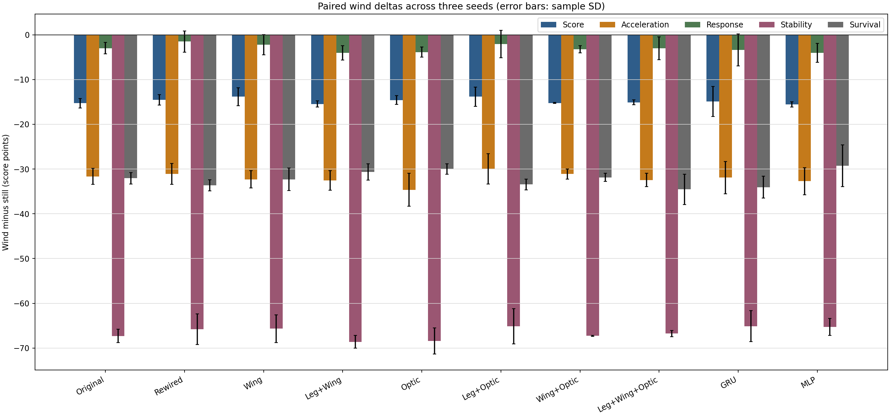
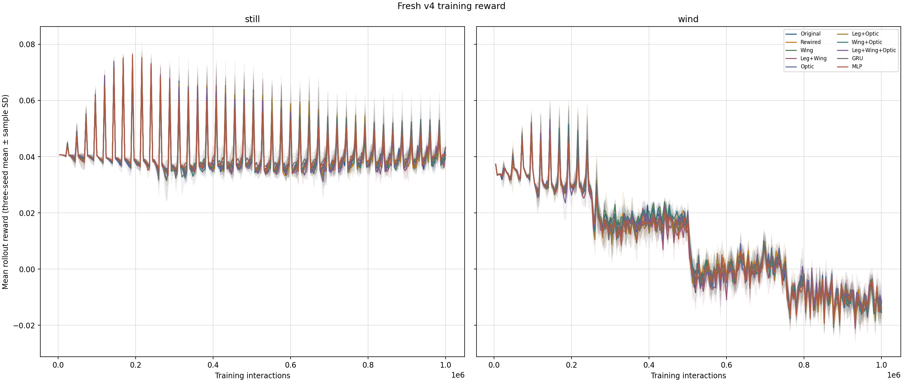
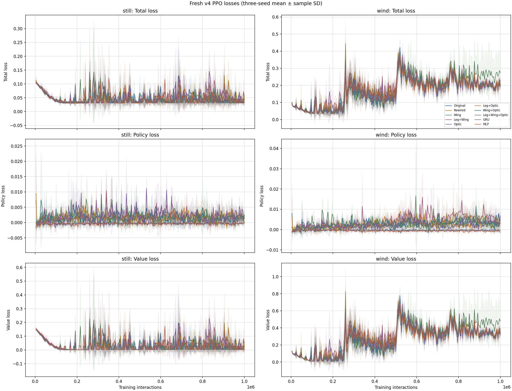
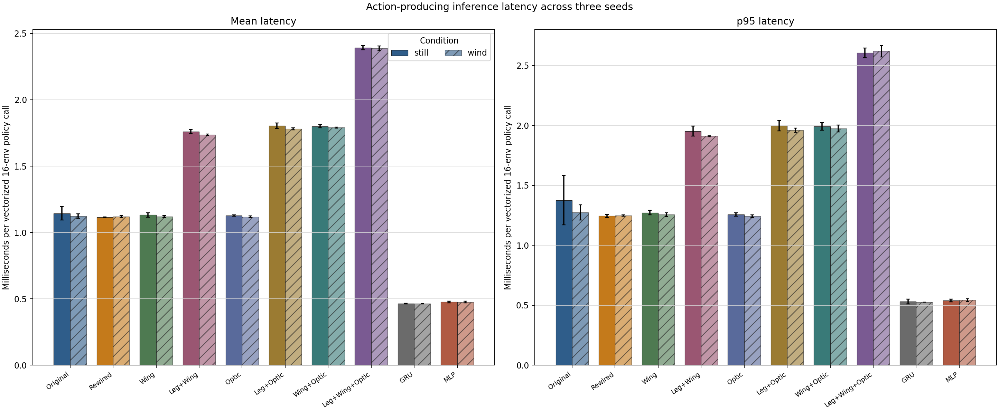
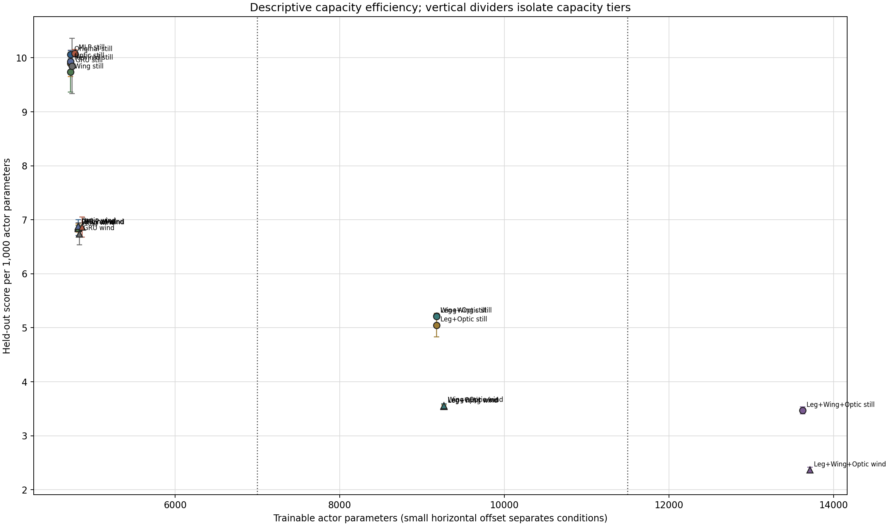
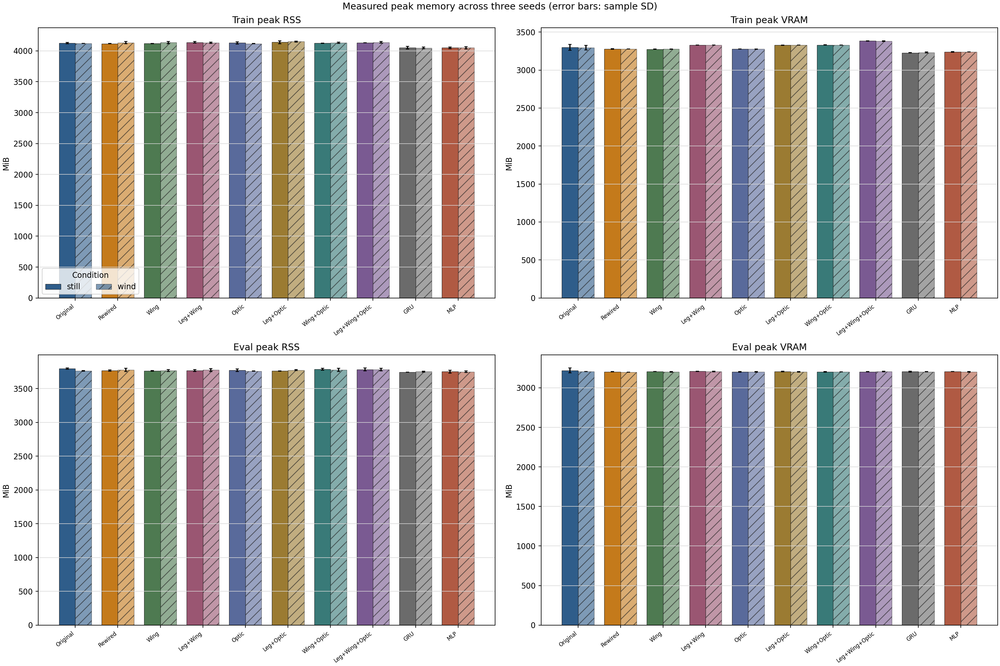

# Crazyflie all-fair command-control comparison (revision 4)

Report state: **COMPLETE — all 60 fresh revision-4 cells independently verified**

## Executive summary

The highest observed three-seed mean held-out score is 48.680 for `mlp_normal` in `still`. This is a descriptive result, not a causal topology claim. Exact architecture comparisons are restricted to controllers in the same capacity tier.

All 60 jobs trained from fresh initialization for exactly 1,000,000 interactions and contributed 16 held-out episodes of 600 steps: 60,000,000 training interactions and 960 evaluation episodes in total.

Seeds 0, 1, and 2 each passed the reset-invariant paired-command identity gate; all ten wind cells within a seed also shared one wind schedule.

Generated (UTC): `2026-09-19T06:55:26+00:00`  
Config SHA-256: `96be75b06a4233c49c3cf964ca63d7cb581b0059a4bbbd858f3c2067199d91d7`  
Queue snapshot SHA-256: `544c5305a52821cc1ea224b29413f55b8ce114022f9ea8d26a67a75122a2d813`

## Evidence boundary and fairness

This report uses only the 60 new revision-4 cells: 10 controllers × 2 conditions × 3 independent seeds. Revision-2 and revision-3 artifacts are preserved by pinned identity only; none of their scores, episodes, histories, latencies, activity, or resource measurements are merged here.

The one-core LIF tier compares Original, Rewired, Wing, and Optic at exactly 4,776 actor parameters and 1,024 dynamic-state values per environment. The two-core LIF tier compares Leg+Wing, Leg+Optic, and Wing+Optic at exactly 9,224 actor parameters and 2,048 state values. The three-core LIF has 13,672 actor parameters and 3,072 state values and is isolated. GRU (4,793 actor parameters) and MLP (4,827) are near-capacity engineering baselines for the one-core tier. Cross-tier comparisons are descriptive only.

Activity values are observed correlations from actual action-producing forwards; they do not establish causal neuron or connectome effects.

## Per-seed 20-cell results

### Seed 0

| Controller | Condition | Capacity tier | Actor params | State/env | Score | Tracking | Acceleration | Response | Stability | Survival | Final train reward | Final loss | Inference mean ms / 16-env call | Train peak VRAM MiB | Eval peak VRAM MiB |
| --- | --- | --- | --- | --- | --- | --- | --- | --- | --- | --- | --- | --- | --- | --- | --- |
| original_lif | still | one-core LIF (4,776 actor parameters) | 4776 | 1024 | 48.251 | 9.007 | 98.001 | 64.502 | 77.449 | 100.000 | 0.042 | 0.03256 | 1.2042 | 3344.0 | 3257.0 |
| original_lif | wind | one-core LIF (4,776 actor parameters) | 4776 | 1024 | 32.521 | 0.003 | 66.066 | 61.309 | 9.803 | 67.135 | -0.008 | 0.17771 | 1.1068 | 3330.0 | 3206.0 |
| rewired_lif | still | one-core LIF (4,776 actor parameters) | 4776 | 1024 | 46.111 | 8.785 | 96.526 | 62.934 | 74.507 | 100.000 | 0.038 | 0.03701 | 1.1164 | 3276.0 | 3200.0 |
| rewired_lif | wind | one-core LIF (4,776 actor parameters) | 4776 | 1024 | 32.457 | 0.007 | 68.134 | 59.706 | 12.627 | 66.406 | -0.013 | 0.21214 | 1.1125 | 3278.0 | 3200.0 |
| wing_lif | still | one-core LIF (4,776 actor parameters) | 4776 | 1024 | 45.945 | 8.086 | 96.726 | 62.934 | 74.838 | 100.000 | 0.040 | 0.03267 | 1.1143 | 3276.0 | 3206.0 |
| wing_lif | wind | one-core LIF (4,776 actor parameters) | 4776 | 1024 | 32.848 | 0.009 | 66.634 | 60.687 | 12.323 | 65.823 | -0.014 | 0.38649 | 1.1100 | 3275.0 | 3200.0 |
| leg_wing_lif | still | two-core LIF (9,224 actor parameters) | 9224 | 2048 | 48.138 | 8.882 | 97.831 | 64.590 | 77.435 | 100.000 | 0.039 | 0.07010 | 1.7615 | 3330.0 | 3208.0 |
| leg_wing_lif | wind | two-core LIF (9,224 actor parameters) | 9224 | 2048 | 32.350 | 0.005 | 67.798 | 59.269 | 10.423 | 67.313 | -0.010 | 0.17756 | 1.7324 | 3327.0 | 3208.0 |
| optic_lif | still | one-core LIF (4,776 actor parameters) | 4776 | 1024 | 46.454 | 8.633 | 97.136 | 63.316 | 75.347 | 100.000 | 0.037 | 0.03153 | 1.1224 | 3277.0 | 3199.0 |
| optic_lif | wind | one-core LIF (4,776 actor parameters) | 4776 | 1024 | 32.597 | 0.003 | 66.759 | 59.827 | 10.289 | 68.698 | -0.009 | 0.18200 | 1.1128 | 3276.0 | 3206.0 |
| leg_optic_lif | still | two-core LIF (9,224 actor parameters) | 9224 | 2048 | 47.190 | 9.031 | 97.765 | 63.887 | 76.047 | 100.000 | 0.042 | 0.03052 | 1.7835 | 3330.0 | 3201.0 |
| leg_optic_lif | wind | two-core LIF (9,224 actor parameters) | 9224 | 2048 | 32.872 | 0.004 | 67.649 | 60.288 | 10.847 | 67.854 | -0.008 | 0.17604 | 1.7720 | 3330.0 | 3202.0 |
| wing_optic_lif | still | two-core LIF (9,224 actor parameters) | 9224 | 2048 | 47.705 | 8.826 | 97.864 | 64.502 | 76.701 | 100.000 | 0.040 | 0.03146 | 1.8072 | 3333.0 | 3208.0 |
| wing_optic_lif | wind | two-core LIF (9,224 actor parameters) | 9224 | 2048 | 32.434 | 0.001 | 65.699 | 60.360 | 9.436 | 67.552 | -0.009 | 0.20817 | 1.7855 | 3330.0 | 3202.0 |
| leg_wing_optic_lif | still | three-core LIF (13,672 actor parameters; isolated tier) | 13672 | 3072 | 47.280 | 9.046 | 97.842 | 63.925 | 76.011 | 100.000 | 0.040 | 0.03249 | 2.3895 | 3383.0 | 3202.0 |
| leg_wing_optic_lif | wind | three-core LIF (13,672 actor parameters; isolated tier) | 13672 | 3072 | 32.755 | 0.002 | 65.460 | 63.459 | 9.276 | 64.302 | -0.012 | 0.20794 | 2.3826 | 3383.0 | 3209.0 |
| gru_matched | still | single-core-capacity engineering baseline | 4793 | 33 | 48.770 | 9.320 | 97.808 | 65.543 | 75.764 | 100.000 | 0.037 | 0.03124 | 0.4631 | 3228.0 | 3209.0 |
| gru_matched | wind | single-core-capacity engineering baseline | 4793 | 33 | 32.192 | 0.002 | 64.579 | 61.758 | 8.987 | 63.708 | -0.011 | 0.18291 | 0.4638 | 3229.0 | 3200.0 |
| mlp_normal | still | single-core-capacity engineering baseline | 4827 | 0 | 48.514 | 9.452 | 97.859 | 65.262 | 75.999 | 100.000 | 0.040 | 0.03121 | 0.4743 | 3245.0 | 3206.0 |
| mlp_normal | wind | single-core-capacity engineering baseline | 4827 | 0 | 32.885 | 0.005 | 66.674 | 62.342 | 10.982 | 68.260 | -0.013 | 0.19869 | 0.4828 | 3238.0 | 3206.0 |

### Seed 1

| Controller | Condition | Capacity tier | Actor params | State/env | Score | Tracking | Acceleration | Response | Stability | Survival | Final train reward | Final loss | Inference mean ms / 16-env call | Train peak VRAM MiB | Eval peak VRAM MiB |
| --- | --- | --- | --- | --- | --- | --- | --- | --- | --- | --- | --- | --- | --- | --- | --- |
| original_lif | still | one-core LIF (4,776 actor parameters) | 4776 | 1024 | 47.623 | 9.078 | 97.793 | 64.275 | 76.463 | 100.000 | 0.046 | 0.03390 | 1.1193 | 3276.0 | 3199.0 |
| original_lif | wind | one-core LIF (4,776 actor parameters) | 4776 | 1024 | 33.542 | 0.006 | 68.078 | 62.642 | 10.801 | 69.437 | -0.015 | 0.21862 | 1.1413 | 3276.0 | 3205.0 |
| rewired_lif | still | one-core LIF (4,776 actor parameters) | 4776 | 1024 | 47.282 | 9.075 | 97.735 | 63.900 | 76.116 | 100.000 | 0.040 | 0.06895 | 1.1141 | 3276.0 | 3206.0 |
| rewired_lif | wind | one-core LIF (4,776 actor parameters) | 4776 | 1024 | 33.134 | 0.002 | 65.495 | 65.093 | 8.989 | 67.625 | -0.019 | 0.21267 | 1.1246 | 3276.0 | 3200.0 |
| wing_lif | still | one-core LIF (4,776 actor parameters) | 4776 | 1024 | 45.075 | 8.772 | 94.983 | 61.141 | 72.945 | 100.000 | 0.038 | 0.07580 | 1.1367 | 3272.0 | 3206.0 |
| wing_lif | wind | one-core LIF (4,776 actor parameters) | 4776 | 1024 | 32.774 | 5.596e-04 | 61.322 | 61.234 | 7.234 | 70.604 | -0.016 | 0.21755 | 1.1263 | 3276.0 | 3200.0 |
| leg_wing_lif | still | two-core LIF (9,224 actor parameters) | 9224 | 2048 | 47.861 | 9.007 | 97.773 | 64.326 | 76.865 | 100.000 | 0.049 | 0.03746 | 1.7455 | 3330.0 | 3207.0 |
| leg_wing_lif | wind | two-core LIF (9,224 actor parameters) | 9224 | 2048 | 33.192 | 8.954e-04 | 64.183 | 62.060 | 7.793 | 70.854 | -0.016 | 0.20770 | 1.7389 | 3330.0 | 3208.0 |
| optic_lif | still | one-core LIF (4,776 actor parameters) | 4776 | 1024 | 47.422 | 8.071 | 97.832 | 64.641 | 76.806 | 100.000 | 0.043 | 0.03143 | 1.1305 | 3279.0 | 3206.0 |
| optic_lif | wind | one-core LIF (4,776 actor parameters) | 4776 | 1024 | 33.207 | 5.655e-04 | 61.411 | 61.651 | 7.211 | 70.875 | -0.019 | 0.22253 | 1.1250 | 3276.0 | 3198.0 |
| leg_optic_lif | still | two-core LIF (9,224 actor parameters) | 9224 | 2048 | 44.335 | 7.960 | 95.129 | 60.629 | 72.142 | 100.000 | 0.038 | 0.10825 | 1.8075 | 3326.0 | 3208.0 |
| leg_optic_lif | wind | two-core LIF (9,224 actor parameters) | 9224 | 2048 | 32.873 | 0.006 | 68.681 | 62.101 | 10.964 | 65.479 | -0.020 | 0.19924 | 1.7872 | 3330.0 | 3201.0 |
| wing_optic_lif | still | two-core LIF (9,224 actor parameters) | 9224 | 2048 | 48.042 | 8.973 | 97.822 | 64.527 | 77.136 | 100.000 | 0.042 | 0.03586 | 1.8073 | 3330.0 | 3202.0 |
| wing_optic_lif | wind | two-core LIF (9,224 actor parameters) | 9224 | 2048 | 32.906 | 0.004 | 67.857 | 61.573 | 10.006 | 67.677 | -0.017 | 0.18569 | 1.7928 | 3330.0 | 3202.0 |
| leg_wing_optic_lif | still | three-core LIF (13,672 actor parameters; isolated tier) | 13672 | 3072 | 46.665 | 8.850 | 97.060 | 63.378 | 75.430 | 100.000 | 0.044 | 0.03468 | 2.4105 | 3386.0 | 3208.0 |
| leg_wing_optic_lif | wind | three-core LIF (13,672 actor parameters; isolated tier) | 13672 | 3072 | 31.485 | 4.256e-04 | 63.072 | 60.398 | 9.377 | 62.813 | -0.019 | 0.25331 | 2.3721 | 3382.0 | 3201.0 |
| gru_matched | still | single-core-capacity engineering baseline | 4793 | 33 | 44.385 | 7.281 | 95.275 | 61.596 | 71.485 | 100.000 | 0.039 | 0.06903 | 0.4616 | 3224.0 | 3206.0 |
| gru_matched | wind | single-core-capacity engineering baseline | 4793 | 33 | 33.331 | 0.006 | 67.472 | 62.005 | 10.378 | 68.563 | -0.016 | 0.20467 | 0.4651 | 3238.0 | 3206.0 |
| mlp_normal | still | single-core-capacity engineering baseline | 4827 | 0 | 48.470 | 9.044 | 97.942 | 66.653 | 74.633 | 100.000 | 0.042 | 0.03129 | 0.4841 | 3238.0 | 3206.0 |
| mlp_normal | wind | single-core-capacity engineering baseline | 4827 | 0 | 32.385 | 0.003 | 67.207 | 60.161 | 11.118 | 67.833 | -0.019 | 0.21164 | 0.4722 | 3238.0 | 3206.0 |

### Seed 2

| Controller | Condition | Capacity tier | Actor params | State/env | Score | Tracking | Acceleration | Response | Stability | Survival | Final train reward | Final loss | Inference mean ms / 16-env call | Train peak VRAM MiB | Eval peak VRAM MiB |
| --- | --- | --- | --- | --- | --- | --- | --- | --- | --- | --- | --- | --- | --- | --- | --- |
| original_lif | still | one-core LIF (4,776 actor parameters) | 4776 | 1024 | 48.245 | 8.805 | 97.981 | 64.704 | 77.503 | 100.000 | 0.041 | 0.03451 | 1.1110 | 3278.0 | 3206.0 |
| original_lif | wind | one-core LIF (4,776 actor parameters) | 4776 | 1024 | 32.178 | 0.001 | 64.718 | 60.587 | 8.950 | 67.313 | -0.012 | 0.22133 | 1.1235 | 3276.0 | 3206.0 |
| rewired_lif | still | one-core LIF (4,776 actor parameters) | 4776 | 1024 | 48.419 | 9.238 | 97.935 | 64.565 | 77.544 | 100.000 | 0.043 | 0.03305 | 1.1122 | 3283.0 | 3206.0 |
| rewired_lif | wind | one-core LIF (4,776 actor parameters) | 4776 | 1024 | 32.539 | 0.002 | 65.379 | 62.103 | 9.249 | 65.156 | -0.011 | 0.19496 | 1.1250 | 3276.0 | 3200.0 |
| wing_lif | still | one-core LIF (4,776 actor parameters) | 4776 | 1024 | 48.484 | 9.257 | 97.969 | 64.615 | 77.414 | 100.000 | 0.043 | 0.03256 | 1.1460 | 3276.0 | 3206.0 |
| wing_lif | wind | one-core LIF (4,776 actor parameters) | 4776 | 1024 | 32.368 | 0.001 | 64.867 | 60.210 | 8.707 | 66.708 | -0.013 | 0.21569 | 1.1241 | 3276.0 | 3206.0 |
| leg_wing_lif | still | two-core LIF (9,224 actor parameters) | 9224 | 2048 | 48.389 | 8.976 | 97.984 | 64.552 | 77.534 | 100.000 | 0.042 | 0.03014 | 1.7758 | 3330.0 | 3211.0 |
| leg_wing_lif | wind | two-core LIF (9,224 actor parameters) | 9224 | 2048 | 32.485 | 0.001 | 64.007 | 60.009 | 7.844 | 69.854 | -0.010 | 0.18861 | 1.7406 | 3330.0 | 3202.0 |
| optic_lif | still | one-core LIF (4,776 actor parameters) | 4776 | 1024 | 48.451 | 9.132 | 98.047 | 64.628 | 77.472 | 100.000 | 0.043 | 0.03153 | 1.1331 | 3276.0 | 3200.0 |
| optic_lif | wind | one-core LIF (4,776 actor parameters) | 4776 | 1024 | 32.743 | 5.016e-04 | 60.954 | 59.473 | 6.949 | 70.542 | -0.007 | 0.16713 | 1.1175 | 3279.0 | 3206.0 |
| leg_optic_lif | still | two-core LIF (9,224 actor parameters) | 9224 | 2048 | 48.199 | 9.006 | 98.063 | 64.704 | 77.511 | 100.000 | 0.041 | 0.03327 | 1.8230 | 3330.0 | 3208.0 |
| leg_optic_lif | wind | two-core LIF (9,224 actor parameters) | 9224 | 2048 | 32.489 | 0.001 | 64.820 | 60.653 | 8.452 | 66.385 | -0.010 | 0.20952 | 1.7837 | 3330.0 | 3208.0 |
| wing_optic_lif | still | two-core LIF (9,224 actor parameters) | 9224 | 2048 | 48.464 | 9.263 | 98.005 | 64.666 | 77.517 | 100.000 | 0.040 | 0.03191 | 1.7862 | 3327.0 | 3200.0 |
| wing_optic_lif | wind | two-core LIF (9,224 actor parameters) | 9224 | 2048 | 33.109 | 0.003 | 66.783 | 62.073 | 10.149 | 69.208 | -0.013 | 0.20166 | 1.7935 | 3331.0 | 3201.0 |
| leg_wing_optic_lif | still | three-core LIF (13,672 actor parameters; isolated tier) | 13672 | 3072 | 48.362 | 9.179 | 97.987 | 64.540 | 77.484 | 100.000 | 0.040 | 0.03174 | 2.3776 | 3382.0 | 3202.0 |
| leg_wing_optic_lif | wind | three-core LIF (13,672 actor parameters; isolated tier) | 13672 | 3072 | 32.768 | 0.006 | 67.013 | 58.951 | 10.018 | 69.281 | -0.017 | 0.23461 | 2.4066 | 3378.0 | 3208.0 |
| gru_matched | still | single-core-capacity engineering baseline | 4793 | 33 | 48.455 | 8.881 | 97.987 | 65.658 | 75.403 | 100.000 | 0.042 | 0.03159 | 0.4666 | 3228.0 | 3199.0 |
| gru_matched | wind | single-core-capacity engineering baseline | 4793 | 33 | 31.387 | 5.242e-04 | 63.302 | 58.928 | 7.984 | 65.562 | -0.016 | 0.19879 | 0.4608 | 3229.0 | 3206.0 |
| mlp_normal | still | single-core-capacity engineering baseline | 4827 | 0 | 49.056 | 9.555 | 97.961 | 66.381 | 75.035 | 100.000 | 0.041 | 0.03148 | 0.4715 | 3238.0 | 3206.0 |
| mlp_normal | wind | single-core-capacity engineering baseline | 4827 | 0 | 34.151 | 0.001 | 61.754 | 63.702 | 7.725 | 76.135 | -0.011 | 0.20078 | 0.4723 | 3241.0 | 3199.0 |

## Aggregate controller-condition results across three seeds

| Controller | Condition | Capacity tier | Score mean ± sample SD [raw seeds] | Acceleration mean ± SD [raw] | Response mean ± SD [raw] | Stability mean ± SD [raw] | Survival mean ± SD [raw] |
| --- | --- | --- | --- | --- | --- | --- | --- |
| original_lif | still | one-core LIF (4,776 actor parameters) | 48.039 ± 0.361 [s0=48.251, s1=47.623, s2=48.245] | 97.925 ± 0.115 [s0=98.001, s1=97.793, s2=97.981] | 64.494 ± 0.214 [s0=64.502, s1=64.275, s2=64.704] | 77.138 ± 0.585 [s0=77.449, s1=76.463, s2=77.503] | 100.000 ± 0.000 [s0=100.000, s1=100.000, s2=100.000] |
| original_lif | wind | one-core LIF (4,776 actor parameters) | 32.747 ± 0.709 [s0=32.521, s1=33.542, s2=32.178] | 66.287 ± 1.691 [s0=66.066, s1=68.078, s2=64.718] | 61.512 ± 1.042 [s0=61.309, s1=62.642, s2=60.587] | 9.851 ± 0.926 [s0=9.803, s1=10.801, s2=8.950] | 67.962 ± 1.281 [s0=67.135, s1=69.437, s2=67.313] |
| rewired_lif | still | one-core LIF (4,776 actor parameters) | 47.271 ± 1.154 [s0=46.111, s1=47.282, s2=48.419] | 97.399 ± 0.762 [s0=96.526, s1=97.735, s2=97.935] | 63.800 ± 0.820 [s0=62.934, s1=63.900, s2=64.565] | 76.056 ± 1.519 [s0=74.507, s1=76.116, s2=77.544] | 100.000 ± 0.000 [s0=100.000, s1=100.000, s2=100.000] |
| rewired_lif | wind | one-core LIF (4,776 actor parameters) | 32.710 ± 0.370 [s0=32.457, s1=33.134, s2=32.539] | 66.336 ± 1.559 [s0=68.134, s1=65.495, s2=65.379] | 62.301 ± 2.699 [s0=59.706, s1=65.093, s2=62.103] | 10.289 ± 2.030 [s0=12.627, s1=8.989, s2=9.249] | 66.396 ± 1.234 [s0=66.406, s1=67.625, s2=65.156] |
| wing_lif | still | one-core LIF (4,776 actor parameters) | 46.502 ± 1.771 [s0=45.945, s1=45.075, s2=48.484] | 96.559 ± 1.500 [s0=96.726, s1=94.983, s2=97.969] | 62.897 ± 1.738 [s0=62.934, s1=61.141, s2=64.615] | 75.066 ± 2.244 [s0=74.838, s1=72.945, s2=77.414] | 100.000 ± 0.000 [s0=100.000, s1=100.000, s2=100.000] |
| wing_lif | wind | one-core LIF (4,776 actor parameters) | 32.663 ± 0.259 [s0=32.848, s1=32.774, s2=32.368] | 64.275 ± 2.705 [s0=66.634, s1=61.322, s2=64.867] | 60.710 ± 0.513 [s0=60.687, s1=61.234, s2=60.210] | 9.421 ± 2.619 [s0=12.323, s1=7.234, s2=8.707] | 67.712 ± 2.544 [s0=65.823, s1=70.604, s2=66.708] |
| leg_wing_lif | still | two-core LIF (9,224 actor parameters) | 48.130 ± 0.264 [s0=48.138, s1=47.861, s2=48.389] | 97.862 ± 0.109 [s0=97.831, s1=97.773, s2=97.984] | 64.489 ± 0.143 [s0=64.590, s1=64.326, s2=64.552] | 77.278 ± 0.361 [s0=77.435, s1=76.865, s2=77.534] | 100.000 ± 0.000 [s0=100.000, s1=100.000, s2=100.000] |
| leg_wing_lif | wind | two-core LIF (9,224 actor parameters) | 32.676 ± 0.452 [s0=32.350, s1=33.192, s2=32.485] | 65.329 ± 2.139 [s0=67.798, s1=64.183, s2=64.007] | 60.446 ± 1.446 [s0=59.269, s1=62.060, s2=60.009] | 8.687 ± 1.504 [s0=10.423, s1=7.793, s2=7.844] | 69.340 ± 1.826 [s0=67.313, s1=70.854, s2=69.854] |
| optic_lif | still | one-core LIF (4,776 actor parameters) | 47.442 ± 0.999 [s0=46.454, s1=47.422, s2=48.451] | 97.672 ± 0.476 [s0=97.136, s1=97.832, s2=98.047] | 64.195 ± 0.761 [s0=63.316, s1=64.641, s2=64.628] | 76.542 ± 1.087 [s0=75.347, s1=76.806, s2=77.472] | 100.000 ± 0.000 [s0=100.000, s1=100.000, s2=100.000] |
| optic_lif | wind | one-core LIF (4,776 actor parameters) | 32.849 ± 0.318 [s0=32.597, s1=33.207, s2=32.743] | 63.041 ± 3.228 [s0=66.759, s1=61.411, s2=60.954] | 60.317 ± 1.169 [s0=59.827, s1=61.651, s2=59.473] | 8.150 ± 1.858 [s0=10.289, s1=7.211, s2=6.949] | 70.038 ± 1.173 [s0=68.698, s1=70.875, s2=70.542] |
| leg_optic_lif | still | two-core LIF (9,224 actor parameters) | 46.575 ± 2.004 [s0=47.190, s1=44.335, s2=48.199] | 96.985 ± 1.615 [s0=97.765, s1=95.129, s2=98.063] | 63.074 ± 2.156 [s0=63.887, s1=60.629, s2=64.704] | 75.233 ± 2.775 [s0=76.047, s1=72.142, s2=77.511] | 100.000 ± 0.000 [s0=100.000, s1=100.000, s2=100.000] |
| leg_optic_lif | wind | two-core LIF (9,224 actor parameters) | 32.745 ± 0.221 [s0=32.872, s1=32.873, s2=32.489] | 67.050 ± 1.999 [s0=67.649, s1=68.681, s2=64.820] | 61.014 ± 0.959 [s0=60.288, s1=62.101, s2=60.653] | 10.088 ± 1.418 [s0=10.847, s1=10.964, s2=8.452] | 66.573 ± 1.199 [s0=67.854, s1=65.479, s2=66.385] |
| wing_optic_lif | still | two-core LIF (9,224 actor parameters) | 48.070 ± 0.380 [s0=47.705, s1=48.042, s2=48.464] | 97.897 ± 0.096 [s0=97.864, s1=97.822, s2=98.005] | 64.565 ± 0.088 [s0=64.502, s1=64.527, s2=64.666] | 77.118 ± 0.408 [s0=76.701, s1=77.136, s2=77.517] | 100.000 ± 0.000 [s0=100.000, s1=100.000, s2=100.000] |
| wing_optic_lif | wind | two-core LIF (9,224 actor parameters) | 32.816 ± 0.346 [s0=32.434, s1=32.906, s2=33.109] | 66.780 ± 1.079 [s0=65.699, s1=67.857, s2=66.783] | 61.335 ± 0.881 [s0=60.360, s1=61.573, s2=62.073] | 9.864 ± 0.378 [s0=9.436, s1=10.006, s2=10.149] | 68.146 ± 0.922 [s0=67.552, s1=67.677, s2=69.208] |
| leg_wing_optic_lif | still | three-core LIF (13,672 actor parameters; isolated tier) | 47.436 ± 0.859 [s0=47.280, s1=46.665, s2=48.362] | 97.630 ± 0.499 [s0=97.842, s1=97.060, s2=97.987] | 63.947 ± 0.581 [s0=63.925, s1=63.378, s2=64.540] | 76.308 ± 1.059 [s0=76.011, s1=75.430, s2=77.484] | 100.000 ± 0.000 [s0=100.000, s1=100.000, s2=100.000] |
| leg_wing_optic_lif | wind | three-core LIF (13,672 actor parameters; isolated tier) | 32.336 ± 0.737 [s0=32.755, s1=31.485, s2=32.768] | 65.181 ± 1.985 [s0=65.460, s1=63.072, s2=67.013] | 60.936 ± 2.302 [s0=63.459, s1=60.398, s2=58.951] | 9.557 ± 0.403 [s0=9.276, s1=9.377, s2=10.018] | 65.465 ± 3.388 [s0=64.302, s1=62.813, s2=69.281] |
| gru_matched | still | single-core-capacity engineering baseline | 47.203 ± 2.446 [s0=48.770, s1=44.385, s2=48.455] | 97.023 ± 1.517 [s0=97.808, s1=95.275, s2=97.987] | 64.266 ± 2.313 [s0=65.543, s1=61.596, s2=65.658] | 74.218 ± 2.373 [s0=75.764, s1=71.485, s2=75.403] | 100.000 ± 0.000 [s0=100.000, s1=100.000, s2=100.000] |
| gru_matched | wind | single-core-capacity engineering baseline | 32.304 ± 0.977 [s0=32.192, s1=33.331, s2=31.387] | 65.118 ± 2.137 [s0=64.579, s1=67.472, s2=63.302] | 60.897 ± 1.709 [s0=61.758, s1=62.005, s2=58.928] | 9.116 ± 1.202 [s0=8.987, s1=10.378, s2=7.984] | 65.944 ± 2.450 [s0=63.708, s1=68.563, s2=65.562] |
| mlp_normal | still | single-core-capacity engineering baseline | 48.680 ± 0.326 [s0=48.514, s1=48.470, s2=49.056] | 97.921 ± 0.055 [s0=97.859, s1=97.942, s2=97.961] | 66.099 ± 0.737 [s0=65.262, s1=66.653, s2=66.381] | 75.222 ± 0.702 [s0=75.999, s1=74.633, s2=75.035] | 100.000 ± 0.000 [s0=100.000, s1=100.000, s2=100.000] |
| mlp_normal | wind | single-core-capacity engineering baseline | 33.140 ± 0.910 [s0=32.885, s1=32.385, s2=34.151] | 65.212 ± 3.006 [s0=66.674, s1=67.207, s2=61.754] | 62.068 ± 1.786 [s0=62.342, s1=60.161, s2=63.702] | 9.942 ± 1.921 [s0=10.982, s1=11.118, s2=7.725] | 70.743 ± 4.675 [s0=68.260, s1=67.833, s2=76.135] |

## All held-out score subscores

| Controller | Condition | linear_tracking | yaw_tracking | direction | response | braking | hover | safety | effort | smoothness |
| --- | --- | --- | --- | --- | --- | --- | --- | --- | --- | --- |
| original_lif | still | 8.963 ± 0.142 [s0=9.007, s1=9.078, s2=8.805] | 62.058 ± 3.779 [s0=63.902, s1=57.711, s2=64.561] | 89.982 ± 0.858 [s0=90.357, s1=90.589, s2=89.000] | 64.494 ± 0.214 [s0=64.502, s1=64.275, s2=64.704] | 37.504 ± 0.712 [s0=37.266, s1=36.942, s2=38.305] | 4.431e-05 ± 8.220e-06 [s0=4.557e-05, s1=5.183e-05, s2=3.553e-05] | 100.000 ± 0.000 [s0=100.000, s1=100.000, s2=100.000] | 98.832 ± 0.018 [s0=98.811, s1=98.844, s2=98.841] | 99.034 ± 0.026 [s0=99.023, s1=99.063, s2=99.014] |
| original_lif | wind | 0.003 ± 0.002 [s0=0.003, s1=0.006, s2=0.001] | 0.062 ± 0.010 [s0=0.061, s1=0.073, s2=0.052] | 78.940 ± 3.403 [s0=78.261, s1=82.631, s2=75.928] | 61.512 ± 1.042 [s0=61.309, s1=62.642, s2=60.587] | 37.785 ± 0.426 [s0=37.642, s1=38.264, s2=37.448] | 1.722e-18 ± 2.549e-18 [s0=6.538e-20, s1=4.657e-18, s2=4.428e-19] | 67.962 ± 1.281 [s0=67.135, s1=69.437, s2=67.313] | 90.527 ± 1.522 [s0=90.557, s1=92.034, s2=88.991] | 98.346 ± 0.157 [s0=98.348, s1=98.503, s2=98.188] |
| rewired_lif | still | 9.033 ± 0.229 [s0=8.785, s1=9.075, s2=9.238] | 55.301 ± 9.143 [s0=46.542, s1=54.577, s2=64.785] | 89.899 ± 0.792 [s0=89.018, s1=90.554, s2=90.125] | 63.800 ± 0.820 [s0=62.934, s1=63.900, s2=64.565] | 37.143 ± 0.373 [s0=36.788, s1=37.111, s2=37.531] | 5.056e-05 ± 9.367e-06 [s0=4.008e-05, s1=5.348e-05, s2=5.812e-05] | 100.000 ± 0.000 [s0=100.000, s1=100.000, s2=100.000] | 98.819 ± 0.017 [s0=98.830, s1=98.799, s2=98.827] | 99.044 ± 0.018 [s0=99.060, s1=99.025, s2=99.046] |
| rewired_lif | wind | 0.004 ± 0.003 [s0=0.007, s1=0.002, s2=0.002] | 0.093 ± 0.063 [s0=0.166, s1=0.051, s2=0.063] | 79.670 ± 1.489 [s0=77.990, s1=80.190, s2=80.829] | 62.301 ± 2.699 [s0=59.706, s1=65.093, s2=62.103] | 38.172 ± 1.007 [s0=39.333, s1=37.531, s2=37.651] | 4.396e-19 ± 5.758e-19 [s0=1.093e-18, s1=2.185e-19, s2=7.032e-21] | 66.396 ± 1.234 [s0=66.406, s1=67.625, s2=65.156] | 90.649 ± 1.603 [s0=92.499, s1=89.787, s2=89.661] | 98.401 ± 0.071 [s0=98.482, s1=98.362, s2=98.358] |
| wing_lif | still | 8.705 ± 0.588 [s0=8.086, s1=8.772, s2=9.257] | 49.697 ± 13.262 [s0=47.582, s1=37.620, s2=63.889] | 89.774 ± 1.496 [s0=88.411, s1=89.536, s2=91.375] | 62.897 ± 1.738 [s0=62.934, s1=61.141, s2=64.615] | 37.098 ± 0.538 [s0=36.788, s1=36.788, s2=37.719] | 4.129e-05 ± 1.835e-05 [s0=2.062e-05, s1=4.763e-05, s2=5.563e-05] | 100.000 ± 0.000 [s0=100.000, s1=100.000, s2=100.000] | 98.861 ± 0.028 [s0=98.847, s1=98.893, s2=98.843] | 98.881 ± 0.307 [s0=99.075, s1=98.527, s2=99.042] |
| wing_lif | wind | 0.004 ± 0.005 [s0=0.009, s1=5.596e-04, s2=0.001] | 0.060 ± 0.050 [s0=0.116, s1=0.018, s2=0.045] | 78.449 ± 1.938 [s0=80.516, s1=76.673, s2=78.159] | 60.710 ± 0.513 [s0=60.687, s1=61.234, s2=60.210] | 38.826 ± 1.532 [s0=40.517, s1=37.531, s2=38.431] | 5.719e-19 ± 8.911e-19 [s0=1.600e-18, s1=1.702e-20, s2=9.881e-20] | 67.712 ± 2.544 [s0=65.823, s1=70.604, s2=66.708] | 89.757 ± 2.883 [s0=92.978, s1=87.416, s2=88.877] | 98.269 ± 0.246 [s0=98.547, s1=98.078, s2=98.183] |
| leg_wing_lif | still | 8.955 ± 0.065 [s0=8.882, s1=9.007, s2=8.976] | 62.569 ± 1.973 [s0=62.888, s1=60.455, s2=64.363] | 89.667 ± 0.207 [s0=89.804, s1=89.768, s2=89.429] | 64.489 ± 0.143 [s0=64.590, s1=64.326, s2=64.552] | 38.289 ± 0.785 [s0=38.003, s1=37.688, s2=39.177] | 4.227e-05 ± 7.666e-06 [s0=3.814e-05, s1=5.112e-05, s2=3.756e-05] | 100.000 ± 0.000 [s0=100.000, s1=100.000, s2=100.000] | 98.836 ± 0.007 [s0=98.840, s1=98.829, s2=98.840] | 98.831 ± 0.215 [s0=98.965, s1=98.584, s2=98.945] |
| leg_wing_lif | wind | 0.002 ± 0.002 [s0=0.005, s1=8.954e-04, s2=0.001] | 0.033 ± 0.012 [s0=0.047, s1=0.024, s2=0.027] | 76.368 ± 1.298 [s0=75.630, s1=77.867, s2=75.607] | 60.446 ± 1.446 [s0=59.269, s1=62.060, s2=60.009] | 38.829 ± 1.203 [s0=40.045, s1=38.803, s2=37.638] | 2.334e-19 ± 1.403e-19 [s0=2.550e-19, s1=3.616e-19, s2=8.351e-20] | 69.340 ± 1.826 [s0=67.313, s1=70.854, s2=69.854] | 90.049 ± 1.371 [s0=91.632, s1=89.317, s2=89.199] | 98.202 ± 0.251 [s0=98.456, s1=98.198, s2=97.953] |
| optic_lif | still | 8.612 ± 0.531 [s0=8.633, s1=8.071, s2=9.132] | 58.387 ± 7.127 [s0=50.497, s1=60.304, s2=64.360] | 88.786 ± 1.029 [s0=88.554, s1=87.893, s2=89.911] | 64.195 ± 0.761 [s0=63.316, s1=64.641, s2=64.628] | 37.738 ± 0.976 [s0=36.788, s1=37.688, s2=38.739] | 3.432e-05 ± 1.615e-05 [s0=3.694e-05, s1=1.701e-05, s2=4.900e-05] | 100.000 ± 0.000 [s0=100.000, s1=100.000, s2=100.000] | 98.845 ± 0.001 [s0=98.844, s1=98.846, s2=98.846] | 99.078 ± 2.890e-04 [s0=99.078, s1=99.079, s2=99.078] |
| optic_lif | wind | 0.001 ± 0.001 [s0=0.003, s1=5.655e-04, s2=5.016e-04] | 0.036 ± 0.036 [s0=0.078, s1=0.019, s2=0.012] | 78.598 ± 1.320 [s0=77.960, s1=80.116, s2=77.719] | 60.317 ± 1.169 [s0=59.827, s1=61.651, s2=59.473] | 37.770 ± 0.193 [s0=37.817, s1=37.558, s2=37.935] | 9.411e-20 ± 1.616e-19 [s0=2.807e-19, s1=1.178e-21, s2=4.471e-22] | 70.038 ± 1.173 [s0=68.698, s1=70.875, s2=70.542] | 88.560 ± 1.664 [s0=90.476, s1=87.477, s2=87.727] | 98.257 ± 0.164 [s0=98.446, s1=98.151, s2=98.174] |
| leg_optic_lif | still | 8.666 ± 0.611 [s0=9.031, s1=7.960, s2=9.006] | 51.144 ± 14.828 [s0=54.460, s1=34.939, s2=64.034] | 88.899 ± 1.137 [s0=89.857, s1=87.643, s2=89.196] | 63.074 ± 2.156 [s0=63.887, s1=60.629, s2=64.704] | 37.164 ± 0.388 [s0=37.142, s1=36.788, s2=37.562] | 4.490e-05 ± 1.703e-05 [s0=5.242e-05, s1=2.541e-05, s2=5.687e-05] | 100.000 ± 0.000 [s0=100.000, s1=100.000, s2=100.000] | 98.844 ± 5.429e-04 [s0=98.844, s1=98.843, s2=98.844] | 99.032 ± 0.029 [s0=99.004, s1=99.030, s2=99.062] |
| leg_optic_lif | wind | 0.004 ± 0.002 [s0=0.004, s1=0.006, s2=0.001] | 0.060 ± 0.025 [s0=0.086, s1=0.059, s2=0.035] | 80.884 ± 1.402 [s0=79.618, s1=82.391, s2=80.643] | 61.014 ± 0.959 [s0=60.288, s1=62.101, s2=60.653] | 38.371 ± 1.095 [s0=39.551, s1=38.176, s2=37.387] | 1.911e-18 ± 3.061e-18 [s0=5.442e-18, s1=2.777e-19, s2=1.345e-20] | 66.573 ± 1.199 [s0=67.854, s1=65.479, s2=66.385] | 90.607 ± 2.121 [s0=91.069, s1=92.459, s2=88.294] | 98.379 ± 0.265 [s0=98.461, s1=98.593, s2=98.083] |
| wing_optic_lif | still | 9.021 ± 0.223 [s0=8.826, s1=8.973, s2=9.263] | 61.925 ± 2.542 [s0=59.306, s1=62.086, s2=64.382] | 89.929 ± 0.589 [s0=89.554, s1=89.625, s2=90.607] | 64.565 ± 0.088 [s0=64.502, s1=64.527, s2=64.666] | 37.751 ± 0.042 [s0=37.735, s1=37.798, s2=37.719] | 4.620e-05 ± 8.793e-06 [s0=3.807e-05, s1=4.499e-05, s2=5.553e-05] | 100.000 ± 0.000 [s0=100.000, s1=100.000, s2=100.000] | 98.844 ± 0.002 [s0=98.844, s1=98.842, s2=98.845] | 99.039 ± 0.024 [s0=99.062, s1=99.013, s2=99.042] |
| wing_optic_lif | wind | 0.003 ± 0.001 [s0=0.001, s1=0.004, s2=0.003] | 0.073 ± 0.018 [s0=0.084, s1=0.052, s2=0.082] | 79.352 ± 1.530 [s0=77.590, s1=80.115, s2=80.350] | 61.335 ± 0.881 [s0=60.360, s1=61.573, s2=62.073] | 37.945 ± 0.349 [s0=38.044, s1=38.235, s2=37.557] | 1.872e-19 ± 1.681e-19 [s0=6.528e-21, s1=2.161e-19, s2=3.389e-19] | 68.146 ± 0.922 [s0=67.552, s1=67.677, s2=69.208] | 90.557 ± 1.186 [s0=89.453, s1=91.810, s2=90.408] | 98.368 ± 0.092 [s0=98.262, s1=98.427, s2=98.414] |
| leg_wing_optic_lif | still | 9.025 ± 0.165 [s0=9.046, s1=8.850, s2=9.179] | 56.519 ± 6.705 [s0=54.808, s1=50.836, s2=63.914] | 90.185 ± 0.486 [s0=90.500, s1=89.625, s2=90.429] | 63.947 ± 0.581 [s0=63.925, s1=63.378, s2=64.540] | 37.160 ± 0.505 [s0=36.957, s1=36.788, s2=37.735] | 5.709e-05 ± 1.037e-05 [s0=6.904e-05, s1=5.055e-05, s2=5.166e-05] | 100.000 ± 0.000 [s0=100.000, s1=100.000, s2=100.000] | 98.843 ± 0.004 [s0=98.838, s1=98.844, s2=98.846] | 99.038 ± 0.014 [s0=99.043, s1=99.049, s2=99.023] |
| leg_wing_optic_lif | wind | 0.003 ± 0.003 [s0=0.002, s1=4.256e-04, s2=0.006] | 0.058 ± 0.018 [s0=0.056, s1=0.077, s2=0.041] | 78.733 ± 3.165 [s0=81.996, s1=75.676, s2=78.527] | 60.936 ± 2.302 [s0=63.459, s1=60.398, s2=58.951] | 38.556 ± 0.091 [s0=38.659, s1=38.488, s2=38.520] | 2.028e-17 ± 3.511e-17 [s0=5.417e-21, s1=7.339e-24, s2=6.082e-17] | 65.465 ± 3.388 [s0=64.302, s1=62.813, s2=69.281] | 89.178 ± 3.204 [s0=89.345, s1=85.893, s2=92.295] | 98.304 ± 0.221 [s0=98.359, s1=98.061, s2=98.491] |
| gru_matched | still | 8.494 ± 1.073 [s0=9.320, s1=7.281, s2=8.881] | 54.712 ± 15.396 [s0=63.935, s1=36.938, s2=63.262] | 89.357 ± 1.909 [s0=90.929, s1=87.232, s2=89.911] | 64.266 ± 2.313 [s0=65.543, s1=61.596, s2=65.658] | 38.798 ± 1.745 [s0=39.935, s1=36.788, s2=39.670] | 2.440e-05 ± 1.739e-05 [s0=4.325e-05, s1=8.973e-06, s2=2.097e-05] | 100.000 ± 0.000 [s0=100.000, s1=100.000, s2=100.000] | 98.671 ± 0.077 [s0=98.627, s1=98.760, s2=98.628] | 99.007 ± 0.030 [s0=98.984, s1=99.042, s2=98.996] |
| gru_matched | wind | 0.003 ± 0.003 [s0=0.002, s1=0.006, s2=5.242e-04] | 0.049 ± 0.012 [s0=0.058, s1=0.053, s2=0.035] | 77.568 ± 5.904 [s0=79.978, s1=81.887, s2=70.840] | 60.897 ± 1.709 [s0=61.758, s1=62.005, s2=58.928] | 38.601 ± 0.846 [s0=37.625, s1=39.115, s2=39.063] | 2.337e-18 ± 3.502e-18 [s0=6.378e-19, s1=6.364e-18, s2=8.019e-21] | 65.944 ± 2.450 [s0=63.708, s1=68.563, s2=65.562] | 89.607 ± 1.354 [s0=89.378, s1=91.061, s2=88.381] | 98.375 ± 0.123 [s0=98.345, s1=98.510, s2=98.270] |
| mlp_normal | still | 9.350 ± 0.270 [s0=9.452, s1=9.044, s2=9.555] | 64.324 ± 1.406 [s0=62.809, s1=65.588, s2=64.575] | 89.429 ± 1.256 [s0=90.054, s1=87.982, s2=90.250] | 66.099 ± 0.737 [s0=65.262, s1=66.653, s2=66.381] | 39.546 ± 1.716 [s0=39.291, s1=37.972, s2=41.375] | 5.252e-05 ± 3.121e-06 [s0=5.610e-05, s1=5.043e-05, s2=5.102e-05] | 100.000 ± 0.000 [s0=100.000, s1=100.000, s2=100.000] | 98.584 ± 0.066 [s0=98.626, s1=98.617, s2=98.507] | 98.833 ± 0.063 [s0=98.859, s1=98.879, s2=98.761] |
| mlp_normal | wind | 0.003 ± 0.002 [s0=0.005, s1=0.003, s2=0.001] | 0.071 ± 0.042 [s0=0.110, s1=0.075, s2=0.027] | 78.228 ± 1.776 [s0=78.709, s1=76.261, s2=79.715] | 62.068 ± 1.786 [s0=62.342, s1=60.161, s2=63.702] | 37.868 ± 0.378 [s0=38.044, s1=38.126, s2=37.434] | 1.489e-17 ± 2.483e-17 [s0=4.355e-17, s1=9.852e-19, s2=1.180e-19] | 70.743 ± 4.675 [s0=68.260, s1=67.833, s2=76.135] | 89.852 ± 2.025 [s0=90.634, s1=91.369, s2=87.552] | 98.319 ± 0.176 [s0=98.308, s1=98.500, s2=98.149] |

## Paired wind effect (wind minus still within seed)

| Controller | Δ score mean ± SD [raw seeds] | Δ tracking | Δ acceleration | Δ response | Δ stability | Δ survival | Δ linear RMSE m/s |
| --- | --- | --- | --- | --- | --- | --- | --- |
| original_lif | -15.292 ± 1.062 [s0=-15.730, s1=-14.081, s2=-16.067] | -8.960 ± 0.140 [s0=-9.004, s1=-9.072, s2=-8.804] | -31.638 ± 1.793 [s0=-31.934, s1=-29.715, s2=-33.263] | -2.981 ± 1.255 [s0=-3.193, s1=-1.634, s2=-4.117] | -67.287 ± 1.478 [s0=-67.646, s1=-65.662, s2=-68.553] | -32.038 ± 1.281 [s0=-32.865, s1=-30.563, s2=-32.687] | 0.592 ± 0.039 [s0=0.594, s1=0.552, s2=0.629] |
| rewired_lif | -14.560 ± 1.169 [s0=-13.654, s1=-14.148, s2=-15.880] | -9.029 ± 0.232 [s0=-8.778, s1=-9.073, s2=-9.236] | -31.063 ± 2.318 [s0=-28.392, s1=-32.240, s2=-32.556] | -1.499 ± 2.363 [s0=-3.227, s1=1.193, s2=-2.462] | -65.767 ± 3.417 [s0=-61.880, s1=-67.126, s2=-68.295] | -33.604 ± 1.234 [s0=-33.594, s1=-32.375, s2=-34.844] | 0.584 ± 0.044 [s0=0.535, s1=0.618, s2=0.600] |
| wing_lif | -13.838 ± 2.012 [s0=-13.097, s1=-12.302, s2=-16.116] | -8.701 ± 0.592 [s0=-8.077, s1=-8.771, s2=-9.255] | -32.285 ± 1.920 [s0=-30.092, s1=-33.661, s2=-33.101] | -2.186 ± 2.250 [s0=-2.247, s1=0.094, s2=-4.406] | -65.644 ± 3.097 [s0=-62.515, s1=-65.711, s2=-68.708] | -32.288 ± 2.544 [s0=-34.177, s1=-29.396, s2=-33.292] | 0.603 ± 0.082 [s0=0.512, s1=0.671, s2=0.627] |
| leg_wing_lif | -15.454 ± 0.682 [s0=-15.789, s1=-14.669, s2=-15.904] | -8.953 ± 0.067 [s0=-8.877, s1=-9.006, s2=-8.975] | -32.533 ± 2.173 [s0=-30.033, s1=-33.590, s2=-33.976] | -4.043 ± 1.588 [s0=-5.321, s1=-2.265, s2=-4.543] | -68.591 ± 1.403 [s0=-67.011, s1=-69.073, s2=-69.690] | -30.660 ± 1.826 [s0=-32.687, s1=-29.146, s2=-30.146] | 0.617 ± 0.050 [s0=0.559, s1=0.650, s2=0.640] |
| optic_lif | -14.594 ± 0.982 [s0=-13.857, s1=-14.215, s2=-15.708] | -8.611 ± 0.531 [s0=-8.630, s1=-8.070, s2=-9.131] | -34.630 ± 3.699 [s0=-30.377, s1=-36.421, s2=-37.093] | -3.878 ± 1.134 [s0=-3.489, s1=-2.989, s2=-5.155] | -68.392 ± 2.924 [s0=-65.058, s1=-69.595, s2=-70.522] | -29.962 ± 1.173 [s0=-31.302, s1=-29.125, s2=-29.458] | 0.642 ± 0.051 [s0=0.585, s1=0.661, s2=0.681] |
| leg_optic_lif | -13.830 ± 2.165 [s0=-14.318, s1=-11.462, s2=-15.710] | -8.662 ± 0.613 [s0=-9.027, s1=-7.954, s2=-9.004] | -29.935 ± 3.401 [s0=-30.115, s1=-26.447, s2=-33.243] | -2.060 ± 3.067 [s0=-3.600, s1=1.472, s2=-4.051] | -65.146 ± 3.941 [s0=-65.200, s1=-61.178, s2=-69.059] | -33.427 ± 1.199 [s0=-32.146, s1=-34.521, s2=-33.615] | 0.577 ± 0.049 [s0=0.566, s1=0.534, s2=0.630] |
| wing_optic_lif | -15.254 ± 0.110 [s0=-15.271, s1=-15.136, s2=-15.355] | -9.018 ± 0.222 [s0=-8.824, s1=-8.969, s2=-9.260] | -31.117 ± 1.104 [s0=-32.165, s1=-29.965, s2=-31.222] | -3.230 ± 0.810 [s0=-4.142, s1=-2.954, s2=-2.593] | -67.254 ± 0.119 [s0=-67.266, s1=-67.130, s2=-67.367] | -31.854 ± 0.922 [s0=-32.448, s1=-32.323, s2=-30.792] | 0.595 ± 0.030 [s0=0.627, s1=0.569, s2=0.588] |
| leg_wing_optic_lif | -15.100 ± 0.540 [s0=-14.524, s1=-15.180, s2=-15.594] | -9.022 ± 0.162 [s0=-9.044, s1=-8.850, s2=-9.173] | -32.448 ± 1.508 [s0=-32.382, s1=-33.988, s2=-30.974] | -3.011 ± 2.561 [s0=-0.466, s1=-2.980, s2=-5.588] | -66.751 ± 0.706 [s0=-66.735, s1=-66.053, s2=-67.465] | -34.535 ± 3.388 [s0=-35.698, s1=-37.187, s2=-30.719] | 0.615 ± 0.068 [s0=0.608, s1=0.686, s2=0.550] |
| gru_matched | -14.900 ± 3.340 [s0=-16.579, s1=-11.053, s2=-17.067] | -8.491 ± 1.076 [s0=-9.318, s1=-7.274, s2=-8.880] | -31.906 ± 3.627 [s0=-33.229, s1=-27.803, s2=-34.685] | -3.369 ± 3.588 [s0=-3.785, s1=0.409, s2=-6.730] | -65.101 ± 3.474 [s0=-66.778, s1=-61.107, s2=-67.419] | -34.056 ± 2.450 [s0=-36.292, s1=-31.437, s2=-34.438] | 0.605 ± 0.077 [s0=0.617, s1=0.523, s2=0.676] |
| mlp_normal | -15.540 ± 0.595 [s0=-15.630, s1=-16.085, s2=-14.905] | -9.347 ± 0.270 [s0=-9.448, s1=-9.041, s2=-9.553] | -32.709 ± 3.038 [s0=-31.184, s1=-30.735, s2=-36.208] | -4.031 ± 2.136 [s0=-2.920, s1=-6.493, s2=-2.679] | -65.281 ± 1.911 [s0=-65.018, s1=-63.515, s2=-67.310] | -29.257 ± 4.675 [s0=-31.740, s1=-32.167, s2=-23.865] | 0.597 ± 0.032 [s0=0.567, s1=0.594, s2=0.630] |

Negative score deltas mean lower performance in wind; positive RMSE deltas mean more tracking error.

## Training reward and loss

| Controller | Condition | Final rollout reward mean ± SD [raw] | Final total loss mean ± SD [raw] | Final policy loss | Final value loss | Training wall s |
| --- | --- | --- | --- | --- | --- | --- |
| original_lif | still | 0.043 ± 0.003 [s0=0.042, s1=0.046, s2=0.041] | 0.03366 ± 0.00100 [s0=0.03256, s1=0.03390, s2=0.03451] | 0.00208 ± 0.00101 [s0=0.00093, s1=0.00246, s2=0.00283] | 0.00212 ± 0.00019 [s0=0.00214, s1=0.00192, s2=0.00230] | 528.5 ± 34.3 [s0=568.1, s1=508.0, s2=509.4] |
| original_lif | wind | -0.012 ± 0.004 [s0=-0.008, s1=-0.015, s2=-0.012] | 0.20589 ± 0.02444 [s0=0.17771, s1=0.21862, s2=0.22133] | 0.00672 ± 0.00226 [s0=0.00505, s1=0.00581, s2=0.00928] | 0.33745 ± 0.04596 [s0=0.28439, s1=0.36480, s2=0.36315] | 532.9 ± 31.0 [s0=568.6, s1=517.5, s2=512.5] |
| rewired_lif | still | 0.040 ± 0.002 [s0=0.038, s1=0.040, s2=0.043] | 0.04634 ± 0.01969 [s0=0.03701, s1=0.06895, s2=0.03305] | 0.00223 ± 0.00279 [s0=0.00533, s1=-0.00005, s2=0.00140] | 0.02722 ± 0.04323 [s0=0.00235, s1=0.07713, s2=0.00217] | 508.4 ± 0.2 [s0=508.2, s1=508.5, s2=508.3] |
| rewired_lif | wind | -0.014 ± 0.004 [s0=-0.013, s1=-0.019, s2=-0.011] | 0.20659 ± 0.01008 [s0=0.21214, s1=0.21267, s2=0.19496] | 0.00180 ± 0.00339 [s0=-0.00211, s1=0.00390, s2=0.00363] | 0.34873 ± 0.02404 [s0=0.36765, s1=0.35686, s2=0.32169] | 516.2 ± 1.8 [s0=518.0, s1=514.4, s2=516.2] |
| wing_lif | still | 0.040 ± 0.002 [s0=0.040, s1=0.038, s2=0.043] | 0.04701 ± 0.02493 [s0=0.03267, s1=0.07580, s2=0.03256] | 0.00254 ± 0.00275 [s0=0.00099, s1=0.00571, s2=0.00091] | 0.02801 ± 0.04443 [s0=0.00242, s1=0.07931, s2=0.00230] | 511.1 ± 5.7 [s0=508.9, s1=517.6, s2=506.9] |
| wing_lif | wind | -0.015 ± 0.002 [s0=-0.014, s1=-0.016, s2=-0.013] | 0.27324 ± 0.09808 [s0=0.38649, s1=0.21755, s2=0.21569] | 0.00287 ± 0.00271 [s0=-7.47442e-08, s1=0.00539, s2=0.00320] | 0.47983 ± 0.20105 [s0=0.71198, s1=0.36351, s2=0.36399] | 504.8 ± 19.8 [s0=482.0, s1=514.5, s2=517.8] |
| leg_wing_lif | still | 0.043 ± 0.005 [s0=0.039, s1=0.049, s2=0.042] | 0.04590 ± 0.02127 [s0=0.07010, s1=0.03746, s2=0.03014] | 0.00164 ± 0.00388 [s0=0.00045, s1=0.00598, s2=-0.00149] | 0.02752 ± 0.04395 [s0=0.07827, s1=0.00207, s2=0.00222] | 652.3 ± 3.0 [s0=651.9, s1=655.4, s2=649.5] |
| leg_wing_lif | wind | -0.012 ± 0.003 [s0=-0.010, s1=-0.016, s2=-0.010] | 0.19129 ± 0.01525 [s0=0.17756, s1=0.20770, s2=0.18861] | 0.00346 ± 0.00351 [s0=-0.00059, s1=0.00524, s2=0.00574] | 0.31475 ± 0.02587 [s0=0.29539, s1=0.34414, s2=0.30473] | 661.2 ± 2.9 [s0=659.1, s1=664.5, s2=659.9] |
| optic_lif | still | 0.041 ± 0.003 [s0=0.037, s1=0.043, s2=0.043] | 0.03149 ± 0.00006 [s0=0.03153, s1=0.03143, s2=0.03153] | -0.00005 ± 0.00007 [s0=-0.00010, s1=0.00002, s2=-0.00008] | 0.00215 ± 0.00022 [s0=0.00231, s1=0.00190, s2=0.00224] | 508.2 ± 1.4 [s0=506.7, s1=509.5, s2=508.4] |
| optic_lif | wind | -0.011 ± 0.006 [s0=-0.009, s1=-0.019, s2=-0.007] | 0.19055 ± 0.02867 [s0=0.18200, s1=0.22253, s2=0.16713] | -0.00038 ± 0.00048 [s0=0.00010, s1=-0.00037, s2=-0.00086] | 0.32104 ± 0.05709 [s0=0.30309, s1=0.38494, s2=0.27508] | 517.8 ± 0.9 [s0=517.3, s1=517.2, s2=518.9] |
| leg_optic_lif | still | 0.041 ± 0.002 [s0=0.042, s1=0.038, s2=0.041] | 0.05735 ± 0.04411 [s0=0.03052, s1=0.10825, s2=0.03327] | -0.00007 ± 0.00153 [s0=-0.00117, s1=-0.00072, s2=0.00168] | 0.05380 ± 0.08932 [s0=0.00235, s1=0.15693, s2=0.00211] | 659.6 ± 4.0 [s0=660.6, s1=663.0, s2=655.2] |
| leg_optic_lif | wind | -0.012 ± 0.007 [s0=-0.008, s1=-0.020, s2=-0.010] | 0.19493 ± 0.01715 [s0=0.17604, s1=0.19924, s2=0.20952] | 0.00470 ± 0.00289 [s0=0.00165, s1=0.00740, s2=0.00506] | 0.31954 ± 0.03014 [s0=0.28789, s1=0.32283, s2=0.34791] | 668.4 ± 4.2 [s0=665.7, s1=673.2, s2=666.2] |
| wing_optic_lif | still | 0.041 ± 0.001 [s0=0.040, s1=0.042, s2=0.040] | 0.03307 ± 0.00242 [s0=0.03146, s1=0.03586, s2=0.03191] | 0.00154 ± 0.00255 [s0=-0.00012, s1=0.00448, s2=0.00026] | 0.00204 ± 0.00021 [s0=0.00212, s1=0.00181, s2=0.00220] | 657.7 ± 3.6 [s0=657.3, s1=661.4, s2=654.3] |
| wing_optic_lif | wind | -0.013 ± 0.004 [s0=-0.009, s1=-0.017, s2=-0.013] | 0.19850 ± 0.01157 [s0=0.20817, s1=0.18569, s2=0.20166] | 0.00433 ± 0.00544 [s0=0.01061, s1=0.00146, s2=0.00093] | 0.32753 ± 0.01745 [s0=0.33434, s1=0.30770, s2=0.34055] | 669.1 ± 2.5 [s0=666.3, s1=670.6, s2=670.5] |
| leg_wing_optic_lif | still | 0.042 ± 0.002 [s0=0.040, s1=0.044, s2=0.040] | 0.03297 ± 0.00153 [s0=0.03249, s1=0.03468, s2=0.03174] | 0.00127 ± 0.00154 [s0=0.00080, s1=0.00300, s2=0.00002] | 0.00237 ± 0.00010 [s0=0.00227, s1=0.00241, s2=0.00245] | 797.4 ± 6.4 [s0=790.9, s1=803.6, s2=797.8] |
| leg_wing_optic_lif | wind | -0.016 ± 0.004 [s0=-0.012, s1=-0.019, s2=-0.017] | 0.23195 ± 0.02280 [s0=0.20794, s1=0.25331, s2=0.23461] | 0.00678 ± 0.00144 [s0=0.00568, s1=0.00625, s2=0.00841] | 0.38945 ± 0.04482 [s0=0.34366, s1=0.43324, s2=0.39144] | 802.5 ± 2.7 [s0=799.5, s1=803.5, s2=804.7] |
| gru_matched | still | 0.039 ± 0.002 [s0=0.037, s1=0.039, s2=0.042] | 0.04395 ± 0.02172 [s0=0.03124, s1=0.06903, s2=0.03159] | 0.00006 ± 0.00035 [s0=-0.00019, s1=0.00046, s2=-0.00009] | 0.02690 ± 0.04276 [s0=0.00199, s1=0.07627, s2=0.00244] | 367.0 ± 4.1 [s0=365.1, s1=371.6, s2=364.2] |
| gru_matched | wind | -0.014 ± 0.003 [s0=-0.011, s1=-0.016, s2=-0.016] | 0.19546 ± 0.01126 [s0=0.18291, s1=0.20467, s2=0.19879] | -0.00053 ± 0.00044 [s0=-0.00070, s1=-0.00003, s2=-0.00085] | 0.33113 ± 0.02200 [s0=0.30640, s1=0.34854, s2=0.33844] | 376.9 ± 0.4 [s0=377.1, s1=377.1, s2=376.3] |
| mlp_normal | still | 0.041 ± 0.001 [s0=0.040, s1=0.042, s2=0.041] | 0.03133 ± 0.00014 [s0=0.03121, s1=0.03129, s2=0.03148] | -0.00013 ± 0.00018 [s0=-0.00030, s1=0.00006, s2=-0.00015] | 0.00195 ± 0.00037 [s0=0.00199, s1=0.00155, s2=0.00229] | 297.7 ± 2.0 [s0=299.0, s1=298.7, s2=295.3] |
| mlp_normal | wind | -0.014 ± 0.004 [s0=-0.013, s1=-0.019, s2=-0.011] | 0.20370 ± 0.00695 [s0=0.19869, s1=0.21164, s2=0.20078] | -0.00132 ± 0.00067 [s0=-0.00056, s1=-0.00163, s2=-0.00178] | 0.34924 ± 0.01470 [s0=0.33770, s1=0.36579, s2=0.34424] | 307.4 ± 1.9 [s0=305.3, s1=308.9, s2=308.1] |

## Activity by authenticated biological core or engineering layer

| Controller | Condition | Group type | Authenticated group | Units | Mean \|activity\| mean ± SD [raw] | Active fraction mean ± SD [raw] |
| --- | --- | --- | --- | --- | --- | --- |
| original_lif | still | biological core | leg | 256 | 0.14022 ± 0.11848 [s0=0.09501, s1=0.05101, s2=0.27465] | 0.14022 ± 0.11848 [s0=0.09501, s1=0.05101, s2=0.27465] |
| original_lif | wind | biological core | leg | 256 | 0.15542 ± 0.10330 [s0=0.09701, s1=0.09455, s2=0.27469] | 0.15542 ± 0.10330 [s0=0.09701, s1=0.09455, s2=0.27469] |
| rewired_lif | still | biological core | leg | 256 | 0.07165 ± 0.03361 [s0=0.07875, s1=0.03505, s2=0.10114] | 0.07165 ± 0.03361 [s0=0.07875, s1=0.03505, s2=0.10114] |
| rewired_lif | wind | biological core | leg | 256 | 0.12307 ± 0.07703 [s0=0.16299, s1=0.03427, s2=0.17194] | 0.12307 ± 0.07703 [s0=0.16299, s1=0.03427, s2=0.17194] |
| wing_lif | still | biological core | wing | 256 | 0.21861 ± 0.13611 [s0=0.09371, s1=0.36367, s2=0.19846] | 0.21861 ± 0.13611 [s0=0.09371, s1=0.36367, s2=0.19846] |
| wing_lif | wind | biological core | wing | 256 | 0.26580 ± 0.09661 [s0=0.22615, s1=0.37592, s2=0.19532] | 0.26580 ± 0.09661 [s0=0.22615, s1=0.37592, s2=0.19532] |
| leg_wing_lif | still | biological core | leg | 256 | 0.13949 ± 0.11916 [s0=0.07017, s1=0.07122, s2=0.27708] | 0.13949 ± 0.11916 [s0=0.07017, s1=0.07122, s2=0.27708] |
| leg_wing_lif | still | biological core | wing | 256 | 0.27749 ± 0.17583 [s0=0.39027, s1=0.36731, s2=0.07490] | 0.27749 ± 0.17583 [s0=0.39027, s1=0.36731, s2=0.07490] |
| leg_wing_lif | wind | biological core | leg | 256 | 0.21975 ± 0.04151 [s0=0.17551, s1=0.25785, s2=0.22591] | 0.21975 ± 0.04151 [s0=0.17551, s1=0.25785, s2=0.22591] |
| leg_wing_lif | wind | biological core | wing | 256 | 0.34511 ± 0.04310 [s0=0.38152, s1=0.35628, s2=0.29752] | 0.34511 ± 0.04310 [s0=0.38152, s1=0.35628, s2=0.29752] |
| optic_lif | still | biological core | optic | 256 | 0.01789 ± 0.00698 [s0=0.01010, s1=0.01997, s2=0.02359] | 0.01789 ± 0.00698 [s0=0.01010, s1=0.01997, s2=0.02359] |
| optic_lif | wind | biological core | optic | 256 | 0.01451 ± 0.00640 [s0=0.00739, s1=0.01635, s2=0.01979] | 0.01451 ± 0.00640 [s0=0.00739, s1=0.01635, s2=0.01979] |
| leg_optic_lif | still | biological core | leg | 256 | 0.24364 ± 0.02883 [s0=0.22641, s1=0.27692, s2=0.22759] | 0.24364 ± 0.02883 [s0=0.22641, s1=0.27692, s2=0.22759] |
| leg_optic_lif | still | biological core | optic | 256 | 0.01687 ± 0.00493 [s0=0.02249, s1=0.01329, s2=0.01483] | 0.01687 ± 0.00493 [s0=0.02249, s1=0.01329, s2=0.01483] |
| leg_optic_lif | wind | biological core | leg | 256 | 0.21167 ± 0.09717 [s0=0.15011, s1=0.16120, s2=0.32368] | 0.21167 ± 0.09717 [s0=0.15011, s1=0.16120, s2=0.32368] |
| leg_optic_lif | wind | biological core | optic | 256 | 0.01752 ± 0.00256 [s0=0.01951, s1=0.01463, s2=0.01840] | 0.01752 ± 0.00256 [s0=0.01951, s1=0.01463, s2=0.01840] |
| wing_optic_lif | still | biological core | wing | 256 | 0.21755 ± 0.13530 [s0=0.08716, s1=0.35728, s2=0.20821] | 0.21755 ± 0.13530 [s0=0.08716, s1=0.35728, s2=0.20821] |
| wing_optic_lif | still | biological core | optic | 256 | 0.02115 ± 0.00906 [s0=0.01693, s1=0.01496, s2=0.03155] | 0.02115 ± 0.00906 [s0=0.01693, s1=0.01496, s2=0.03155] |
| wing_optic_lif | wind | biological core | wing | 256 | 0.21011 ± 0.09151 [s0=0.19013, s1=0.30996, s2=0.13026] | 0.21011 ± 0.09151 [s0=0.19013, s1=0.30996, s2=0.13026] |
| wing_optic_lif | wind | biological core | optic | 256 | 0.01620 ± 0.00479 [s0=0.02122, s1=0.01168, s2=0.01570] | 0.01620 ± 0.00479 [s0=0.02122, s1=0.01168, s2=0.01570] |
| leg_wing_optic_lif | still | biological core | leg | 256 | 0.25441 ± 0.05877 [s0=0.24247, s1=0.31823, s2=0.20253] | 0.25441 ± 0.05877 [s0=0.24247, s1=0.31823, s2=0.20253] |
| leg_wing_optic_lif | still | biological core | wing | 256 | 0.30305 ± 0.08730 [s0=0.20263, s1=0.36085, s2=0.34567] | 0.30305 ± 0.08730 [s0=0.20263, s1=0.36085, s2=0.34567] |
| leg_wing_optic_lif | still | biological core | optic | 256 | 0.01256 ± 0.00476 [s0=0.00906, s1=0.01798, s2=0.01064] | 0.01256 ± 0.00476 [s0=0.00906, s1=0.01798, s2=0.01064] |
| leg_wing_optic_lif | wind | biological core | leg | 256 | 0.17155 ± 0.12813 [s0=0.16342, s1=0.04767, s2=0.30355] | 0.17155 ± 0.12813 [s0=0.16342, s1=0.04767, s2=0.30355] |
| leg_wing_optic_lif | wind | biological core | wing | 256 | 0.23388 ± 0.15119 [s0=0.07248, s1=0.37221, s2=0.25694] | 0.23388 ± 0.15119 [s0=0.07248, s1=0.37221, s2=0.25694] |
| leg_wing_optic_lif | wind | biological core | optic | 256 | 0.01133 ± 0.00297 [s0=0.00982, s1=0.01476, s2=0.00942] | 0.01133 ± 0.00297 [s0=0.00982, s1=0.01476, s2=0.00942] |
| gru_matched | still | engineering layer | gru:hidden | 33 | 0.10429 ± 0.03505 [s0=0.07410, s1=0.14273, s2=0.09603] | 1.00000 ± 1.82244e-06 [s0=1.00000, s1=1.00000, s2=1.00000] |
| gru_matched | wind | engineering layer | gru:hidden | 33 | 0.15552 ± 0.01495 [s0=0.14582, s1=0.14801, s2=0.17274] | 1.00000 ± 4.59852e-06 [s0=1.00000, s1=0.99999, s2=1.00000] |
| mlp_normal | still | engineering layer | mlp:hidden_0 | 61 | 0.17249 ± 0.00630 [s0=0.17769, s1=0.16548, s2=0.17430] | 1.00000 ± 1.97182e-06 [s0=1.00000, s1=1.00000, s2=1.00000] |
| mlp_normal | still | engineering layer | mlp:hidden_1 | 61 | 0.04655 ± 0.00897 [s0=0.03625, s1=0.05265, s2=0.05075] | 0.99999 ± 2.60848e-06 [s0=0.99998, s1=0.99999, s2=0.99999] |
| mlp_normal | wind | engineering layer | mlp:hidden_0 | 61 | 0.20328 ± 0.00344 [s0=0.20639, s1=0.19958, s2=0.20387] | 1.00000 ± 2.58671e-06 [s0=1.00000, s1=1.00000, s2=1.00000] |
| mlp_normal | wind | engineering layer | mlp:hidden_1 | 61 | 0.10874 ± 0.01332 [s0=0.09608, s1=0.10751, s2=0.12263] | 1.00000 ± 4.32642e-06 [s0=0.99999, s1=1.00000, s2=1.00000] |

The GRU and MLP rows are engineering-unit activations, not biological neurons. Activity differences are descriptive correlations only.

## Capacity, latency, efficiency, and resource gates

| Controller | Condition | Capacity tier | Actor params | Critic params | Dynamic state/env | Score/1k actor params mean ± SD [raw] | Inference mean ms / 16-env call | Inference p95 ms / 16-env call | Train peak RSS MiB | Train peak VRAM MiB | Eval peak RSS MiB | Eval peak VRAM MiB |
| --- | --- | --- | --- | --- | --- | --- | --- | --- | --- | --- | --- | --- |
| original_lif | still | one-core LIF (4,776 actor parameters) | 4776 | 18305 | 1024 | 10.059 ± 0.076 [s0=10.103, s1=9.971, s2=10.102] | 1.1448 ± 0.0516 [s0=1.2042, s1=1.1193, s2=1.1110] | 1.3758 ± 0.2064 [s0=1.6137, s1=1.2440, s2=1.2697] | 4125.5 ± 9.1 [s0=4124.1, s1=4117.2, s2=4135.3] | 3299.3 ± 38.7 [s0=3344.0, s1=3276.0, s2=3278.0] | 3796.4 ± 10.2 [s0=3784.6, s1=3801.6, s2=3802.9] | 3220.7 ± 31.7 [s0=3257.0, s1=3199.0, s2=3206.0] |
| original_lif | wind | one-core LIF (4,776 actor parameters) | 4776 | 18305 | 1024 | 6.857 ± 0.149 [s0=6.809, s1=7.023, s2=6.737] | 1.1239 ± 0.0172 [s0=1.1068, s1=1.1413, s2=1.1235] | 1.2741 ± 0.0631 [s0=1.2271, s1=1.3459, s2=1.2494] | 4119.4 ± 1.5 [s0=4119.0, s1=4118.1, s2=4121.0] | 3294.0 ± 31.2 [s0=3330.0, s1=3276.0, s2=3276.0] | 3761.4 ± 3.8 [s0=3760.0, s1=3758.5, s2=3765.6] | 3205.7 ± 0.6 [s0=3206.0, s1=3205.0, s2=3206.0] |
| rewired_lif | still | one-core LIF (4,776 actor parameters) | 4776 | 18305 | 1024 | 9.898 ± 0.242 [s0=9.655, s1=9.900, s2=10.138] | 1.1142 ± 0.0021 [s0=1.1164, s1=1.1141, s2=1.1122] | 1.2452 ± 0.0127 [s0=1.2573, s1=1.2465, s2=1.2320] | 4116.9 ± 1.3 [s0=4116.5, s1=4115.8, s2=4118.3] | 3278.3 ± 4.0 [s0=3276.0, s1=3276.0, s2=3283.0] | 3767.7 ± 9.1 [s0=3777.8, s1=3764.9, s2=3760.3] | 3204.0 ± 3.5 [s0=3200.0, s1=3206.0, s2=3206.0] |
| rewired_lif | wind | one-core LIF (4,776 actor parameters) | 4776 | 18305 | 1024 | 6.849 ± 0.077 [s0=6.796, s1=6.938, s2=6.813] | 1.1207 ± 0.0071 [s0=1.1125, s1=1.1246, s2=1.1250] | 1.2474 ± 0.0054 [s0=1.2412, s1=1.2507, s2=1.2504] | 4131.6 ± 18.5 [s0=4123.2, s1=4152.8, s2=4118.8] | 3276.7 ± 1.2 [s0=3278.0, s1=3276.0, s2=3276.0] | 3776.1 ± 24.2 [s0=3804.0, s1=3764.1, s2=3760.2] | 3200.0 ± 0.0 [s0=3200.0, s1=3200.0, s2=3200.0] |
| wing_lif | still | one-core LIF (4,776 actor parameters) | 4776 | 18305 | 1024 | 9.737 ± 0.371 [s0=9.620, s1=9.438, s2=10.152] | 1.1323 ± 0.0163 [s0=1.1143, s1=1.1367, s2=1.1460] | 1.2725 ± 0.0197 [s0=1.2498, s1=1.2832, s2=1.2845] | 4118.9 ± 2.0 [s0=4118.2, s1=4121.2, s2=4117.4] | 3274.7 ± 2.3 [s0=3276.0, s1=3272.0, s2=3276.0] | 3762.2 ± 2.8 [s0=3760.0, s1=3765.3, s2=3761.1] | 3206.0 ± 0.0 [s0=3206.0, s1=3206.0, s2=3206.0] |
| wing_lif | wind | one-core LIF (4,776 actor parameters) | 4776 | 18305 | 1024 | 6.839 ± 0.054 [s0=6.878, s1=6.862, s2=6.777] | 1.1202 ± 0.0088 [s0=1.1100, s1=1.1263, s2=1.1241] | 1.2557 ± 0.0158 [s0=1.2389, s1=1.2701, s2=1.2580] | 4134.8 ± 17.2 [s0=4117.4, s1=4135.1, s2=4151.8] | 3275.7 ± 0.6 [s0=3275.0, s1=3276.0, s2=3276.0] | 3767.9 ± 14.0 [s0=3760.5, s1=3759.2, s2=3784.1] | 3202.0 ± 3.5 [s0=3200.0, s1=3200.0, s2=3206.0] |
| leg_wing_lif | still | two-core LIF (9,224 actor parameters) | 9224 | 18305 | 2048 | 5.218 ± 0.029 [s0=5.219, s1=5.189, s2=5.246] | 1.7609 ± 0.0151 [s0=1.7615, s1=1.7455, s2=1.7758] | 1.9526 ± 0.0414 [s0=1.9715, s1=1.9052, s2=1.9813] | 4139.0 ± 11.2 [s0=4147.7, s1=4126.4, s2=4142.9] | 3330.0 ± 0.0 [s0=3330.0, s1=3330.0, s2=3330.0] | 3768.5 ± 14.2 [s0=3759.3, s1=3761.3, s2=3784.9] | 3208.7 ± 2.1 [s0=3208.0, s1=3207.0, s2=3211.0] |
| leg_wing_lif | wind | two-core LIF (9,224 actor parameters) | 9224 | 18305 | 2048 | 3.542 ± 0.049 [s0=3.507, s1=3.598, s2=3.522] | 1.7373 ± 0.0043 [s0=1.7324, s1=1.7389, s2=1.7406] | 1.9097 ± 0.0042 [s0=1.9100, s1=1.9137, s2=1.9053] | 4130.0 ± 10.5 [s0=4125.2, s1=4142.1, s2=4122.8] | 3329.0 ± 1.7 [s0=3327.0, s1=3330.0, s2=3330.0] | 3774.5 ± 22.2 [s0=3800.1, s1=3762.0, s2=3761.3] | 3206.0 ± 3.5 [s0=3208.0, s1=3208.0, s2=3202.0] |
| optic_lif | still | one-core LIF (4,776 actor parameters) | 4776 | 18305 | 1024 | 9.933 ± 0.209 [s0=9.726, s1=9.929, s2=10.145] | 1.1287 ± 0.0056 [s0=1.1224, s1=1.1305, s2=1.1331] | 1.2566 ± 0.0147 [s0=1.2482, s1=1.2480, s2=1.2736] | 4129.9 ± 19.1 [s0=4116.3, s1=4121.6, s2=4151.7] | 3277.3 ± 1.5 [s0=3277.0, s1=3279.0, s2=3276.0] | 3771.5 ± 20.8 [s0=3758.9, s1=3760.2, s2=3795.5] | 3201.7 ± 3.8 [s0=3199.0, s1=3206.0, s2=3200.0] |
| optic_lif | wind | one-core LIF (4,776 actor parameters) | 4776 | 18305 | 1024 | 6.878 ± 0.067 [s0=6.825, s1=6.953, s2=6.856] | 1.1184 ± 0.0061 [s0=1.1128, s1=1.1250, s2=1.1175] | 1.2420 ± 0.0108 [s0=1.2524, s1=1.2427, s2=1.2308] | 4117.8 ± 2.0 [s0=4120.0, s1=4116.3, s2=4117.1] | 3277.0 ± 1.7 [s0=3276.0, s1=3276.0, s2=3279.0] | 3759.0 ± 2.9 [s0=3762.4, s1=3757.1, s2=3757.5] | 3203.3 ± 4.6 [s0=3206.0, s1=3198.0, s2=3206.0] |
| leg_optic_lif | still | two-core LIF (9,224 actor parameters) | 9224 | 18305 | 2048 | 5.049 ± 0.217 [s0=5.116, s1=4.806, s2=5.225] | 1.8047 ± 0.0199 [s0=1.7835, s1=1.8075, s2=1.8230] | 1.9971 ± 0.0433 [s0=1.9533, s1=1.9983, s2=2.0398] | 4139.5 ± 24.3 [s0=4167.5, s1=4124.3, s2=4126.7] | 3328.7 ± 2.3 [s0=3330.0, s1=3326.0, s2=3330.0] | 3760.9 ± 2.1 [s0=3759.7, s1=3763.3, s2=3759.7] | 3205.7 ± 4.0 [s0=3201.0, s1=3208.0, s2=3208.0] |
| leg_optic_lif | wind | two-core LIF (9,224 actor parameters) | 9224 | 18305 | 2048 | 3.550 ± 0.024 [s0=3.564, s1=3.564, s2=3.522] | 1.7810 ± 0.0080 [s0=1.7720, s1=1.7872, s2=1.7837] | 1.9605 ± 0.0168 [s0=1.9419, s1=1.9744, s2=1.9653] | 4151.1 ± 8.8 [s0=4159.0, s1=4141.7, s2=4152.6] | 3330.0 ± 0.0 [s0=3330.0, s1=3330.0, s2=3330.0] | 3772.9 ± 6.9 [s0=3777.1, s1=3776.6, s2=3764.9] | 3203.7 ± 3.8 [s0=3202.0, s1=3201.0, s2=3208.0] |
| wing_optic_lif | still | two-core LIF (9,224 actor parameters) | 9224 | 18305 | 2048 | 5.211 ± 0.041 [s0=5.172, s1=5.208, s2=5.254] | 1.8002 ± 0.0122 [s0=1.8072, s1=1.8073, s2=1.7862] | 1.9910 ± 0.0315 [s0=1.9966, s1=2.0193, s2=1.9571] | 4124.7 ± 2.6 [s0=4124.8, s1=4122.1, s2=4127.2] | 3330.0 ± 3.0 [s0=3333.0, s1=3330.0, s2=3327.0] | 3786.8 ± 14.8 [s0=3803.9, s1=3778.5, s2=3777.9] | 3203.3 ± 4.2 [s0=3208.0, s1=3202.0, s2=3200.0] |
| wing_optic_lif | wind | two-core LIF (9,224 actor parameters) | 9224 | 18305 | 2048 | 3.558 ± 0.038 [s0=3.516, s1=3.567, s2=3.589] | 1.7906 ± 0.0044 [s0=1.7855, s1=1.7928, s2=1.7935] | 1.9740 ± 0.0299 [s0=1.9406, s1=1.9834, s2=1.9981] | 4131.9 ± 11.7 [s0=4145.2, s1=4123.5, s2=4126.8] | 3330.3 ± 0.6 [s0=3330.0, s1=3330.0, s2=3331.0] | 3777.1 ± 22.9 [s0=3765.4, s1=3803.5, s2=3762.4] | 3201.7 ± 0.6 [s0=3202.0, s1=3202.0, s2=3201.0] |
| leg_wing_optic_lif | still | three-core LIF (13,672 actor parameters; isolated tier) | 13672 | 18305 | 3072 | 3.470 ± 0.063 [s0=3.458, s1=3.413, s2=3.537] | 2.3925 ± 0.0166 [s0=2.3895, s1=2.4105, s2=2.3776] | 2.6045 ± 0.0397 [s0=2.6267, s1=2.6280, s2=2.5587] | 4130.9 ± 1.8 [s0=4132.9, s1=4130.4, s2=4129.4] | 3383.7 ± 2.1 [s0=3383.0, s1=3386.0, s2=3382.0] | 3783.6 ± 19.9 [s0=3762.1, s1=3787.1, s2=3801.5] | 3204.0 ± 3.5 [s0=3202.0, s1=3208.0, s2=3202.0] |
| leg_wing_optic_lif | wind | three-core LIF (13,672 actor parameters; isolated tier) | 13672 | 18305 | 3072 | 2.365 ± 0.054 [s0=2.396, s1=2.303, s2=2.397] | 2.3871 ± 0.0177 [s0=2.3826, s1=2.3721, s2=2.4066] | 2.6188 ± 0.0477 [s0=2.6212, s1=2.5700, s2=2.6653] | 4138.6 ± 12.7 [s0=4129.6, s1=4153.1, s2=4133.1] | 3381.0 ± 2.6 [s0=3383.0, s1=3382.0, s2=3378.0] | 3780.8 ± 18.5 [s0=3763.5, s1=3778.6, s2=3800.3] | 3206.0 ± 4.4 [s0=3209.0, s1=3201.0, s2=3208.0] |
| gru_matched | still | single-core-capacity engineering baseline | 4793 | 18305 | 33 | 9.848 ± 0.510 [s0=10.175, s1=9.260, s2=10.110] | 0.4638 ± 0.0026 [s0=0.4631, s1=0.4616, s2=0.4666] | 0.5314 ± 0.0193 [s0=0.5222, s1=0.5185, s2=0.5536] | 4051.3 ± 22.1 [s0=4038.4, s1=4076.9, s2=4038.7] | 3226.7 ± 2.3 [s0=3228.0, s1=3224.0, s2=3228.0] | 3743.6 ± 1.7 [s0=3744.1, s1=3744.9, s2=3741.7] | 3204.7 ± 5.1 [s0=3209.0, s1=3206.0, s2=3199.0] |
| gru_matched | wind | single-core-capacity engineering baseline | 4793 | 18305 | 33 | 6.740 ± 0.204 [s0=6.716, s1=6.954, s2=6.549] | 0.4632 ± 0.0022 [s0=0.4638, s1=0.4651, s2=0.4608] | 0.5262 ± 0.0006 [s0=0.5260, s1=0.5269, s2=0.5257] | 4048.2 ± 11.8 [s0=4040.2, s1=4061.7, s2=4042.7] | 3232.0 ± 5.2 [s0=3229.0, s1=3238.0, s2=3229.0] | 3751.1 ± 8.8 [s0=3761.1, s1=3744.5, s2=3747.5] | 3204.0 ± 3.5 [s0=3200.0, s1=3206.0, s2=3206.0] |
| mlp_normal | still | single-core-capacity engineering baseline | 4827 | 18305 | 0 | 10.085 ± 0.068 [s0=10.051, s1=10.041, s2=10.163] | 0.4766 ± 0.0066 [s0=0.4743, s1=0.4841, s2=0.4715] | 0.5392 ± 0.0122 [s0=0.5362, s1=0.5526, s2=0.5288] | 4049.8 ± 12.2 [s0=4061.6, s1=4050.7, s2=4037.2] | 3240.3 ± 4.0 [s0=3245.0, s1=3238.0, s2=3238.0] | 3752.1 ± 21.8 [s0=3777.3, s1=3739.0, s2=3739.9] | 3206.0 ± 0.0 [s0=3206.0, s1=3206.0, s2=3206.0] |
| mlp_normal | wind | single-core-capacity engineering baseline | 4827 | 18305 | 0 | 6.866 ± 0.189 [s0=6.813, s1=6.709, s2=7.075] | 0.4758 ± 0.0061 [s0=0.4828, s1=0.4722, s2=0.4723] | 0.5439 ± 0.0116 [s0=0.5572, s1=0.5364, s2=0.5381] | 4050.1 ± 17.4 [s0=4031.0, s1=4065.2, s2=4054.1] | 3239.0 ± 1.7 [s0=3238.0, s1=3238.0, s2=3241.0] | 3749.8 ± 10.7 [s0=3741.8, s1=3761.9, s2=3745.7] | 3203.7 ± 4.0 [s0=3206.0, s1=3206.0, s2=3199.0] |

Latency times the exact action-producing `policy.act` path with CUDA synchronization before and after each call. Ten real warmup calls are excluded from steady-state statistics; no extra forward passes are introduced.

## Reset-invariant paired schedule proof

| Seed | Shared command-state identity SHA-256 | Shared wind-state identity SHA-256 |
| --- | --- | --- |
| 0 | f0b69a9a7740801a4626cc0c0cba92d848e38720e933e368e06ea03d04ccf1a1 | 5e3f7710169dfda02393474fafc62e2cc8611e0a492178561a019be22c6543cb |
| 1 | dde11500062a765dc0e66aef730c161fbed64df4436741f64b3205e50dd1f2ac | 5e3f7710169dfda02393474fafc62e2cc8611e0a492178561a019be22c6543cb |
| 2 | a8ca9fa5ae6570e9ab5905875439f130dc883f1230aa44dcec2d0a11248f7909 | 5e3f7710169dfda02393474fafc62e2cc8611e0a492178561a019be22c6543cb |

## Frozen-core before/after integrity

| Job | Core | Declared SHA-256 | Before PPO SHA-256 | After PPO SHA-256 | Gate |
| --- | --- | --- | --- | --- | --- |
| 001__original_lif__still__seed-0 | primary | cf2c0b8f9fe4319eeebabeefaebd6125084012abd5b8f891422dea2eede4fc54 | cf2c0b8f9fe4319eeebabeefaebd6125084012abd5b8f891422dea2eede4fc54 | cf2c0b8f9fe4319eeebabeefaebd6125084012abd5b8f891422dea2eede4fc54 | PASS |
| 002__original_lif__wind__seed-0 | primary | cf2c0b8f9fe4319eeebabeefaebd6125084012abd5b8f891422dea2eede4fc54 | cf2c0b8f9fe4319eeebabeefaebd6125084012abd5b8f891422dea2eede4fc54 | cf2c0b8f9fe4319eeebabeefaebd6125084012abd5b8f891422dea2eede4fc54 | PASS |
| 003__original_lif__still__seed-1 | primary | cf2c0b8f9fe4319eeebabeefaebd6125084012abd5b8f891422dea2eede4fc54 | cf2c0b8f9fe4319eeebabeefaebd6125084012abd5b8f891422dea2eede4fc54 | cf2c0b8f9fe4319eeebabeefaebd6125084012abd5b8f891422dea2eede4fc54 | PASS |
| 004__original_lif__wind__seed-1 | primary | cf2c0b8f9fe4319eeebabeefaebd6125084012abd5b8f891422dea2eede4fc54 | cf2c0b8f9fe4319eeebabeefaebd6125084012abd5b8f891422dea2eede4fc54 | cf2c0b8f9fe4319eeebabeefaebd6125084012abd5b8f891422dea2eede4fc54 | PASS |
| 005__original_lif__still__seed-2 | primary | cf2c0b8f9fe4319eeebabeefaebd6125084012abd5b8f891422dea2eede4fc54 | cf2c0b8f9fe4319eeebabeefaebd6125084012abd5b8f891422dea2eede4fc54 | cf2c0b8f9fe4319eeebabeefaebd6125084012abd5b8f891422dea2eede4fc54 | PASS |
| 006__original_lif__wind__seed-2 | primary | cf2c0b8f9fe4319eeebabeefaebd6125084012abd5b8f891422dea2eede4fc54 | cf2c0b8f9fe4319eeebabeefaebd6125084012abd5b8f891422dea2eede4fc54 | cf2c0b8f9fe4319eeebabeefaebd6125084012abd5b8f891422dea2eede4fc54 | PASS |
| 007__rewired_lif__still__seed-0 | primary | 923cb1ad72c4507d1cddb939934774260bb013b0bf42e3d908fd653d084d1fe9 | 923cb1ad72c4507d1cddb939934774260bb013b0bf42e3d908fd653d084d1fe9 | 923cb1ad72c4507d1cddb939934774260bb013b0bf42e3d908fd653d084d1fe9 | PASS |
| 008__rewired_lif__wind__seed-0 | primary | 923cb1ad72c4507d1cddb939934774260bb013b0bf42e3d908fd653d084d1fe9 | 923cb1ad72c4507d1cddb939934774260bb013b0bf42e3d908fd653d084d1fe9 | 923cb1ad72c4507d1cddb939934774260bb013b0bf42e3d908fd653d084d1fe9 | PASS |
| 009__rewired_lif__still__seed-1 | primary | 923cb1ad72c4507d1cddb939934774260bb013b0bf42e3d908fd653d084d1fe9 | 923cb1ad72c4507d1cddb939934774260bb013b0bf42e3d908fd653d084d1fe9 | 923cb1ad72c4507d1cddb939934774260bb013b0bf42e3d908fd653d084d1fe9 | PASS |
| 010__rewired_lif__wind__seed-1 | primary | 923cb1ad72c4507d1cddb939934774260bb013b0bf42e3d908fd653d084d1fe9 | 923cb1ad72c4507d1cddb939934774260bb013b0bf42e3d908fd653d084d1fe9 | 923cb1ad72c4507d1cddb939934774260bb013b0bf42e3d908fd653d084d1fe9 | PASS |
| 011__rewired_lif__still__seed-2 | primary | 923cb1ad72c4507d1cddb939934774260bb013b0bf42e3d908fd653d084d1fe9 | 923cb1ad72c4507d1cddb939934774260bb013b0bf42e3d908fd653d084d1fe9 | 923cb1ad72c4507d1cddb939934774260bb013b0bf42e3d908fd653d084d1fe9 | PASS |
| 012__rewired_lif__wind__seed-2 | primary | 923cb1ad72c4507d1cddb939934774260bb013b0bf42e3d908fd653d084d1fe9 | 923cb1ad72c4507d1cddb939934774260bb013b0bf42e3d908fd653d084d1fe9 | 923cb1ad72c4507d1cddb939934774260bb013b0bf42e3d908fd653d084d1fe9 | PASS |
| 013__wing_lif__still__seed-0 | primary | 461ff516c0d7e3feb79c8aac86dbc3f5242940564b84de6a18cac9edb27719eb | 461ff516c0d7e3feb79c8aac86dbc3f5242940564b84de6a18cac9edb27719eb | 461ff516c0d7e3feb79c8aac86dbc3f5242940564b84de6a18cac9edb27719eb | PASS |
| 014__wing_lif__wind__seed-0 | primary | 461ff516c0d7e3feb79c8aac86dbc3f5242940564b84de6a18cac9edb27719eb | 461ff516c0d7e3feb79c8aac86dbc3f5242940564b84de6a18cac9edb27719eb | 461ff516c0d7e3feb79c8aac86dbc3f5242940564b84de6a18cac9edb27719eb | PASS |
| 015__wing_lif__still__seed-1 | primary | 461ff516c0d7e3feb79c8aac86dbc3f5242940564b84de6a18cac9edb27719eb | 461ff516c0d7e3feb79c8aac86dbc3f5242940564b84de6a18cac9edb27719eb | 461ff516c0d7e3feb79c8aac86dbc3f5242940564b84de6a18cac9edb27719eb | PASS |
| 016__wing_lif__wind__seed-1 | primary | 461ff516c0d7e3feb79c8aac86dbc3f5242940564b84de6a18cac9edb27719eb | 461ff516c0d7e3feb79c8aac86dbc3f5242940564b84de6a18cac9edb27719eb | 461ff516c0d7e3feb79c8aac86dbc3f5242940564b84de6a18cac9edb27719eb | PASS |
| 017__wing_lif__still__seed-2 | primary | 461ff516c0d7e3feb79c8aac86dbc3f5242940564b84de6a18cac9edb27719eb | 461ff516c0d7e3feb79c8aac86dbc3f5242940564b84de6a18cac9edb27719eb | 461ff516c0d7e3feb79c8aac86dbc3f5242940564b84de6a18cac9edb27719eb | PASS |
| 018__wing_lif__wind__seed-2 | primary | 461ff516c0d7e3feb79c8aac86dbc3f5242940564b84de6a18cac9edb27719eb | 461ff516c0d7e3feb79c8aac86dbc3f5242940564b84de6a18cac9edb27719eb | 461ff516c0d7e3feb79c8aac86dbc3f5242940564b84de6a18cac9edb27719eb | PASS |
| 019__leg_wing_lif__still__seed-0 | leg | cf2c0b8f9fe4319eeebabeefaebd6125084012abd5b8f891422dea2eede4fc54 | cf2c0b8f9fe4319eeebabeefaebd6125084012abd5b8f891422dea2eede4fc54 | cf2c0b8f9fe4319eeebabeefaebd6125084012abd5b8f891422dea2eede4fc54 | PASS |
| 019__leg_wing_lif__still__seed-0 | wing | 461ff516c0d7e3feb79c8aac86dbc3f5242940564b84de6a18cac9edb27719eb | 461ff516c0d7e3feb79c8aac86dbc3f5242940564b84de6a18cac9edb27719eb | 461ff516c0d7e3feb79c8aac86dbc3f5242940564b84de6a18cac9edb27719eb | PASS |
| 020__leg_wing_lif__wind__seed-0 | leg | cf2c0b8f9fe4319eeebabeefaebd6125084012abd5b8f891422dea2eede4fc54 | cf2c0b8f9fe4319eeebabeefaebd6125084012abd5b8f891422dea2eede4fc54 | cf2c0b8f9fe4319eeebabeefaebd6125084012abd5b8f891422dea2eede4fc54 | PASS |
| 020__leg_wing_lif__wind__seed-0 | wing | 461ff516c0d7e3feb79c8aac86dbc3f5242940564b84de6a18cac9edb27719eb | 461ff516c0d7e3feb79c8aac86dbc3f5242940564b84de6a18cac9edb27719eb | 461ff516c0d7e3feb79c8aac86dbc3f5242940564b84de6a18cac9edb27719eb | PASS |
| 021__leg_wing_lif__still__seed-1 | leg | cf2c0b8f9fe4319eeebabeefaebd6125084012abd5b8f891422dea2eede4fc54 | cf2c0b8f9fe4319eeebabeefaebd6125084012abd5b8f891422dea2eede4fc54 | cf2c0b8f9fe4319eeebabeefaebd6125084012abd5b8f891422dea2eede4fc54 | PASS |
| 021__leg_wing_lif__still__seed-1 | wing | 461ff516c0d7e3feb79c8aac86dbc3f5242940564b84de6a18cac9edb27719eb | 461ff516c0d7e3feb79c8aac86dbc3f5242940564b84de6a18cac9edb27719eb | 461ff516c0d7e3feb79c8aac86dbc3f5242940564b84de6a18cac9edb27719eb | PASS |
| 022__leg_wing_lif__wind__seed-1 | leg | cf2c0b8f9fe4319eeebabeefaebd6125084012abd5b8f891422dea2eede4fc54 | cf2c0b8f9fe4319eeebabeefaebd6125084012abd5b8f891422dea2eede4fc54 | cf2c0b8f9fe4319eeebabeefaebd6125084012abd5b8f891422dea2eede4fc54 | PASS |
| 022__leg_wing_lif__wind__seed-1 | wing | 461ff516c0d7e3feb79c8aac86dbc3f5242940564b84de6a18cac9edb27719eb | 461ff516c0d7e3feb79c8aac86dbc3f5242940564b84de6a18cac9edb27719eb | 461ff516c0d7e3feb79c8aac86dbc3f5242940564b84de6a18cac9edb27719eb | PASS |
| 023__leg_wing_lif__still__seed-2 | leg | cf2c0b8f9fe4319eeebabeefaebd6125084012abd5b8f891422dea2eede4fc54 | cf2c0b8f9fe4319eeebabeefaebd6125084012abd5b8f891422dea2eede4fc54 | cf2c0b8f9fe4319eeebabeefaebd6125084012abd5b8f891422dea2eede4fc54 | PASS |
| 023__leg_wing_lif__still__seed-2 | wing | 461ff516c0d7e3feb79c8aac86dbc3f5242940564b84de6a18cac9edb27719eb | 461ff516c0d7e3feb79c8aac86dbc3f5242940564b84de6a18cac9edb27719eb | 461ff516c0d7e3feb79c8aac86dbc3f5242940564b84de6a18cac9edb27719eb | PASS |
| 024__leg_wing_lif__wind__seed-2 | leg | cf2c0b8f9fe4319eeebabeefaebd6125084012abd5b8f891422dea2eede4fc54 | cf2c0b8f9fe4319eeebabeefaebd6125084012abd5b8f891422dea2eede4fc54 | cf2c0b8f9fe4319eeebabeefaebd6125084012abd5b8f891422dea2eede4fc54 | PASS |
| 024__leg_wing_lif__wind__seed-2 | wing | 461ff516c0d7e3feb79c8aac86dbc3f5242940564b84de6a18cac9edb27719eb | 461ff516c0d7e3feb79c8aac86dbc3f5242940564b84de6a18cac9edb27719eb | 461ff516c0d7e3feb79c8aac86dbc3f5242940564b84de6a18cac9edb27719eb | PASS |
| 025__optic_lif__still__seed-0 | primary | 268ac6eb120e92a884f31a37375b47e2e4af8d055c0aa5afac8f6d7feedbdaf3 | 268ac6eb120e92a884f31a37375b47e2e4af8d055c0aa5afac8f6d7feedbdaf3 | 268ac6eb120e92a884f31a37375b47e2e4af8d055c0aa5afac8f6d7feedbdaf3 | PASS |
| 026__optic_lif__wind__seed-0 | primary | 268ac6eb120e92a884f31a37375b47e2e4af8d055c0aa5afac8f6d7feedbdaf3 | 268ac6eb120e92a884f31a37375b47e2e4af8d055c0aa5afac8f6d7feedbdaf3 | 268ac6eb120e92a884f31a37375b47e2e4af8d055c0aa5afac8f6d7feedbdaf3 | PASS |
| 027__optic_lif__still__seed-1 | primary | 268ac6eb120e92a884f31a37375b47e2e4af8d055c0aa5afac8f6d7feedbdaf3 | 268ac6eb120e92a884f31a37375b47e2e4af8d055c0aa5afac8f6d7feedbdaf3 | 268ac6eb120e92a884f31a37375b47e2e4af8d055c0aa5afac8f6d7feedbdaf3 | PASS |
| 028__optic_lif__wind__seed-1 | primary | 268ac6eb120e92a884f31a37375b47e2e4af8d055c0aa5afac8f6d7feedbdaf3 | 268ac6eb120e92a884f31a37375b47e2e4af8d055c0aa5afac8f6d7feedbdaf3 | 268ac6eb120e92a884f31a37375b47e2e4af8d055c0aa5afac8f6d7feedbdaf3 | PASS |
| 029__optic_lif__still__seed-2 | primary | 268ac6eb120e92a884f31a37375b47e2e4af8d055c0aa5afac8f6d7feedbdaf3 | 268ac6eb120e92a884f31a37375b47e2e4af8d055c0aa5afac8f6d7feedbdaf3 | 268ac6eb120e92a884f31a37375b47e2e4af8d055c0aa5afac8f6d7feedbdaf3 | PASS |
| 030__optic_lif__wind__seed-2 | primary | 268ac6eb120e92a884f31a37375b47e2e4af8d055c0aa5afac8f6d7feedbdaf3 | 268ac6eb120e92a884f31a37375b47e2e4af8d055c0aa5afac8f6d7feedbdaf3 | 268ac6eb120e92a884f31a37375b47e2e4af8d055c0aa5afac8f6d7feedbdaf3 | PASS |
| 031__leg_optic_lif__still__seed-0 | leg | cf2c0b8f9fe4319eeebabeefaebd6125084012abd5b8f891422dea2eede4fc54 | cf2c0b8f9fe4319eeebabeefaebd6125084012abd5b8f891422dea2eede4fc54 | cf2c0b8f9fe4319eeebabeefaebd6125084012abd5b8f891422dea2eede4fc54 | PASS |
| 031__leg_optic_lif__still__seed-0 | optic | 268ac6eb120e92a884f31a37375b47e2e4af8d055c0aa5afac8f6d7feedbdaf3 | 268ac6eb120e92a884f31a37375b47e2e4af8d055c0aa5afac8f6d7feedbdaf3 | 268ac6eb120e92a884f31a37375b47e2e4af8d055c0aa5afac8f6d7feedbdaf3 | PASS |
| 032__leg_optic_lif__wind__seed-0 | leg | cf2c0b8f9fe4319eeebabeefaebd6125084012abd5b8f891422dea2eede4fc54 | cf2c0b8f9fe4319eeebabeefaebd6125084012abd5b8f891422dea2eede4fc54 | cf2c0b8f9fe4319eeebabeefaebd6125084012abd5b8f891422dea2eede4fc54 | PASS |
| 032__leg_optic_lif__wind__seed-0 | optic | 268ac6eb120e92a884f31a37375b47e2e4af8d055c0aa5afac8f6d7feedbdaf3 | 268ac6eb120e92a884f31a37375b47e2e4af8d055c0aa5afac8f6d7feedbdaf3 | 268ac6eb120e92a884f31a37375b47e2e4af8d055c0aa5afac8f6d7feedbdaf3 | PASS |
| 033__leg_optic_lif__still__seed-1 | leg | cf2c0b8f9fe4319eeebabeefaebd6125084012abd5b8f891422dea2eede4fc54 | cf2c0b8f9fe4319eeebabeefaebd6125084012abd5b8f891422dea2eede4fc54 | cf2c0b8f9fe4319eeebabeefaebd6125084012abd5b8f891422dea2eede4fc54 | PASS |
| 033__leg_optic_lif__still__seed-1 | optic | 268ac6eb120e92a884f31a37375b47e2e4af8d055c0aa5afac8f6d7feedbdaf3 | 268ac6eb120e92a884f31a37375b47e2e4af8d055c0aa5afac8f6d7feedbdaf3 | 268ac6eb120e92a884f31a37375b47e2e4af8d055c0aa5afac8f6d7feedbdaf3 | PASS |
| 034__leg_optic_lif__wind__seed-1 | leg | cf2c0b8f9fe4319eeebabeefaebd6125084012abd5b8f891422dea2eede4fc54 | cf2c0b8f9fe4319eeebabeefaebd6125084012abd5b8f891422dea2eede4fc54 | cf2c0b8f9fe4319eeebabeefaebd6125084012abd5b8f891422dea2eede4fc54 | PASS |
| 034__leg_optic_lif__wind__seed-1 | optic | 268ac6eb120e92a884f31a37375b47e2e4af8d055c0aa5afac8f6d7feedbdaf3 | 268ac6eb120e92a884f31a37375b47e2e4af8d055c0aa5afac8f6d7feedbdaf3 | 268ac6eb120e92a884f31a37375b47e2e4af8d055c0aa5afac8f6d7feedbdaf3 | PASS |
| 035__leg_optic_lif__still__seed-2 | leg | cf2c0b8f9fe4319eeebabeefaebd6125084012abd5b8f891422dea2eede4fc54 | cf2c0b8f9fe4319eeebabeefaebd6125084012abd5b8f891422dea2eede4fc54 | cf2c0b8f9fe4319eeebabeefaebd6125084012abd5b8f891422dea2eede4fc54 | PASS |
| 035__leg_optic_lif__still__seed-2 | optic | 268ac6eb120e92a884f31a37375b47e2e4af8d055c0aa5afac8f6d7feedbdaf3 | 268ac6eb120e92a884f31a37375b47e2e4af8d055c0aa5afac8f6d7feedbdaf3 | 268ac6eb120e92a884f31a37375b47e2e4af8d055c0aa5afac8f6d7feedbdaf3 | PASS |
| 036__leg_optic_lif__wind__seed-2 | leg | cf2c0b8f9fe4319eeebabeefaebd6125084012abd5b8f891422dea2eede4fc54 | cf2c0b8f9fe4319eeebabeefaebd6125084012abd5b8f891422dea2eede4fc54 | cf2c0b8f9fe4319eeebabeefaebd6125084012abd5b8f891422dea2eede4fc54 | PASS |
| 036__leg_optic_lif__wind__seed-2 | optic | 268ac6eb120e92a884f31a37375b47e2e4af8d055c0aa5afac8f6d7feedbdaf3 | 268ac6eb120e92a884f31a37375b47e2e4af8d055c0aa5afac8f6d7feedbdaf3 | 268ac6eb120e92a884f31a37375b47e2e4af8d055c0aa5afac8f6d7feedbdaf3 | PASS |
| 037__wing_optic_lif__still__seed-0 | wing | 461ff516c0d7e3feb79c8aac86dbc3f5242940564b84de6a18cac9edb27719eb | 461ff516c0d7e3feb79c8aac86dbc3f5242940564b84de6a18cac9edb27719eb | 461ff516c0d7e3feb79c8aac86dbc3f5242940564b84de6a18cac9edb27719eb | PASS |
| 037__wing_optic_lif__still__seed-0 | optic | 268ac6eb120e92a884f31a37375b47e2e4af8d055c0aa5afac8f6d7feedbdaf3 | 268ac6eb120e92a884f31a37375b47e2e4af8d055c0aa5afac8f6d7feedbdaf3 | 268ac6eb120e92a884f31a37375b47e2e4af8d055c0aa5afac8f6d7feedbdaf3 | PASS |
| 038__wing_optic_lif__wind__seed-0 | wing | 461ff516c0d7e3feb79c8aac86dbc3f5242940564b84de6a18cac9edb27719eb | 461ff516c0d7e3feb79c8aac86dbc3f5242940564b84de6a18cac9edb27719eb | 461ff516c0d7e3feb79c8aac86dbc3f5242940564b84de6a18cac9edb27719eb | PASS |
| 038__wing_optic_lif__wind__seed-0 | optic | 268ac6eb120e92a884f31a37375b47e2e4af8d055c0aa5afac8f6d7feedbdaf3 | 268ac6eb120e92a884f31a37375b47e2e4af8d055c0aa5afac8f6d7feedbdaf3 | 268ac6eb120e92a884f31a37375b47e2e4af8d055c0aa5afac8f6d7feedbdaf3 | PASS |
| 039__wing_optic_lif__still__seed-1 | wing | 461ff516c0d7e3feb79c8aac86dbc3f5242940564b84de6a18cac9edb27719eb | 461ff516c0d7e3feb79c8aac86dbc3f5242940564b84de6a18cac9edb27719eb | 461ff516c0d7e3feb79c8aac86dbc3f5242940564b84de6a18cac9edb27719eb | PASS |
| 039__wing_optic_lif__still__seed-1 | optic | 268ac6eb120e92a884f31a37375b47e2e4af8d055c0aa5afac8f6d7feedbdaf3 | 268ac6eb120e92a884f31a37375b47e2e4af8d055c0aa5afac8f6d7feedbdaf3 | 268ac6eb120e92a884f31a37375b47e2e4af8d055c0aa5afac8f6d7feedbdaf3 | PASS |
| 040__wing_optic_lif__wind__seed-1 | wing | 461ff516c0d7e3feb79c8aac86dbc3f5242940564b84de6a18cac9edb27719eb | 461ff516c0d7e3feb79c8aac86dbc3f5242940564b84de6a18cac9edb27719eb | 461ff516c0d7e3feb79c8aac86dbc3f5242940564b84de6a18cac9edb27719eb | PASS |
| 040__wing_optic_lif__wind__seed-1 | optic | 268ac6eb120e92a884f31a37375b47e2e4af8d055c0aa5afac8f6d7feedbdaf3 | 268ac6eb120e92a884f31a37375b47e2e4af8d055c0aa5afac8f6d7feedbdaf3 | 268ac6eb120e92a884f31a37375b47e2e4af8d055c0aa5afac8f6d7feedbdaf3 | PASS |
| 041__wing_optic_lif__still__seed-2 | wing | 461ff516c0d7e3feb79c8aac86dbc3f5242940564b84de6a18cac9edb27719eb | 461ff516c0d7e3feb79c8aac86dbc3f5242940564b84de6a18cac9edb27719eb | 461ff516c0d7e3feb79c8aac86dbc3f5242940564b84de6a18cac9edb27719eb | PASS |
| 041__wing_optic_lif__still__seed-2 | optic | 268ac6eb120e92a884f31a37375b47e2e4af8d055c0aa5afac8f6d7feedbdaf3 | 268ac6eb120e92a884f31a37375b47e2e4af8d055c0aa5afac8f6d7feedbdaf3 | 268ac6eb120e92a884f31a37375b47e2e4af8d055c0aa5afac8f6d7feedbdaf3 | PASS |
| 042__wing_optic_lif__wind__seed-2 | wing | 461ff516c0d7e3feb79c8aac86dbc3f5242940564b84de6a18cac9edb27719eb | 461ff516c0d7e3feb79c8aac86dbc3f5242940564b84de6a18cac9edb27719eb | 461ff516c0d7e3feb79c8aac86dbc3f5242940564b84de6a18cac9edb27719eb | PASS |
| 042__wing_optic_lif__wind__seed-2 | optic | 268ac6eb120e92a884f31a37375b47e2e4af8d055c0aa5afac8f6d7feedbdaf3 | 268ac6eb120e92a884f31a37375b47e2e4af8d055c0aa5afac8f6d7feedbdaf3 | 268ac6eb120e92a884f31a37375b47e2e4af8d055c0aa5afac8f6d7feedbdaf3 | PASS |
| 043__leg_wing_optic_lif__still__seed-0 | leg | cf2c0b8f9fe4319eeebabeefaebd6125084012abd5b8f891422dea2eede4fc54 | cf2c0b8f9fe4319eeebabeefaebd6125084012abd5b8f891422dea2eede4fc54 | cf2c0b8f9fe4319eeebabeefaebd6125084012abd5b8f891422dea2eede4fc54 | PASS |
| 043__leg_wing_optic_lif__still__seed-0 | wing | 461ff516c0d7e3feb79c8aac86dbc3f5242940564b84de6a18cac9edb27719eb | 461ff516c0d7e3feb79c8aac86dbc3f5242940564b84de6a18cac9edb27719eb | 461ff516c0d7e3feb79c8aac86dbc3f5242940564b84de6a18cac9edb27719eb | PASS |
| 043__leg_wing_optic_lif__still__seed-0 | optic | 268ac6eb120e92a884f31a37375b47e2e4af8d055c0aa5afac8f6d7feedbdaf3 | 268ac6eb120e92a884f31a37375b47e2e4af8d055c0aa5afac8f6d7feedbdaf3 | 268ac6eb120e92a884f31a37375b47e2e4af8d055c0aa5afac8f6d7feedbdaf3 | PASS |
| 044__leg_wing_optic_lif__wind__seed-0 | leg | cf2c0b8f9fe4319eeebabeefaebd6125084012abd5b8f891422dea2eede4fc54 | cf2c0b8f9fe4319eeebabeefaebd6125084012abd5b8f891422dea2eede4fc54 | cf2c0b8f9fe4319eeebabeefaebd6125084012abd5b8f891422dea2eede4fc54 | PASS |
| 044__leg_wing_optic_lif__wind__seed-0 | wing | 461ff516c0d7e3feb79c8aac86dbc3f5242940564b84de6a18cac9edb27719eb | 461ff516c0d7e3feb79c8aac86dbc3f5242940564b84de6a18cac9edb27719eb | 461ff516c0d7e3feb79c8aac86dbc3f5242940564b84de6a18cac9edb27719eb | PASS |
| 044__leg_wing_optic_lif__wind__seed-0 | optic | 268ac6eb120e92a884f31a37375b47e2e4af8d055c0aa5afac8f6d7feedbdaf3 | 268ac6eb120e92a884f31a37375b47e2e4af8d055c0aa5afac8f6d7feedbdaf3 | 268ac6eb120e92a884f31a37375b47e2e4af8d055c0aa5afac8f6d7feedbdaf3 | PASS |
| 045__leg_wing_optic_lif__still__seed-1 | leg | cf2c0b8f9fe4319eeebabeefaebd6125084012abd5b8f891422dea2eede4fc54 | cf2c0b8f9fe4319eeebabeefaebd6125084012abd5b8f891422dea2eede4fc54 | cf2c0b8f9fe4319eeebabeefaebd6125084012abd5b8f891422dea2eede4fc54 | PASS |
| 045__leg_wing_optic_lif__still__seed-1 | wing | 461ff516c0d7e3feb79c8aac86dbc3f5242940564b84de6a18cac9edb27719eb | 461ff516c0d7e3feb79c8aac86dbc3f5242940564b84de6a18cac9edb27719eb | 461ff516c0d7e3feb79c8aac86dbc3f5242940564b84de6a18cac9edb27719eb | PASS |
| 045__leg_wing_optic_lif__still__seed-1 | optic | 268ac6eb120e92a884f31a37375b47e2e4af8d055c0aa5afac8f6d7feedbdaf3 | 268ac6eb120e92a884f31a37375b47e2e4af8d055c0aa5afac8f6d7feedbdaf3 | 268ac6eb120e92a884f31a37375b47e2e4af8d055c0aa5afac8f6d7feedbdaf3 | PASS |
| 046__leg_wing_optic_lif__wind__seed-1 | leg | cf2c0b8f9fe4319eeebabeefaebd6125084012abd5b8f891422dea2eede4fc54 | cf2c0b8f9fe4319eeebabeefaebd6125084012abd5b8f891422dea2eede4fc54 | cf2c0b8f9fe4319eeebabeefaebd6125084012abd5b8f891422dea2eede4fc54 | PASS |
| 046__leg_wing_optic_lif__wind__seed-1 | wing | 461ff516c0d7e3feb79c8aac86dbc3f5242940564b84de6a18cac9edb27719eb | 461ff516c0d7e3feb79c8aac86dbc3f5242940564b84de6a18cac9edb27719eb | 461ff516c0d7e3feb79c8aac86dbc3f5242940564b84de6a18cac9edb27719eb | PASS |
| 046__leg_wing_optic_lif__wind__seed-1 | optic | 268ac6eb120e92a884f31a37375b47e2e4af8d055c0aa5afac8f6d7feedbdaf3 | 268ac6eb120e92a884f31a37375b47e2e4af8d055c0aa5afac8f6d7feedbdaf3 | 268ac6eb120e92a884f31a37375b47e2e4af8d055c0aa5afac8f6d7feedbdaf3 | PASS |
| 047__leg_wing_optic_lif__still__seed-2 | leg | cf2c0b8f9fe4319eeebabeefaebd6125084012abd5b8f891422dea2eede4fc54 | cf2c0b8f9fe4319eeebabeefaebd6125084012abd5b8f891422dea2eede4fc54 | cf2c0b8f9fe4319eeebabeefaebd6125084012abd5b8f891422dea2eede4fc54 | PASS |
| 047__leg_wing_optic_lif__still__seed-2 | wing | 461ff516c0d7e3feb79c8aac86dbc3f5242940564b84de6a18cac9edb27719eb | 461ff516c0d7e3feb79c8aac86dbc3f5242940564b84de6a18cac9edb27719eb | 461ff516c0d7e3feb79c8aac86dbc3f5242940564b84de6a18cac9edb27719eb | PASS |
| 047__leg_wing_optic_lif__still__seed-2 | optic | 268ac6eb120e92a884f31a37375b47e2e4af8d055c0aa5afac8f6d7feedbdaf3 | 268ac6eb120e92a884f31a37375b47e2e4af8d055c0aa5afac8f6d7feedbdaf3 | 268ac6eb120e92a884f31a37375b47e2e4af8d055c0aa5afac8f6d7feedbdaf3 | PASS |
| 048__leg_wing_optic_lif__wind__seed-2 | leg | cf2c0b8f9fe4319eeebabeefaebd6125084012abd5b8f891422dea2eede4fc54 | cf2c0b8f9fe4319eeebabeefaebd6125084012abd5b8f891422dea2eede4fc54 | cf2c0b8f9fe4319eeebabeefaebd6125084012abd5b8f891422dea2eede4fc54 | PASS |
| 048__leg_wing_optic_lif__wind__seed-2 | wing | 461ff516c0d7e3feb79c8aac86dbc3f5242940564b84de6a18cac9edb27719eb | 461ff516c0d7e3feb79c8aac86dbc3f5242940564b84de6a18cac9edb27719eb | 461ff516c0d7e3feb79c8aac86dbc3f5242940564b84de6a18cac9edb27719eb | PASS |
| 048__leg_wing_optic_lif__wind__seed-2 | optic | 268ac6eb120e92a884f31a37375b47e2e4af8d055c0aa5afac8f6d7feedbdaf3 | 268ac6eb120e92a884f31a37375b47e2e4af8d055c0aa5afac8f6d7feedbdaf3 | 268ac6eb120e92a884f31a37375b47e2e4af8d055c0aa5afac8f6d7feedbdaf3 | PASS |

## Immutable per-job evidence and resume history

| Queue job | Validation | Checkpoint SHA-256 | History SHA-256 | History rows | Attempts | Prior isolated failures | Held-out score |
| --- | --- | --- | --- | --- | --- | --- | --- |
| 001__original_lif__still__seed-0 | PASS | 811f3b5eec6def9f0553dffb50c93cbdaf4ec1f690a3c526c8facb42b08ff4fe | 5359acecb1bc14987df6ad8099297dde70de1bfe79fd2017ed8cdce80854f80a | 250 | 2 | 0 | 48.251 |
| 002__original_lif__wind__seed-0 | PASS | c436b3ca6c447e33e932bee8804d4f5a54fe705aaee1dd0564d5e9bd029eafb5 | 6354922b464766d4f047b663628920cf0f8c670b2de9f833f1e9fff4e8580cd6 | 250 | 2 | 0 | 32.521 |
| 003__original_lif__still__seed-1 | PASS | 9b163232432788008a98841ad2b5f1ddfb21b9a49252d0218d79ab9d167671a8 | c2db23b84b739e1072df91175d6ec976cc72678b0538c96c244a920146863bc6 | 250 | 2 | 0 | 47.623 |
| 004__original_lif__wind__seed-1 | PASS | 5b0624c04feda84820a8de45e19cf50cde964c57241c0f791f3399c9172843f2 | a32e96422ff2420f1e2bbd606853b615b1cd48314ba04319bba2772fb609b055 | 250 | 2 | 0 | 33.542 |
| 005__original_lif__still__seed-2 | PASS | 067f068f3bd28f4312b36ef75bd0de5b8d34e896928e873459a62ab3d3d1d882 | b1d80afad794bbb70b3564f8967786aaaebb47bef846731f82f7322e93b80a78 | 250 | 2 | 0 | 48.245 |
| 006__original_lif__wind__seed-2 | PASS | 430fbddf3dcce2eade4378e069c53b3dc0da04a86030a20c8a150c3170b589ea | 2cde28d37d472c8af20e5ba0acf679f1685849506dd42f27ed8dce9d5b67ffa2 | 250 | 2 | 0 | 32.178 |
| 007__rewired_lif__still__seed-0 | PASS | 660f85ebc20540102efe94b4c48aa49255a06c827b5ba0c101e5b2f88389ecdf | 3923c318786dc9deb58cb0d92610e299d248dc3c45131a1805f27f3bfd1d9aa3 | 250 | 2 | 0 | 46.111 |
| 008__rewired_lif__wind__seed-0 | PASS | deafe5fd31d940155cd9aa9ac10b1d7c19ef0d35a453340d736252af1bf58b60 | 8217c6f3bc045d43e7ef9f1e4ffdaa43de0ca72f52871aecbc42f3f7a5f05166 | 250 | 2 | 0 | 32.457 |
| 009__rewired_lif__still__seed-1 | PASS | e65704ac0389498884e66700b55a7cf64cad1573c52cd192e7c1111eec381028 | 1d54703d288ed21afc316a8eb95c66849b8e7ec0facbb6e876bfdcb07020438c | 250 | 2 | 0 | 47.282 |
| 010__rewired_lif__wind__seed-1 | PASS | a65f0cc4d95626298ca16ffa541c539ae867bb37459f13f6debf7399061ca58f | 1df16ae80994eb60e1b1e3ce9bee17ace35b00483d7511f998d01fe9924f9b3c | 250 | 2 | 0 | 33.134 |
| 011__rewired_lif__still__seed-2 | PASS | aff8998cd5bc8de2e34047d4cd87981a0d52cdb7172730b7ceec566f2d18d836 | 32a3fbcfbc4e54891e3cd1c3abf50633e0419c027fad81b08c4af5dcf09cc8b2 | 250 | 2 | 0 | 48.419 |
| 012__rewired_lif__wind__seed-2 | PASS | 71e5309c3b7820ac0f2e370217440fd9224b44939e5d0672c18c014df0dbee0c | f1f3f56a5dbdcd16fdc5bf72f9c16d59277f90abf79855a3bad96dd8be422033 | 250 | 2 | 0 | 32.539 |
| 013__wing_lif__still__seed-0 | PASS | f3a4f560ca83f8c9e13488a986cd3c556f1e1d9f7fe5d4ddb7d596c9cee42d1c | 15bf4e62229d02a558c7e341e4c048c5d5b3ff43dfebff33f0e3a1801e132ea2 | 250 | 2 | 0 | 45.945 |
| 014__wing_lif__wind__seed-0 | PASS | 24868707061ae505bee478fcc1a3d30cbeee29f5f6ad783b54b279ad4400526c | 977bc5ec5c6e7aaba2100d38bca8e6873ea3a67c7ce3a85560ef1d7c5553e444 | 250 | 2 | 0 | 32.848 |
| 015__wing_lif__still__seed-1 | PASS | df25fd793cf0fdcad391e36bb4b59d996e683896ca38d247a06da222393bd164 | 63cbbfb85b44a767ee789faa9a8552617b2e6f2c170af09e64def855b8434f64 | 250 | 2 | 0 | 45.075 |
| 016__wing_lif__wind__seed-1 | PASS | 6fb467e5c4db38e053c062e8fbddf9f84a1eb0a7c3b05d76454f6c080160aeda | b493c2e788f8baa84d39514d8861fe3dbf20cdf8603f9a21e0851eb1d858eb5e | 250 | 2 | 0 | 32.774 |
| 017__wing_lif__still__seed-2 | PASS | ab7f222f28788e179fff0835610aa86ec528fb17cad1387ca93663dd70b48a02 | eb3f54e88dc0e846a981faaa1774c5ad0ff96c9484db1b1068fe35fe76605a2c | 250 | 2 | 0 | 48.484 |
| 018__wing_lif__wind__seed-2 | PASS | 997907272d232828757b7a29e64b217ac33eb9c16d1725467db6e0585c6bc053 | 9f46896725a25878e988ad93ddaf21d2ebea95135e29d359ab3afd8b99477845 | 250 | 2 | 0 | 32.368 |
| 019__leg_wing_lif__still__seed-0 | PASS | ef5e607f06b01dab20eeb41a7872d1fe6c778af349d265ca8dc7578fb3c760ad | 848a057c54f4013f6d24c85b46eaf31885d5f7027afab3609a803f7fe94687ed | 250 | 2 | 0 | 48.138 |
| 020__leg_wing_lif__wind__seed-0 | PASS | 5b441a2a30f3f510602968babf8a2903f7605800af2c9231008f0b94ec1d4e03 | 5293a3d42ea0cd91394ca0843e0e6a469d4af47e10ca74c33ae7fada7a811ef3 | 250 | 2 | 0 | 32.350 |
| 021__leg_wing_lif__still__seed-1 | PASS | 2e58a5a8b4916656ab7a0b4f5458a6bbf98b7e1a856c90d64f154dd4d5cfbbf9 | e106ab8ea8bd6051f5ae1c3ab20107795392af5d5548468548a4f0a440d78250 | 250 | 2 | 0 | 47.861 |
| 022__leg_wing_lif__wind__seed-1 | PASS | 08e123bc073a02ce5dd2e34057a41cfa587f2232c573a583f2111f8b1e03e7d5 | db736b3374b80e09c7ffe870b6c7f78b553aa6e37fa8e8eb1de5d6e932f49a83 | 250 | 2 | 0 | 33.192 |
| 023__leg_wing_lif__still__seed-2 | PASS | 7ffb9287877478c5f8c60e8953abca40bb6859602d7c5d7de2975e2a8d90ea04 | 3a6d447ece0b0001e58fd7502e4b16d848f59cc7ed47b67a0ca864905221e336 | 250 | 2 | 0 | 48.389 |
| 024__leg_wing_lif__wind__seed-2 | PASS | 459940e28c72d9426537c9b7a8c97d660feb591c71ef7931d1c29c31b8a638bf | bea02a4460de522598e2d219a7dbc6269e9c182150ef30ba52161f1fbd375046 | 250 | 2 | 0 | 32.485 |
| 025__optic_lif__still__seed-0 | PASS | 7f46bf1928c0b04a800d3360c99574d2acbae3ded6d9344cb3be2486001fb1ef | 054645217aefeaaf997ef4e7d9892ea42a25d8e40ce1b43bf6710efe28c96652 | 250 | 2 | 0 | 46.454 |
| 026__optic_lif__wind__seed-0 | PASS | c756c60bfe3b1936b231c163cef6c2d630dec10e088bd84ee00ada4959fb1556 | 7e332b275f376766a1ee11010fcda3c0315680f016eb13b42611aaf9abdf4c8e | 250 | 2 | 0 | 32.597 |
| 027__optic_lif__still__seed-1 | PASS | 1b4c118fd5b926b687f5e7b3b7946302edbfcf7d95a6739a95130a5d033cce50 | 471cd836a460ef60a89e05227e6440feade4a66371c3ea2357ae44a3d0040499 | 250 | 2 | 0 | 47.422 |
| 028__optic_lif__wind__seed-1 | PASS | c2c7bfbcdce77a0245ca8e061d18020aa4365a8d311b36c9e0c6e09fae720f2d | be592f08117bf2540431fdb6cfc46c8c7aa89891efb5a1d00959588241dbb568 | 250 | 2 | 0 | 33.207 |
| 029__optic_lif__still__seed-2 | PASS | a98c95244af4577282591a52592c82d23c1ec0b2c5448dd18ba00aff12b68c08 | eb088ea220ffe50f335f8007bb84041f38d5704cca0b08e3d2165ab9b20537d1 | 250 | 2 | 0 | 48.451 |
| 030__optic_lif__wind__seed-2 | PASS | a29a3f4cd020bb8431fcdde821aac9a1fee0e44833a474fb4106d8c1f8c8675f | 28976faadc171bb5ea280ee731c67b63d48f25979559f466492e630d791dcf5d | 250 | 2 | 0 | 32.743 |
| 031__leg_optic_lif__still__seed-0 | PASS | 30af9aeb111d30d59e164f67b51ef9726a56f8b32bc4b63911491bcb329d5fda | 6117a54a3fbeff245fb15c02911da3aa04b01fd02b628e0d776e4a34ff197839 | 250 | 2 | 0 | 47.190 |
| 032__leg_optic_lif__wind__seed-0 | PASS | d8922604d618afcd8ac6f3557a412e117698fe39f742953622eb5992b059bd28 | 653840200d361c61ab87f5c2bced4d8e22a2161c1939397fa8c0c6f1899c45a6 | 250 | 2 | 0 | 32.872 |
| 033__leg_optic_lif__still__seed-1 | PASS | 109d0f73b3a21a528326e8539a0cfe2fecf91c3c7bbd54926242a4cf6f0a1667 | b88c499314e75a15b3652c3a12b3faff37c488bbc00866dcf3c3a10049365583 | 250 | 2 | 0 | 44.335 |
| 034__leg_optic_lif__wind__seed-1 | PASS | 39f317e19139530837e1891e6e51a3b21228287b195d2cd0db8f6e5471919c30 | af34b8dd09ed2411c53f7ec4456902b60eaa4c0fee5c04428bdd12ac45a38acb | 250 | 2 | 0 | 32.873 |
| 035__leg_optic_lif__still__seed-2 | PASS | 3d0a061f5c44606fd41aab625d3193326e247b89a9e83d3ccdec9df799481504 | 2aa87a6e8a5c414a17eb2543fbdba9224d37449bb1ff0136975b74db124ef39f | 250 | 2 | 0 | 48.199 |
| 036__leg_optic_lif__wind__seed-2 | PASS | 4fd57089ba953b013edd59bec1189ffac184cc88c78efd2a4ec1ed418d7cf3ea | 8c00bedfe21bc4f7b2fd3db6b7fcbefe9d778fc6734f24a8e27cb2160b4f37cf | 250 | 2 | 0 | 32.489 |
| 037__wing_optic_lif__still__seed-0 | PASS | 1c09586c053e389f16fe4f2c75c182dc046af3f2dc8802ea0223ab49f0d1b4b1 | d73c2f9b024abef5c777bf56d532e58f389437b9d6ba421a5b8ddf06bdf683a8 | 250 | 2 | 0 | 47.705 |
| 038__wing_optic_lif__wind__seed-0 | PASS | 7c12104029d4f64ee94bf355b8174dde867cea0a6abfdefc1e2a62beda94fb3e | 53b68ada8c760c4e03d9aef962d3c8fdbec97ada07f596ff77ea86cd65f2ea88 | 250 | 2 | 0 | 32.434 |
| 039__wing_optic_lif__still__seed-1 | PASS | 1186b8a56103d8a975e709905019cc028c6c5ffb77006b97880e8d34d41ab38e | b6aa36f88b6ceecc8a4814cff43c5bc5325aac4af7f6da00a46e496d73bf04ca | 250 | 2 | 0 | 48.042 |
| 040__wing_optic_lif__wind__seed-1 | PASS | 972301f5eee804810d504917e7fda4ca1b721633444a41085c058efc2346cddd | 993cdcee12986ae1adba200457c5c71babc003c3e52fd24bc51175c49fd8cbeb | 250 | 2 | 0 | 32.906 |
| 041__wing_optic_lif__still__seed-2 | PASS | 885fbb8f5031f59a6d69e390795b41d5a159d5f323116e6aa90fd0e711e4d901 | 4c50dc1fccfdd8f3fb4d0ee9278a3198ecda2cc361a60e92765824143962351b | 250 | 2 | 0 | 48.464 |
| 042__wing_optic_lif__wind__seed-2 | PASS | 3234500255100a86b4babf532d84607c70f42a2e7f307e2c4a2501999404474e | 96fa720ef5247238ed254bb93c0eb87931f644adf2ec5223c01faa833eccc82b | 250 | 2 | 0 | 33.109 |
| 043__leg_wing_optic_lif__still__seed-0 | PASS | 9fe681c37d0c3cae50518727cc97ed7f8a906d663c36531b52fb4b7865342b2d | f68f79c6b962e8f8c0414d02bd2350017b9795727b1870e5163826b162508bb6 | 250 | 2 | 0 | 47.280 |
| 044__leg_wing_optic_lif__wind__seed-0 | PASS | 8bb68069ddff513edf754fd346ccba63baa1fc6c736d5d9f254f7816be39fe7b | 133001d26d52927eaeef190929f86f5f153d3c21e7f1e9a7058521821acc0fa0 | 250 | 2 | 0 | 32.755 |
| 045__leg_wing_optic_lif__still__seed-1 | PASS | 7491449134962ef5d5916871fca08aa04e9b6bec09a0bea1832d3b7e399a3354 | 9cc9f0377f8cbb50a95fe6adc26f576054fd80c1f4baa4baeddbc924b7627235 | 250 | 2 | 0 | 46.665 |
| 046__leg_wing_optic_lif__wind__seed-1 | PASS | 5225040556c8c8a62da874a9ce0cba92baba25f910d44be7ba62d6ccbd511d15 | 242e36c3d40a9598971a9d1e194bf05f8737224ede5c567fa26e1b6c398180e4 | 250 | 2 | 0 | 31.485 |
| 047__leg_wing_optic_lif__still__seed-2 | PASS | e3b617ce2de90ca988f686dcf5426e5d6c485151b848edbe68a6eb282913ddf0 | aa7cc374d0cf51367d27acaf11d292444aa27feebce44d098439c3c95ebfb3af | 250 | 2 | 0 | 48.362 |
| 048__leg_wing_optic_lif__wind__seed-2 | PASS | 2c34279fbbeac824b4e817c9c129f2fbee1f7fee5dabdf21df5d71479764e265 | 5c991e0797b38810cbad10d79ff97cb570f1aef7d8414f4f822ac81b47ca2146 | 250 | 2 | 0 | 32.768 |
| 049__gru_matched__still__seed-0 | PASS | 2f2d9135216a6daca9ac7ae05b7f1d15988722d5a5f05e9311f42e8bbd184914 | 507b27f35d1969344a7bed7a192df1b92638d19438ec8361696bb1aadcc27499 | 250 | 2 | 0 | 48.770 |
| 050__gru_matched__wind__seed-0 | PASS | f0a9a9b4f4f7960469757ad30ebbad07aa7739a25911b7fa5f05660c2747c6f9 | 776ae5b2bf16a60cad044bb015bc34542f4616b8522109821010429fda3a0e6a | 250 | 2 | 0 | 32.192 |
| 051__gru_matched__still__seed-1 | PASS | 60e716d4a0adee6140097c920f0d0e5ab1cfbac68fcb56bd9831f300e2426072 | a6be7b855d3cf036cd3c91bd03df10cc13ac509d8dbeb6933488ca5399aab975 | 250 | 2 | 0 | 44.385 |
| 052__gru_matched__wind__seed-1 | PASS | 32dd4e92a7b9483e8af33d3cbf50f36307859e78cb6928bca7810054de1305bf | f4c59de19e1cfe45b9dfa9985a299f67720381ad5cc32a10c00b19aedfa9dfea | 250 | 2 | 0 | 33.331 |
| 053__gru_matched__still__seed-2 | PASS | 12cd65520ac1fc91aad0e9f46f1dce7683f2a941fdf77a7af43cf148ebf60efe | a20e626151fdf63e54a84d4c4c889010c910cfae25b3e9d7aea2c3101dfc6b0c | 250 | 2 | 0 | 48.455 |
| 054__gru_matched__wind__seed-2 | PASS | 68eaa24870fbf79229db9e775637d7ac636f0c5e5fa26754e8987e7a60450f2b | 8c34ba02f92f6d8e9a211d8bc913c462ec09717fed0e72241e48eb957241aae5 | 250 | 2 | 0 | 31.387 |
| 055__mlp_normal__still__seed-0 | PASS | ac5b31b6c8b1f4946e5e725d79e17ef293197df6622d46c6a6757fd491d0f7c1 | 7381145641155a75409ca16f8871cd309e34b7120bcef1d3420d5e6e1aa91ef9 | 250 | 2 | 0 | 48.514 |
| 056__mlp_normal__wind__seed-0 | PASS | 2d27b8c04bba942c6f7f3b1af4e71f5b981c5955331171426b146c7aba3c5a45 | b40318eca63063e2cea5108d10bc606022a05eb7a0b17967fd6aa3a5a65bbe16 | 250 | 2 | 0 | 32.885 |
| 057__mlp_normal__still__seed-1 | PASS | 5fde1cf76b00b1cd082c9c1eecf16cd505dd4529508a2f775b9ca2c195aca515 | 07c30cb1a063e666c49a188d267bca6ee2f7da4d89f9a487ca04b2fbea3151ba | 250 | 2 | 0 | 48.470 |
| 058__mlp_normal__wind__seed-1 | PASS | 24292f5b17cb31c95b2bcf39db00a6ce9bd95730f361afa66de9496cb590ede3 | a049bd2250bcbc82960ee20cb6292f3032b578d27fef98f0e23a2d42a75d30c6 | 250 | 2 | 0 | 32.385 |
| 059__mlp_normal__still__seed-2 | PASS | 1f961a6850cfdd6318bde84a571cab58ad897af32b2384c9158bb3b63390a6e4 | b9d9e605e75e8a283e16ddbe5908912bccda7c1d18327d10a2871f8db0e3a2cd | 250 | 2 | 0 | 49.056 |
| 060__mlp_normal__wind__seed-2 | PASS | 4280042361eec33c131361bd50351565adbbfd5ac3e9551d5094ac22fdfb3b5d | 193185b83d8f4448bc144a24d870f62bd6513626ae04bb3aa9863336d685b484 | 250 | 2 | 0 | 34.151 |

## Authenticated input manifest

| Input path | SHA-256 |
| --- | --- |
| /home/chayanin/Desktop/flyg1/configs/experiments/crazyflie_command_all_fair_seeds0_1_2_1m.json | 96be75b06a4233c49c3cf964ca63d7cb581b0059a4bbbd858f3c2067199d91d7 |
| /home/chayanin/Desktop/flyg1/configs/experiments/crazyflie_command_combinations_seed0_1m.json | 34df6d0480634f48bc9c86acb43e169406ee54e8b1017459ac9668d3f19d1223 |
| /home/chayanin/Desktop/flyg1/configs/experiments/crazyflie_command_optic_wind_seed0_1m.json | bf7369d74d119784eb6a932cbeb57734fa93b7fdda5457e3e46decfb6f140c44 |
| /home/chayanin/Desktop/flyg1/docs/crazyflie_command_optic_wind_report.md | 7988eabbb82c710dda724f36bfb19852439cafd984562b997ef238d41b7a6fed |
| /home/chayanin/Desktop/flyg1/runs/crazyflie_command_all_fair_seeds0_1_2_1m/evaluations/001__original_lif__still__seed-0/heldout.json | 864b6b0a08f3ff68935d64d7fc2ef00c4c5f546e00a4f10e945d649fe947d108 |
| /home/chayanin/Desktop/flyg1/runs/crazyflie_command_all_fair_seeds0_1_2_1m/evaluations/002__original_lif__wind__seed-0/heldout.json | df547a49884d2cdebb828205d25b70d71f2e8fc99f71570cb91db98deba55102 |
| /home/chayanin/Desktop/flyg1/runs/crazyflie_command_all_fair_seeds0_1_2_1m/evaluations/003__original_lif__still__seed-1/heldout.json | 2c7247851441a808255ca34cba06f3261c0cc843ea8eeb32056ab9259e38a9e1 |
| /home/chayanin/Desktop/flyg1/runs/crazyflie_command_all_fair_seeds0_1_2_1m/evaluations/004__original_lif__wind__seed-1/heldout.json | a8fe71c9a2868d77fa709c31f892fa9a2b37d4e0732e1e8899cee5c523eb8ee6 |
| /home/chayanin/Desktop/flyg1/runs/crazyflie_command_all_fair_seeds0_1_2_1m/evaluations/005__original_lif__still__seed-2/heldout.json | 723716ece86b8fda58efcfa2236a02782f61e73f75234bd78753c9f151761c18 |
| /home/chayanin/Desktop/flyg1/runs/crazyflie_command_all_fair_seeds0_1_2_1m/evaluations/006__original_lif__wind__seed-2/heldout.json | c29cee4ac11f0ace11937f6ecc24e540301eeb552c2e5cfefcf49fffe378e6f3 |
| /home/chayanin/Desktop/flyg1/runs/crazyflie_command_all_fair_seeds0_1_2_1m/evaluations/007__rewired_lif__still__seed-0/heldout.json | c8aad63034df4f4344aeda103a790ee6fdf05bb0d5d5718633bf28d42d649a56 |
| /home/chayanin/Desktop/flyg1/runs/crazyflie_command_all_fair_seeds0_1_2_1m/evaluations/008__rewired_lif__wind__seed-0/heldout.json | 739957df4c581ccf4bb4b93d2628612b3a0d8717b41ab12d523b28b6f247d2c8 |
| /home/chayanin/Desktop/flyg1/runs/crazyflie_command_all_fair_seeds0_1_2_1m/evaluations/009__rewired_lif__still__seed-1/heldout.json | 76f2ec21fd21c2ed3be9260ac0deb56aad7506859eee13e99d8e4d84c027316d |
| /home/chayanin/Desktop/flyg1/runs/crazyflie_command_all_fair_seeds0_1_2_1m/evaluations/010__rewired_lif__wind__seed-1/heldout.json | 52e028e722bfba76cf4f66bc1bc4b14ef42506cf8fae7e8ac5bc0d96bc855f26 |
| /home/chayanin/Desktop/flyg1/runs/crazyflie_command_all_fair_seeds0_1_2_1m/evaluations/011__rewired_lif__still__seed-2/heldout.json | fd87e62c248922d9e2816222fde65421985d973a38f9eb5b7145608452f8f3f0 |
| /home/chayanin/Desktop/flyg1/runs/crazyflie_command_all_fair_seeds0_1_2_1m/evaluations/012__rewired_lif__wind__seed-2/heldout.json | d3b176cd4d3922abe2c50e5993d7780e85fdf890c9dfe5bf047e2e04efc7f84b |
| /home/chayanin/Desktop/flyg1/runs/crazyflie_command_all_fair_seeds0_1_2_1m/evaluations/013__wing_lif__still__seed-0/heldout.json | 79d9e539e1f7c29fdcc60e0d0aeb5a2fe09e867298366540a378322548d8ac67 |
| /home/chayanin/Desktop/flyg1/runs/crazyflie_command_all_fair_seeds0_1_2_1m/evaluations/014__wing_lif__wind__seed-0/heldout.json | eb154f57b077999d1293d80919f99b2376ff82110a4865cc7c9e413ac10faf86 |
| /home/chayanin/Desktop/flyg1/runs/crazyflie_command_all_fair_seeds0_1_2_1m/evaluations/015__wing_lif__still__seed-1/heldout.json | bcceae58ce95c55f41161795913fcd1634e27da34d9801c01606ac47d5205e81 |
| /home/chayanin/Desktop/flyg1/runs/crazyflie_command_all_fair_seeds0_1_2_1m/evaluations/016__wing_lif__wind__seed-1/heldout.json | 46ec0aedb308f4a52c7a96ffaa1f003512bb895028d60873f093d695868491e8 |
| /home/chayanin/Desktop/flyg1/runs/crazyflie_command_all_fair_seeds0_1_2_1m/evaluations/017__wing_lif__still__seed-2/heldout.json | b7971fd60d16309038bf49c0f4bfc9d340aa1618ae111bbc13aa7fc1032926e5 |
| /home/chayanin/Desktop/flyg1/runs/crazyflie_command_all_fair_seeds0_1_2_1m/evaluations/018__wing_lif__wind__seed-2/heldout.json | 07554907be5b174cc91f015a108d3b07d31e5b8cfd331e31433adf391ad2465e |
| /home/chayanin/Desktop/flyg1/runs/crazyflie_command_all_fair_seeds0_1_2_1m/evaluations/019__leg_wing_lif__still__seed-0/heldout.json | 623e41e4542c2022f5f94a9dd4602187c9ca39424b4fb1f593f4498887634339 |
| /home/chayanin/Desktop/flyg1/runs/crazyflie_command_all_fair_seeds0_1_2_1m/evaluations/020__leg_wing_lif__wind__seed-0/heldout.json | 41c26fabfbb178b1307fd1b1a415832718abf8454cc1bf06815a760b4adb08e3 |
| /home/chayanin/Desktop/flyg1/runs/crazyflie_command_all_fair_seeds0_1_2_1m/evaluations/021__leg_wing_lif__still__seed-1/heldout.json | db342cee162d2fa850c38cf0cc93889c48a1cfcb5a7c5ac02a1692e902df8827 |
| /home/chayanin/Desktop/flyg1/runs/crazyflie_command_all_fair_seeds0_1_2_1m/evaluations/022__leg_wing_lif__wind__seed-1/heldout.json | c66e54359890528986337cd824578a7c89743c69decb6ceed277cdcd1af45887 |
| /home/chayanin/Desktop/flyg1/runs/crazyflie_command_all_fair_seeds0_1_2_1m/evaluations/023__leg_wing_lif__still__seed-2/heldout.json | 63203272f55d376b3817673eec2279a5888af7395fd55ec424b1df3608366fe5 |
| /home/chayanin/Desktop/flyg1/runs/crazyflie_command_all_fair_seeds0_1_2_1m/evaluations/024__leg_wing_lif__wind__seed-2/heldout.json | 866bc0bada0ba46f4e359e673017d324c24130a10359f2b1a684ddbbdc4b33cd |
| /home/chayanin/Desktop/flyg1/runs/crazyflie_command_all_fair_seeds0_1_2_1m/evaluations/025__optic_lif__still__seed-0/heldout.json | 71286db628c76aab36633729ff7b8c83fcdaa34576395c80646d424f76d2b081 |
| /home/chayanin/Desktop/flyg1/runs/crazyflie_command_all_fair_seeds0_1_2_1m/evaluations/026__optic_lif__wind__seed-0/heldout.json | b4d930404b73ddda2b04a3f09247b8151b15a38873c5c2f43ce81e2857997f3a |
| /home/chayanin/Desktop/flyg1/runs/crazyflie_command_all_fair_seeds0_1_2_1m/evaluations/027__optic_lif__still__seed-1/heldout.json | 2aac8169e209374d114d6ce4f6baaded3ba32499445eeba08ccc953311ec6860 |
| /home/chayanin/Desktop/flyg1/runs/crazyflie_command_all_fair_seeds0_1_2_1m/evaluations/028__optic_lif__wind__seed-1/heldout.json | ac0b53608e88599f644a463644c582bf36bda1f66e7dbbc923707a377a3c1be3 |
| /home/chayanin/Desktop/flyg1/runs/crazyflie_command_all_fair_seeds0_1_2_1m/evaluations/029__optic_lif__still__seed-2/heldout.json | 063bf193f39bf560b42e5ed06960f05d67b1bccbb39093eca60f3ba99c54b2f7 |
| /home/chayanin/Desktop/flyg1/runs/crazyflie_command_all_fair_seeds0_1_2_1m/evaluations/030__optic_lif__wind__seed-2/heldout.json | a2061c8568ba594674ad4f8c38f1b7b9a69786ba7f81c7f3da24d85cbe228d5f |
| /home/chayanin/Desktop/flyg1/runs/crazyflie_command_all_fair_seeds0_1_2_1m/evaluations/031__leg_optic_lif__still__seed-0/heldout.json | 200f91fb95964076659c0fafdd39acba160e18342d34d063deff7ed5c96e2db2 |
| /home/chayanin/Desktop/flyg1/runs/crazyflie_command_all_fair_seeds0_1_2_1m/evaluations/032__leg_optic_lif__wind__seed-0/heldout.json | 3419f78cac45e1954933cec2da0199be593a07d128709d9518d846052f77cb90 |
| /home/chayanin/Desktop/flyg1/runs/crazyflie_command_all_fair_seeds0_1_2_1m/evaluations/033__leg_optic_lif__still__seed-1/heldout.json | 1c8ea0622832598bf9254ef6c256b16403f59b8b8e903a400be4a466493bff82 |
| /home/chayanin/Desktop/flyg1/runs/crazyflie_command_all_fair_seeds0_1_2_1m/evaluations/034__leg_optic_lif__wind__seed-1/heldout.json | 66c887e3fe89a392a601588f63dfb230cabaa6d2fcc08ba1a41c6751ddea7a3a |
| /home/chayanin/Desktop/flyg1/runs/crazyflie_command_all_fair_seeds0_1_2_1m/evaluations/035__leg_optic_lif__still__seed-2/heldout.json | e6c4d7e69c52eb05b157263ac18baf9388287e1ef5900c59e53a9632560cc77f |
| /home/chayanin/Desktop/flyg1/runs/crazyflie_command_all_fair_seeds0_1_2_1m/evaluations/036__leg_optic_lif__wind__seed-2/heldout.json | 59cec31a56b7c5815192cd2897cddbe918742783604ee257ac36965e4009025e |
| /home/chayanin/Desktop/flyg1/runs/crazyflie_command_all_fair_seeds0_1_2_1m/evaluations/037__wing_optic_lif__still__seed-0/heldout.json | 30d72d83fd26065088af3fff365e4beacc7e7284ec90772a25c270f7fbccbc7a |
| /home/chayanin/Desktop/flyg1/runs/crazyflie_command_all_fair_seeds0_1_2_1m/evaluations/038__wing_optic_lif__wind__seed-0/heldout.json | 38e287cbd168bf39c0f1e961d1ce51ac6444d16af665fcbf536d79a010b21adc |
| /home/chayanin/Desktop/flyg1/runs/crazyflie_command_all_fair_seeds0_1_2_1m/evaluations/039__wing_optic_lif__still__seed-1/heldout.json | 248bb600444f629b1076d35aad2711746f39d4fd173082631f0e52837acea35f |
| /home/chayanin/Desktop/flyg1/runs/crazyflie_command_all_fair_seeds0_1_2_1m/evaluations/040__wing_optic_lif__wind__seed-1/heldout.json | 4b7ef3becf471950ad66afbbef79ee2ddc46c810bd7da3f77f9ba70b39533e29 |
| /home/chayanin/Desktop/flyg1/runs/crazyflie_command_all_fair_seeds0_1_2_1m/evaluations/041__wing_optic_lif__still__seed-2/heldout.json | 834d0a90aec5a1cbd21f8ab5a020f8aa4d493e504ae2756fd5cc0258b7cc3904 |
| /home/chayanin/Desktop/flyg1/runs/crazyflie_command_all_fair_seeds0_1_2_1m/evaluations/042__wing_optic_lif__wind__seed-2/heldout.json | 2da71559187f913388e1f3504a316359ecd8b93fd77cab6d6a4613953f00c901 |
| /home/chayanin/Desktop/flyg1/runs/crazyflie_command_all_fair_seeds0_1_2_1m/evaluations/043__leg_wing_optic_lif__still__seed-0/heldout.json | a0784989f22405c6c4380068d56e8a4ff456c730b4b6ad1995a4707e98c0a67b |
| /home/chayanin/Desktop/flyg1/runs/crazyflie_command_all_fair_seeds0_1_2_1m/evaluations/044__leg_wing_optic_lif__wind__seed-0/heldout.json | 4596e11db5706e4804aef68f40f46216246fd0678d745328e75c70aff1a84485 |
| /home/chayanin/Desktop/flyg1/runs/crazyflie_command_all_fair_seeds0_1_2_1m/evaluations/045__leg_wing_optic_lif__still__seed-1/heldout.json | 5453c14059a0f342891c1451c10b4da17a7fba66deda290441c7d685cf4ed8b4 |
| /home/chayanin/Desktop/flyg1/runs/crazyflie_command_all_fair_seeds0_1_2_1m/evaluations/046__leg_wing_optic_lif__wind__seed-1/heldout.json | c0039df9a9fc8efb9aca3216614bcd95625db32afa4307498958482b1a0fc7a0 |
| /home/chayanin/Desktop/flyg1/runs/crazyflie_command_all_fair_seeds0_1_2_1m/evaluations/047__leg_wing_optic_lif__still__seed-2/heldout.json | 527da2db1f94abb9b14ba62c7743a142ef565ffea8b4b2af0fc31cf70fbab88d |
| /home/chayanin/Desktop/flyg1/runs/crazyflie_command_all_fair_seeds0_1_2_1m/evaluations/048__leg_wing_optic_lif__wind__seed-2/heldout.json | 70b1627a44608f71953f40a274b28dcecefdb862f6434f6c628b5cbb89da1cbf |
| /home/chayanin/Desktop/flyg1/runs/crazyflie_command_all_fair_seeds0_1_2_1m/evaluations/049__gru_matched__still__seed-0/heldout.json | 2d2d36bf892a928d86059d206d15dc77c6618af0457a599272aeb8c381124795 |
| /home/chayanin/Desktop/flyg1/runs/crazyflie_command_all_fair_seeds0_1_2_1m/evaluations/050__gru_matched__wind__seed-0/heldout.json | 1970fd03b99fd8f382a3696652489490a6cfbdd628c3d0fa1e59dd8a07e30615 |
| /home/chayanin/Desktop/flyg1/runs/crazyflie_command_all_fair_seeds0_1_2_1m/evaluations/051__gru_matched__still__seed-1/heldout.json | c59be28c2d25bb1b7ceb6dbca00cd0a15229d7389b51f80b54151aab8ec05ef0 |
| /home/chayanin/Desktop/flyg1/runs/crazyflie_command_all_fair_seeds0_1_2_1m/evaluations/052__gru_matched__wind__seed-1/heldout.json | a920b883b6f72d5411410685b61e116b781d970428fd0a7deb4c1280b19faf13 |
| /home/chayanin/Desktop/flyg1/runs/crazyflie_command_all_fair_seeds0_1_2_1m/evaluations/053__gru_matched__still__seed-2/heldout.json | 401e63c935101672be48ec2331d8421813c63387884b571d3fa269aa986a89ff |
| /home/chayanin/Desktop/flyg1/runs/crazyflie_command_all_fair_seeds0_1_2_1m/evaluations/054__gru_matched__wind__seed-2/heldout.json | 90a9a76c07559c2664c0559e389ca11fdff13b34497cca740bb8cf148e1bf058 |
| /home/chayanin/Desktop/flyg1/runs/crazyflie_command_all_fair_seeds0_1_2_1m/evaluations/055__mlp_normal__still__seed-0/heldout.json | a628c1c574838247bc1fb4f49156dc336262d1a41e797cea563d9b1bb28c050e |
| /home/chayanin/Desktop/flyg1/runs/crazyflie_command_all_fair_seeds0_1_2_1m/evaluations/056__mlp_normal__wind__seed-0/heldout.json | a2f5d646bbc20f6d8f1f1aa470f8eef03f02a89ad8bacd9c748c57006f952604 |
| /home/chayanin/Desktop/flyg1/runs/crazyflie_command_all_fair_seeds0_1_2_1m/evaluations/057__mlp_normal__still__seed-1/heldout.json | 4d5bd06ed381815a0f006a9763ff7baa87da3279aa7fc79783ac99c089017827 |
| /home/chayanin/Desktop/flyg1/runs/crazyflie_command_all_fair_seeds0_1_2_1m/evaluations/058__mlp_normal__wind__seed-1/heldout.json | 165350f44f4d95e54c43ca60c651980fd79c4631da037aa2e0556e8a632340f8 |
| /home/chayanin/Desktop/flyg1/runs/crazyflie_command_all_fair_seeds0_1_2_1m/evaluations/059__mlp_normal__still__seed-2/heldout.json | 5dbce8f3509f33a8f5be2bc2680c6b9435c6bb5b6970ae84d89934bf8b46a4a4 |
| /home/chayanin/Desktop/flyg1/runs/crazyflie_command_all_fair_seeds0_1_2_1m/evaluations/060__mlp_normal__wind__seed-2/heldout.json | c9c1454fe1e887bc63a9bf5a0f2965edfb2bddd4b88ff67e83a01c257773c50b |
| /home/chayanin/Desktop/flyg1/runs/crazyflie_command_all_fair_seeds0_1_2_1m/jobs/001__original_lif__still__seed-0/checkpoints/latest.pt | 811f3b5eec6def9f0553dffb50c93cbdaf4ec1f690a3c526c8facb42b08ff4fe |
| /home/chayanin/Desktop/flyg1/runs/crazyflie_command_all_fair_seeds0_1_2_1m/jobs/001__original_lif__still__seed-0/history/rows-00000001-00000025-resume-0000-1789737249676180943.jsonl | 1305c31d222fc7eed4e82077192ebbdc45e98d8db349126e0e6ec7740da0990d |
| /home/chayanin/Desktop/flyg1/runs/crazyflie_command_all_fair_seeds0_1_2_1m/jobs/001__original_lif__still__seed-0/history/rows-00000026-00000050-resume-0000-1789737309153736824.jsonl | 99696c5a4253730cea04f896d7a56a0f4147ac9be27f5e5db76d4ce21351f223 |
| /home/chayanin/Desktop/flyg1/runs/crazyflie_command_all_fair_seeds0_1_2_1m/jobs/001__original_lif__still__seed-0/history/rows-00000051-00000075-resume-0000-1789737358790971546.jsonl | 16c38c0b94e44bdc9dd2231cfb419d8c2516e6b737137d4c59c200a9655d1860 |
| /home/chayanin/Desktop/flyg1/runs/crazyflie_command_all_fair_seeds0_1_2_1m/jobs/001__original_lif__still__seed-0/history/rows-00000076-00000100-resume-0000-1789737420677940221.jsonl | bd5920424807dabb5239915757103c5169423ef49cc767170b065c070b902652 |
| /home/chayanin/Desktop/flyg1/runs/crazyflie_command_all_fair_seeds0_1_2_1m/jobs/001__original_lif__still__seed-0/history/rows-00000101-00000125-resume-0000-1789737472282392568.jsonl | 279bd33ddfa711976ddfeab99c8f63c64d99004663ccc5b0ed0bbd99a7e8c868 |
| /home/chayanin/Desktop/flyg1/runs/crazyflie_command_all_fair_seeds0_1_2_1m/jobs/001__original_lif__still__seed-0/history/rows-00000126-00000150-resume-0000-1789737528201498680.jsonl | e9ed515ad7309d01d2a2852eff6f11573bad0dec82abef693b4ff2a0e7c83b9e |
| /home/chayanin/Desktop/flyg1/runs/crazyflie_command_all_fair_seeds0_1_2_1m/jobs/001__original_lif__still__seed-0/history/rows-00000151-00000175-resume-0000-1789737578562557930.jsonl | ff43a97e92430823edbc9f14af9c5dd65e6564f80d619a7fb538de60043330ec |
| /home/chayanin/Desktop/flyg1/runs/crazyflie_command_all_fair_seeds0_1_2_1m/jobs/001__original_lif__still__seed-0/history/rows-00000176-00000200-resume-0000-1789737631552368018.jsonl | ff38b830e942879964bc6888a8c4f5925068fec7c6802c46e199ca9b6968e174 |
| /home/chayanin/Desktop/flyg1/runs/crazyflie_command_all_fair_seeds0_1_2_1m/jobs/001__original_lif__still__seed-0/history/rows-00000201-00000225-resume-0000-1789737690773128307.jsonl | d44a02e2e163258cd7931f7d99a195e77d2781a1e80f020e9eef397b0e845b3b |
| /home/chayanin/Desktop/flyg1/runs/crazyflie_command_all_fair_seeds0_1_2_1m/jobs/001__original_lif__still__seed-0/history/rows-00000226-00000250-resume-0000-1789737745357109384.jsonl | a8c13c13747e24b46196d23f238b41cd2313c0e7a2451d97f06e70c18bc4ba4c |
| /home/chayanin/Desktop/flyg1/runs/crazyflie_command_all_fair_seeds0_1_2_1m/jobs/001__original_lif__still__seed-0/training_manifest.json | 7045003435d0b81a242cd5c7475c7e66ad7b7fb59eaa354531e3e9a4c577bbfc |
| /home/chayanin/Desktop/flyg1/runs/crazyflie_command_all_fair_seeds0_1_2_1m/jobs/002__original_lif__wind__seed-0/checkpoints/latest.pt | c436b3ca6c447e33e932bee8804d4f5a54fe705aaee1dd0564d5e9bd029eafb5 |
| /home/chayanin/Desktop/flyg1/runs/crazyflie_command_all_fair_seeds0_1_2_1m/jobs/002__original_lif__wind__seed-0/history/rows-00000001-00000025-resume-0000-1789737828862814730.jsonl | 61bde346b8e630f88ca0701922ecd85e2b7ad8b487792b714dafa9725d2337b1 |
| /home/chayanin/Desktop/flyg1/runs/crazyflie_command_all_fair_seeds0_1_2_1m/jobs/002__original_lif__wind__seed-0/history/rows-00000026-00000050-resume-0000-1789737898791148007.jsonl | 631146eb4bd09dfcce54803ce4de48be5a2331600a81946b074718d4605efc8e |
| /home/chayanin/Desktop/flyg1/runs/crazyflie_command_all_fair_seeds0_1_2_1m/jobs/002__original_lif__wind__seed-0/history/rows-00000051-00000075-resume-0000-1789737969667175385.jsonl | dbf966a2ce91a5badf75aff54c495afbbf4abe74ce2cadb5b7bede46d2d27070 |
| /home/chayanin/Desktop/flyg1/runs/crazyflie_command_all_fair_seeds0_1_2_1m/jobs/002__original_lif__wind__seed-0/history/rows-00000076-00000100-resume-0000-1789738021697617593.jsonl | 5d1b8e0f4db4d2babaf09b18b36eb64a45664bd3ad06f26c4606639b918eb7c3 |
| /home/chayanin/Desktop/flyg1/runs/crazyflie_command_all_fair_seeds0_1_2_1m/jobs/002__original_lif__wind__seed-0/history/rows-00000101-00000125-resume-0000-1789738073069708957.jsonl | c1724f57a775634b3893f794bc1ba524d55ab5a06c41631bb32827ef38ff5a03 |
| /home/chayanin/Desktop/flyg1/runs/crazyflie_command_all_fair_seeds0_1_2_1m/jobs/002__original_lif__wind__seed-0/history/rows-00000126-00000150-resume-0000-1789738124676877620.jsonl | 15ad304ed029bee9bb18997c57513e02b9bff39bf291c33427c428649e9d907b |
| /home/chayanin/Desktop/flyg1/runs/crazyflie_command_all_fair_seeds0_1_2_1m/jobs/002__original_lif__wind__seed-0/history/rows-00000151-00000175-resume-0000-1789738176201654460.jsonl | 3f19a7764199146508e39302030b0059ef84cf655a8cf9ebbc599bed8d8f9a42 |
| /home/chayanin/Desktop/flyg1/runs/crazyflie_command_all_fair_seeds0_1_2_1m/jobs/002__original_lif__wind__seed-0/history/rows-00000176-00000200-resume-0000-1789738227912952459.jsonl | f811d77c65ebe5ffba0fc8bbffa0476a32f751a90d68497ba06069a8cb7c33c2 |
| /home/chayanin/Desktop/flyg1/runs/crazyflie_command_all_fair_seeds0_1_2_1m/jobs/002__original_lif__wind__seed-0/history/rows-00000201-00000225-resume-0000-1789738280127025280.jsonl | 9093d87c51d09b3accde47f7c17241b4495bd6b2a0bb561bbfeef3ea64c80574 |
| /home/chayanin/Desktop/flyg1/runs/crazyflie_command_all_fair_seeds0_1_2_1m/jobs/002__original_lif__wind__seed-0/history/rows-00000226-00000250-resume-0000-1789738332900306249.jsonl | 8349718bbc5daba2cbb2cd5708f6abb218aa61a7a5563b8bed1a1fd755619c9e |
| /home/chayanin/Desktop/flyg1/runs/crazyflie_command_all_fair_seeds0_1_2_1m/jobs/002__original_lif__wind__seed-0/training_manifest.json | 4faf5423a6e6e964576179926b9decc172343509421c67adfb30cdcbecf36ae6 |
| /home/chayanin/Desktop/flyg1/runs/crazyflie_command_all_fair_seeds0_1_2_1m/jobs/003__original_lif__still__seed-1/checkpoints/latest.pt | 9b163232432788008a98841ad2b5f1ddfb21b9a49252d0218d79ab9d167671a8 |
| /home/chayanin/Desktop/flyg1/runs/crazyflie_command_all_fair_seeds0_1_2_1m/jobs/003__original_lif__still__seed-1/history/rows-00000001-00000025-resume-0000-1789738404379831057.jsonl | 95f7cc7e74f1cd67891d6d5f538a9d0cf2f8206867524e93d1a04f607c0160e4 |
| /home/chayanin/Desktop/flyg1/runs/crazyflie_command_all_fair_seeds0_1_2_1m/jobs/003__original_lif__still__seed-1/history/rows-00000026-00000050-resume-0000-1789738454537297173.jsonl | 0ea14ca76ffd755b33eb5a2954d76e34c1c4c320330bdd936fff201089e8e199 |
| /home/chayanin/Desktop/flyg1/runs/crazyflie_command_all_fair_seeds0_1_2_1m/jobs/003__original_lif__still__seed-1/history/rows-00000051-00000075-resume-0000-1789738504804249352.jsonl | e85c4454dfb125233064c16ebfe87ce585b64c8431c1bf0078272884f996d498 |
| /home/chayanin/Desktop/flyg1/runs/crazyflie_command_all_fair_seeds0_1_2_1m/jobs/003__original_lif__still__seed-1/history/rows-00000076-00000100-resume-0000-1789738555159113692.jsonl | bbb2cae54e33df0eba5f2d5a7b81f2acc42d86f1d34de9864e70c249d5b17c8b |
| /home/chayanin/Desktop/flyg1/runs/crazyflie_command_all_fair_seeds0_1_2_1m/jobs/003__original_lif__still__seed-1/history/rows-00000101-00000125-resume-0000-1789738605636311616.jsonl | d9a8d37c88d75c067573a30825c0c8d7c5187d47ba83ac02b503e6e58751a802 |
| /home/chayanin/Desktop/flyg1/runs/crazyflie_command_all_fair_seeds0_1_2_1m/jobs/003__original_lif__still__seed-1/history/rows-00000126-00000150-resume-0000-1789738656514857935.jsonl | 399be1935c881c9a9617b6fca6c3addd036e7d6c0fac0d2801f49d4ef4967b78 |
| /home/chayanin/Desktop/flyg1/runs/crazyflie_command_all_fair_seeds0_1_2_1m/jobs/003__original_lif__still__seed-1/history/rows-00000151-00000175-resume-0000-1789738707230440616.jsonl | b077a00cc54c75c54cc9abdc58fe7e2013cf8619b699a477b7960a40ead6c321 |
| /home/chayanin/Desktop/flyg1/runs/crazyflie_command_all_fair_seeds0_1_2_1m/jobs/003__original_lif__still__seed-1/history/rows-00000176-00000200-resume-0000-1789738757883010440.jsonl | 7164f58c93f07b3a864bf4261a75887c079b8569bffd4c7260ef485292c79a4b |
| /home/chayanin/Desktop/flyg1/runs/crazyflie_command_all_fair_seeds0_1_2_1m/jobs/003__original_lif__still__seed-1/history/rows-00000201-00000225-resume-0000-1789738808761801786.jsonl | 71500e9d2a8207bb2a111e1c9569a456877c0b12eafc1c793818ee636cee9a8d |
| /home/chayanin/Desktop/flyg1/runs/crazyflie_command_all_fair_seeds0_1_2_1m/jobs/003__original_lif__still__seed-1/history/rows-00000226-00000250-resume-0000-1789738859581053264.jsonl | 0b9d69b61c473a242ec4a6b126ecfc5d65b7e323d76ad7fa994fc5d5e83b24f1 |
| /home/chayanin/Desktop/flyg1/runs/crazyflie_command_all_fair_seeds0_1_2_1m/jobs/003__original_lif__still__seed-1/training_manifest.json | 0f8ee04561e1d0b5d25470d53d6ef07d49789e986e92eb69c893357204316f15 |
| /home/chayanin/Desktop/flyg1/runs/crazyflie_command_all_fair_seeds0_1_2_1m/jobs/004__original_lif__wind__seed-1/checkpoints/latest.pt | 5b0624c04feda84820a8de45e19cf50cde964c57241c0f791f3399c9172843f2 |
| /home/chayanin/Desktop/flyg1/runs/crazyflie_command_all_fair_seeds0_1_2_1m/jobs/004__original_lif__wind__seed-1/history/rows-00000001-00000025-resume-0000-1789738931752360984.jsonl | 3c660ab8b22e1e5a3147abf1acb2b0248acd0582c963d9a735d1b636ccb1d73b |
| /home/chayanin/Desktop/flyg1/runs/crazyflie_command_all_fair_seeds0_1_2_1m/jobs/004__original_lif__wind__seed-1/history/rows-00000026-00000050-resume-0000-1789738982495496484.jsonl | 8b1b3a277388fd78dbfb2ad81e120e9c34e514cef1517bc46e2bd9b8000ed26f |
| /home/chayanin/Desktop/flyg1/runs/crazyflie_command_all_fair_seeds0_1_2_1m/jobs/004__original_lif__wind__seed-1/history/rows-00000051-00000075-resume-0000-1789739033602260562.jsonl | 2148ad2ca0772a53f4ccfc46102611456844139a50a5e4390629f9fbe355194d |
| /home/chayanin/Desktop/flyg1/runs/crazyflie_command_all_fair_seeds0_1_2_1m/jobs/004__original_lif__wind__seed-1/history/rows-00000076-00000100-resume-0000-1789739085017434982.jsonl | 53f76dc1890be2ba940c838003120cc416dbe8ee3c05275a8f25d629dec45f65 |
| /home/chayanin/Desktop/flyg1/runs/crazyflie_command_all_fair_seeds0_1_2_1m/jobs/004__original_lif__wind__seed-1/history/rows-00000101-00000125-resume-0000-1789739136328418803.jsonl | 2a32843bf0da76fc2c25b18a1af1f6e2c6607a1554e228260265656af4cf0e33 |
| /home/chayanin/Desktop/flyg1/runs/crazyflie_command_all_fair_seeds0_1_2_1m/jobs/004__original_lif__wind__seed-1/history/rows-00000126-00000150-resume-0000-1789739188060339448.jsonl | 94a68fede0b129fc2ab1112cf38b1f06e48bcac2c5b241a152d36f96a91375f0 |
| /home/chayanin/Desktop/flyg1/runs/crazyflie_command_all_fair_seeds0_1_2_1m/jobs/004__original_lif__wind__seed-1/history/rows-00000151-00000175-resume-0000-1789739239772269473.jsonl | ef9f40fca4926bd7a64cacf3ff70ca672034b26eea7ceb109ee0845af372b63c |
| /home/chayanin/Desktop/flyg1/runs/crazyflie_command_all_fair_seeds0_1_2_1m/jobs/004__original_lif__wind__seed-1/history/rows-00000176-00000200-resume-0000-1789739291825313340.jsonl | acdc0b889456342a66c74b5b361e7d7e76a7a55502b1d4515e8d54006a40869e |
| /home/chayanin/Desktop/flyg1/runs/crazyflie_command_all_fair_seeds0_1_2_1m/jobs/004__original_lif__wind__seed-1/history/rows-00000201-00000225-resume-0000-1789739343964013918.jsonl | ca584628bb25fb56901eb1666cce8f5679f1f18cfe656d48619d5b04209741c8 |
| /home/chayanin/Desktop/flyg1/runs/crazyflie_command_all_fair_seeds0_1_2_1m/jobs/004__original_lif__wind__seed-1/history/rows-00000226-00000250-resume-0000-1789739396282050447.jsonl | f2f8989f4bd7b05d9cae8f7b263aa679c6017b02788ea81f82290fd92f4b7ce1 |
| /home/chayanin/Desktop/flyg1/runs/crazyflie_command_all_fair_seeds0_1_2_1m/jobs/004__original_lif__wind__seed-1/training_manifest.json | 2a4085ce32ff8ffed1a1f380b84d6e823b984d8ad2c223ac567ae803af01242f |
| /home/chayanin/Desktop/flyg1/runs/crazyflie_command_all_fair_seeds0_1_2_1m/jobs/005__original_lif__still__seed-2/checkpoints/latest.pt | 067f068f3bd28f4312b36ef75bd0de5b8d34e896928e873459a62ab3d3d1d882 |
| /home/chayanin/Desktop/flyg1/runs/crazyflie_command_all_fair_seeds0_1_2_1m/jobs/005__original_lif__still__seed-2/history/rows-00000001-00000025-resume-0000-1789739469174025727.jsonl | d9d5dc7443cc1adfc249791692a494715b48f550cf95a1afbd1918475dfc72c9 |
| /home/chayanin/Desktop/flyg1/runs/crazyflie_command_all_fair_seeds0_1_2_1m/jobs/005__original_lif__still__seed-2/history/rows-00000026-00000050-resume-0000-1789739519675459896.jsonl | 3dff0a4a9ca2e28138573335e0cd302c3f2f797f9faa763eb4e69cae111763e9 |
| /home/chayanin/Desktop/flyg1/runs/crazyflie_command_all_fair_seeds0_1_2_1m/jobs/005__original_lif__still__seed-2/history/rows-00000051-00000075-resume-0000-1789739570118156208.jsonl | cc7de47c4bb6195d874f41991854afc8d1f0ce0294f7c28e19db54b8ed7d359e |
| /home/chayanin/Desktop/flyg1/runs/crazyflie_command_all_fair_seeds0_1_2_1m/jobs/005__original_lif__still__seed-2/history/rows-00000076-00000100-resume-0000-1789739620594693076.jsonl | d330bfb5421afa77d217f8258afa0f03b8231b3c761dac4bf7259c4a7fb8f095 |
| /home/chayanin/Desktop/flyg1/runs/crazyflie_command_all_fair_seeds0_1_2_1m/jobs/005__original_lif__still__seed-2/history/rows-00000101-00000125-resume-0000-1789739671221518430.jsonl | bb8d45b5898967389cc4315c047905224c204c8b41195731528f474d920a1767 |
| /home/chayanin/Desktop/flyg1/runs/crazyflie_command_all_fair_seeds0_1_2_1m/jobs/005__original_lif__still__seed-2/history/rows-00000126-00000150-resume-0000-1789739721704740889.jsonl | 7dd96f6fd94cba712df47491190aa9d114137b392f82e068d45bda81625bcae6 |
| /home/chayanin/Desktop/flyg1/runs/crazyflie_command_all_fair_seeds0_1_2_1m/jobs/005__original_lif__still__seed-2/history/rows-00000151-00000175-resume-0000-1789739772492270452.jsonl | e9839f6f15f673fcc0b71be33bdf2c37059fddccb75c11ad308e85d7a1b8fc50 |
| /home/chayanin/Desktop/flyg1/runs/crazyflie_command_all_fair_seeds0_1_2_1m/jobs/005__original_lif__still__seed-2/history/rows-00000176-00000200-resume-0000-1789739823515936966.jsonl | 9a60b23feae69118d0f3e87879c5af5e073a46b92533f613fbeaa242fc90ef62 |
| /home/chayanin/Desktop/flyg1/runs/crazyflie_command_all_fair_seeds0_1_2_1m/jobs/005__original_lif__still__seed-2/history/rows-00000201-00000225-resume-0000-1789739874543056683.jsonl | 479a2bb8bad3b823d1b94f7042152116811943632d6ab13ed6519c5b6b4b6103 |
| /home/chayanin/Desktop/flyg1/runs/crazyflie_command_all_fair_seeds0_1_2_1m/jobs/005__original_lif__still__seed-2/history/rows-00000226-00000250-resume-0000-1789739925474335885.jsonl | f74ebc09d30eef7f4abf465e313f0a6760ff3bd84c87c363cb7cb0d5cb2d55c1 |
| /home/chayanin/Desktop/flyg1/runs/crazyflie_command_all_fair_seeds0_1_2_1m/jobs/005__original_lif__still__seed-2/training_manifest.json | c434cc86326a3d94923ce806a0f4f26cb03a908a66d40d9f758e679b2d2baba9 |
| /home/chayanin/Desktop/flyg1/runs/crazyflie_command_all_fair_seeds0_1_2_1m/jobs/006__original_lif__wind__seed-2/checkpoints/latest.pt | 430fbddf3dcce2eade4378e069c53b3dc0da04a86030a20c8a150c3170b589ea |
| /home/chayanin/Desktop/flyg1/runs/crazyflie_command_all_fair_seeds0_1_2_1m/jobs/006__original_lif__wind__seed-2/history/rows-00000001-00000025-resume-0000-1789740000763228417.jsonl | 9e1dcc85a998e00e9f9721dd8934e02c74ac80ac177169ed89b3e962704b7cfb |
| /home/chayanin/Desktop/flyg1/runs/crazyflie_command_all_fair_seeds0_1_2_1m/jobs/006__original_lif__wind__seed-2/history/rows-00000026-00000050-resume-0000-1789740051046582731.jsonl | e65f3fbd6a6be8ca2cc5ee29bc07f70225317bb0bf47c56bff8185afe0863bf5 |
| /home/chayanin/Desktop/flyg1/runs/crazyflie_command_all_fair_seeds0_1_2_1m/jobs/006__original_lif__wind__seed-2/history/rows-00000051-00000075-resume-0000-1789740101622601386.jsonl | 436e31c831abb62fd2cba4bb24ee431ef698c5cb323ad3ed293ae25f02d4708a |
| /home/chayanin/Desktop/flyg1/runs/crazyflie_command_all_fair_seeds0_1_2_1m/jobs/006__original_lif__wind__seed-2/history/rows-00000076-00000100-resume-0000-1789740152486384539.jsonl | 069a460f69304fb0b7f6ebaaa80b8f9e52af6875f626e42e59f59eb445946bfc |
| /home/chayanin/Desktop/flyg1/runs/crazyflie_command_all_fair_seeds0_1_2_1m/jobs/006__original_lif__wind__seed-2/history/rows-00000101-00000125-resume-0000-1789740203460795360.jsonl | 470c747f338191e5a9b2041d79cec42de154b32d993bc898feb55c3bfc10d02e |
| /home/chayanin/Desktop/flyg1/runs/crazyflie_command_all_fair_seeds0_1_2_1m/jobs/006__original_lif__wind__seed-2/history/rows-00000126-00000150-resume-0000-1789740254779811407.jsonl | 6d84085c9fbadec163fe46c029e1320f21f4ff28faf3341942f4967bdeb773c7 |
| /home/chayanin/Desktop/flyg1/runs/crazyflie_command_all_fair_seeds0_1_2_1m/jobs/006__original_lif__wind__seed-2/history/rows-00000151-00000175-resume-0000-1789740306069098149.jsonl | e968c57f76c6a752e4c235de886e219b64f2c121bef74d5c588a92fa0bc41561 |
| /home/chayanin/Desktop/flyg1/runs/crazyflie_command_all_fair_seeds0_1_2_1m/jobs/006__original_lif__wind__seed-2/history/rows-00000176-00000200-resume-0000-1789740357371850071.jsonl | f179b85a8aee6171bc5dd1155c278d0ae7d192ed805d8dd211732a21e826eed5 |
| /home/chayanin/Desktop/flyg1/runs/crazyflie_command_all_fair_seeds0_1_2_1m/jobs/006__original_lif__wind__seed-2/history/rows-00000201-00000225-resume-0000-1789740409007985389.jsonl | 49217ceb4a862060f4a499706fc750cb0537c99af61d734cf5a11d5e3bfbbd67 |
| /home/chayanin/Desktop/flyg1/runs/crazyflie_command_all_fair_seeds0_1_2_1m/jobs/006__original_lif__wind__seed-2/history/rows-00000226-00000250-resume-0000-1789740460603854766.jsonl | 4b0865969b9067310302e4c2f57920aae76da0fb5afcfb15e9dda95cae4e886e |
| /home/chayanin/Desktop/flyg1/runs/crazyflie_command_all_fair_seeds0_1_2_1m/jobs/006__original_lif__wind__seed-2/training_manifest.json | 81b954a031bc938a751225fe6e0f4d44eb9545664650b736d199585fb681a7e6 |
| /home/chayanin/Desktop/flyg1/runs/crazyflie_command_all_fair_seeds0_1_2_1m/jobs/007__rewired_lif__still__seed-0/checkpoints/latest.pt | 660f85ebc20540102efe94b4c48aa49255a06c827b5ba0c101e5b2f88389ecdf |
| /home/chayanin/Desktop/flyg1/runs/crazyflie_command_all_fair_seeds0_1_2_1m/jobs/007__rewired_lif__still__seed-0/history/rows-00000001-00000025-resume-0000-1789740533106177731.jsonl | ebe92a58863f10e55f4e3e535c66556adbe236406c74953de72ac8d67438ff3b |
| /home/chayanin/Desktop/flyg1/runs/crazyflie_command_all_fair_seeds0_1_2_1m/jobs/007__rewired_lif__still__seed-0/history/rows-00000026-00000050-resume-0000-1789740583313749162.jsonl | 29d8ef7c2e53c311184fde11ba277f1e17537f141a823ce9544f1c5248994579 |
| /home/chayanin/Desktop/flyg1/runs/crazyflie_command_all_fair_seeds0_1_2_1m/jobs/007__rewired_lif__still__seed-0/history/rows-00000051-00000075-resume-0000-1789740633594990301.jsonl | 10a018d9e7b90ca77712bba25c14307afeda5619615b294bbcd1976d7b03b90e |
| /home/chayanin/Desktop/flyg1/runs/crazyflie_command_all_fair_seeds0_1_2_1m/jobs/007__rewired_lif__still__seed-0/history/rows-00000076-00000100-resume-0000-1789740684145366949.jsonl | 093c3b5e9a2e88f263a5dbc3482c0f379b7df35045c3c7eec261090fe9651504 |
| /home/chayanin/Desktop/flyg1/runs/crazyflie_command_all_fair_seeds0_1_2_1m/jobs/007__rewired_lif__still__seed-0/history/rows-00000101-00000125-resume-0000-1789740734691146176.jsonl | c399797f180337b3b947d4f8e16cec17e5fd97e5feb8f08f876ad96bb52a1223 |
| /home/chayanin/Desktop/flyg1/runs/crazyflie_command_all_fair_seeds0_1_2_1m/jobs/007__rewired_lif__still__seed-0/history/rows-00000126-00000150-resume-0000-1789740785327226063.jsonl | 5f7401b764d106cee73234b6bf3bf6ade77af35f91f79541234b626c61f5a2ff |
| /home/chayanin/Desktop/flyg1/runs/crazyflie_command_all_fair_seeds0_1_2_1m/jobs/007__rewired_lif__still__seed-0/history/rows-00000151-00000175-resume-0000-1789740836204477549.jsonl | 6fae6228d44fe72c6f2d66110818deaef95ad21b272b1aee43917aefa4a0ca9f |
| /home/chayanin/Desktop/flyg1/runs/crazyflie_command_all_fair_seeds0_1_2_1m/jobs/007__rewired_lif__still__seed-0/history/rows-00000176-00000200-resume-0000-1789740887206174623.jsonl | c2f9f08b838c643c949aa5fb4b67e1f5c8e1355593d6010b628487dbde726249 |
| /home/chayanin/Desktop/flyg1/runs/crazyflie_command_all_fair_seeds0_1_2_1m/jobs/007__rewired_lif__still__seed-0/history/rows-00000201-00000225-resume-0000-1789740937756800068.jsonl | a963fd69f2b98e9e914fa993df0470c876d52099dcf5c9015912b5f4f67403df |
| /home/chayanin/Desktop/flyg1/runs/crazyflie_command_all_fair_seeds0_1_2_1m/jobs/007__rewired_lif__still__seed-0/history/rows-00000226-00000250-resume-0000-1789740988411686968.jsonl | 0661a6313059c8754d7307661578f0aa745c9e9614ee560788b656efc92ee2d9 |
| /home/chayanin/Desktop/flyg1/runs/crazyflie_command_all_fair_seeds0_1_2_1m/jobs/007__rewired_lif__still__seed-0/training_manifest.json | 1279a2321a01a5552715d299b03e22b0982a11322fd47636a37721733daf8866 |
| /home/chayanin/Desktop/flyg1/runs/crazyflie_command_all_fair_seeds0_1_2_1m/jobs/008__rewired_lif__wind__seed-0/checkpoints/latest.pt | deafe5fd31d940155cd9aa9ac10b1d7c19ef0d35a453340d736252af1bf58b60 |
| /home/chayanin/Desktop/flyg1/runs/crazyflie_command_all_fair_seeds0_1_2_1m/jobs/008__rewired_lif__wind__seed-0/history/rows-00000001-00000025-resume-0000-1789741060455819947.jsonl | ab4e6d06ae0e6e612257e1eb7d64dd3536a3255c027648f46ecf6792b0c57256 |
| /home/chayanin/Desktop/flyg1/runs/crazyflie_command_all_fair_seeds0_1_2_1m/jobs/008__rewired_lif__wind__seed-0/history/rows-00000026-00000050-resume-0000-1789741111360188873.jsonl | 9dccf8712b05ced612a8084738fa9e037d81312558988aee3b933eb4550dcbf0 |
| /home/chayanin/Desktop/flyg1/runs/crazyflie_command_all_fair_seeds0_1_2_1m/jobs/008__rewired_lif__wind__seed-0/history/rows-00000051-00000075-resume-0000-1789741162335301371.jsonl | 556ef10e8d7c0822ad991b100423471605d2bdcd6a10fc456c85d27783f9e469 |
| /home/chayanin/Desktop/flyg1/runs/crazyflie_command_all_fair_seeds0_1_2_1m/jobs/008__rewired_lif__wind__seed-0/history/rows-00000076-00000100-resume-0000-1789741213941992526.jsonl | 6f3ba76e71eebae9cce1a1f7cfa4b6edf3ce5a26c9fe68a523d0ee92c5f4381d |
| /home/chayanin/Desktop/flyg1/runs/crazyflie_command_all_fair_seeds0_1_2_1m/jobs/008__rewired_lif__wind__seed-0/history/rows-00000101-00000125-resume-0000-1789741265431824296.jsonl | 94f5de77afe441c13650f594f181d59990db26c2cac92a951082e5d69f1a57f1 |
| /home/chayanin/Desktop/flyg1/runs/crazyflie_command_all_fair_seeds0_1_2_1m/jobs/008__rewired_lif__wind__seed-0/history/rows-00000126-00000150-resume-0000-1789741317341610716.jsonl | fea88b653936da5f24c8f0ea944fddcf0856da18915b295949429847400b6ef8 |
| /home/chayanin/Desktop/flyg1/runs/crazyflie_command_all_fair_seeds0_1_2_1m/jobs/008__rewired_lif__wind__seed-0/history/rows-00000151-00000175-resume-0000-1789741369090714749.jsonl | ac02807b24ef220635839378b0114720a9f2a2f9fe958b6c48ebd18498121b17 |
| /home/chayanin/Desktop/flyg1/runs/crazyflie_command_all_fair_seeds0_1_2_1m/jobs/008__rewired_lif__wind__seed-0/history/rows-00000176-00000200-resume-0000-1789741420993298594.jsonl | 54551ee9760ad76cde856dda5a3e569f8ff9be02f7e84895bc52fee947ef0e01 |
| /home/chayanin/Desktop/flyg1/runs/crazyflie_command_all_fair_seeds0_1_2_1m/jobs/008__rewired_lif__wind__seed-0/history/rows-00000201-00000225-resume-0000-1789741473060050871.jsonl | e7e57aec29d40c7561ba8566e31f301f0a6afd91293ad819e0d2f109f44a19f0 |
| /home/chayanin/Desktop/flyg1/runs/crazyflie_command_all_fair_seeds0_1_2_1m/jobs/008__rewired_lif__wind__seed-0/history/rows-00000226-00000250-resume-0000-1789741525318957711.jsonl | dc3516dbc05497d92872138a3c792e5ce293ec831bca53023c4027ded4758c92 |
| /home/chayanin/Desktop/flyg1/runs/crazyflie_command_all_fair_seeds0_1_2_1m/jobs/008__rewired_lif__wind__seed-0/training_manifest.json | 0ac34f9c2d8136b005da8c2163c9ce4d96acf783803c0ef12cff7a230d1def54 |
| /home/chayanin/Desktop/flyg1/runs/crazyflie_command_all_fair_seeds0_1_2_1m/jobs/009__rewired_lif__still__seed-1/checkpoints/latest.pt | e65704ac0389498884e66700b55a7cf64cad1573c52cd192e7c1111eec381028 |
| /home/chayanin/Desktop/flyg1/runs/crazyflie_command_all_fair_seeds0_1_2_1m/jobs/009__rewired_lif__still__seed-1/history/rows-00000001-00000025-resume-0000-1789741597310690528.jsonl | 3f3c6db9d43b0aa875393eb1e02bc77a051bba9654f0b2a7ecc4015c77c57b2c |
| /home/chayanin/Desktop/flyg1/runs/crazyflie_command_all_fair_seeds0_1_2_1m/jobs/009__rewired_lif__still__seed-1/history/rows-00000026-00000050-resume-0000-1789741647474085485.jsonl | 96397b7e1690ec87576ad66a84b744aecb04ef776691a115fdc05f65931ceec5 |
| /home/chayanin/Desktop/flyg1/runs/crazyflie_command_all_fair_seeds0_1_2_1m/jobs/009__rewired_lif__still__seed-1/history/rows-00000051-00000075-resume-0000-1789741697724547237.jsonl | 89b3cfc0eae12bd2d26f074567262f8aa63251972c7646f67664105debde89f7 |
| /home/chayanin/Desktop/flyg1/runs/crazyflie_command_all_fair_seeds0_1_2_1m/jobs/009__rewired_lif__still__seed-1/history/rows-00000076-00000100-resume-0000-1789741748111024019.jsonl | 05f2cdd456ff35c2696e7e9ebff37405388718c196435788515fbb5c672b4a46 |
| /home/chayanin/Desktop/flyg1/runs/crazyflie_command_all_fair_seeds0_1_2_1m/jobs/009__rewired_lif__still__seed-1/history/rows-00000101-00000125-resume-0000-1789741799008609675.jsonl | 2eb715f4de7e5b14ef5dcbf4d8a9957c8377cc1f8e847316dff3080805740202 |
| /home/chayanin/Desktop/flyg1/runs/crazyflie_command_all_fair_seeds0_1_2_1m/jobs/009__rewired_lif__still__seed-1/history/rows-00000126-00000150-resume-0000-1789741849689746460.jsonl | 019a1239b4bd9a035372023b1f17d05ab53d8b33f8658ad5383deaea7c724266 |
| /home/chayanin/Desktop/flyg1/runs/crazyflie_command_all_fair_seeds0_1_2_1m/jobs/009__rewired_lif__still__seed-1/history/rows-00000151-00000175-resume-0000-1789741900407848486.jsonl | 86d61b3b3106fa6b217eecf113e5067a0cf999d212de02b2d4bf9dcb0aa31375 |
| /home/chayanin/Desktop/flyg1/runs/crazyflie_command_all_fair_seeds0_1_2_1m/jobs/009__rewired_lif__still__seed-1/history/rows-00000176-00000200-resume-0000-1789741951261147262.jsonl | 43ed0dc4062dad53233f82fb25a4ec89e4f8c8b9d004930c6086e406362cb8ad |
| /home/chayanin/Desktop/flyg1/runs/crazyflie_command_all_fair_seeds0_1_2_1m/jobs/009__rewired_lif__still__seed-1/history/rows-00000201-00000225-resume-0000-1789742002140124380.jsonl | 2ebbd1ce829465b10b9c22c7a8e220d8141fcf1aca9dc33d633a5e0e62bc61c9 |
| /home/chayanin/Desktop/flyg1/runs/crazyflie_command_all_fair_seeds0_1_2_1m/jobs/009__rewired_lif__still__seed-1/history/rows-00000226-00000250-resume-0000-1789742052899709466.jsonl | 55d5f8411eb119a5439d2458339b3f51957c98caf6f503a4dab28a3b6d73e0d5 |
| /home/chayanin/Desktop/flyg1/runs/crazyflie_command_all_fair_seeds0_1_2_1m/jobs/009__rewired_lif__still__seed-1/training_manifest.json | 54ae357bd85dee48dd1a2171c12f55d231fb9e3dacbd31c34708d1a108d22a06 |
| /home/chayanin/Desktop/flyg1/runs/crazyflie_command_all_fair_seeds0_1_2_1m/jobs/010__rewired_lif__wind__seed-1/checkpoints/latest.pt | a65f0cc4d95626298ca16ffa541c539ae867bb37459f13f6debf7399061ca58f |
| /home/chayanin/Desktop/flyg1/runs/crazyflie_command_all_fair_seeds0_1_2_1m/jobs/010__rewired_lif__wind__seed-1/history/rows-00000001-00000025-resume-0000-1789742124293170993.jsonl | 61310953eff4cd6fdc67c138e15c46b74578f144bd32246df2eaafccefb4ca61 |
| /home/chayanin/Desktop/flyg1/runs/crazyflie_command_all_fair_seeds0_1_2_1m/jobs/010__rewired_lif__wind__seed-1/history/rows-00000026-00000050-resume-0000-1789742174990094565.jsonl | 6a4a130cf33cd3154899f84f1394549cdbf47081599e3f28476eab49ac30f7b8 |
| /home/chayanin/Desktop/flyg1/runs/crazyflie_command_all_fair_seeds0_1_2_1m/jobs/010__rewired_lif__wind__seed-1/history/rows-00000051-00000075-resume-0000-1789742225882641749.jsonl | 9e996b8234a9c826296b1d36d896767117796da65cf254c2c0ba7a112cb08569 |
| /home/chayanin/Desktop/flyg1/runs/crazyflie_command_all_fair_seeds0_1_2_1m/jobs/010__rewired_lif__wind__seed-1/history/rows-00000076-00000100-resume-0000-1789742276924702432.jsonl | 4225394b0f9ba281e2cbd711fbc698ccb70517f5cfba0f5909b2e0f491a3f467 |
| /home/chayanin/Desktop/flyg1/runs/crazyflie_command_all_fair_seeds0_1_2_1m/jobs/010__rewired_lif__wind__seed-1/history/rows-00000101-00000125-resume-0000-1789742328140916155.jsonl | ef64e16cddce9e329bc8a685edcb916093cbbe2bbaffa4dee3c8f785cb4e6294 |
| /home/chayanin/Desktop/flyg1/runs/crazyflie_command_all_fair_seeds0_1_2_1m/jobs/010__rewired_lif__wind__seed-1/history/rows-00000126-00000150-resume-0000-1789742379574612733.jsonl | e75f644b793d3c0545d6c0401cff472aff7b39b827cc7eef716a547130c6dc75 |
| /home/chayanin/Desktop/flyg1/runs/crazyflie_command_all_fair_seeds0_1_2_1m/jobs/010__rewired_lif__wind__seed-1/history/rows-00000151-00000175-resume-0000-1789742431003706897.jsonl | ab5503147cb5e3f48a8f2f106f21366bf9be2913ec90edd463d215b3208853f1 |
| /home/chayanin/Desktop/flyg1/runs/crazyflie_command_all_fair_seeds0_1_2_1m/jobs/010__rewired_lif__wind__seed-1/history/rows-00000176-00000200-resume-0000-1789742482338191800.jsonl | 34f99000f1985cbc74b153d10563fe481ee580eafbf0f51f88f473f80ddadc45 |
| /home/chayanin/Desktop/flyg1/runs/crazyflie_command_all_fair_seeds0_1_2_1m/jobs/010__rewired_lif__wind__seed-1/history/rows-00000201-00000225-resume-0000-1789742534165384127.jsonl | df433f9bcfd388857edd3463d08bb5a32f31f4d6d49ae4ab8f517dec2fd8886f |
| /home/chayanin/Desktop/flyg1/runs/crazyflie_command_all_fair_seeds0_1_2_1m/jobs/010__rewired_lif__wind__seed-1/history/rows-00000226-00000250-resume-0000-1789742585972115180.jsonl | 2f4dd35c6a32c585421a7b12f3e41debdc09c18d0509f469007e199802de7ded |
| /home/chayanin/Desktop/flyg1/runs/crazyflie_command_all_fair_seeds0_1_2_1m/jobs/010__rewired_lif__wind__seed-1/training_manifest.json | b7e438f33ee053a918c3e1efca2d9227758381d44366b3f1ea77ebe0d7f82f0d |
| /home/chayanin/Desktop/flyg1/runs/crazyflie_command_all_fair_seeds0_1_2_1m/jobs/011__rewired_lif__still__seed-2/checkpoints/latest.pt | aff8998cd5bc8de2e34047d4cd87981a0d52cdb7172730b7ceec566f2d18d836 |
| /home/chayanin/Desktop/flyg1/runs/crazyflie_command_all_fair_seeds0_1_2_1m/jobs/011__rewired_lif__still__seed-2/history/rows-00000001-00000025-resume-0000-1789742661650462947.jsonl | a8be29c1547060b1d74e1fb0a0d5a67d709dc016fde3dcb6fc32fa0690405fd9 |
| /home/chayanin/Desktop/flyg1/runs/crazyflie_command_all_fair_seeds0_1_2_1m/jobs/011__rewired_lif__still__seed-2/history/rows-00000026-00000050-resume-0000-1789742712086655473.jsonl | 1eb513f1e688ffa3c0bf31385591c56ab62f01565174e95abab75e8f16f08852 |
| /home/chayanin/Desktop/flyg1/runs/crazyflie_command_all_fair_seeds0_1_2_1m/jobs/011__rewired_lif__still__seed-2/history/rows-00000051-00000075-resume-0000-1789742762527222571.jsonl | cc6c69db527245699246dd6726b9e122c4a8d4380796d9c9ac504aaad2982791 |
| /home/chayanin/Desktop/flyg1/runs/crazyflie_command_all_fair_seeds0_1_2_1m/jobs/011__rewired_lif__still__seed-2/history/rows-00000076-00000100-resume-0000-1789742813010536218.jsonl | 6d08fe136f90774e2978bab660c2cc8e43d091639abf6ef8a553ee2e65e91f5a |
| /home/chayanin/Desktop/flyg1/runs/crazyflie_command_all_fair_seeds0_1_2_1m/jobs/011__rewired_lif__still__seed-2/history/rows-00000101-00000125-resume-0000-1789742863339778048.jsonl | 349d77c1da2cf2eb1ee340341ade267cce70ab8577d55e95dbb2ade74e080ea3 |
| /home/chayanin/Desktop/flyg1/runs/crazyflie_command_all_fair_seeds0_1_2_1m/jobs/011__rewired_lif__still__seed-2/history/rows-00000126-00000150-resume-0000-1789742913928218370.jsonl | 1535b1057ba9f7963920b4775af7ec3b0a1ca09476c917ce3069a0a4c7705042 |
| /home/chayanin/Desktop/flyg1/runs/crazyflie_command_all_fair_seeds0_1_2_1m/jobs/011__rewired_lif__still__seed-2/history/rows-00000151-00000175-resume-0000-1789742964316597878.jsonl | a61082d0d06dff409ad12986221d149b34f543ae7e2e83a444cbeb7b939bf87e |
| /home/chayanin/Desktop/flyg1/runs/crazyflie_command_all_fair_seeds0_1_2_1m/jobs/011__rewired_lif__still__seed-2/history/rows-00000176-00000200-resume-0000-1789743015076060531.jsonl | fb296edb4b965c7ff2de30321e197e64bbae977e1d67d44a76e466444ae147c0 |
| /home/chayanin/Desktop/flyg1/runs/crazyflie_command_all_fair_seeds0_1_2_1m/jobs/011__rewired_lif__still__seed-2/history/rows-00000201-00000225-resume-0000-1789743065986753070.jsonl | 162cc941bbd2767d66c99ddb2a96dba174469cfbe58b325505eaf3b25641d753 |
| /home/chayanin/Desktop/flyg1/runs/crazyflie_command_all_fair_seeds0_1_2_1m/jobs/011__rewired_lif__still__seed-2/history/rows-00000226-00000250-resume-0000-1789743116933366653.jsonl | e58cd3ba8304bdebfd858fcba5ef2f4581c0531c36bc115ee3bd92aac0e8a1e5 |
| /home/chayanin/Desktop/flyg1/runs/crazyflie_command_all_fair_seeds0_1_2_1m/jobs/011__rewired_lif__still__seed-2/training_manifest.json | ba698a65c3f8577ebef6b27778c78ad46f6ae8f41ee415c426143ef1f80dfb65 |
| /home/chayanin/Desktop/flyg1/runs/crazyflie_command_all_fair_seeds0_1_2_1m/jobs/012__rewired_lif__wind__seed-2/checkpoints/latest.pt | 71e5309c3b7820ac0f2e370217440fd9224b44939e5d0672c18c014df0dbee0c |
| /home/chayanin/Desktop/flyg1/runs/crazyflie_command_all_fair_seeds0_1_2_1m/jobs/012__rewired_lif__wind__seed-2/history/rows-00000001-00000025-resume-0000-1789743188728520078.jsonl | 94c266a547a75afca32b27b2e8f16bef304b79d2f59cc1f8e0e04939ad8255c9 |
| /home/chayanin/Desktop/flyg1/runs/crazyflie_command_all_fair_seeds0_1_2_1m/jobs/012__rewired_lif__wind__seed-2/history/rows-00000026-00000050-resume-0000-1789743239434199198.jsonl | f872b6b1fb69e1b698ba50ed082facd9eafcda8d76414dc4f87f2ac4bd2a7678 |
| /home/chayanin/Desktop/flyg1/runs/crazyflie_command_all_fair_seeds0_1_2_1m/jobs/012__rewired_lif__wind__seed-2/history/rows-00000051-00000075-resume-0000-1789743290204308764.jsonl | ed82e2372b552ea3b0d237d6a2cea68e283c3678eb2a776ae27d25c94ea74766 |
| /home/chayanin/Desktop/flyg1/runs/crazyflie_command_all_fair_seeds0_1_2_1m/jobs/012__rewired_lif__wind__seed-2/history/rows-00000076-00000100-resume-0000-1789743341373510834.jsonl | 7ec9f8c7cf4c305ba94ca0c4083c5b86a4794e396d975ba022ded7e29417d202 |
| /home/chayanin/Desktop/flyg1/runs/crazyflie_command_all_fair_seeds0_1_2_1m/jobs/012__rewired_lif__wind__seed-2/history/rows-00000101-00000125-resume-0000-1789743392761623033.jsonl | fdd11cd3d9664de2f3012f84abdd6da39f96d3fa9786eaf15d9f7ef513fda7e9 |
| /home/chayanin/Desktop/flyg1/runs/crazyflie_command_all_fair_seeds0_1_2_1m/jobs/012__rewired_lif__wind__seed-2/history/rows-00000126-00000150-resume-0000-1789743444516947935.jsonl | 06a438da3c541cc3a82b0b62772044df3e5eb28a408b14578f76ea5c3c0e0d64 |
| /home/chayanin/Desktop/flyg1/runs/crazyflie_command_all_fair_seeds0_1_2_1m/jobs/012__rewired_lif__wind__seed-2/history/rows-00000151-00000175-resume-0000-1789743495966017256.jsonl | 7b22718a44ee7ee216f9e53473cb5eee2be08b108f966a7cabd7fa18bfa122fe |
| /home/chayanin/Desktop/flyg1/runs/crazyflie_command_all_fair_seeds0_1_2_1m/jobs/012__rewired_lif__wind__seed-2/history/rows-00000176-00000200-resume-0000-1789743547743990739.jsonl | c2171a574c0e4d72d411a4c72b4f7ce733ad09de4d899189843240d43a2e8eba |
| /home/chayanin/Desktop/flyg1/runs/crazyflie_command_all_fair_seeds0_1_2_1m/jobs/012__rewired_lif__wind__seed-2/history/rows-00000201-00000225-resume-0000-1789743599886941874.jsonl | de5febe906c5a5058a7dc68770f35f782d7b8be58c0cb5817e8e8ca2cd56ae66 |
| /home/chayanin/Desktop/flyg1/runs/crazyflie_command_all_fair_seeds0_1_2_1m/jobs/012__rewired_lif__wind__seed-2/history/rows-00000226-00000250-resume-0000-1789743651935036934.jsonl | 79735bde81efeddb20432755d6453ed1dd84011b9ef7ca425efa86b419eeac27 |
| /home/chayanin/Desktop/flyg1/runs/crazyflie_command_all_fair_seeds0_1_2_1m/jobs/012__rewired_lif__wind__seed-2/training_manifest.json | 55f0b72ebe433e29cada16bb6cf4fc294e937ba138e09d404464f3afc2efcd91 |
| /home/chayanin/Desktop/flyg1/runs/crazyflie_command_all_fair_seeds0_1_2_1m/jobs/013__wing_lif__still__seed-0/checkpoints/latest.pt | f3a4f560ca83f8c9e13488a986cd3c556f1e1d9f7fe5d4ddb7d596c9cee42d1c |
| /home/chayanin/Desktop/flyg1/runs/crazyflie_command_all_fair_seeds0_1_2_1m/jobs/013__wing_lif__still__seed-0/history/rows-00000001-00000025-resume-0000-1789743726000413653.jsonl | 46366e13f73c660a2d8ac5813d5fa8bc24b7085756e504db94e90c91201d1761 |
| /home/chayanin/Desktop/flyg1/runs/crazyflie_command_all_fair_seeds0_1_2_1m/jobs/013__wing_lif__still__seed-0/history/rows-00000026-00000050-resume-0000-1789743776436790615.jsonl | 9cb988f795ed8189d3af528215fa9ca6597125f8c2b843e403ac7a0b2e8e1aa5 |
| /home/chayanin/Desktop/flyg1/runs/crazyflie_command_all_fair_seeds0_1_2_1m/jobs/013__wing_lif__still__seed-0/history/rows-00000051-00000075-resume-0000-1789743826814655638.jsonl | 493378f0abbb3aa685a1fee82d813caadd4950ba637a8844d2d35191683c70ff |
| /home/chayanin/Desktop/flyg1/runs/crazyflie_command_all_fair_seeds0_1_2_1m/jobs/013__wing_lif__still__seed-0/history/rows-00000076-00000100-resume-0000-1789743877549491018.jsonl | 74a411b5844967bc11ff3561ab80c174f9cc830d27d9d2d42284dff90a98096a |
| /home/chayanin/Desktop/flyg1/runs/crazyflie_command_all_fair_seeds0_1_2_1m/jobs/013__wing_lif__still__seed-0/history/rows-00000101-00000125-resume-0000-1789743928099453576.jsonl | 7ba64870461c1d0de6c3825bdf07c79d123a7d85073241957e70ec6432763ee4 |
| /home/chayanin/Desktop/flyg1/runs/crazyflie_command_all_fair_seeds0_1_2_1m/jobs/013__wing_lif__still__seed-0/history/rows-00000126-00000150-resume-0000-1789743978904952004.jsonl | 1c4c612a7b885c7bf641812863fa08d5fac739f542ef8373a5b09ff5eaf70184 |
| /home/chayanin/Desktop/flyg1/runs/crazyflie_command_all_fair_seeds0_1_2_1m/jobs/013__wing_lif__still__seed-0/history/rows-00000151-00000175-resume-0000-1789744029647033816.jsonl | a55d799e22b60e0767f64699b1b7e3d79f9c1f0c5436ee87bb54dcc0fd64cb26 |
| /home/chayanin/Desktop/flyg1/runs/crazyflie_command_all_fair_seeds0_1_2_1m/jobs/013__wing_lif__still__seed-0/history/rows-00000176-00000200-resume-0000-1789744080209514351.jsonl | b488a4a8144cf89846d8f654e2928fbe0fc2c0a2091a302cb74dea03fd855b12 |
| /home/chayanin/Desktop/flyg1/runs/crazyflie_command_all_fair_seeds0_1_2_1m/jobs/013__wing_lif__still__seed-0/history/rows-00000201-00000225-resume-0000-1789744131143668388.jsonl | 15211348005acd07b3844864ffaf0c744834e794d73300ced376a90c95d1740a |
| /home/chayanin/Desktop/flyg1/runs/crazyflie_command_all_fair_seeds0_1_2_1m/jobs/013__wing_lif__still__seed-0/history/rows-00000226-00000250-resume-0000-1789744181897342426.jsonl | df4b7ae8d2b3a08b4f9e8a70732164dd3d6b8b20aaae0ad25b8672044593ac27 |
| /home/chayanin/Desktop/flyg1/runs/crazyflie_command_all_fair_seeds0_1_2_1m/jobs/013__wing_lif__still__seed-0/training_manifest.json | 1e5d0e9e2a14d56188d5ec11bf929ca21f42d568901aa94841eb2313a822fe0b |
| /home/chayanin/Desktop/flyg1/runs/crazyflie_command_all_fair_seeds0_1_2_1m/jobs/014__wing_lif__wind__seed-0/checkpoints/latest.pt | 24868707061ae505bee478fcc1a3d30cbeee29f5f6ad783b54b279ad4400526c |
| /home/chayanin/Desktop/flyg1/runs/crazyflie_command_all_fair_seeds0_1_2_1m/jobs/014__wing_lif__wind__seed-0/history/rows-00000001-00000025-resume-0000-1789744258370238706.jsonl | 6ee1493df6382d153ba5ce9ca5b6a35bd6b52acd4a4bc7687d2194ce9f1de938 |
| /home/chayanin/Desktop/flyg1/runs/crazyflie_command_all_fair_seeds0_1_2_1m/jobs/014__wing_lif__wind__seed-0/history/rows-00000026-00000050-resume-0000-1789744309230349325.jsonl | 68882f9782c2a25c4f5dfe153bf8152c47f5b1293d96454d298d7089441f306d |
| /home/chayanin/Desktop/flyg1/runs/crazyflie_command_all_fair_seeds0_1_2_1m/jobs/014__wing_lif__wind__seed-0/history/rows-00000051-00000075-resume-0000-1789744360298993416.jsonl | e4fa175e07dbc7300bdc9b4381aee607dda167377d6820ea842025617128b2ca |
| /home/chayanin/Desktop/flyg1/runs/crazyflie_command_all_fair_seeds0_1_2_1m/jobs/014__wing_lif__wind__seed-0/history/rows-00000076-00000100-resume-0000-1789744410312457293.jsonl | 2a64e05346b7f828787a7b1bdca80146edd725dc0b34f5e97ac9c5453ec46cf0 |
| /home/chayanin/Desktop/flyg1/runs/crazyflie_command_all_fair_seeds0_1_2_1m/jobs/014__wing_lif__wind__seed-0/history/rows-00000101-00000125-resume-0000-1789744458346629907.jsonl | 74bc74abc3083a9c254f6feffba029371d0615e062f81aa4d3e2f515bfa1748a |
| /home/chayanin/Desktop/flyg1/runs/crazyflie_command_all_fair_seeds0_1_2_1m/jobs/014__wing_lif__wind__seed-0/history/rows-00000126-00000150-resume-0000-1789744504892236805.jsonl | af9960dcac05c8e74dc34a2f4ea45a9387b81bf4a979fc7a0491b7d9a8f5390c |
| /home/chayanin/Desktop/flyg1/runs/crazyflie_command_all_fair_seeds0_1_2_1m/jobs/014__wing_lif__wind__seed-0/history/rows-00000151-00000175-resume-0000-1789744551114986658.jsonl | 2ddde4575e3bc21352675907854dc0b8efbc6aa5a1d38486750e3a965f78c4e5 |
| /home/chayanin/Desktop/flyg1/runs/crazyflie_command_all_fair_seeds0_1_2_1m/jobs/014__wing_lif__wind__seed-0/history/rows-00000176-00000200-resume-0000-1789744595913018132.jsonl | d86e3b3e8eb1b54b2eed641302773dbf3fef1abcc5999adb3d8eea47f76eefa4 |
| /home/chayanin/Desktop/flyg1/runs/crazyflie_command_all_fair_seeds0_1_2_1m/jobs/014__wing_lif__wind__seed-0/history/rows-00000201-00000225-resume-0000-1789744641124675995.jsonl | ce4184f85843f9b4e8b389f0b2e44b945c1cc71327455ac0e3f14f20bcdfc497 |
| /home/chayanin/Desktop/flyg1/runs/crazyflie_command_all_fair_seeds0_1_2_1m/jobs/014__wing_lif__wind__seed-0/history/rows-00000226-00000250-resume-0000-1789744687052724906.jsonl | d42829b465cb271557e38c7cb2f94ac1027b1e8524b244334390d62efe4a2457 |
| /home/chayanin/Desktop/flyg1/runs/crazyflie_command_all_fair_seeds0_1_2_1m/jobs/014__wing_lif__wind__seed-0/training_manifest.json | bccffb7cae72b52c0c96070c04aa4b39cecf90ff1444f2eb17966f9015e456ff |
| /home/chayanin/Desktop/flyg1/runs/crazyflie_command_all_fair_seeds0_1_2_1m/jobs/015__wing_lif__still__seed-1/checkpoints/latest.pt | df25fd793cf0fdcad391e36bb4b59d996e683896ca38d247a06da222393bd164 |
| /home/chayanin/Desktop/flyg1/runs/crazyflie_command_all_fair_seeds0_1_2_1m/jobs/015__wing_lif__still__seed-1/history/rows-00000001-00000025-resume-0000-1789744760651664273.jsonl | 44b45e837cb84c94c8ecde86a7e8531e2fa9e693e26ad0535bc42dfdd8067d0a |
| /home/chayanin/Desktop/flyg1/runs/crazyflie_command_all_fair_seeds0_1_2_1m/jobs/015__wing_lif__still__seed-1/history/rows-00000026-00000050-resume-0000-1789744811830245035.jsonl | 10429e6cf8d3ffab5afd31ca53f2ba67bf5946dd87efd7d15e1a5a450b850458 |
| /home/chayanin/Desktop/flyg1/runs/crazyflie_command_all_fair_seeds0_1_2_1m/jobs/015__wing_lif__still__seed-1/history/rows-00000051-00000075-resume-0000-1789744862948194798.jsonl | 1939a8f5535cb304667bd508c1e6e96a54a7d20a8d466c0fc8f2746b981ea501 |
| /home/chayanin/Desktop/flyg1/runs/crazyflie_command_all_fair_seeds0_1_2_1m/jobs/015__wing_lif__still__seed-1/history/rows-00000076-00000100-resume-0000-1789744914615441617.jsonl | 9d1a1a3e2e474467dda2317fea126276932ba318d724c78cb76232193486306f |
| /home/chayanin/Desktop/flyg1/runs/crazyflie_command_all_fair_seeds0_1_2_1m/jobs/015__wing_lif__still__seed-1/history/rows-00000101-00000125-resume-0000-1789744966115693546.jsonl | db9457d75db0546f1cad42fca4358cd558fb0994c017f45ab8307748b3b4771e |
| /home/chayanin/Desktop/flyg1/runs/crazyflie_command_all_fair_seeds0_1_2_1m/jobs/015__wing_lif__still__seed-1/history/rows-00000126-00000150-resume-0000-1789745017855840226.jsonl | 979e4daa564a02fdbf6aced7747befd0792e8290b43aaa49eec0290ce37ac38c |
| /home/chayanin/Desktop/flyg1/runs/crazyflie_command_all_fair_seeds0_1_2_1m/jobs/015__wing_lif__still__seed-1/history/rows-00000151-00000175-resume-0000-1789745069384032311.jsonl | 32c35bb7abaf032f5132661c3f3cb4f88b47071fcd02ef0cf7635f76607e7bbc |
| /home/chayanin/Desktop/flyg1/runs/crazyflie_command_all_fair_seeds0_1_2_1m/jobs/015__wing_lif__still__seed-1/history/rows-00000176-00000200-resume-0000-1789745121010406052.jsonl | 77ea4de690c2d9adb96ecbaee53e0a803c28dcf13db167ba10d22c957711d89d |
| /home/chayanin/Desktop/flyg1/runs/crazyflie_command_all_fair_seeds0_1_2_1m/jobs/015__wing_lif__still__seed-1/history/rows-00000201-00000225-resume-0000-1789745173108301394.jsonl | a3a39087827f66494e333025d75e4bb160bc13308cdaea7f7196a19777acf9c6 |
| /home/chayanin/Desktop/flyg1/runs/crazyflie_command_all_fair_seeds0_1_2_1m/jobs/015__wing_lif__still__seed-1/history/rows-00000226-00000250-resume-0000-1789745224835594102.jsonl | 0290a7756919152248baec09572fbfbfbeec30e0d8e9e31cedd473d66f7eadde |
| /home/chayanin/Desktop/flyg1/runs/crazyflie_command_all_fair_seeds0_1_2_1m/jobs/015__wing_lif__still__seed-1/training_manifest.json | aafb858deb956c53753663de60840b945b2aa1475531328609f5b74ef918e405 |
| /home/chayanin/Desktop/flyg1/runs/crazyflie_command_all_fair_seeds0_1_2_1m/jobs/016__wing_lif__wind__seed-1/checkpoints/latest.pt | 6fb467e5c4db38e053c062e8fbddf9f84a1eb0a7c3b05d76454f6c080160aeda |
| /home/chayanin/Desktop/flyg1/runs/crazyflie_command_all_fair_seeds0_1_2_1m/jobs/016__wing_lif__wind__seed-1/history/rows-00000001-00000025-resume-0000-1789745297051601252.jsonl | 181d5ff6f24db7f6f27ceeaf7f276e29fbca8011a6b321969580a7315bb89e04 |
| /home/chayanin/Desktop/flyg1/runs/crazyflie_command_all_fair_seeds0_1_2_1m/jobs/016__wing_lif__wind__seed-1/history/rows-00000026-00000050-resume-0000-1789745347579367328.jsonl | e6b690ef4378da500e863aea2207b673125002755cab78fd18be2e52d06ccff4 |
| /home/chayanin/Desktop/flyg1/runs/crazyflie_command_all_fair_seeds0_1_2_1m/jobs/016__wing_lif__wind__seed-1/history/rows-00000051-00000075-resume-0000-1789745398507330774.jsonl | cf67f5126a00e70a581a309c05d4c83db1b1f96abcbda14f4b18a1e8ebd6eb78 |
| /home/chayanin/Desktop/flyg1/runs/crazyflie_command_all_fair_seeds0_1_2_1m/jobs/016__wing_lif__wind__seed-1/history/rows-00000076-00000100-resume-0000-1789745449712015500.jsonl | b6e83933f1020f295ed3bacfd834b90ff976b83bbe9d29ed4ffc15754de7bdf5 |
| /home/chayanin/Desktop/flyg1/runs/crazyflie_command_all_fair_seeds0_1_2_1m/jobs/016__wing_lif__wind__seed-1/history/rows-00000101-00000125-resume-0000-1789745500720821417.jsonl | 312475bcdea5ce27bdcd2e6c5a3b136527963ea7e3aadc170e781545fedb09e0 |
| /home/chayanin/Desktop/flyg1/runs/crazyflie_command_all_fair_seeds0_1_2_1m/jobs/016__wing_lif__wind__seed-1/history/rows-00000126-00000150-resume-0000-1789745552386491206.jsonl | 44f991003ee86811119f10a7508af90ec08072804aa813e6f328a07e76b6ca85 |
| /home/chayanin/Desktop/flyg1/runs/crazyflie_command_all_fair_seeds0_1_2_1m/jobs/016__wing_lif__wind__seed-1/history/rows-00000151-00000175-resume-0000-1789745603862963872.jsonl | fc5f79507e13dee98a505c67c9ca562c2b33acf44f973f84d7d1953ca8588161 |
| /home/chayanin/Desktop/flyg1/runs/crazyflie_command_all_fair_seeds0_1_2_1m/jobs/016__wing_lif__wind__seed-1/history/rows-00000176-00000200-resume-0000-1789745655242422045.jsonl | 4443839d4dc560d5cc3ea7cc79afc5a9a0af0bf7774fc801e5be6a49d748b90b |
| /home/chayanin/Desktop/flyg1/runs/crazyflie_command_all_fair_seeds0_1_2_1m/jobs/016__wing_lif__wind__seed-1/history/rows-00000201-00000225-resume-0000-1789745706925994485.jsonl | e4ee3a682ee14794886423adaeaf0dd002bb7a568eceec60de8be50d76a04114 |
| /home/chayanin/Desktop/flyg1/runs/crazyflie_command_all_fair_seeds0_1_2_1m/jobs/016__wing_lif__wind__seed-1/history/rows-00000226-00000250-resume-0000-1789745758787433700.jsonl | 54e7515fe4bc128add8cbc2ee7f12a8d977c56646ba24c1a63adb941061c984e |
| /home/chayanin/Desktop/flyg1/runs/crazyflie_command_all_fair_seeds0_1_2_1m/jobs/016__wing_lif__wind__seed-1/training_manifest.json | a78f5729ddd20fec1a93293379a19289ccfd4fe841fbfac31b4d10f87588a97c |
| /home/chayanin/Desktop/flyg1/runs/crazyflie_command_all_fair_seeds0_1_2_1m/jobs/017__wing_lif__still__seed-2/checkpoints/latest.pt | ab7f222f28788e179fff0835610aa86ec528fb17cad1387ca93663dd70b48a02 |
| /home/chayanin/Desktop/flyg1/runs/crazyflie_command_all_fair_seeds0_1_2_1m/jobs/017__wing_lif__still__seed-2/history/rows-00000001-00000025-resume-0000-1789745834095851094.jsonl | 032104a67aba490e50c8d249d873726fa95310e618c7c8ed8acdcd1fb61e50cf |
| /home/chayanin/Desktop/flyg1/runs/crazyflie_command_all_fair_seeds0_1_2_1m/jobs/017__wing_lif__still__seed-2/history/rows-00000026-00000050-resume-0000-1789745884256470264.jsonl | b1510b9eedbdb6468147aa39725e10a66d47399ebead38aec9d7cb6b0756c6a2 |
| /home/chayanin/Desktop/flyg1/runs/crazyflie_command_all_fair_seeds0_1_2_1m/jobs/017__wing_lif__still__seed-2/history/rows-00000051-00000075-resume-0000-1789745934795883237.jsonl | 963c571aac9d20bf00efdecef1d6a2a77d031c993375ae0d5bb96972ae2d618e |
| /home/chayanin/Desktop/flyg1/runs/crazyflie_command_all_fair_seeds0_1_2_1m/jobs/017__wing_lif__still__seed-2/history/rows-00000076-00000100-resume-0000-1789745985167079860.jsonl | 73c50b7c0a87ffc363a6a0396a7fb4d3996e63a7e5a59a8e25e0a396e3630d73 |
| /home/chayanin/Desktop/flyg1/runs/crazyflie_command_all_fair_seeds0_1_2_1m/jobs/017__wing_lif__still__seed-2/history/rows-00000101-00000125-resume-0000-1789746035455572672.jsonl | cb81e54925c0190d5bb4a90f06bc484ae92f7d97c21ae18d83abd30d899f174c |
| /home/chayanin/Desktop/flyg1/runs/crazyflie_command_all_fair_seeds0_1_2_1m/jobs/017__wing_lif__still__seed-2/history/rows-00000126-00000150-resume-0000-1789746085929294824.jsonl | acdde70d9748e459799f2bb06750cc8c730958fee46e428d942983515de95f22 |
| /home/chayanin/Desktop/flyg1/runs/crazyflie_command_all_fair_seeds0_1_2_1m/jobs/017__wing_lif__still__seed-2/history/rows-00000151-00000175-resume-0000-1789746136322893973.jsonl | d3f49f7964ae6e8f4c28d3ef04f616b8b9654f8ad8e59c18d05aa9077c325356 |
| /home/chayanin/Desktop/flyg1/runs/crazyflie_command_all_fair_seeds0_1_2_1m/jobs/017__wing_lif__still__seed-2/history/rows-00000176-00000200-resume-0000-1789746186866539550.jsonl | a1223a932415ed3399393dab042a67a719dbd294f9f8d61761549ab5f2dd44da |
| /home/chayanin/Desktop/flyg1/runs/crazyflie_command_all_fair_seeds0_1_2_1m/jobs/017__wing_lif__still__seed-2/history/rows-00000201-00000225-resume-0000-1789746237440071462.jsonl | 872837882de56460596a73461123e386f26d3dcd58f1e5ae34f12a9930771302 |
| /home/chayanin/Desktop/flyg1/runs/crazyflie_command_all_fair_seeds0_1_2_1m/jobs/017__wing_lif__still__seed-2/history/rows-00000226-00000250-resume-0000-1789746288322183173.jsonl | fcfeae8a7179473bdea4fb32b3a5d1bac42e521c38aa3ebc6a797e4600a86fa0 |
| /home/chayanin/Desktop/flyg1/runs/crazyflie_command_all_fair_seeds0_1_2_1m/jobs/017__wing_lif__still__seed-2/training_manifest.json | 589b2ef15e2930d963096e55e8c79e0b9cfc10b116c648a13407e241fd7de8e6 |
| /home/chayanin/Desktop/flyg1/runs/crazyflie_command_all_fair_seeds0_1_2_1m/jobs/018__wing_lif__wind__seed-2/checkpoints/latest.pt | 997907272d232828757b7a29e64b217ac33eb9c16d1725467db6e0585c6bc053 |
| /home/chayanin/Desktop/flyg1/runs/crazyflie_command_all_fair_seeds0_1_2_1m/jobs/018__wing_lif__wind__seed-2/history/rows-00000001-00000025-resume-0000-1789746361875651017.jsonl | ab045d0ba29d775c941b66856ed625468e49f80011dfa26ace7e5f7099bc8071 |
| /home/chayanin/Desktop/flyg1/runs/crazyflie_command_all_fair_seeds0_1_2_1m/jobs/018__wing_lif__wind__seed-2/history/rows-00000026-00000050-resume-0000-1789746412781024451.jsonl | d10647c61ee2f5401304060092c1fe562b0f9389cdcccf735c4963d7d6aaeeab |
| /home/chayanin/Desktop/flyg1/runs/crazyflie_command_all_fair_seeds0_1_2_1m/jobs/018__wing_lif__wind__seed-2/history/rows-00000051-00000075-resume-0000-1789746463907419986.jsonl | 2d07268b14aaf5e4b26f34154fda7720d3a61a59b31a7ca1455dbfb306b9c219 |
| /home/chayanin/Desktop/flyg1/runs/crazyflie_command_all_fair_seeds0_1_2_1m/jobs/018__wing_lif__wind__seed-2/history/rows-00000076-00000100-resume-0000-1789746515158868990.jsonl | af56fcd4af4f24952d7838aae15ff83e278986d4febe4fd8289fd6ef666ca360 |
| /home/chayanin/Desktop/flyg1/runs/crazyflie_command_all_fair_seeds0_1_2_1m/jobs/018__wing_lif__wind__seed-2/history/rows-00000101-00000125-resume-0000-1789746566456425162.jsonl | 86c50c2c4b6cbfd9bbf9bfdd2864169449f3d40bbb1e436cd0390ed9a9ecc6ef |
| /home/chayanin/Desktop/flyg1/runs/crazyflie_command_all_fair_seeds0_1_2_1m/jobs/018__wing_lif__wind__seed-2/history/rows-00000126-00000150-resume-0000-1789746618147748874.jsonl | 54aec445cf3aef8c01397f00f93a87e059980aba07adc115561e99246efa28ad |
| /home/chayanin/Desktop/flyg1/runs/crazyflie_command_all_fair_seeds0_1_2_1m/jobs/018__wing_lif__wind__seed-2/history/rows-00000151-00000175-resume-0000-1789746670032778127.jsonl | 3cac1f3102572d98bc7d805d6f4cddec6ea503233892e2dbc40bfecb29bfd24f |
| /home/chayanin/Desktop/flyg1/runs/crazyflie_command_all_fair_seeds0_1_2_1m/jobs/018__wing_lif__wind__seed-2/history/rows-00000176-00000200-resume-0000-1789746721910556080.jsonl | a56c5eb75ce4534155bb828a79e2b4a4e0d681ae4a7f4160392e0fa870c0a54d |
| /home/chayanin/Desktop/flyg1/runs/crazyflie_command_all_fair_seeds0_1_2_1m/jobs/018__wing_lif__wind__seed-2/history/rows-00000201-00000225-resume-0000-1789746774133895075.jsonl | bd053370d08d4bc5c6ac7ab6c13be28cc9290a9d3aef875c0480243cf5d99dd5 |
| /home/chayanin/Desktop/flyg1/runs/crazyflie_command_all_fair_seeds0_1_2_1m/jobs/018__wing_lif__wind__seed-2/history/rows-00000226-00000250-resume-0000-1789746826276027161.jsonl | b0805b84af1641218ffbcf79bc0801523cfeee525da31c3c740ca78eb0056bec |
| /home/chayanin/Desktop/flyg1/runs/crazyflie_command_all_fair_seeds0_1_2_1m/jobs/018__wing_lif__wind__seed-2/training_manifest.json | 0df1f433caf309c0beecaf37d84293ef57f69464cae0fc42711e2b6a485574de |
| /home/chayanin/Desktop/flyg1/runs/crazyflie_command_all_fair_seeds0_1_2_1m/jobs/019__leg_wing_lif__still__seed-0/checkpoints/latest.pt | ef5e607f06b01dab20eeb41a7872d1fe6c778af349d265ca8dc7578fb3c760ad |
| /home/chayanin/Desktop/flyg1/runs/crazyflie_command_all_fair_seeds0_1_2_1m/jobs/019__leg_wing_lif__still__seed-0/history/rows-00000001-00000025-resume-0000-1789746912828791680.jsonl | 1546e7b72a8d116381ae344424ab2b076a2ec5b53fcc69637b2e74641518cb2d |
| /home/chayanin/Desktop/flyg1/runs/crazyflie_command_all_fair_seeds0_1_2_1m/jobs/019__leg_wing_lif__still__seed-0/history/rows-00000026-00000050-resume-0000-1789746977880601446.jsonl | 85e349f92cdbe36f251610f906d6ba1471cb436281e62ef255d4f26a90f1df5d |
| /home/chayanin/Desktop/flyg1/runs/crazyflie_command_all_fair_seeds0_1_2_1m/jobs/019__leg_wing_lif__still__seed-0/history/rows-00000051-00000075-resume-0000-1789747042770906044.jsonl | c87255b0876e205ef068486153584d5699f46f5aa63881e2bce6a05e02d815fe |
| /home/chayanin/Desktop/flyg1/runs/crazyflie_command_all_fair_seeds0_1_2_1m/jobs/019__leg_wing_lif__still__seed-0/history/rows-00000076-00000100-resume-0000-1789747107406314518.jsonl | 2946446f6e01ff9ab399605fbdf72cc131e527288daa743a8f5e598af7eaa27c |
| /home/chayanin/Desktop/flyg1/runs/crazyflie_command_all_fair_seeds0_1_2_1m/jobs/019__leg_wing_lif__still__seed-0/history/rows-00000101-00000125-resume-0000-1789747172262196675.jsonl | 4dbbe7204c65b8bb7efc25019cea8c839baeb657d43195c9f10f080ee094a877 |
| /home/chayanin/Desktop/flyg1/runs/crazyflie_command_all_fair_seeds0_1_2_1m/jobs/019__leg_wing_lif__still__seed-0/history/rows-00000126-00000150-resume-0000-1789747237068490552.jsonl | 36f4bc3722775e167106b228da6d4ab66336b918cf546bfccd7b95d800af30de |
| /home/chayanin/Desktop/flyg1/runs/crazyflie_command_all_fair_seeds0_1_2_1m/jobs/019__leg_wing_lif__still__seed-0/history/rows-00000151-00000175-resume-0000-1789747302125674163.jsonl | 97873b04d1712693007e08bd08be78623c2b73e70c5e8a2dcd4db9229fe6855a |
| /home/chayanin/Desktop/flyg1/runs/crazyflie_command_all_fair_seeds0_1_2_1m/jobs/019__leg_wing_lif__still__seed-0/history/rows-00000176-00000200-resume-0000-1789747367296276787.jsonl | 74240a084254e6dc554f449ba091e1f35df2b58696740c07f1063f44589709bd |
| /home/chayanin/Desktop/flyg1/runs/crazyflie_command_all_fair_seeds0_1_2_1m/jobs/019__leg_wing_lif__still__seed-0/history/rows-00000201-00000225-resume-0000-1789747432487113264.jsonl | 20b0cde4478425dc5f7530da6a825d93ca1fd9e35f2d52e2b2677add65aa2d64 |
| /home/chayanin/Desktop/flyg1/runs/crazyflie_command_all_fair_seeds0_1_2_1m/jobs/019__leg_wing_lif__still__seed-0/history/rows-00000226-00000250-resume-0000-1789747497567651048.jsonl | d15ec1bac494af4538ad0e0f4e8a7eb4bf0c3167b4249ca18f7fd581e2dc8d08 |
| /home/chayanin/Desktop/flyg1/runs/crazyflie_command_all_fair_seeds0_1_2_1m/jobs/019__leg_wing_lif__still__seed-0/training_manifest.json | ed2478cf30cdf92f4dd8ba214afb79fd7ca37d04d371eafc94250a1dd49bb3de |
| /home/chayanin/Desktop/flyg1/runs/crazyflie_command_all_fair_seeds0_1_2_1m/jobs/020__leg_wing_lif__wind__seed-0/checkpoints/latest.pt | 5b441a2a30f3f510602968babf8a2903f7605800af2c9231008f0b94ec1d4e03 |
| /home/chayanin/Desktop/flyg1/runs/crazyflie_command_all_fair_seeds0_1_2_1m/jobs/020__leg_wing_lif__wind__seed-0/history/rows-00000001-00000025-resume-0000-1789747585700809964.jsonl | ab9c3d0a870d5e14843a67503cedba814f312f3504cdbb56e7d903e9dfda6bba |
| /home/chayanin/Desktop/flyg1/runs/crazyflie_command_all_fair_seeds0_1_2_1m/jobs/020__leg_wing_lif__wind__seed-0/history/rows-00000026-00000050-resume-0000-1789747650407346104.jsonl | bb7cb7374a17f1146ce76debb8d2f84a7e275a144902d5d0bb4f86fde59e514f |
| /home/chayanin/Desktop/flyg1/runs/crazyflie_command_all_fair_seeds0_1_2_1m/jobs/020__leg_wing_lif__wind__seed-0/history/rows-00000051-00000075-resume-0000-1789747715692795004.jsonl | 0eef19b7e2eea7e1a481a7418345bdd83b049ec1691bf0a0dcbe70abaf6ea81a |
| /home/chayanin/Desktop/flyg1/runs/crazyflie_command_all_fair_seeds0_1_2_1m/jobs/020__leg_wing_lif__wind__seed-0/history/rows-00000076-00000100-resume-0000-1789747781100004788.jsonl | 8abb170c2e56f43eb7f3fedad626f7bb273ca26d622e14d35b20e6834c9e93ff |
| /home/chayanin/Desktop/flyg1/runs/crazyflie_command_all_fair_seeds0_1_2_1m/jobs/020__leg_wing_lif__wind__seed-0/history/rows-00000101-00000125-resume-0000-1789747846741721667.jsonl | d5585096fcf87a5039ddc5dcc8efaa2d5e45c1f4201ac3d84df88245a0fb8f54 |
| /home/chayanin/Desktop/flyg1/runs/crazyflie_command_all_fair_seeds0_1_2_1m/jobs/020__leg_wing_lif__wind__seed-0/history/rows-00000126-00000150-resume-0000-1789747913093121747.jsonl | 15db7ab387430805de265e799a82da399a33b46ca6638a52268e68bce44ee0f7 |
| /home/chayanin/Desktop/flyg1/runs/crazyflie_command_all_fair_seeds0_1_2_1m/jobs/020__leg_wing_lif__wind__seed-0/history/rows-00000151-00000175-resume-0000-1789747978235094111.jsonl | c883792f3fc0fa2d68fd5355d8410828ed9a4fc9abc25eb1888fe159f78eee53 |
| /home/chayanin/Desktop/flyg1/runs/crazyflie_command_all_fair_seeds0_1_2_1m/jobs/020__leg_wing_lif__wind__seed-0/history/rows-00000176-00000200-resume-0000-1789748044318381440.jsonl | 4a1e400c3778325093fba32e7debfd3d7048db1be930d4db1bfa17f744d4e6c1 |
| /home/chayanin/Desktop/flyg1/runs/crazyflie_command_all_fair_seeds0_1_2_1m/jobs/020__leg_wing_lif__wind__seed-0/history/rows-00000201-00000225-resume-0000-1789748110937314967.jsonl | 03262b9d682dc92bac160aa854ae3d825d3ba25cae0a079a8f85f91746db0f69 |
| /home/chayanin/Desktop/flyg1/runs/crazyflie_command_all_fair_seeds0_1_2_1m/jobs/020__leg_wing_lif__wind__seed-0/history/rows-00000226-00000250-resume-0000-1789748177389090604.jsonl | 890a426a581ada613e1321c4e76d4a3cb3a59d94a791a8b1d57e0af0d0c56c56 |
| /home/chayanin/Desktop/flyg1/runs/crazyflie_command_all_fair_seeds0_1_2_1m/jobs/020__leg_wing_lif__wind__seed-0/training_manifest.json | b6ee5f7dddd227a4503ef92a7d455b787d895f7fcb3b7f122494055fd5be69f3 |
| /home/chayanin/Desktop/flyg1/runs/crazyflie_command_all_fair_seeds0_1_2_1m/jobs/021__leg_wing_lif__still__seed-1/checkpoints/latest.pt | 2e58a5a8b4916656ab7a0b4f5458a6bbf98b7e1a856c90d64f154dd4d5cfbbf9 |
| /home/chayanin/Desktop/flyg1/runs/crazyflie_command_all_fair_seeds0_1_2_1m/jobs/021__leg_wing_lif__still__seed-1/history/rows-00000001-00000025-resume-0000-1789748263370524562.jsonl | 70689fd30b68838dc05f87c99bf6c271a9a93ff7c2e758aa710191b1b4fb309f |
| /home/chayanin/Desktop/flyg1/runs/crazyflie_command_all_fair_seeds0_1_2_1m/jobs/021__leg_wing_lif__still__seed-1/history/rows-00000026-00000050-resume-0000-1789748328113915115.jsonl | 16b0b51e5e7a115fc9ff82c76b892f0148802d6e49ff51e305455876fa8d2a84 |
| /home/chayanin/Desktop/flyg1/runs/crazyflie_command_all_fair_seeds0_1_2_1m/jobs/021__leg_wing_lif__still__seed-1/history/rows-00000051-00000075-resume-0000-1789748393015022308.jsonl | e58e1f6f95d315f3cb11793363250b3e6f282c27cc1abdece783cf20009b661c |
| /home/chayanin/Desktop/flyg1/runs/crazyflie_command_all_fair_seeds0_1_2_1m/jobs/021__leg_wing_lif__still__seed-1/history/rows-00000076-00000100-resume-0000-1789748458297999645.jsonl | aa4813a64143a624a5540f58f4dd08bac3a44e0c468f972b406c07082acd03b5 |
| /home/chayanin/Desktop/flyg1/runs/crazyflie_command_all_fair_seeds0_1_2_1m/jobs/021__leg_wing_lif__still__seed-1/history/rows-00000101-00000125-resume-0000-1789748523783917180.jsonl | 15960030835e455293fe04d0175b6734590ddfc6793233666036d347cdfb0ffc |
| /home/chayanin/Desktop/flyg1/runs/crazyflie_command_all_fair_seeds0_1_2_1m/jobs/021__leg_wing_lif__still__seed-1/history/rows-00000126-00000150-resume-0000-1789748589268609502.jsonl | e2d29244cc1b98e652ba27dec0e1e53e1a63e24a706c6783cf21c57905189c8f |
| /home/chayanin/Desktop/flyg1/runs/crazyflie_command_all_fair_seeds0_1_2_1m/jobs/021__leg_wing_lif__still__seed-1/history/rows-00000151-00000175-resume-0000-1789748654709276736.jsonl | ae33ed12072248984925abcec20bccf50d758c39cf3d5d026527783843e292cf |
| /home/chayanin/Desktop/flyg1/runs/crazyflie_command_all_fair_seeds0_1_2_1m/jobs/021__leg_wing_lif__still__seed-1/history/rows-00000176-00000200-resume-0000-1789748719938766575.jsonl | 14d2d74cf4bc08f3f1d098bd4d17dc167c7bd5a42c6c7c026abff816af347ab2 |
| /home/chayanin/Desktop/flyg1/runs/crazyflie_command_all_fair_seeds0_1_2_1m/jobs/021__leg_wing_lif__still__seed-1/history/rows-00000201-00000225-resume-0000-1789748785373943786.jsonl | 464064f3416f53e287ea35638d3ab0232a55918a1fc7e78f6354b71cf466bf3a |
| /home/chayanin/Desktop/flyg1/runs/crazyflie_command_all_fair_seeds0_1_2_1m/jobs/021__leg_wing_lif__still__seed-1/history/rows-00000226-00000250-resume-0000-1789748851264894318.jsonl | fb14facc2cf525b63399281c1c76ca61ba3c59e406596d1523996f34e1748586 |
| /home/chayanin/Desktop/flyg1/runs/crazyflie_command_all_fair_seeds0_1_2_1m/jobs/021__leg_wing_lif__still__seed-1/training_manifest.json | cd2737ecd005f99acca50a738a415dd082d26146c3cb502ea4aa4716d519e394 |
| /home/chayanin/Desktop/flyg1/runs/crazyflie_command_all_fair_seeds0_1_2_1m/jobs/022__leg_wing_lif__wind__seed-1/checkpoints/latest.pt | 08e123bc073a02ce5dd2e34057a41cfa587f2232c573a583f2111f8b1e03e7d5 |
| /home/chayanin/Desktop/flyg1/runs/crazyflie_command_all_fair_seeds0_1_2_1m/jobs/022__leg_wing_lif__wind__seed-1/history/rows-00000001-00000025-resume-0000-1789748941396266162.jsonl | 0f404747cfd56413cd9c1eea9f0e58ba3697d26f654a6f611c77851af20c7ecb |
| /home/chayanin/Desktop/flyg1/runs/crazyflie_command_all_fair_seeds0_1_2_1m/jobs/022__leg_wing_lif__wind__seed-1/history/rows-00000026-00000050-resume-0000-1789749006817071812.jsonl | bd1764aed21bee58c09287f41a5c71f99d18f9149b978e48e61dd1a402d610c9 |
| /home/chayanin/Desktop/flyg1/runs/crazyflie_command_all_fair_seeds0_1_2_1m/jobs/022__leg_wing_lif__wind__seed-1/history/rows-00000051-00000075-resume-0000-1789749072715089174.jsonl | a133c4bccc44930ea0af21b3f54bf505643467d6e57ca4a242703967f187f69b |
| /home/chayanin/Desktop/flyg1/runs/crazyflie_command_all_fair_seeds0_1_2_1m/jobs/022__leg_wing_lif__wind__seed-1/history/rows-00000076-00000100-resume-0000-1789749138748668044.jsonl | cc6e36a07b542970a816c090a7efea5255436bba55956c30705f145c2305ed58 |
| /home/chayanin/Desktop/flyg1/runs/crazyflie_command_all_fair_seeds0_1_2_1m/jobs/022__leg_wing_lif__wind__seed-1/history/rows-00000101-00000125-resume-0000-1789749204980022965.jsonl | 07218f5eb255945828ad8631badd9002b7a52ef38d2088bb514fb483b6f474fd |
| /home/chayanin/Desktop/flyg1/runs/crazyflie_command_all_fair_seeds0_1_2_1m/jobs/022__leg_wing_lif__wind__seed-1/history/rows-00000126-00000150-resume-0000-1789749270914381964.jsonl | 4f4ab00cc89b1cc84c42bd7eedef8dbbdc1cce638574df6699f87a678ad704ab |
| /home/chayanin/Desktop/flyg1/runs/crazyflie_command_all_fair_seeds0_1_2_1m/jobs/022__leg_wing_lif__wind__seed-1/history/rows-00000151-00000175-resume-0000-1789749337246787670.jsonl | 67893ab70c59671b500b2ccbd04825c498e8a75981b3362a53b7464e49d34279 |
| /home/chayanin/Desktop/flyg1/runs/crazyflie_command_all_fair_seeds0_1_2_1m/jobs/022__leg_wing_lif__wind__seed-1/history/rows-00000176-00000200-resume-0000-1789749403825449261.jsonl | 01a7d9af9616a8ddbca01fe85af13c49dc3fb3d942bfcb4c93157b938fe5585a |
| /home/chayanin/Desktop/flyg1/runs/crazyflie_command_all_fair_seeds0_1_2_1m/jobs/022__leg_wing_lif__wind__seed-1/history/rows-00000201-00000225-resume-0000-1789749470813396394.jsonl | 122a569fc78de9cb74a3c7f43bfa26f2f1af4d044b5625a6327a3c6ee436c214 |
| /home/chayanin/Desktop/flyg1/runs/crazyflie_command_all_fair_seeds0_1_2_1m/jobs/022__leg_wing_lif__wind__seed-1/history/rows-00000226-00000250-resume-0000-1789749538011646585.jsonl | 93c84565e58d3f8e303987936aaa578c0c5c54aefce1b4cf2c7d8a0e95979ee9 |
| /home/chayanin/Desktop/flyg1/runs/crazyflie_command_all_fair_seeds0_1_2_1m/jobs/022__leg_wing_lif__wind__seed-1/training_manifest.json | a10f852e8f0676b417f83b9a5a7623940f063c11c0d65595ec3f66eeb28a46d1 |
| /home/chayanin/Desktop/flyg1/runs/crazyflie_command_all_fair_seeds0_1_2_1m/jobs/023__leg_wing_lif__still__seed-2/checkpoints/latest.pt | 7ffb9287877478c5f8c60e8953abca40bb6859602d7c5d7de2975e2a8d90ea04 |
| /home/chayanin/Desktop/flyg1/runs/crazyflie_command_all_fair_seeds0_1_2_1m/jobs/023__leg_wing_lif__still__seed-2/history/rows-00000001-00000025-resume-0000-1789749627976067022.jsonl | 8bdb438a6c343b761e7a969df6b57a9e195a3a11692c3258afe501b65bce6020 |
| /home/chayanin/Desktop/flyg1/runs/crazyflie_command_all_fair_seeds0_1_2_1m/jobs/023__leg_wing_lif__still__seed-2/history/rows-00000026-00000050-resume-0000-1789749692676561896.jsonl | ff1153141328aa884d769405bf20a853dbb787d15aa65e29d23b87f2a1921dc2 |
| /home/chayanin/Desktop/flyg1/runs/crazyflie_command_all_fair_seeds0_1_2_1m/jobs/023__leg_wing_lif__still__seed-2/history/rows-00000051-00000075-resume-0000-1789749757414724099.jsonl | 0fea1264ab4b2c645baab7e6fbc88d4aa27c9a236ae22ef79cd0740b6466c471 |
| /home/chayanin/Desktop/flyg1/runs/crazyflie_command_all_fair_seeds0_1_2_1m/jobs/023__leg_wing_lif__still__seed-2/history/rows-00000076-00000100-resume-0000-1789749821841091617.jsonl | 2c9cc62d3fbd5fad74aca130a11267b3280c0a285194c33b1f79acf011a47cea |
| /home/chayanin/Desktop/flyg1/runs/crazyflie_command_all_fair_seeds0_1_2_1m/jobs/023__leg_wing_lif__still__seed-2/history/rows-00000101-00000125-resume-0000-1789749886357513749.jsonl | 1c306e842782a7cec9d1def8e2c4190494447cb6ec806867719f5be4e07005d9 |
| /home/chayanin/Desktop/flyg1/runs/crazyflie_command_all_fair_seeds0_1_2_1m/jobs/023__leg_wing_lif__still__seed-2/history/rows-00000126-00000150-resume-0000-1789749951091012541.jsonl | 010668209c1daf9c1dc982c669bc7f4042a1143d4df97b97aa4628209adbb0f1 |
| /home/chayanin/Desktop/flyg1/runs/crazyflie_command_all_fair_seeds0_1_2_1m/jobs/023__leg_wing_lif__still__seed-2/history/rows-00000151-00000175-resume-0000-1789750015881547543.jsonl | 58f44228501bceb37a0b8b7610de116f6a14a847cee01cc0689d7b6cd265c097 |
| /home/chayanin/Desktop/flyg1/runs/crazyflie_command_all_fair_seeds0_1_2_1m/jobs/023__leg_wing_lif__still__seed-2/history/rows-00000176-00000200-resume-0000-1789750080841358224.jsonl | 3e85b4ba406c4b2bdf488eb23f2ec1280eaa877d94d6c9e1ac04c08144290170 |
| /home/chayanin/Desktop/flyg1/runs/crazyflie_command_all_fair_seeds0_1_2_1m/jobs/023__leg_wing_lif__still__seed-2/history/rows-00000201-00000225-resume-0000-1789750145625640034.jsonl | 1895dcbfad03d6f718609541648433961f197f55c3d29f7397f9cdac80774c05 |
| /home/chayanin/Desktop/flyg1/runs/crazyflie_command_all_fair_seeds0_1_2_1m/jobs/023__leg_wing_lif__still__seed-2/history/rows-00000226-00000250-resume-0000-1789750210617145370.jsonl | 25c8e4199dded1bcd3227814a7731e4d9bb34882046cd24ac27f04b89e29d54e |
| /home/chayanin/Desktop/flyg1/runs/crazyflie_command_all_fair_seeds0_1_2_1m/jobs/023__leg_wing_lif__still__seed-2/training_manifest.json | a402ed9b2fd2e1669031a2185d0f1866445ed9001b7ae82bc54c94f1ba2eef55 |
| /home/chayanin/Desktop/flyg1/runs/crazyflie_command_all_fair_seeds0_1_2_1m/jobs/024__leg_wing_lif__wind__seed-2/checkpoints/latest.pt | 459940e28c72d9426537c9b7a8c97d660feb591c71ef7931d1c29c31b8a638bf |
| /home/chayanin/Desktop/flyg1/runs/crazyflie_command_all_fair_seeds0_1_2_1m/jobs/024__leg_wing_lif__wind__seed-2/history/rows-00000001-00000025-resume-0000-1789750301317804353.jsonl | 639b17ad841c44959c10a3f0dd6f1570545dce9c2d085c2af01746b8afa09c07 |
| /home/chayanin/Desktop/flyg1/runs/crazyflie_command_all_fair_seeds0_1_2_1m/jobs/024__leg_wing_lif__wind__seed-2/history/rows-00000026-00000050-resume-0000-1789750366335992044.jsonl | f05ee1f3c88bf4a9fcd4d3d6c46fa14c89ba56713f4fc685670b87014159b6d1 |
| /home/chayanin/Desktop/flyg1/runs/crazyflie_command_all_fair_seeds0_1_2_1m/jobs/024__leg_wing_lif__wind__seed-2/history/rows-00000051-00000075-resume-0000-1789750431623980820.jsonl | 229a084455199c1bb0c6f17d476fc9afd5f90ce50b37c8550edcc29d9044a249 |
| /home/chayanin/Desktop/flyg1/runs/crazyflie_command_all_fair_seeds0_1_2_1m/jobs/024__leg_wing_lif__wind__seed-2/history/rows-00000076-00000100-resume-0000-1789750497048071804.jsonl | bc69f1a28067feef9c4dbbeb06b4c9aaf837cfb918855b4c63fed181c7820649 |
| /home/chayanin/Desktop/flyg1/runs/crazyflie_command_all_fair_seeds0_1_2_1m/jobs/024__leg_wing_lif__wind__seed-2/history/rows-00000101-00000125-resume-0000-1789750562604337760.jsonl | e36e9fcd3ee17d1a86df87a2169dfb71eb479229b657540d368bc9e446f92a5a |
| /home/chayanin/Desktop/flyg1/runs/crazyflie_command_all_fair_seeds0_1_2_1m/jobs/024__leg_wing_lif__wind__seed-2/history/rows-00000126-00000150-resume-0000-1789750628948045359.jsonl | af6b99ad25b10a4ce8ee5710d00e9602e1fb49f61a04f89543683822b6692be6 |
| /home/chayanin/Desktop/flyg1/runs/crazyflie_command_all_fair_seeds0_1_2_1m/jobs/024__leg_wing_lif__wind__seed-2/history/rows-00000151-00000175-resume-0000-1789750694736034665.jsonl | 4b11a8662240a0fabde66f66c10ec4a0723d69104ef7443504599edc776fb2f0 |
| /home/chayanin/Desktop/flyg1/runs/crazyflie_command_all_fair_seeds0_1_2_1m/jobs/024__leg_wing_lif__wind__seed-2/history/rows-00000176-00000200-resume-0000-1789750760836745071.jsonl | b8ab94cae0187e2dfdf915103102d315d4a1144a3650f00d7a0cfc7f363a6bf7 |
| /home/chayanin/Desktop/flyg1/runs/crazyflie_command_all_fair_seeds0_1_2_1m/jobs/024__leg_wing_lif__wind__seed-2/history/rows-00000201-00000225-resume-0000-1789750827114707489.jsonl | 3faca40cb3bdb26bb9b777b45563d75b9db639cac16b458c6b6b8e5c567e0020 |
| /home/chayanin/Desktop/flyg1/runs/crazyflie_command_all_fair_seeds0_1_2_1m/jobs/024__leg_wing_lif__wind__seed-2/history/rows-00000226-00000250-resume-0000-1789750893656739123.jsonl | a47b870e2f584794ac7bce42663c8429ec4d270f313d61517222da20e5da36c3 |
| /home/chayanin/Desktop/flyg1/runs/crazyflie_command_all_fair_seeds0_1_2_1m/jobs/024__leg_wing_lif__wind__seed-2/training_manifest.json | 79ac2996044857d67b1c6047aa628f7d2155686bae696cd308500b0353014936 |
| /home/chayanin/Desktop/flyg1/runs/crazyflie_command_all_fair_seeds0_1_2_1m/jobs/025__optic_lif__still__seed-0/checkpoints/latest.pt | 7f46bf1928c0b04a800d3360c99574d2acbae3ded6d9344cb3be2486001fb1ef |
| /home/chayanin/Desktop/flyg1/runs/crazyflie_command_all_fair_seeds0_1_2_1m/jobs/025__optic_lif__still__seed-0/history/rows-00000001-00000025-resume-0000-1789750969204327236.jsonl | bcf26937c9daefee485a42476b95be9d5274de62b2b99cfb96f6364b9242ab39 |
| /home/chayanin/Desktop/flyg1/runs/crazyflie_command_all_fair_seeds0_1_2_1m/jobs/025__optic_lif__still__seed-0/history/rows-00000026-00000050-resume-0000-1789751019423189467.jsonl | d65a0af8ab7d21dd51ccd1a58c2530c9c78a72eb3b88bb20b71db92604951fd7 |
| /home/chayanin/Desktop/flyg1/runs/crazyflie_command_all_fair_seeds0_1_2_1m/jobs/025__optic_lif__still__seed-0/history/rows-00000051-00000075-resume-0000-1789751069563620969.jsonl | a1e1bbd706c001eac04077eb7e1fb41dfa199b14d3a292dd003014576594ac85 |
| /home/chayanin/Desktop/flyg1/runs/crazyflie_command_all_fair_seeds0_1_2_1m/jobs/025__optic_lif__still__seed-0/history/rows-00000076-00000100-resume-0000-1789751119840646006.jsonl | 4c25143a21d593b1a1ff2e8eca2bf2a677649e5ac76d85c4d49e3cde5bbc8aeb |
| /home/chayanin/Desktop/flyg1/runs/crazyflie_command_all_fair_seeds0_1_2_1m/jobs/025__optic_lif__still__seed-0/history/rows-00000101-00000125-resume-0000-1789751170215646364.jsonl | d76be4babeb29342307148d36cfaf11866d26b99394cbde0f55c7994b1de0df8 |
| /home/chayanin/Desktop/flyg1/runs/crazyflie_command_all_fair_seeds0_1_2_1m/jobs/025__optic_lif__still__seed-0/history/rows-00000126-00000150-resume-0000-1789751220723789751.jsonl | 14b360549f83355c3e3e4bd243164b0c3a285d1ca70a34c8aae7a18b9d3655f2 |
| /home/chayanin/Desktop/flyg1/runs/crazyflie_command_all_fair_seeds0_1_2_1m/jobs/025__optic_lif__still__seed-0/history/rows-00000151-00000175-resume-0000-1789751271315257449.jsonl | 6221b1115e2425cf0a09ce60bd9322f65803c5ac30880b4d05ada8a431b55ac2 |
| /home/chayanin/Desktop/flyg1/runs/crazyflie_command_all_fair_seeds0_1_2_1m/jobs/025__optic_lif__still__seed-0/history/rows-00000176-00000200-resume-0000-1789751321896487697.jsonl | 216fbaf2358925b265804db2da79f63c25d61311b6824d61cc5b0db8394a94e3 |
| /home/chayanin/Desktop/flyg1/runs/crazyflie_command_all_fair_seeds0_1_2_1m/jobs/025__optic_lif__still__seed-0/history/rows-00000201-00000225-resume-0000-1789751372438820924.jsonl | eb4630e8869733ba08b4e755b865656325361d96fbb7dc6a30e585be35f7395f |
| /home/chayanin/Desktop/flyg1/runs/crazyflie_command_all_fair_seeds0_1_2_1m/jobs/025__optic_lif__still__seed-0/history/rows-00000226-00000250-resume-0000-1789751423123658024.jsonl | c8099b36ea5da8e4eddb403064380092ef920273033fa909da7f0ac8c45b3b1a |
| /home/chayanin/Desktop/flyg1/runs/crazyflie_command_all_fair_seeds0_1_2_1m/jobs/025__optic_lif__still__seed-0/training_manifest.json | e5a4432319e172b17ff89a6651688d8c7f63137f5acd4a4896be217f85548245 |
| /home/chayanin/Desktop/flyg1/runs/crazyflie_command_all_fair_seeds0_1_2_1m/jobs/026__optic_lif__wind__seed-0/checkpoints/latest.pt | c756c60bfe3b1936b231c163cef6c2d630dec10e088bd84ee00ada4959fb1556 |
| /home/chayanin/Desktop/flyg1/runs/crazyflie_command_all_fair_seeds0_1_2_1m/jobs/026__optic_lif__wind__seed-0/history/rows-00000001-00000025-resume-0000-1789751496598455938.jsonl | b20cd31bb5c459f60a11ef1a9326dbe87f1234605d4806c6af462a6c25d64ecc |
| /home/chayanin/Desktop/flyg1/runs/crazyflie_command_all_fair_seeds0_1_2_1m/jobs/026__optic_lif__wind__seed-0/history/rows-00000026-00000050-resume-0000-1789751547393121913.jsonl | 2c9c5f3b64011f758d7fda7f7e39d8c30a24060602fe3cd660ed37a3ab82fde9 |
| /home/chayanin/Desktop/flyg1/runs/crazyflie_command_all_fair_seeds0_1_2_1m/jobs/026__optic_lif__wind__seed-0/history/rows-00000051-00000075-resume-0000-1789751598154701219.jsonl | 99006c84b94eb1cda4150a9d367e29ecbb0fadd82a0e39e8e7b30fb61b7fdcf6 |
| /home/chayanin/Desktop/flyg1/runs/crazyflie_command_all_fair_seeds0_1_2_1m/jobs/026__optic_lif__wind__seed-0/history/rows-00000076-00000100-resume-0000-1789751649492930382.jsonl | caca0b6d4f575cca78c0f224bb804e37baaa638d280e28ca96564aab036329d6 |
| /home/chayanin/Desktop/flyg1/runs/crazyflie_command_all_fair_seeds0_1_2_1m/jobs/026__optic_lif__wind__seed-0/history/rows-00000101-00000125-resume-0000-1789751700879613963.jsonl | ded079a3fbcfe6c3cdb2dca7e7c59da42bfd8915853a0c31065254f767b8dd96 |
| /home/chayanin/Desktop/flyg1/runs/crazyflie_command_all_fair_seeds0_1_2_1m/jobs/026__optic_lif__wind__seed-0/history/rows-00000126-00000150-resume-0000-1789751752752626626.jsonl | 088497378747d4709a5f82b7eeca71aaea01bd988b9141987ed33ed287bc024d |
| /home/chayanin/Desktop/flyg1/runs/crazyflie_command_all_fair_seeds0_1_2_1m/jobs/026__optic_lif__wind__seed-0/history/rows-00000151-00000175-resume-0000-1789751804336104925.jsonl | f1926d98f986721748e160e5912a2cf2d30425060bdf74df705b7ba116b8cbff |
| /home/chayanin/Desktop/flyg1/runs/crazyflie_command_all_fair_seeds0_1_2_1m/jobs/026__optic_lif__wind__seed-0/history/rows-00000176-00000200-resume-0000-1789751856249291534.jsonl | edefc45bcfc18e46ec69a2dbd2fd70d6f820cdd69759a29e614cbc6ed4e349dd |
| /home/chayanin/Desktop/flyg1/runs/crazyflie_command_all_fair_seeds0_1_2_1m/jobs/026__optic_lif__wind__seed-0/history/rows-00000201-00000225-resume-0000-1789751908545850678.jsonl | fedb3b393c2ec20ad9aa26aee3b4f09e04e17f546d0c3d9f6bbc631a9d0d61c9 |
| /home/chayanin/Desktop/flyg1/runs/crazyflie_command_all_fair_seeds0_1_2_1m/jobs/026__optic_lif__wind__seed-0/history/rows-00000226-00000250-resume-0000-1789751960772544944.jsonl | b591801ae2ade09dfab1e7067cd0e8bdafb8b0b7b1806b275f9c4b09700806ed |
| /home/chayanin/Desktop/flyg1/runs/crazyflie_command_all_fair_seeds0_1_2_1m/jobs/026__optic_lif__wind__seed-0/training_manifest.json | e7296da44883ac4cc351ac1c834b243fc985316dca1b8d17a65317490fc6e2ba |
| /home/chayanin/Desktop/flyg1/runs/crazyflie_command_all_fair_seeds0_1_2_1m/jobs/027__optic_lif__still__seed-1/checkpoints/latest.pt | 1b4c118fd5b926b687f5e7b3b7946302edbfcf7d95a6739a95130a5d033cce50 |
| /home/chayanin/Desktop/flyg1/runs/crazyflie_command_all_fair_seeds0_1_2_1m/jobs/027__optic_lif__still__seed-1/history/rows-00000001-00000025-resume-0000-1789752033382175005.jsonl | dbc1d9ef644f5706be2c33405df74bb90e693a2752ae45d0eabaac57059460d5 |
| /home/chayanin/Desktop/flyg1/runs/crazyflie_command_all_fair_seeds0_1_2_1m/jobs/027__optic_lif__still__seed-1/history/rows-00000026-00000050-resume-0000-1789752083822370355.jsonl | c620867cdbfb086a7795c647f915d7449063f24a840a63918ec6a8970609d86d |
| /home/chayanin/Desktop/flyg1/runs/crazyflie_command_all_fair_seeds0_1_2_1m/jobs/027__optic_lif__still__seed-1/history/rows-00000051-00000075-resume-0000-1789752134338762365.jsonl | aa97187036f9ca23790bcd4a90435d7fa78ff0a8b2cc8caebb20d4ecd76dd741 |
| /home/chayanin/Desktop/flyg1/runs/crazyflie_command_all_fair_seeds0_1_2_1m/jobs/027__optic_lif__still__seed-1/history/rows-00000076-00000100-resume-0000-1789752184934269327.jsonl | 8c5753287c990778a8739ac1b97f69b6a00f0cb554e8f6772401223719884278 |
| /home/chayanin/Desktop/flyg1/runs/crazyflie_command_all_fair_seeds0_1_2_1m/jobs/027__optic_lif__still__seed-1/history/rows-00000101-00000125-resume-0000-1789752235637130586.jsonl | 5f1bbc90df77786bd52ed3132da9c39190fc0bb30fd71853baea56a1d33e9840 |
| /home/chayanin/Desktop/flyg1/runs/crazyflie_command_all_fair_seeds0_1_2_1m/jobs/027__optic_lif__still__seed-1/history/rows-00000126-00000150-resume-0000-1789752286455117028.jsonl | a0958bf8390832d4b6dfbbf556593b4ae34610f8c507f434cbe0adb29007dcbc |
| /home/chayanin/Desktop/flyg1/runs/crazyflie_command_all_fair_seeds0_1_2_1m/jobs/027__optic_lif__still__seed-1/history/rows-00000151-00000175-resume-0000-1789752337207996114.jsonl | 865bd63e260434568247ef2728995283defa3e6752a2dcd3dd8051b5d51c0c9a |
| /home/chayanin/Desktop/flyg1/runs/crazyflie_command_all_fair_seeds0_1_2_1m/jobs/027__optic_lif__still__seed-1/history/rows-00000176-00000200-resume-0000-1789752388142980533.jsonl | 20c71d22c594a0428f3c6d5c0b9895f1f5af0c5b289e81c23ba8dc79e5308d56 |
| /home/chayanin/Desktop/flyg1/runs/crazyflie_command_all_fair_seeds0_1_2_1m/jobs/027__optic_lif__still__seed-1/history/rows-00000201-00000225-resume-0000-1789752439323821124.jsonl | 0d67a70ada6bcbacbc91b43e59cc997b13cf8a2553ab6bc49ee2ec21743a0373 |
| /home/chayanin/Desktop/flyg1/runs/crazyflie_command_all_fair_seeds0_1_2_1m/jobs/027__optic_lif__still__seed-1/history/rows-00000226-00000250-resume-0000-1789752490122763693.jsonl | a280a1d6b197f9fc560782f72ed7fd141d253b3d8396a1a25829f8055483f323 |
| /home/chayanin/Desktop/flyg1/runs/crazyflie_command_all_fair_seeds0_1_2_1m/jobs/027__optic_lif__still__seed-1/training_manifest.json | eecf646377db53ff691c426eb3145cd6d282138ea424489316363a6a6353927d |
| /home/chayanin/Desktop/flyg1/runs/crazyflie_command_all_fair_seeds0_1_2_1m/jobs/028__optic_lif__wind__seed-1/checkpoints/latest.pt | c2c7bfbcdce77a0245ca8e061d18020aa4365a8d311b36c9e0c6e09fae720f2d |
| /home/chayanin/Desktop/flyg1/runs/crazyflie_command_all_fair_seeds0_1_2_1m/jobs/028__optic_lif__wind__seed-1/history/rows-00000001-00000025-resume-0000-1789752565612789256.jsonl | 3fdb7e8e2174c3c0ba2e49933f4260f67df54bb6aca7661198b1e77aa386184e |
| /home/chayanin/Desktop/flyg1/runs/crazyflie_command_all_fair_seeds0_1_2_1m/jobs/028__optic_lif__wind__seed-1/history/rows-00000026-00000050-resume-0000-1789752616530026253.jsonl | 35769112758719c9452767a1d4c070ea3e25d8feb82bc140f9a68e031aa8cee2 |
| /home/chayanin/Desktop/flyg1/runs/crazyflie_command_all_fair_seeds0_1_2_1m/jobs/028__optic_lif__wind__seed-1/history/rows-00000051-00000075-resume-0000-1789752667801668535.jsonl | de66e3fa768a561ba2b9b524cdd61fc3a385419cde5face3f815069f7fd45aa6 |
| /home/chayanin/Desktop/flyg1/runs/crazyflie_command_all_fair_seeds0_1_2_1m/jobs/028__optic_lif__wind__seed-1/history/rows-00000076-00000100-resume-0000-1789752719389928237.jsonl | fda6192632a3ec98f79668666f88f75e2393acca7e9fe53be10978166c32c55f |
| /home/chayanin/Desktop/flyg1/runs/crazyflie_command_all_fair_seeds0_1_2_1m/jobs/028__optic_lif__wind__seed-1/history/rows-00000101-00000125-resume-0000-1789752770957314726.jsonl | 0e714e8776bdb4d25fa27ceaa03f8db8d7b536cd81de4d9945ff9fc5adad0305 |
| /home/chayanin/Desktop/flyg1/runs/crazyflie_command_all_fair_seeds0_1_2_1m/jobs/028__optic_lif__wind__seed-1/history/rows-00000126-00000150-resume-0000-1789752822752724350.jsonl | bb1ca1f7ffb6c66fc92111f6f0c52cd6dab7e2121c85343cdec2d9175889a2fa |
| /home/chayanin/Desktop/flyg1/runs/crazyflie_command_all_fair_seeds0_1_2_1m/jobs/028__optic_lif__wind__seed-1/history/rows-00000151-00000175-resume-0000-1789752874220964702.jsonl | 111633970f13b104e0780fbbe05584b739fc1b69a5b2ccf72491e8dd43ec22ab |
| /home/chayanin/Desktop/flyg1/runs/crazyflie_command_all_fair_seeds0_1_2_1m/jobs/028__optic_lif__wind__seed-1/history/rows-00000176-00000200-resume-0000-1789752925657345841.jsonl | bae30a3a3afb84b731f3339b5b9c3173a92669c28f620b8a591eb52bec4ce797 |
| /home/chayanin/Desktop/flyg1/runs/crazyflie_command_all_fair_seeds0_1_2_1m/jobs/028__optic_lif__wind__seed-1/history/rows-00000201-00000225-resume-0000-1789752977694777436.jsonl | 44ece2cddfffdb667fd1184aa4e67be693d08631b037cb7598a01dba5a0eb037 |
| /home/chayanin/Desktop/flyg1/runs/crazyflie_command_all_fair_seeds0_1_2_1m/jobs/028__optic_lif__wind__seed-1/history/rows-00000226-00000250-resume-0000-1789753029859284898.jsonl | dc62c3424993abf340e6e7fa5dad6eac5607c3a7e514d39236a130d10b1103d8 |
| /home/chayanin/Desktop/flyg1/runs/crazyflie_command_all_fair_seeds0_1_2_1m/jobs/028__optic_lif__wind__seed-1/training_manifest.json | 8ddebbad48a13829fef7a7cfb4333d79d1a9ebb3a3a3507ac1fbf46880671263 |
| /home/chayanin/Desktop/flyg1/runs/crazyflie_command_all_fair_seeds0_1_2_1m/jobs/029__optic_lif__still__seed-2/checkpoints/latest.pt | a98c95244af4577282591a52592c82d23c1ec0b2c5448dd18ba00aff12b68c08 |
| /home/chayanin/Desktop/flyg1/runs/crazyflie_command_all_fair_seeds0_1_2_1m/jobs/029__optic_lif__still__seed-2/history/rows-00000001-00000025-resume-0000-1789753102585138490.jsonl | 7a2073e7728fc0564854e3b79bcfc72a6927795c9ee94856bd39e07b1a9382c8 |
| /home/chayanin/Desktop/flyg1/runs/crazyflie_command_all_fair_seeds0_1_2_1m/jobs/029__optic_lif__still__seed-2/history/rows-00000026-00000050-resume-0000-1789753153173985233.jsonl | 02cfea6355e4a193134a53985b492e259c8c96a0347f478b7e9370e0f7074368 |
| /home/chayanin/Desktop/flyg1/runs/crazyflie_command_all_fair_seeds0_1_2_1m/jobs/029__optic_lif__still__seed-2/history/rows-00000051-00000075-resume-0000-1789753203610634761.jsonl | e7cd14724a2a5522a4be9b42f8acf22362386a00f576351718dd90862bd9145a |
| /home/chayanin/Desktop/flyg1/runs/crazyflie_command_all_fair_seeds0_1_2_1m/jobs/029__optic_lif__still__seed-2/history/rows-00000076-00000100-resume-0000-1789753254136822357.jsonl | 0bd10b17fcdb45df2f75f43cde449f5c999dda1c6cfe257390cf75692dd677ff |
| /home/chayanin/Desktop/flyg1/runs/crazyflie_command_all_fair_seeds0_1_2_1m/jobs/029__optic_lif__still__seed-2/history/rows-00000101-00000125-resume-0000-1789753304758867630.jsonl | e331b31d24ed74172962f1493646583294fef6e833c028541149504e66692c2b |
| /home/chayanin/Desktop/flyg1/runs/crazyflie_command_all_fair_seeds0_1_2_1m/jobs/029__optic_lif__still__seed-2/history/rows-00000126-00000150-resume-0000-1789753355111751710.jsonl | e0f72cb58f3ebaa356b993e0ad8d2a0ba7a7eda7a38961e0c5ce4e9082d31e0d |
| /home/chayanin/Desktop/flyg1/runs/crazyflie_command_all_fair_seeds0_1_2_1m/jobs/029__optic_lif__still__seed-2/history/rows-00000151-00000175-resume-0000-1789753405680558340.jsonl | 8ca4277fc5bff51907ce6e84fa7cfe81eb02837d3c1a695c52bbcaaaf3b5ff43 |
| /home/chayanin/Desktop/flyg1/runs/crazyflie_command_all_fair_seeds0_1_2_1m/jobs/029__optic_lif__still__seed-2/history/rows-00000176-00000200-resume-0000-1789753456336403795.jsonl | fe8d01b208863f11a7165185601cfc14ecd899928a5267706e3ccc44b814c392 |
| /home/chayanin/Desktop/flyg1/runs/crazyflie_command_all_fair_seeds0_1_2_1m/jobs/029__optic_lif__still__seed-2/history/rows-00000201-00000225-resume-0000-1789753507357673263.jsonl | 8a0dfc91c2772abd284465e84572ea76c62f06e3c1213df329753fe19f85374c |
| /home/chayanin/Desktop/flyg1/runs/crazyflie_command_all_fair_seeds0_1_2_1m/jobs/029__optic_lif__still__seed-2/history/rows-00000226-00000250-resume-0000-1789753558237384083.jsonl | 09ad2b47145e80a5e1bd0bfc5bebbcbce32f2c2ebe8c3b92720db12c665c26e8 |
| /home/chayanin/Desktop/flyg1/runs/crazyflie_command_all_fair_seeds0_1_2_1m/jobs/029__optic_lif__still__seed-2/training_manifest.json | 680e66c944c0f91b903e09bdb2de743a73b9ed4073cb816ae55abb922e0335dc |
| /home/chayanin/Desktop/flyg1/runs/crazyflie_command_all_fair_seeds0_1_2_1m/jobs/030__optic_lif__wind__seed-2/checkpoints/latest.pt | a29a3f4cd020bb8431fcdde821aac9a1fee0e44833a474fb4106d8c1f8c8675f |
| /home/chayanin/Desktop/flyg1/runs/crazyflie_command_all_fair_seeds0_1_2_1m/jobs/030__optic_lif__wind__seed-2/history/rows-00000001-00000025-resume-0000-1789753630229546396.jsonl | 1eacef05a8c7ba9ba41ee6264af0cb0b45d9aec3667503b0f5c1c04953497af4 |
| /home/chayanin/Desktop/flyg1/runs/crazyflie_command_all_fair_seeds0_1_2_1m/jobs/030__optic_lif__wind__seed-2/history/rows-00000026-00000050-resume-0000-1789753681069519188.jsonl | 61c92091838a9851295745a42febc8df43704b01a6dd94a5de6e063c43183aa2 |
| /home/chayanin/Desktop/flyg1/runs/crazyflie_command_all_fair_seeds0_1_2_1m/jobs/030__optic_lif__wind__seed-2/history/rows-00000051-00000075-resume-0000-1789753732338231792.jsonl | 8916188d936e0c85fb5b84768f17295fa852eaad6eeff5caed48e2d971c37057 |
| /home/chayanin/Desktop/flyg1/runs/crazyflie_command_all_fair_seeds0_1_2_1m/jobs/030__optic_lif__wind__seed-2/history/rows-00000076-00000100-resume-0000-1789753783708938541.jsonl | 8f7fdfa459f424f4e4e429d0bdec22f1dc059625e44c01d4a80ca3388db76996 |
| /home/chayanin/Desktop/flyg1/runs/crazyflie_command_all_fair_seeds0_1_2_1m/jobs/030__optic_lif__wind__seed-2/history/rows-00000101-00000125-resume-0000-1789753835074117855.jsonl | d5287f6e73ed3c7ab76b6338228120087d5e5ea449c435a5ac8a766ef649fe32 |
| /home/chayanin/Desktop/flyg1/runs/crazyflie_command_all_fair_seeds0_1_2_1m/jobs/030__optic_lif__wind__seed-2/history/rows-00000126-00000150-resume-0000-1789753887231751980.jsonl | 68fd9ea3be36051d82f86487de937ea4efe511dc3e50f0c6ad484f6596a40721 |
| /home/chayanin/Desktop/flyg1/runs/crazyflie_command_all_fair_seeds0_1_2_1m/jobs/030__optic_lif__wind__seed-2/history/rows-00000151-00000175-resume-0000-1789753939240368312.jsonl | cc897c2f53d428f8e4bb7ca5cdb2174e9bfbbfa22a0953c29d28222200474613 |
| /home/chayanin/Desktop/flyg1/runs/crazyflie_command_all_fair_seeds0_1_2_1m/jobs/030__optic_lif__wind__seed-2/history/rows-00000176-00000200-resume-0000-1789753991331428524.jsonl | 20e18bb431699ccf2fb93a523a0670fe5a475836cee97d8d9d3ce1a7716c27c2 |
| /home/chayanin/Desktop/flyg1/runs/crazyflie_command_all_fair_seeds0_1_2_1m/jobs/030__optic_lif__wind__seed-2/history/rows-00000201-00000225-resume-0000-1789754043671610403.jsonl | 66e8e83282c0ac3b5eaff07be96e4efef634b52a3834e6e8adda9eddf70f35c2 |
| /home/chayanin/Desktop/flyg1/runs/crazyflie_command_all_fair_seeds0_1_2_1m/jobs/030__optic_lif__wind__seed-2/history/rows-00000226-00000250-resume-0000-1789754095768012701.jsonl | acc561a5a4ae109efaf35f741045d6cc4cb934eec8f732e051401eee78a69402 |
| /home/chayanin/Desktop/flyg1/runs/crazyflie_command_all_fair_seeds0_1_2_1m/jobs/030__optic_lif__wind__seed-2/training_manifest.json | d183fb9a85cb5adfca164b7a72c84518341c39f1cbcf31d0bd8aabebfe5fe499 |
| /home/chayanin/Desktop/flyg1/runs/crazyflie_command_all_fair_seeds0_1_2_1m/jobs/031__leg_optic_lif__still__seed-0/checkpoints/latest.pt | 30af9aeb111d30d59e164f67b51ef9726a56f8b32bc4b63911491bcb329d5fda |
| /home/chayanin/Desktop/flyg1/runs/crazyflie_command_all_fair_seeds0_1_2_1m/jobs/031__leg_optic_lif__still__seed-0/history/rows-00000001-00000025-resume-0000-1789754187064011376.jsonl | b4e9144c54a693cb5a2a344d2f073a301411d3255c25adec4b233b306f16d1b5 |
| /home/chayanin/Desktop/flyg1/runs/crazyflie_command_all_fair_seeds0_1_2_1m/jobs/031__leg_optic_lif__still__seed-0/history/rows-00000026-00000050-resume-0000-1789754253037600163.jsonl | f200285f79602e45a80db31a82a065a330bf1c592a65380d8a68bccbb4841f80 |
| /home/chayanin/Desktop/flyg1/runs/crazyflie_command_all_fair_seeds0_1_2_1m/jobs/031__leg_optic_lif__still__seed-0/history/rows-00000051-00000075-resume-0000-1789754318598170196.jsonl | 07ffc1f83ccb3bda6342d85553707066d5fa3e7703c02c9cda7fbcda79ebdbf1 |
| /home/chayanin/Desktop/flyg1/runs/crazyflie_command_all_fair_seeds0_1_2_1m/jobs/031__leg_optic_lif__still__seed-0/history/rows-00000076-00000100-resume-0000-1789754384133361329.jsonl | d9243e1a3cd99647b7aa7da6a1a7cfa24d647859c9d728abce321f3516f945f9 |
| /home/chayanin/Desktop/flyg1/runs/crazyflie_command_all_fair_seeds0_1_2_1m/jobs/031__leg_optic_lif__still__seed-0/history/rows-00000101-00000125-resume-0000-1789754449768976192.jsonl | c51d1d810a56d1533239dea785dcafb5247026a94172b27d2be7a266452daf32 |
| /home/chayanin/Desktop/flyg1/runs/crazyflie_command_all_fair_seeds0_1_2_1m/jobs/031__leg_optic_lif__still__seed-0/history/rows-00000126-00000150-resume-0000-1789754515965931937.jsonl | 796dfd209a016cb33d082f1e56f6f99fc801d98f21f37d179c13e04fd74f9a1e |
| /home/chayanin/Desktop/flyg1/runs/crazyflie_command_all_fair_seeds0_1_2_1m/jobs/031__leg_optic_lif__still__seed-0/history/rows-00000151-00000175-resume-0000-1789754581991542426.jsonl | 4f77745e5483b416d27292ac31ffe43b589e09445b57facb4db166ff8b419ea6 |
| /home/chayanin/Desktop/flyg1/runs/crazyflie_command_all_fair_seeds0_1_2_1m/jobs/031__leg_optic_lif__still__seed-0/history/rows-00000176-00000200-resume-0000-1789754647950335157.jsonl | e30e09a1e2a8ca13b0ced0365e2c013dd14c954af68ff8380425d27fee6078c3 |
| /home/chayanin/Desktop/flyg1/runs/crazyflie_command_all_fair_seeds0_1_2_1m/jobs/031__leg_optic_lif__still__seed-0/history/rows-00000201-00000225-resume-0000-1789754713658813558.jsonl | 742119b49c9303412e81021594a47a3dbc375fd5daf73c9e9307a12e069f6a5f |
| /home/chayanin/Desktop/flyg1/runs/crazyflie_command_all_fair_seeds0_1_2_1m/jobs/031__leg_optic_lif__still__seed-0/history/rows-00000226-00000250-resume-0000-1789754779734817286.jsonl | a582a874bbb3cd1f5820380b04be9db443da38be3f533fb8c22c127aa2069b00 |
| /home/chayanin/Desktop/flyg1/runs/crazyflie_command_all_fair_seeds0_1_2_1m/jobs/031__leg_optic_lif__still__seed-0/training_manifest.json | 354c1e3ac506aaf53fe98d5d61d1dc679e551c85fcbcb65ef59ac85716a557c6 |
| /home/chayanin/Desktop/flyg1/runs/crazyflie_command_all_fair_seeds0_1_2_1m/jobs/032__leg_optic_lif__wind__seed-0/checkpoints/latest.pt | d8922604d618afcd8ac6f3557a412e117698fe39f742953622eb5992b059bd28 |
| /home/chayanin/Desktop/flyg1/runs/crazyflie_command_all_fair_seeds0_1_2_1m/jobs/032__leg_optic_lif__wind__seed-0/history/rows-00000001-00000025-resume-0000-1789754869674579237.jsonl | 4417d0fac4e8a4696b1f968b20dca646ef13519fd89687e9001ff5b1996f3597 |
| /home/chayanin/Desktop/flyg1/runs/crazyflie_command_all_fair_seeds0_1_2_1m/jobs/032__leg_optic_lif__wind__seed-0/history/rows-00000026-00000050-resume-0000-1789754935286718809.jsonl | 7dc83c87f8d2d706ba89b6534126cb91a832277959e0afefdf1e8b0953b91bf2 |
| /home/chayanin/Desktop/flyg1/runs/crazyflie_command_all_fair_seeds0_1_2_1m/jobs/032__leg_optic_lif__wind__seed-0/history/rows-00000051-00000075-resume-0000-1789755000955009357.jsonl | 8c13661b9793e5642de8a62301494c07395e031d726da63641716b6262699f41 |
| /home/chayanin/Desktop/flyg1/runs/crazyflie_command_all_fair_seeds0_1_2_1m/jobs/032__leg_optic_lif__wind__seed-0/history/rows-00000076-00000100-resume-0000-1789755067296914467.jsonl | 9cccaf14852c7bbf1064b21e2f67ea4b680b71f90675b3ee6bad069a84813b3d |
| /home/chayanin/Desktop/flyg1/runs/crazyflie_command_all_fair_seeds0_1_2_1m/jobs/032__leg_optic_lif__wind__seed-0/history/rows-00000101-00000125-resume-0000-1789755133476901407.jsonl | 5ab69d569eaabbe0940a23a0debfd0ccf4a64f72a69486b276c9824f5af0e12d |
| /home/chayanin/Desktop/flyg1/runs/crazyflie_command_all_fair_seeds0_1_2_1m/jobs/032__leg_optic_lif__wind__seed-0/history/rows-00000126-00000150-resume-0000-1789755199898841410.jsonl | 5056d71cf968e6bda5f9f95fc1cb86c5a768dbf66bb44411472637910726187d |
| /home/chayanin/Desktop/flyg1/runs/crazyflie_command_all_fair_seeds0_1_2_1m/jobs/032__leg_optic_lif__wind__seed-0/history/rows-00000151-00000175-resume-0000-1789755266439133472.jsonl | 8c4818eb549e2b25e09540f0cd57016480cc0db0f4432d569ef45eb7bb6d0a42 |
| /home/chayanin/Desktop/flyg1/runs/crazyflie_command_all_fair_seeds0_1_2_1m/jobs/032__leg_optic_lif__wind__seed-0/history/rows-00000176-00000200-resume-0000-1789755333099986140.jsonl | 7f5bb4f5a560b048b227cb603c4db674999dfa078c8c85c9c7d072b179b0937b |
| /home/chayanin/Desktop/flyg1/runs/crazyflie_command_all_fair_seeds0_1_2_1m/jobs/032__leg_optic_lif__wind__seed-0/history/rows-00000201-00000225-resume-0000-1789755400347094442.jsonl | 1b2a699414cca45eb35691664e03a1db61c99a94248411c10dd92630951219b9 |
| /home/chayanin/Desktop/flyg1/runs/crazyflie_command_all_fair_seeds0_1_2_1m/jobs/032__leg_optic_lif__wind__seed-0/history/rows-00000226-00000250-resume-0000-1789755467562934605.jsonl | edad5e7da1fd807ec1accfeb2148d297c2e54e9db4a1bedd86b8ebe2413355bd |
| /home/chayanin/Desktop/flyg1/runs/crazyflie_command_all_fair_seeds0_1_2_1m/jobs/032__leg_optic_lif__wind__seed-0/training_manifest.json | 1627a0fe2d8dd02d13aa8e178944ee5ecdd4cc4853ad14806a3f3dbd2e3d6fdb |
| /home/chayanin/Desktop/flyg1/runs/crazyflie_command_all_fair_seeds0_1_2_1m/jobs/033__leg_optic_lif__still__seed-1/checkpoints/latest.pt | 109d0f73b3a21a528326e8539a0cfe2fecf91c3c7bbd54926242a4cf6f0a1667 |
| /home/chayanin/Desktop/flyg1/runs/crazyflie_command_all_fair_seeds0_1_2_1m/jobs/033__leg_optic_lif__still__seed-1/history/rows-00000001-00000025-resume-0000-1789755557546242607.jsonl | f5206ff1548c48253b7f7f6ffe3ba79311c0bbe9aa41b57c268d3d621962f678 |
| /home/chayanin/Desktop/flyg1/runs/crazyflie_command_all_fair_seeds0_1_2_1m/jobs/033__leg_optic_lif__still__seed-1/history/rows-00000026-00000050-resume-0000-1789755623265336844.jsonl | c210f1433b82e65ab3fc06ccf5f0a8ab5d7edf211bc0f4d1fe841fd388f4a125 |
| /home/chayanin/Desktop/flyg1/runs/crazyflie_command_all_fair_seeds0_1_2_1m/jobs/033__leg_optic_lif__still__seed-1/history/rows-00000051-00000075-resume-0000-1789755689408770828.jsonl | 6e6095df05fc0f77206387a12734afc6f919c9765efdda7cbb82b451f0986b92 |
| /home/chayanin/Desktop/flyg1/runs/crazyflie_command_all_fair_seeds0_1_2_1m/jobs/033__leg_optic_lif__still__seed-1/history/rows-00000076-00000100-resume-0000-1789755755398920105.jsonl | d904bbfc8c9052330dfd878a0ab1b87cb1c964120f5f593c73425b3aacf9b058 |
| /home/chayanin/Desktop/flyg1/runs/crazyflie_command_all_fair_seeds0_1_2_1m/jobs/033__leg_optic_lif__still__seed-1/history/rows-00000101-00000125-resume-0000-1789755821580648644.jsonl | cc9119b0406c57dcb865d2e591880b0eb740100b3b830e07699ccf651496b5ac |
| /home/chayanin/Desktop/flyg1/runs/crazyflie_command_all_fair_seeds0_1_2_1m/jobs/033__leg_optic_lif__still__seed-1/history/rows-00000126-00000150-resume-0000-1789755887747173370.jsonl | fc2a1ce3a04a5837136c4a37e70f93bb4b4e63d43029d8155aa39e3c95d97f72 |
| /home/chayanin/Desktop/flyg1/runs/crazyflie_command_all_fair_seeds0_1_2_1m/jobs/033__leg_optic_lif__still__seed-1/history/rows-00000151-00000175-resume-0000-1789755953715199848.jsonl | 2be287f5e334a6af0551ecc9c3076d2c7c97535baf425b2203ab98b3d33b9752 |
| /home/chayanin/Desktop/flyg1/runs/crazyflie_command_all_fair_seeds0_1_2_1m/jobs/033__leg_optic_lif__still__seed-1/history/rows-00000176-00000200-resume-0000-1789756020014910648.jsonl | 38f84e1bf37320bee0e266675104e5d7697cb91f4c7b2e9740fe0301cfced903 |
| /home/chayanin/Desktop/flyg1/runs/crazyflie_command_all_fair_seeds0_1_2_1m/jobs/033__leg_optic_lif__still__seed-1/history/rows-00000201-00000225-resume-0000-1789756086298590487.jsonl | d2a4783b2f0ffbed89ae1739095262198d17782c2826d2b9d6ea3794872dde6d |
| /home/chayanin/Desktop/flyg1/runs/crazyflie_command_all_fair_seeds0_1_2_1m/jobs/033__leg_optic_lif__still__seed-1/history/rows-00000226-00000250-resume-0000-1789756152567989122.jsonl | 0b66bd4d7ba1d44a058f5fdadde54150bacc4ab9596411875b14fc1f6411a706 |
| /home/chayanin/Desktop/flyg1/runs/crazyflie_command_all_fair_seeds0_1_2_1m/jobs/033__leg_optic_lif__still__seed-1/training_manifest.json | c2609e3e71d2ac80c3b8b859ded95220c2b63bf3e01f1e69312b15af1d87b87b |
| /home/chayanin/Desktop/flyg1/runs/crazyflie_command_all_fair_seeds0_1_2_1m/jobs/034__leg_optic_lif__wind__seed-1/checkpoints/latest.pt | 39f317e19139530837e1891e6e51a3b21228287b195d2cd0db8f6e5471919c30 |
| /home/chayanin/Desktop/flyg1/runs/crazyflie_command_all_fair_seeds0_1_2_1m/jobs/034__leg_optic_lif__wind__seed-1/history/rows-00000001-00000025-resume-0000-1789756240820377268.jsonl | 9b88b57e893eb76deaac51493710fdfeb31431e8288e9c1963a0b58ae8ba39fa |
| /home/chayanin/Desktop/flyg1/runs/crazyflie_command_all_fair_seeds0_1_2_1m/jobs/034__leg_optic_lif__wind__seed-1/history/rows-00000026-00000050-resume-0000-1789756307262028513.jsonl | 672690060a7aa6bd3b5423566af8f7a567d864a74b9e81daa2bb514d71e40383 |
| /home/chayanin/Desktop/flyg1/runs/crazyflie_command_all_fair_seeds0_1_2_1m/jobs/034__leg_optic_lif__wind__seed-1/history/rows-00000051-00000075-resume-0000-1789756374141790075.jsonl | 9f22001899151f8de554e4a7c718f8e348e811a646e938ef9279977f9b2098d8 |
| /home/chayanin/Desktop/flyg1/runs/crazyflie_command_all_fair_seeds0_1_2_1m/jobs/034__leg_optic_lif__wind__seed-1/history/rows-00000076-00000100-resume-0000-1789756441113945298.jsonl | e4ea9b48c933ae9c3199f2462901ba3e634b5b21bb13bbc3a6cdf975e6466ff9 |
| /home/chayanin/Desktop/flyg1/runs/crazyflie_command_all_fair_seeds0_1_2_1m/jobs/034__leg_optic_lif__wind__seed-1/history/rows-00000101-00000125-resume-0000-1789756507886205930.jsonl | 799538fa026095368299d1689e51b70035747ffc1bfb0ffd5a2ae0662654b2c8 |
| /home/chayanin/Desktop/flyg1/runs/crazyflie_command_all_fair_seeds0_1_2_1m/jobs/034__leg_optic_lif__wind__seed-1/history/rows-00000126-00000150-resume-0000-1789756575317914682.jsonl | 0d68155bcd7e26274663633ac38daec093d72a170720e2449b144985f6743ee6 |
| /home/chayanin/Desktop/flyg1/runs/crazyflie_command_all_fair_seeds0_1_2_1m/jobs/034__leg_optic_lif__wind__seed-1/history/rows-00000151-00000175-resume-0000-1789756642594687048.jsonl | 0702fe279f9cd2b585dda3a779439b172c9b0a1e286def15ab4d6acc259d2369 |
| /home/chayanin/Desktop/flyg1/runs/crazyflie_command_all_fair_seeds0_1_2_1m/jobs/034__leg_optic_lif__wind__seed-1/history/rows-00000176-00000200-resume-0000-1789756710095959169.jsonl | a8ef84f1729c9e4262d6f19652cae6e54d82451d44c64b06e143d4d5416e8f00 |
| /home/chayanin/Desktop/flyg1/runs/crazyflie_command_all_fair_seeds0_1_2_1m/jobs/034__leg_optic_lif__wind__seed-1/history/rows-00000201-00000225-resume-0000-1789756777693450557.jsonl | 8f63f55a4d3007ea67acae5f6bacf90971a0d7e3a4396c9e81b527e7a6243334 |
| /home/chayanin/Desktop/flyg1/runs/crazyflie_command_all_fair_seeds0_1_2_1m/jobs/034__leg_optic_lif__wind__seed-1/history/rows-00000226-00000250-resume-0000-1789756845419029197.jsonl | 31651a8112a4b2ebfc4e509933ddc1299d8ca59bf1137e4d1f76c4a419c4f5a6 |
| /home/chayanin/Desktop/flyg1/runs/crazyflie_command_all_fair_seeds0_1_2_1m/jobs/034__leg_optic_lif__wind__seed-1/training_manifest.json | d18d044ce71e2e10f2f095d3f5c79f4bca0fbf9a15323958046165311b956eb8 |
| /home/chayanin/Desktop/flyg1/runs/crazyflie_command_all_fair_seeds0_1_2_1m/jobs/035__leg_optic_lif__still__seed-2/checkpoints/latest.pt | 3d0a061f5c44606fd41aab625d3193326e247b89a9e83d3ccdec9df799481504 |
| /home/chayanin/Desktop/flyg1/runs/crazyflie_command_all_fair_seeds0_1_2_1m/jobs/035__leg_optic_lif__still__seed-2/history/rows-00000001-00000025-resume-0000-1789756932253673647.jsonl | e2ad72f4e2729992b30b456de93a860870a90514b792db6ddb8c7dc4f6315f12 |
| /home/chayanin/Desktop/flyg1/runs/crazyflie_command_all_fair_seeds0_1_2_1m/jobs/035__leg_optic_lif__still__seed-2/history/rows-00000026-00000050-resume-0000-1789756997634564655.jsonl | 4791e4c322591c31fc087bfc69af559eb118f1da39da31c1f6ddb645226656af |
| /home/chayanin/Desktop/flyg1/runs/crazyflie_command_all_fair_seeds0_1_2_1m/jobs/035__leg_optic_lif__still__seed-2/history/rows-00000051-00000075-resume-0000-1789757062738181426.jsonl | 3f29615a94a14191c86007f138317f40ef7fad6671ff15ded979acf30a5e85d3 |
| /home/chayanin/Desktop/flyg1/runs/crazyflie_command_all_fair_seeds0_1_2_1m/jobs/035__leg_optic_lif__still__seed-2/history/rows-00000076-00000100-resume-0000-1789757127957357049.jsonl | c18b826126484373192fe6d42dd5c533dcc4845dff02f026940df12d3027ad72 |
| /home/chayanin/Desktop/flyg1/runs/crazyflie_command_all_fair_seeds0_1_2_1m/jobs/035__leg_optic_lif__still__seed-2/history/rows-00000101-00000125-resume-0000-1789757193106650165.jsonl | b7a93c576b9c2d342028e7b1460914326445a0f0b273c9d6ac8e930df059af0f |
| /home/chayanin/Desktop/flyg1/runs/crazyflie_command_all_fair_seeds0_1_2_1m/jobs/035__leg_optic_lif__still__seed-2/history/rows-00000126-00000150-resume-0000-1789757258476223761.jsonl | 87c620ce7322d2b4c4af9b8f45cbd6842be97f033e0844362ada4f645bcca20f |
| /home/chayanin/Desktop/flyg1/runs/crazyflie_command_all_fair_seeds0_1_2_1m/jobs/035__leg_optic_lif__still__seed-2/history/rows-00000151-00000175-resume-0000-1789757323645135331.jsonl | 6c27fde142f376a684c6310b838c8d61a6035c16542e78964dd673465e80f215 |
| /home/chayanin/Desktop/flyg1/runs/crazyflie_command_all_fair_seeds0_1_2_1m/jobs/035__leg_optic_lif__still__seed-2/history/rows-00000176-00000200-resume-0000-1789757388823617550.jsonl | cc32f0a5bb0f1774c25f18b3a7f9e85e434d108fdb8c026665b7b102039ce88d |
| /home/chayanin/Desktop/flyg1/runs/crazyflie_command_all_fair_seeds0_1_2_1m/jobs/035__leg_optic_lif__still__seed-2/history/rows-00000201-00000225-resume-0000-1789757454395091072.jsonl | 876bf3aad5a04b5d9451d5f6d395ed40e74db01cb893bc377a03f37a1e4060b8 |
| /home/chayanin/Desktop/flyg1/runs/crazyflie_command_all_fair_seeds0_1_2_1m/jobs/035__leg_optic_lif__still__seed-2/history/rows-00000226-00000250-resume-0000-1789757520027115978.jsonl | ff14cee82f856847329e3dde0f7a83e6783a035ddc41162ea79f289138a9c71c |
| /home/chayanin/Desktop/flyg1/runs/crazyflie_command_all_fair_seeds0_1_2_1m/jobs/035__leg_optic_lif__still__seed-2/training_manifest.json | a365f3c838cc8a76f52d5eb2c6a85658950344614f87d6fc202a15550d3554ba |
| /home/chayanin/Desktop/flyg1/runs/crazyflie_command_all_fair_seeds0_1_2_1m/jobs/036__leg_optic_lif__wind__seed-2/checkpoints/latest.pt | 4fd57089ba953b013edd59bec1189ffac184cc88c78efd2a4ec1ed418d7cf3ea |
| /home/chayanin/Desktop/flyg1/runs/crazyflie_command_all_fair_seeds0_1_2_1m/jobs/036__leg_optic_lif__wind__seed-2/history/rows-00000001-00000025-resume-0000-1789757610687010471.jsonl | aef1d1179bdd42006c8af5aaa2a40c620c25a7a7997c81d32688be5c0064fa86 |
| /home/chayanin/Desktop/flyg1/runs/crazyflie_command_all_fair_seeds0_1_2_1m/jobs/036__leg_optic_lif__wind__seed-2/history/rows-00000026-00000050-resume-0000-1789757676380470926.jsonl | 5292cbe559e4c4a14fa07e6d10ff2d41bbcbd97260f293a14d43d358f2644c1f |
| /home/chayanin/Desktop/flyg1/runs/crazyflie_command_all_fair_seeds0_1_2_1m/jobs/036__leg_optic_lif__wind__seed-2/history/rows-00000051-00000075-resume-0000-1789757742286163071.jsonl | c51ee2668d0c2df0dc796139542037d4b93c88d395965fcb83f3e90ab5e56093 |
| /home/chayanin/Desktop/flyg1/runs/crazyflie_command_all_fair_seeds0_1_2_1m/jobs/036__leg_optic_lif__wind__seed-2/history/rows-00000076-00000100-resume-0000-1789757808487656282.jsonl | 764d41231d024129cfdbdff92bd589ec30c26c9c1684723c0b4ec43c5d977b7b |
| /home/chayanin/Desktop/flyg1/runs/crazyflie_command_all_fair_seeds0_1_2_1m/jobs/036__leg_optic_lif__wind__seed-2/history/rows-00000101-00000125-resume-0000-1789757874573868463.jsonl | 44a147612acfd32040b2733ccc93b022d45ea1ffb772e571ae9d614cc1ac827b |
| /home/chayanin/Desktop/flyg1/runs/crazyflie_command_all_fair_seeds0_1_2_1m/jobs/036__leg_optic_lif__wind__seed-2/history/rows-00000126-00000150-resume-0000-1789757941170367266.jsonl | e600e076b1ef3a5e4cb3ef56f457b198271dc79737f1def49eff6c64d320dfe0 |
| /home/chayanin/Desktop/flyg1/runs/crazyflie_command_all_fair_seeds0_1_2_1m/jobs/036__leg_optic_lif__wind__seed-2/history/rows-00000151-00000175-resume-0000-1789758007439821955.jsonl | bae09048f6e67b042d362714862d4113385ca38026312f1233494c22c5e95d88 |
| /home/chayanin/Desktop/flyg1/runs/crazyflie_command_all_fair_seeds0_1_2_1m/jobs/036__leg_optic_lif__wind__seed-2/history/rows-00000176-00000200-resume-0000-1789758074419079390.jsonl | 53873d2e4e69c9ca2c4fdf05263d74005abd48413bd7b0fb8ba123e17ccafafc |
| /home/chayanin/Desktop/flyg1/runs/crazyflie_command_all_fair_seeds0_1_2_1m/jobs/036__leg_optic_lif__wind__seed-2/history/rows-00000201-00000225-resume-0000-1789758141437314994.jsonl | a19296780ec84c27e61e127602fcff27e7c0623d99f8c1a4483c0d9fd9b40b82 |
| /home/chayanin/Desktop/flyg1/runs/crazyflie_command_all_fair_seeds0_1_2_1m/jobs/036__leg_optic_lif__wind__seed-2/history/rows-00000226-00000250-resume-0000-1789758208693464433.jsonl | 31eb0ee21e3981e7ee198f2a566d801ed9f6388aa425455f35a93f07e737f19f |
| /home/chayanin/Desktop/flyg1/runs/crazyflie_command_all_fair_seeds0_1_2_1m/jobs/036__leg_optic_lif__wind__seed-2/training_manifest.json | 765d9c681d446ce12f3fbce7269dbc7bd2629bbc95e614a02c0f3557903986f1 |
| /home/chayanin/Desktop/flyg1/runs/crazyflie_command_all_fair_seeds0_1_2_1m/jobs/037__wing_optic_lif__still__seed-0/checkpoints/latest.pt | 1c09586c053e389f16fe4f2c75c182dc046af3f2dc8802ea0223ab49f0d1b4b1 |
| /home/chayanin/Desktop/flyg1/runs/crazyflie_command_all_fair_seeds0_1_2_1m/jobs/037__wing_optic_lif__still__seed-0/history/rows-00000001-00000025-resume-0000-1789758297987606961.jsonl | 50a637edc119dafe90eeb732b0f4cf0008df6e15f4fe25e6b216152af645fd38 |
| /home/chayanin/Desktop/flyg1/runs/crazyflie_command_all_fair_seeds0_1_2_1m/jobs/037__wing_optic_lif__still__seed-0/history/rows-00000026-00000050-resume-0000-1789758363176963047.jsonl | 97e52ef944b3dec4cb5d45711d4c29bc4ec3c21978a00ab47acf640581621394 |
| /home/chayanin/Desktop/flyg1/runs/crazyflie_command_all_fair_seeds0_1_2_1m/jobs/037__wing_optic_lif__still__seed-0/history/rows-00000051-00000075-resume-0000-1789758428369711880.jsonl | f4ee98bb90f3e06085e2c032081d84fe5b7268ca7cfb813fc56f809d8ab830ce |
| /home/chayanin/Desktop/flyg1/runs/crazyflie_command_all_fair_seeds0_1_2_1m/jobs/037__wing_optic_lif__still__seed-0/history/rows-00000076-00000100-resume-0000-1789758493846484540.jsonl | e2fbc46713b7a14cde9691a6d18275332b471b3c1227fa74b6b304e9c2d07928 |
| /home/chayanin/Desktop/flyg1/runs/crazyflie_command_all_fair_seeds0_1_2_1m/jobs/037__wing_optic_lif__still__seed-0/history/rows-00000101-00000125-resume-0000-1789758559681117400.jsonl | 0e8e8b81e90b64e4aa930c121ade96a32f7a2b3020986031164a71e22d6c8533 |
| /home/chayanin/Desktop/flyg1/runs/crazyflie_command_all_fair_seeds0_1_2_1m/jobs/037__wing_optic_lif__still__seed-0/history/rows-00000126-00000150-resume-0000-1789758625228018003.jsonl | 30c7a36ee384839596130fe812b1bce45feddbcb768541b45e16533ae9be7ceb |
| /home/chayanin/Desktop/flyg1/runs/crazyflie_command_all_fair_seeds0_1_2_1m/jobs/037__wing_optic_lif__still__seed-0/history/rows-00000151-00000175-resume-0000-1789758690493039806.jsonl | 6a725d9023f23edd292023549e0389cc4c41ad8df702996fb7c326c584570dfd |
| /home/chayanin/Desktop/flyg1/runs/crazyflie_command_all_fair_seeds0_1_2_1m/jobs/037__wing_optic_lif__still__seed-0/history/rows-00000176-00000200-resume-0000-1789758756194945266.jsonl | f264ed2dcd8e632f61ad277923cce881f49e69cbadfae684a27683dcb149d446 |
| /home/chayanin/Desktop/flyg1/runs/crazyflie_command_all_fair_seeds0_1_2_1m/jobs/037__wing_optic_lif__still__seed-0/history/rows-00000201-00000225-resume-0000-1789758821667245485.jsonl | 46c20ffe8e46f04c2c32589938119ef2be11739d433c4c780e8b2290e23b6c20 |
| /home/chayanin/Desktop/flyg1/runs/crazyflie_command_all_fair_seeds0_1_2_1m/jobs/037__wing_optic_lif__still__seed-0/history/rows-00000226-00000250-resume-0000-1789758887499081530.jsonl | f72947feae53c76c4dc4d6c6d6a0181f29a09cc9b70d75dcc242edf83d890ead |
| /home/chayanin/Desktop/flyg1/runs/crazyflie_command_all_fair_seeds0_1_2_1m/jobs/037__wing_optic_lif__still__seed-0/training_manifest.json | 88eef3a616d06bf5708cac9982f73a8030254d7b25238adaff6e2be539cad30b |
| /home/chayanin/Desktop/flyg1/runs/crazyflie_command_all_fair_seeds0_1_2_1m/jobs/038__wing_optic_lif__wind__seed-0/checkpoints/latest.pt | 7c12104029d4f64ee94bf355b8174dde867cea0a6abfdefc1e2a62beda94fb3e |
| /home/chayanin/Desktop/flyg1/runs/crazyflie_command_all_fair_seeds0_1_2_1m/jobs/038__wing_optic_lif__wind__seed-0/history/rows-00000001-00000025-resume-0000-1789758976045823728.jsonl | 7033c28fc3ba6c22ce9a2fdd4066badbd8c8ae3b1184af873c1a33387ac7a6ad |
| /home/chayanin/Desktop/flyg1/runs/crazyflie_command_all_fair_seeds0_1_2_1m/jobs/038__wing_optic_lif__wind__seed-0/history/rows-00000026-00000050-resume-0000-1789759041791260012.jsonl | 735dcebee4e44638037af364920c97f821248cbd85bc333629cb612f564bddba |
| /home/chayanin/Desktop/flyg1/runs/crazyflie_command_all_fair_seeds0_1_2_1m/jobs/038__wing_optic_lif__wind__seed-0/history/rows-00000051-00000075-resume-0000-1789759107893370561.jsonl | 34db10d98ac6d954d34900f9b721563bcebfb79c77361592b476303e01897427 |
| /home/chayanin/Desktop/flyg1/runs/crazyflie_command_all_fair_seeds0_1_2_1m/jobs/038__wing_optic_lif__wind__seed-0/history/rows-00000076-00000100-resume-0000-1789759174278479050.jsonl | ea939d3a2b0b042f4e56ee33ead239dd7eda828fae239324f31f18832d30432a |
| /home/chayanin/Desktop/flyg1/runs/crazyflie_command_all_fair_seeds0_1_2_1m/jobs/038__wing_optic_lif__wind__seed-0/history/rows-00000101-00000125-resume-0000-1789759240682141188.jsonl | a58019ee29ad5b229b8923267b9221d19c8caa3e68ec0d1d31bbcca5c344694c |
| /home/chayanin/Desktop/flyg1/runs/crazyflie_command_all_fair_seeds0_1_2_1m/jobs/038__wing_optic_lif__wind__seed-0/history/rows-00000126-00000150-resume-0000-1789759306083379215.jsonl | 78d648a21537dfc1dc7db71975b83d627c38eec1a46508dc44a524fbe4ed43f2 |
| /home/chayanin/Desktop/flyg1/runs/crazyflie_command_all_fair_seeds0_1_2_1m/jobs/038__wing_optic_lif__wind__seed-0/history/rows-00000151-00000175-resume-0000-1789759372664337181.jsonl | 89d95d83a1c0a8c441b5b214a6b0461aab698dc1e55c6c078cc4c8f5bcff036b |
| /home/chayanin/Desktop/flyg1/runs/crazyflie_command_all_fair_seeds0_1_2_1m/jobs/038__wing_optic_lif__wind__seed-0/history/rows-00000176-00000200-resume-0000-1789759439801604954.jsonl | 561572c81fd8053f32752cb76acbde6fd17f58246ad029d2801535200f43c2fe |
| /home/chayanin/Desktop/flyg1/runs/crazyflie_command_all_fair_seeds0_1_2_1m/jobs/038__wing_optic_lif__wind__seed-0/history/rows-00000201-00000225-resume-0000-1789759506854131991.jsonl | 3d586ffa8e40b03627b08b5825e0d1497568d48efa8f33ec60cbff97a0ecb385 |
| /home/chayanin/Desktop/flyg1/runs/crazyflie_command_all_fair_seeds0_1_2_1m/jobs/038__wing_optic_lif__wind__seed-0/history/rows-00000226-00000250-resume-0000-1789759574126265117.jsonl | 6a6041c126498e08215778f9e43629b69abd680ff3fce871f34a3d8bc9597b95 |
| /home/chayanin/Desktop/flyg1/runs/crazyflie_command_all_fair_seeds0_1_2_1m/jobs/038__wing_optic_lif__wind__seed-0/training_manifest.json | 646b2f6c00d37f3fd4e55dbb11e24fe04422933c9f50f16644635dd3e31abe75 |
| /home/chayanin/Desktop/flyg1/runs/crazyflie_command_all_fair_seeds0_1_2_1m/jobs/039__wing_optic_lif__still__seed-1/checkpoints/latest.pt | 1186b8a56103d8a975e709905019cc028c6c5ffb77006b97880e8d34d41ab38e |
| /home/chayanin/Desktop/flyg1/runs/crazyflie_command_all_fair_seeds0_1_2_1m/jobs/039__wing_optic_lif__still__seed-1/history/rows-00000001-00000025-resume-0000-1789759663822661253.jsonl | 97402ee6593a6a31a4ae1721fe9b4ff1a784044ea5eec3743f5abcb78682ddca |
| /home/chayanin/Desktop/flyg1/runs/crazyflie_command_all_fair_seeds0_1_2_1m/jobs/039__wing_optic_lif__still__seed-1/history/rows-00000026-00000050-resume-0000-1789759729499873638.jsonl | 3f008c03479380df783b984b084185f9f15ce8244a0cddfd9153d9098e2a9b89 |
| /home/chayanin/Desktop/flyg1/runs/crazyflie_command_all_fair_seeds0_1_2_1m/jobs/039__wing_optic_lif__still__seed-1/history/rows-00000051-00000075-resume-0000-1789759795149708120.jsonl | 6708ecf81d170998b98cd5baaa3ed04046005fdc59d3cb95b2d9b7177570ef93 |
| /home/chayanin/Desktop/flyg1/runs/crazyflie_command_all_fair_seeds0_1_2_1m/jobs/039__wing_optic_lif__still__seed-1/history/rows-00000076-00000100-resume-0000-1789759860899518414.jsonl | a347eed7387d9fc15f646398a2b5dae376ed18c67ec14f9be17a01ae6f344dec |
| /home/chayanin/Desktop/flyg1/runs/crazyflie_command_all_fair_seeds0_1_2_1m/jobs/039__wing_optic_lif__still__seed-1/history/rows-00000101-00000125-resume-0000-1789759926741044838.jsonl | 7eb92000c086eb87f97bc15c045dc2b1f7a10879481ce6ab55c2a0ce639eec4e |
| /home/chayanin/Desktop/flyg1/runs/crazyflie_command_all_fair_seeds0_1_2_1m/jobs/039__wing_optic_lif__still__seed-1/history/rows-00000126-00000150-resume-0000-1789759992851707447.jsonl | 0800b0e112bb316b20c058312deb0863d640f68a3059684793ad83a34e828057 |
| /home/chayanin/Desktop/flyg1/runs/crazyflie_command_all_fair_seeds0_1_2_1m/jobs/039__wing_optic_lif__still__seed-1/history/rows-00000151-00000175-resume-0000-1789760058904279245.jsonl | 2516fab8d12e2a2543a01ea1f1ecd9feb16ae35688c9593d9d29fbff8f040c7f |
| /home/chayanin/Desktop/flyg1/runs/crazyflie_command_all_fair_seeds0_1_2_1m/jobs/039__wing_optic_lif__still__seed-1/history/rows-00000176-00000200-resume-0000-1789760124832805747.jsonl | 71beb447e0e0558ebdbbaff8e712beff4c779bcb23eb52b1f21f4c925151ea62 |
| /home/chayanin/Desktop/flyg1/runs/crazyflie_command_all_fair_seeds0_1_2_1m/jobs/039__wing_optic_lif__still__seed-1/history/rows-00000201-00000225-resume-0000-1789760190913261783.jsonl | 2880c880b831876cf6ae1ec0367ff36e46784d827db64dc60eb8ca12ee03f76b |
| /home/chayanin/Desktop/flyg1/runs/crazyflie_command_all_fair_seeds0_1_2_1m/jobs/039__wing_optic_lif__still__seed-1/history/rows-00000226-00000250-resume-0000-1789760256995765906.jsonl | 6c1661aac7182eef5ef145e83d8a572cfd21222f0fc5b71ac62b2ff5eb8f5965 |
| /home/chayanin/Desktop/flyg1/runs/crazyflie_command_all_fair_seeds0_1_2_1m/jobs/039__wing_optic_lif__still__seed-1/training_manifest.json | da207931abae825f5c6c7f2b8c86b43855c41fa54c5ae92a88113fbf8ffeb3f7 |
| /home/chayanin/Desktop/flyg1/runs/crazyflie_command_all_fair_seeds0_1_2_1m/jobs/040__wing_optic_lif__wind__seed-1/checkpoints/latest.pt | 972301f5eee804810d504917e7fda4ca1b721633444a41085c058efc2346cddd |
| /home/chayanin/Desktop/flyg1/runs/crazyflie_command_all_fair_seeds0_1_2_1m/jobs/040__wing_optic_lif__wind__seed-1/history/rows-00000001-00000025-resume-0000-1789760346755595965.jsonl | 384d6df9bd66c6b70b7c6de1408217ec1a1dad7080c2d82e69b7e5e4b09f5778 |
| /home/chayanin/Desktop/flyg1/runs/crazyflie_command_all_fair_seeds0_1_2_1m/jobs/040__wing_optic_lif__wind__seed-1/history/rows-00000026-00000050-resume-0000-1789760412928316300.jsonl | 5cb772af8e5e12faa4c5cb1177c25f0299061c896f81c4cd7b9452ac1296921c |
| /home/chayanin/Desktop/flyg1/runs/crazyflie_command_all_fair_seeds0_1_2_1m/jobs/040__wing_optic_lif__wind__seed-1/history/rows-00000051-00000075-resume-0000-1789760479393020110.jsonl | f85703a5493a69680b9bba90b9ab9b273019d3be68762434f548a4fdc11eba25 |
| /home/chayanin/Desktop/flyg1/runs/crazyflie_command_all_fair_seeds0_1_2_1m/jobs/040__wing_optic_lif__wind__seed-1/history/rows-00000076-00000100-resume-0000-1789760545967646046.jsonl | ee4b38e6224e0979c221bc1ff6680ea5d47fb60e9edb471016ffacadf63775ec |
| /home/chayanin/Desktop/flyg1/runs/crazyflie_command_all_fair_seeds0_1_2_1m/jobs/040__wing_optic_lif__wind__seed-1/history/rows-00000101-00000125-resume-0000-1789760612451507727.jsonl | 152eeae62100bd42441aedf2448127f52998f505e2d75adbc98d2d648e55da26 |
| /home/chayanin/Desktop/flyg1/runs/crazyflie_command_all_fair_seeds0_1_2_1m/jobs/040__wing_optic_lif__wind__seed-1/history/rows-00000126-00000150-resume-0000-1789760679481835971.jsonl | e70e55402479aad56c26a23b26b5e48b38346251e2bba26c3e079943b7b1ffa7 |
| /home/chayanin/Desktop/flyg1/runs/crazyflie_command_all_fair_seeds0_1_2_1m/jobs/040__wing_optic_lif__wind__seed-1/history/rows-00000151-00000175-resume-0000-1789760746786012168.jsonl | 4c82b5e6bef40cc65024eeb64b352a17a7bb6fcef692bb4ffce4b1adbc83cca0 |
| /home/chayanin/Desktop/flyg1/runs/crazyflie_command_all_fair_seeds0_1_2_1m/jobs/040__wing_optic_lif__wind__seed-1/history/rows-00000176-00000200-resume-0000-1789760813967328788.jsonl | 309d6e9cc3cf9592d9fe052ba2f23f5099d7d70b429805297991efef29815ea8 |
| /home/chayanin/Desktop/flyg1/runs/crazyflie_command_all_fair_seeds0_1_2_1m/jobs/040__wing_optic_lif__wind__seed-1/history/rows-00000201-00000225-resume-0000-1789760881348102909.jsonl | 6b22734cacfc4f5881410b9450800ea39cb5ecc267b349e2d22d5d8c64e4f31f |
| /home/chayanin/Desktop/flyg1/runs/crazyflie_command_all_fair_seeds0_1_2_1m/jobs/040__wing_optic_lif__wind__seed-1/history/rows-00000226-00000250-resume-0000-1789760948858302833.jsonl | cc27e3d95bb42e7357acc47d716318ff1e83424321548ad66740336a955989c9 |
| /home/chayanin/Desktop/flyg1/runs/crazyflie_command_all_fair_seeds0_1_2_1m/jobs/040__wing_optic_lif__wind__seed-1/training_manifest.json | f39d698065942407c072ff525894a6cb9c9ffdf8639dd7cdd89f177094e1464a |
| /home/chayanin/Desktop/flyg1/runs/crazyflie_command_all_fair_seeds0_1_2_1m/jobs/041__wing_optic_lif__still__seed-2/checkpoints/latest.pt | 885fbb8f5031f59a6d69e390795b41d5a159d5f323116e6aa90fd0e711e4d901 |
| /home/chayanin/Desktop/flyg1/runs/crazyflie_command_all_fair_seeds0_1_2_1m/jobs/041__wing_optic_lif__still__seed-2/history/rows-00000001-00000025-resume-0000-1789761038423787206.jsonl | 4192dfaf7dfc26a7d3817dac6ec2214ca4550f722f2dcd47f65c36be6212eff8 |
| /home/chayanin/Desktop/flyg1/runs/crazyflie_command_all_fair_seeds0_1_2_1m/jobs/041__wing_optic_lif__still__seed-2/history/rows-00000026-00000050-resume-0000-1789761103521016661.jsonl | 6f49519dc3df1efd63d64c41f788ca7833311d10bdfbaff0435c54f5c191d8c2 |
| /home/chayanin/Desktop/flyg1/runs/crazyflie_command_all_fair_seeds0_1_2_1m/jobs/041__wing_optic_lif__still__seed-2/history/rows-00000051-00000075-resume-0000-1789761168751014526.jsonl | cbe4dfb7f554638d3c24803f3c2fa07213c921c8266334b9c642044a3a97f172 |
| /home/chayanin/Desktop/flyg1/runs/crazyflie_command_all_fair_seeds0_1_2_1m/jobs/041__wing_optic_lif__still__seed-2/history/rows-00000076-00000100-resume-0000-1789761233801598363.jsonl | 2d4099dde026953d3413d9b93b6060bcdc28b8540da112743f2480899d9dc522 |
| /home/chayanin/Desktop/flyg1/runs/crazyflie_command_all_fair_seeds0_1_2_1m/jobs/041__wing_optic_lif__still__seed-2/history/rows-00000101-00000125-resume-0000-1789761298837872005.jsonl | 8b2753679c9006154797b6e1d0d7b9d280084dc17db6ada35d423a57c444191a |
| /home/chayanin/Desktop/flyg1/runs/crazyflie_command_all_fair_seeds0_1_2_1m/jobs/041__wing_optic_lif__still__seed-2/history/rows-00000126-00000150-resume-0000-1789761363862231513.jsonl | 276db03ec902dab2f809bc49ab624ec07fbc9fbf86dd6d106cd710af91ad4326 |
| /home/chayanin/Desktop/flyg1/runs/crazyflie_command_all_fair_seeds0_1_2_1m/jobs/041__wing_optic_lif__still__seed-2/history/rows-00000151-00000175-resume-0000-1789761429202753473.jsonl | a8e8fc463acc6f6ac49f443c35f3733947c431ab6106aeafbe9ef54ffd90721c |
| /home/chayanin/Desktop/flyg1/runs/crazyflie_command_all_fair_seeds0_1_2_1m/jobs/041__wing_optic_lif__still__seed-2/history/rows-00000176-00000200-resume-0000-1789761494790891613.jsonl | ecb497522d7a29605168fab5ebdf71aae8a61020bf454ea7496798144507e769 |
| /home/chayanin/Desktop/flyg1/runs/crazyflie_command_all_fair_seeds0_1_2_1m/jobs/041__wing_optic_lif__still__seed-2/history/rows-00000201-00000225-resume-0000-1789761560106825556.jsonl | ca15ae651ef9201d2257c810533d013c0a23e48dc2b678ced9d577f940debd67 |
| /home/chayanin/Desktop/flyg1/runs/crazyflie_command_all_fair_seeds0_1_2_1m/jobs/041__wing_optic_lif__still__seed-2/history/rows-00000226-00000250-resume-0000-1789761625218112798.jsonl | ce245b5ab68d6fba56644c4eb7d8eae8eda0f60a81b5c82fb1994825c236ef90 |
| /home/chayanin/Desktop/flyg1/runs/crazyflie_command_all_fair_seeds0_1_2_1m/jobs/041__wing_optic_lif__still__seed-2/training_manifest.json | 9bf04553ee1fee93b72c163e999f9bcbeed60a71ff919ba7d2d5db61cbfdaaad |
| /home/chayanin/Desktop/flyg1/runs/crazyflie_command_all_fair_seeds0_1_2_1m/jobs/042__wing_optic_lif__wind__seed-2/checkpoints/latest.pt | 3234500255100a86b4babf532d84607c70f42a2e7f307e2c4a2501999404474e |
| /home/chayanin/Desktop/flyg1/runs/crazyflie_command_all_fair_seeds0_1_2_1m/jobs/042__wing_optic_lif__wind__seed-2/history/rows-00000001-00000025-resume-0000-1789761717007735250.jsonl | 15ed6fa7dbb2a5c83386f2b1f67ebbc22fdc83e68c0d04a269e94e5b0609ba15 |
| /home/chayanin/Desktop/flyg1/runs/crazyflie_command_all_fair_seeds0_1_2_1m/jobs/042__wing_optic_lif__wind__seed-2/history/rows-00000026-00000050-resume-0000-1789761783265873113.jsonl | 129bb27d0e88acce7f38226b8a6af4243203b7ad0078471ea3e148c044e6fa3d |
| /home/chayanin/Desktop/flyg1/runs/crazyflie_command_all_fair_seeds0_1_2_1m/jobs/042__wing_optic_lif__wind__seed-2/history/rows-00000051-00000075-resume-0000-1789761849797886715.jsonl | eb2d7ccaf494920eb61e60997ffd3e35e42eb27eeafdfe11711bc5c490f89b47 |
| /home/chayanin/Desktop/flyg1/runs/crazyflie_command_all_fair_seeds0_1_2_1m/jobs/042__wing_optic_lif__wind__seed-2/history/rows-00000076-00000100-resume-0000-1789761916305570913.jsonl | 02ea31fca66ce2dbbdf0a901b041ddb054df4d483aac9813142c80c91a601674 |
| /home/chayanin/Desktop/flyg1/runs/crazyflie_command_all_fair_seeds0_1_2_1m/jobs/042__wing_optic_lif__wind__seed-2/history/rows-00000101-00000125-resume-0000-1789761982830482899.jsonl | 89713e2e637aa5eef6be2f60f73a6c0c0a5b107767d4c756f322866f3e54dcbb |
| /home/chayanin/Desktop/flyg1/runs/crazyflie_command_all_fair_seeds0_1_2_1m/jobs/042__wing_optic_lif__wind__seed-2/history/rows-00000126-00000150-resume-0000-1789762049716647311.jsonl | aa0890372b8754f5cc71a5a85a078c5ef28b2b9474039a27233161d8da589feb |
| /home/chayanin/Desktop/flyg1/runs/crazyflie_command_all_fair_seeds0_1_2_1m/jobs/042__wing_optic_lif__wind__seed-2/history/rows-00000151-00000175-resume-0000-1789762116608282548.jsonl | 58df09f3fa0a94700be06522dbfe31c3d7fb65ba95dfd345312733e0f742199a |
| /home/chayanin/Desktop/flyg1/runs/crazyflie_command_all_fair_seeds0_1_2_1m/jobs/042__wing_optic_lif__wind__seed-2/history/rows-00000176-00000200-resume-0000-1789762184031282649.jsonl | ebc85aff0ecd31675e40072f9b84743bcd5042e7f980ecce72e79dafd13a216a |
| /home/chayanin/Desktop/flyg1/runs/crazyflie_command_all_fair_seeds0_1_2_1m/jobs/042__wing_optic_lif__wind__seed-2/history/rows-00000201-00000225-resume-0000-1789762251550413616.jsonl | 7e5c38466bdb73b0bb2da1864264a2d171152b0a361b0d7973427beb648ca148 |
| /home/chayanin/Desktop/flyg1/runs/crazyflie_command_all_fair_seeds0_1_2_1m/jobs/042__wing_optic_lif__wind__seed-2/history/rows-00000226-00000250-resume-0000-1789762319111638640.jsonl | e497a06fd5d297f0e46c9be902c68b4bded254ee49b4159e85ac1b464f288f2b |
| /home/chayanin/Desktop/flyg1/runs/crazyflie_command_all_fair_seeds0_1_2_1m/jobs/042__wing_optic_lif__wind__seed-2/training_manifest.json | 5c1107c2a2d8209ba7d4b07d33f33d6af9dd8909c739d781a1a9283d9b4363d0 |
| /home/chayanin/Desktop/flyg1/runs/crazyflie_command_all_fair_seeds0_1_2_1m/jobs/043__leg_wing_optic_lif__still__seed-0/checkpoints/latest.pt | 9fe681c37d0c3cae50518727cc97ed7f8a906d663c36531b52fb4b7865342b2d |
| /home/chayanin/Desktop/flyg1/runs/crazyflie_command_all_fair_seeds0_1_2_1m/jobs/043__leg_wing_optic_lif__still__seed-0/history/rows-00000001-00000025-resume-0000-1789762422371293467.jsonl | 897d4886973ba047b8632a0c5b2d054ef78e84d931dc7daf389a8b6437364d3f |
| /home/chayanin/Desktop/flyg1/runs/crazyflie_command_all_fair_seeds0_1_2_1m/jobs/043__leg_wing_optic_lif__still__seed-0/history/rows-00000026-00000050-resume-0000-1789762501099944908.jsonl | 964bc8fc962178dae47e01824fa37b796bcdafdea6d685982854beb800c2a8e7 |
| /home/chayanin/Desktop/flyg1/runs/crazyflie_command_all_fair_seeds0_1_2_1m/jobs/043__leg_wing_optic_lif__still__seed-0/history/rows-00000051-00000075-resume-0000-1789762579722036082.jsonl | 5e892a440d8c66db5500c505bd19b508322677b7bc182343b42ee7773300777e |
| /home/chayanin/Desktop/flyg1/runs/crazyflie_command_all_fair_seeds0_1_2_1m/jobs/043__leg_wing_optic_lif__still__seed-0/history/rows-00000076-00000100-resume-0000-1789762658326034445.jsonl | 5f381592b9cbf55257dbef0ecf98a9ad3bf17b65719f590704ecf1ab1c78b766 |
| /home/chayanin/Desktop/flyg1/runs/crazyflie_command_all_fair_seeds0_1_2_1m/jobs/043__leg_wing_optic_lif__still__seed-0/history/rows-00000101-00000125-resume-0000-1789762737087733252.jsonl | 3ba3a9fffc540558aae7084fdcde73793add9f8532fc1c747c7d8c14b91f0dd1 |
| /home/chayanin/Desktop/flyg1/runs/crazyflie_command_all_fair_seeds0_1_2_1m/jobs/043__leg_wing_optic_lif__still__seed-0/history/rows-00000126-00000150-resume-0000-1789762815941457086.jsonl | 549e931555cfe07f3c43ffdda7969884bf5801d327696f72fa54efc95552f0e1 |
| /home/chayanin/Desktop/flyg1/runs/crazyflie_command_all_fair_seeds0_1_2_1m/jobs/043__leg_wing_optic_lif__still__seed-0/history/rows-00000151-00000175-resume-0000-1789762895214480725.jsonl | b1f86caba107a86df8d43b0c600f02696622468375daa1112b733bd53f662d47 |
| /home/chayanin/Desktop/flyg1/runs/crazyflie_command_all_fair_seeds0_1_2_1m/jobs/043__leg_wing_optic_lif__still__seed-0/history/rows-00000176-00000200-resume-0000-1789762974241308126.jsonl | cc5719c95c022ecba2dc89a2cd3097b1165e2b15ace823434072fa5f1bd8b815 |
| /home/chayanin/Desktop/flyg1/runs/crazyflie_command_all_fair_seeds0_1_2_1m/jobs/043__leg_wing_optic_lif__still__seed-0/history/rows-00000201-00000225-resume-0000-1789763053100312948.jsonl | a8adf2c63bd5e8ef9bba2c9e8f50f16287a9c0cc7b42156ec4eb500f815812e1 |
| /home/chayanin/Desktop/flyg1/runs/crazyflie_command_all_fair_seeds0_1_2_1m/jobs/043__leg_wing_optic_lif__still__seed-0/history/rows-00000226-00000250-resume-0000-1789763132153760653.jsonl | 0b87be809c9596b3c451928d8ef78e869d71be89a7c29ba20671f03c31929e76 |
| /home/chayanin/Desktop/flyg1/runs/crazyflie_command_all_fair_seeds0_1_2_1m/jobs/043__leg_wing_optic_lif__still__seed-0/training_manifest.json | 336a6d61013ea8e17618928ec3d9d3394e30c421d8a6ab9471bb514acf0bcff5 |
| /home/chayanin/Desktop/flyg1/runs/crazyflie_command_all_fair_seeds0_1_2_1m/jobs/044__leg_wing_optic_lif__wind__seed-0/checkpoints/latest.pt | 8bb68069ddff513edf754fd346ccba63baa1fc6c736d5d9f254f7816be39fe7b |
| /home/chayanin/Desktop/flyg1/runs/crazyflie_command_all_fair_seeds0_1_2_1m/jobs/044__leg_wing_optic_lif__wind__seed-0/history/rows-00000001-00000025-resume-0000-1789763236209369409.jsonl | 629b31ee914bfc50bd08cb9dc089538435ff8ed95b487017ed79db4ffd0d786b |
| /home/chayanin/Desktop/flyg1/runs/crazyflie_command_all_fair_seeds0_1_2_1m/jobs/044__leg_wing_optic_lif__wind__seed-0/history/rows-00000026-00000050-resume-0000-1789763315243247924.jsonl | 096cfe24e6c530a63c49727c1da7b447a55bec74157d30c3182a482d570635e6 |
| /home/chayanin/Desktop/flyg1/runs/crazyflie_command_all_fair_seeds0_1_2_1m/jobs/044__leg_wing_optic_lif__wind__seed-0/history/rows-00000051-00000075-resume-0000-1789763394505405035.jsonl | 559a6dd918261299717826a999068a1449fcc951ad16e1158de45d8989808733 |
| /home/chayanin/Desktop/flyg1/runs/crazyflie_command_all_fair_seeds0_1_2_1m/jobs/044__leg_wing_optic_lif__wind__seed-0/history/rows-00000076-00000100-resume-0000-1789763473826057992.jsonl | b30bcab3e051ab659eeeb380e9b6bb06d0736544a16cb47269045225187ac1f2 |
| /home/chayanin/Desktop/flyg1/runs/crazyflie_command_all_fair_seeds0_1_2_1m/jobs/044__leg_wing_optic_lif__wind__seed-0/history/rows-00000101-00000125-resume-0000-1789763553109094969.jsonl | 7ea8a02c5f321ba67621b4f32ed491518fc26e16f751972961f5b48c5950f1de |
| /home/chayanin/Desktop/flyg1/runs/crazyflie_command_all_fair_seeds0_1_2_1m/jobs/044__leg_wing_optic_lif__wind__seed-0/history/rows-00000126-00000150-resume-0000-1789763633437894853.jsonl | 87c0084f4772136784412bb31dc36614b1d3bd35e4751f3f3b928aa9e8565acf |
| /home/chayanin/Desktop/flyg1/runs/crazyflie_command_all_fair_seeds0_1_2_1m/jobs/044__leg_wing_optic_lif__wind__seed-0/history/rows-00000151-00000175-resume-0000-1789763713309359252.jsonl | 4bcb0c050b6baea872c0aaaac70b77ff1dd5054676021f437b90bd80f3d1ba6f |
| /home/chayanin/Desktop/flyg1/runs/crazyflie_command_all_fair_seeds0_1_2_1m/jobs/044__leg_wing_optic_lif__wind__seed-0/history/rows-00000176-00000200-resume-0000-1789763793474531873.jsonl | c0d24de84bf3a8ac70487a74b363f0614bc756343768e52495f89fa62eb91757 |
| /home/chayanin/Desktop/flyg1/runs/crazyflie_command_all_fair_seeds0_1_2_1m/jobs/044__leg_wing_optic_lif__wind__seed-0/history/rows-00000201-00000225-resume-0000-1789763873699598295.jsonl | d8fa3baad6bdacb1c89d6030beab030081163e3bf622cfc0f13d816b438b9569 |
| /home/chayanin/Desktop/flyg1/runs/crazyflie_command_all_fair_seeds0_1_2_1m/jobs/044__leg_wing_optic_lif__wind__seed-0/history/rows-00000226-00000250-resume-0000-1789763953918494428.jsonl | be8d90f286a739bc649087b6d2e126ae4fc11a12e03d92664fd63f81daf2c0bd |
| /home/chayanin/Desktop/flyg1/runs/crazyflie_command_all_fair_seeds0_1_2_1m/jobs/044__leg_wing_optic_lif__wind__seed-0/training_manifest.json | d05e7f2290dee213d4e290d230e903d48bc2e5020935d7e0b1bcc2ca503afe8d |
| /home/chayanin/Desktop/flyg1/runs/crazyflie_command_all_fair_seeds0_1_2_1m/jobs/045__leg_wing_optic_lif__still__seed-1/checkpoints/latest.pt | 7491449134962ef5d5916871fca08aa04e9b6bec09a0bea1832d3b7e399a3354 |
| /home/chayanin/Desktop/flyg1/runs/crazyflie_command_all_fair_seeds0_1_2_1m/jobs/045__leg_wing_optic_lif__still__seed-1/history/rows-00000001-00000025-resume-0000-1789764054766674379.jsonl | 24f466098baf9e95a8f400774f316babd70c6c938931de09c82ea4a911d44ef7 |
| /home/chayanin/Desktop/flyg1/runs/crazyflie_command_all_fair_seeds0_1_2_1m/jobs/045__leg_wing_optic_lif__still__seed-1/history/rows-00000026-00000050-resume-0000-1789764134398121641.jsonl | 6b1df5853494518da761488a1b3598f636bba84302f8f7692ae5c7c394fe4782 |
| /home/chayanin/Desktop/flyg1/runs/crazyflie_command_all_fair_seeds0_1_2_1m/jobs/045__leg_wing_optic_lif__still__seed-1/history/rows-00000051-00000075-resume-0000-1789764216008103257.jsonl | 28a4befbe7193c2d239485f93f7af9a8a2fb8c98fdefc5ebf4b494827108c781 |
| /home/chayanin/Desktop/flyg1/runs/crazyflie_command_all_fair_seeds0_1_2_1m/jobs/045__leg_wing_optic_lif__still__seed-1/history/rows-00000076-00000100-resume-0000-1789764296027144183.jsonl | 4176857e9a39dae2294986330bd48663ab9bdfdc2f256724f6432009eb33c92e |
| /home/chayanin/Desktop/flyg1/runs/crazyflie_command_all_fair_seeds0_1_2_1m/jobs/045__leg_wing_optic_lif__still__seed-1/history/rows-00000101-00000125-resume-0000-1789764376167298784.jsonl | 18484afae45b4d1f8ee1a3137715fa7b46903459c5a437f28e7b33c8b83b2c6c |
| /home/chayanin/Desktop/flyg1/runs/crazyflie_command_all_fair_seeds0_1_2_1m/jobs/045__leg_wing_optic_lif__still__seed-1/history/rows-00000126-00000150-resume-0000-1789764455898866461.jsonl | a725196de9e1b45d2a044bdcd719da148a9e78062883482622959e451bb95466 |
| /home/chayanin/Desktop/flyg1/runs/crazyflie_command_all_fair_seeds0_1_2_1m/jobs/045__leg_wing_optic_lif__still__seed-1/history/rows-00000151-00000175-resume-0000-1789764535672849553.jsonl | 17be4e4b04baf02ce2c6195a0baa34d10ceac32c145c7317376221aea9a3b1af |
| /home/chayanin/Desktop/flyg1/runs/crazyflie_command_all_fair_seeds0_1_2_1m/jobs/045__leg_wing_optic_lif__still__seed-1/history/rows-00000176-00000200-resume-0000-1789764615502231461.jsonl | 7e635ada7192d85094f8e578a2c1fcfb0657589377cb6133abc5d9aeff33e5ba |
| /home/chayanin/Desktop/flyg1/runs/crazyflie_command_all_fair_seeds0_1_2_1m/jobs/045__leg_wing_optic_lif__still__seed-1/history/rows-00000201-00000225-resume-0000-1789764696118712338.jsonl | 2894cb6519d8a0222f1056b3fe6d7f1b6f1042bc30570865024d8b072e168a9b |
| /home/chayanin/Desktop/flyg1/runs/crazyflie_command_all_fair_seeds0_1_2_1m/jobs/045__leg_wing_optic_lif__still__seed-1/history/rows-00000226-00000250-resume-0000-1789764776140798546.jsonl | c886b3a8f2f6be484ef2201eb5b0f7a2d58a35b156e44fcbca8e91e8596eb5ac |
| /home/chayanin/Desktop/flyg1/runs/crazyflie_command_all_fair_seeds0_1_2_1m/jobs/045__leg_wing_optic_lif__still__seed-1/training_manifest.json | 05920f7ae6aa05cad86cbfec76e348702436c2581dcdb44f74e2bbc10e1b790e |
| /home/chayanin/Desktop/flyg1/runs/crazyflie_command_all_fair_seeds0_1_2_1m/jobs/046__leg_wing_optic_lif__wind__seed-1/checkpoints/latest.pt | 5225040556c8c8a62da874a9ce0cba92baba25f910d44be7ba62d6ccbd511d15 |
| /home/chayanin/Desktop/flyg1/runs/crazyflie_command_all_fair_seeds0_1_2_1m/jobs/046__leg_wing_optic_lif__wind__seed-1/history/rows-00000001-00000025-resume-0000-1789764877505948550.jsonl | 4a4b397dfe8fa75997268b58e6ea2899fcfc7bca0273e6b64d482a518e204547 |
| /home/chayanin/Desktop/flyg1/runs/crazyflie_command_all_fair_seeds0_1_2_1m/jobs/046__leg_wing_optic_lif__wind__seed-1/history/rows-00000026-00000050-resume-0000-1789764956995090880.jsonl | ab6145da79ead7914aa63c7faac96f8594eb25fd1c350e5d722f7f4d84b66683 |
| /home/chayanin/Desktop/flyg1/runs/crazyflie_command_all_fair_seeds0_1_2_1m/jobs/046__leg_wing_optic_lif__wind__seed-1/history/rows-00000051-00000075-resume-0000-1789765037264036843.jsonl | 116cd213fd608de3e22962468ac7a713c486fab70b4fd1f4ae93440ced1cb061 |
| /home/chayanin/Desktop/flyg1/runs/crazyflie_command_all_fair_seeds0_1_2_1m/jobs/046__leg_wing_optic_lif__wind__seed-1/history/rows-00000076-00000100-resume-0000-1789765117493531125.jsonl | 8ada2d82bc771f72cf9ce41d0749f0014294c047012006affd5e1d00f607f033 |
| /home/chayanin/Desktop/flyg1/runs/crazyflie_command_all_fair_seeds0_1_2_1m/jobs/046__leg_wing_optic_lif__wind__seed-1/history/rows-00000101-00000125-resume-0000-1789765197678511971.jsonl | f507fef50c31d1226102c8d2d20c0eabbb5aafc0dc2686fabdc555973cdc1c66 |
| /home/chayanin/Desktop/flyg1/runs/crazyflie_command_all_fair_seeds0_1_2_1m/jobs/046__leg_wing_optic_lif__wind__seed-1/history/rows-00000126-00000150-resume-0000-1789765276763465753.jsonl | a6694d2bd4289fcdc5cafd8132df4f631853ad08eb2dca09d97d2bd5ef648f4f |
| /home/chayanin/Desktop/flyg1/runs/crazyflie_command_all_fair_seeds0_1_2_1m/jobs/046__leg_wing_optic_lif__wind__seed-1/history/rows-00000151-00000175-resume-0000-1789765357151950747.jsonl | 71848d187d04c7fdfdb79a9cf618e7f44b0faf2cce4f54055488aee0ebeeabec |
| /home/chayanin/Desktop/flyg1/runs/crazyflie_command_all_fair_seeds0_1_2_1m/jobs/046__leg_wing_optic_lif__wind__seed-1/history/rows-00000176-00000200-resume-0000-1789765437828491640.jsonl | 50073e8d3ebf3e543eaf27bd5ac4be82a382196cfae9ce2c09dacf78d63b8d0c |
| /home/chayanin/Desktop/flyg1/runs/crazyflie_command_all_fair_seeds0_1_2_1m/jobs/046__leg_wing_optic_lif__wind__seed-1/history/rows-00000201-00000225-resume-0000-1789765518344719079.jsonl | 756dde3b4b9bc1a4a608ab0036eb70ed423d80c924cd124b23030291e809d3a3 |
| /home/chayanin/Desktop/flyg1/runs/crazyflie_command_all_fair_seeds0_1_2_1m/jobs/046__leg_wing_optic_lif__wind__seed-1/history/rows-00000226-00000250-resume-0000-1789765599170300477.jsonl | 007b7c2bdcdcc96e2f2e5954c911add84f611bdc103aa7bac4f74e5521b2324b |
| /home/chayanin/Desktop/flyg1/runs/crazyflie_command_all_fair_seeds0_1_2_1m/jobs/046__leg_wing_optic_lif__wind__seed-1/training_manifest.json | d6fbbc5812e949806f1073f35e3aefc59049f90f8d10cbecaf510d8a15b9710f |
| /home/chayanin/Desktop/flyg1/runs/crazyflie_command_all_fair_seeds0_1_2_1m/jobs/047__leg_wing_optic_lif__still__seed-2/checkpoints/latest.pt | e3b617ce2de90ca988f686dcf5426e5d6c485151b848edbe68a6eb282913ddf0 |
| /home/chayanin/Desktop/flyg1/runs/crazyflie_command_all_fair_seeds0_1_2_1m/jobs/047__leg_wing_optic_lif__still__seed-2/history/rows-00000001-00000025-resume-0000-1789765701213071514.jsonl | 8ce2886bb8558384deafaac243a4c631e0134e905e7446f83de3b1a7aad723da |
| /home/chayanin/Desktop/flyg1/runs/crazyflie_command_all_fair_seeds0_1_2_1m/jobs/047__leg_wing_optic_lif__still__seed-2/history/rows-00000026-00000050-resume-0000-1789765781061979559.jsonl | 538f6bf10a66fb8e6f2695c1f41926e1f2849ecb2fb0721bfa7a07adb491e758 |
| /home/chayanin/Desktop/flyg1/runs/crazyflie_command_all_fair_seeds0_1_2_1m/jobs/047__leg_wing_optic_lif__still__seed-2/history/rows-00000051-00000075-resume-0000-1789765860169169489.jsonl | 5671bd3a46aa63ac6697bbe44bd30fda25d32d0d81b3eaa3270661b826759d81 |
| /home/chayanin/Desktop/flyg1/runs/crazyflie_command_all_fair_seeds0_1_2_1m/jobs/047__leg_wing_optic_lif__still__seed-2/history/rows-00000076-00000100-resume-0000-1789765936612144421.jsonl | e6d64ba465d6c4646a5d8167874a19b019a82de389f9a2da881b45f9efbb7368 |
| /home/chayanin/Desktop/flyg1/runs/crazyflie_command_all_fair_seeds0_1_2_1m/jobs/047__leg_wing_optic_lif__still__seed-2/history/rows-00000101-00000125-resume-0000-1789766015512606308.jsonl | 7c938394c9214ac33be1a7cf2ed5825bb26d445273c246d2974d073b01bdf6ec |
| /home/chayanin/Desktop/flyg1/runs/crazyflie_command_all_fair_seeds0_1_2_1m/jobs/047__leg_wing_optic_lif__still__seed-2/history/rows-00000126-00000150-resume-0000-1789766095265797817.jsonl | c03567cbee9bd2253bf31fecb6f943e0ffc80913b183b308f5592db77cf1da6b |
| /home/chayanin/Desktop/flyg1/runs/crazyflie_command_all_fair_seeds0_1_2_1m/jobs/047__leg_wing_optic_lif__still__seed-2/history/rows-00000151-00000175-resume-0000-1789766175826106691.jsonl | f9038b33a854a1edc7e9a93938e9501621b51743706c4e2a08127280ce48db9c |
| /home/chayanin/Desktop/flyg1/runs/crazyflie_command_all_fair_seeds0_1_2_1m/jobs/047__leg_wing_optic_lif__still__seed-2/history/rows-00000176-00000200-resume-0000-1789766256123752932.jsonl | 53b230aa45995be163c3192ee3ece2827816816751cbeaed8c041dd7d1918317 |
| /home/chayanin/Desktop/flyg1/runs/crazyflie_command_all_fair_seeds0_1_2_1m/jobs/047__leg_wing_optic_lif__still__seed-2/history/rows-00000201-00000225-resume-0000-1789766336344085351.jsonl | 56dd8b17bf3275c6064a98acc3989794ceb99b001678f0cbf643743ae1e9c033 |
| /home/chayanin/Desktop/flyg1/runs/crazyflie_command_all_fair_seeds0_1_2_1m/jobs/047__leg_wing_optic_lif__still__seed-2/history/rows-00000226-00000250-resume-0000-1789766416655276254.jsonl | 9f614613f0e98dea09902aee572b36e214e0aca1e9ad734014b8a64488e73a5d |
| /home/chayanin/Desktop/flyg1/runs/crazyflie_command_all_fair_seeds0_1_2_1m/jobs/047__leg_wing_optic_lif__still__seed-2/training_manifest.json | 135866d792bb189c4b75768b78ba7876c3d7f232bda5168a042be50c185e8daf |
| /home/chayanin/Desktop/flyg1/runs/crazyflie_command_all_fair_seeds0_1_2_1m/jobs/048__leg_wing_optic_lif__wind__seed-2/checkpoints/latest.pt | 2c34279fbbeac824b4e817c9c129f2fbee1f7fee5dabdf21df5d71479764e265 |
| /home/chayanin/Desktop/flyg1/runs/crazyflie_command_all_fair_seeds0_1_2_1m/jobs/048__leg_wing_optic_lif__wind__seed-2/history/rows-00000001-00000025-resume-0000-1789766519470053705.jsonl | eedbe82e21d8d4c3ae4d1c3ec9f39d08ae0a15f5ba06eff7143be924b9975011 |
| /home/chayanin/Desktop/flyg1/runs/crazyflie_command_all_fair_seeds0_1_2_1m/jobs/048__leg_wing_optic_lif__wind__seed-2/history/rows-00000026-00000050-resume-0000-1789766599210915969.jsonl | 852af7f357ca496a20e16d4d147a00deb10fe8ab4161c1bf4e074b02b58283ce |
| /home/chayanin/Desktop/flyg1/runs/crazyflie_command_all_fair_seeds0_1_2_1m/jobs/048__leg_wing_optic_lif__wind__seed-2/history/rows-00000051-00000075-resume-0000-1789766678960065866.jsonl | cc7cfb6c04091a2a88820ac42ec89e37c651f6c272d97c09b6a87ffd34c77c64 |
| /home/chayanin/Desktop/flyg1/runs/crazyflie_command_all_fair_seeds0_1_2_1m/jobs/048__leg_wing_optic_lif__wind__seed-2/history/rows-00000076-00000100-resume-0000-1789766759013283139.jsonl | a2e8edcc852f0051c1484bcf870d5688c387e11f951b0d04cf7c54fb1ab49fe0 |
| /home/chayanin/Desktop/flyg1/runs/crazyflie_command_all_fair_seeds0_1_2_1m/jobs/048__leg_wing_optic_lif__wind__seed-2/history/rows-00000101-00000125-resume-0000-1789766839434656557.jsonl | c032ea4e4718acd23fab299086d2049fc28aaf9bf33e059805cb7c6135f3ead1 |
| /home/chayanin/Desktop/flyg1/runs/crazyflie_command_all_fair_seeds0_1_2_1m/jobs/048__leg_wing_optic_lif__wind__seed-2/history/rows-00000126-00000150-resume-0000-1789766920039433958.jsonl | b2bc916596b0573519394b1edfba217599df7107c3417fcf553d97bd72db2512 |
| /home/chayanin/Desktop/flyg1/runs/crazyflie_command_all_fair_seeds0_1_2_1m/jobs/048__leg_wing_optic_lif__wind__seed-2/history/rows-00000151-00000175-resume-0000-1789767000671419062.jsonl | be3e0b4e35b7ca02b47154c35be854b76a6416265360d67b27829430c42591ec |
| /home/chayanin/Desktop/flyg1/runs/crazyflie_command_all_fair_seeds0_1_2_1m/jobs/048__leg_wing_optic_lif__wind__seed-2/history/rows-00000176-00000200-resume-0000-1789767081772325357.jsonl | 994b57b057a416b4881b3271b098c3adb3ac2309c19e8b1a103f65eac9268936 |
| /home/chayanin/Desktop/flyg1/runs/crazyflie_command_all_fair_seeds0_1_2_1m/jobs/048__leg_wing_optic_lif__wind__seed-2/history/rows-00000201-00000225-resume-0000-1789767162790495631.jsonl | e0f682ae73f1c51b6ed4ae336047557af7cb95ff40c13f00810947dec754d3a2 |
| /home/chayanin/Desktop/flyg1/runs/crazyflie_command_all_fair_seeds0_1_2_1m/jobs/048__leg_wing_optic_lif__wind__seed-2/history/rows-00000226-00000250-resume-0000-1789767241714176699.jsonl | 4a9d95b2ab6bd726ad5fddaade6964e00b76aa08bb29145a6aa9de499f19c935 |
| /home/chayanin/Desktop/flyg1/runs/crazyflie_command_all_fair_seeds0_1_2_1m/jobs/048__leg_wing_optic_lif__wind__seed-2/training_manifest.json | f2d0845ca83cd76a274128428ba30af5d7d591f8c2feb58b6f8882d14bdf7b49 |
| /home/chayanin/Desktop/flyg1/runs/crazyflie_command_all_fair_seeds0_1_2_1m/jobs/049__gru_matched__still__seed-0/checkpoints/latest.pt | 2f2d9135216a6daca9ac7ae05b7f1d15988722d5a5f05e9311f42e8bbd184914 |
| /home/chayanin/Desktop/flyg1/runs/crazyflie_command_all_fair_seeds0_1_2_1m/jobs/049__gru_matched__still__seed-0/history/rows-00000001-00000025-resume-0000-1789767298607508030.jsonl | 37e01d7b18541fe9a4f68d568c86418cbd6c4b007f047c82e27fd64d8cc49be2 |
| /home/chayanin/Desktop/flyg1/runs/crazyflie_command_all_fair_seeds0_1_2_1m/jobs/049__gru_matched__still__seed-0/history/rows-00000026-00000050-resume-0000-1789767334680876461.jsonl | 686e36ee64469fb92e96a54eaf9d92b6b0fd4c711b015f582e714d0997ca7388 |
| /home/chayanin/Desktop/flyg1/runs/crazyflie_command_all_fair_seeds0_1_2_1m/jobs/049__gru_matched__still__seed-0/history/rows-00000051-00000075-resume-0000-1789767370790031501.jsonl | 9947a0b63bfe7bb3cc2c9243a2688a6ebfd4d029cd94b536c619f82f512ad818 |
| /home/chayanin/Desktop/flyg1/runs/crazyflie_command_all_fair_seeds0_1_2_1m/jobs/049__gru_matched__still__seed-0/history/rows-00000076-00000100-resume-0000-1789767406971706790.jsonl | 8a3b9ecc5c8e336594aea0b199aa270079689cbaa7754c9cbc29e03ecb024be9 |
| /home/chayanin/Desktop/flyg1/runs/crazyflie_command_all_fair_seeds0_1_2_1m/jobs/049__gru_matched__still__seed-0/history/rows-00000101-00000125-resume-0000-1789767443214025054.jsonl | 3f42c97b798f8c38a84cf967f845caa8a26270c71c1b367e12ff516e95e8544b |
| /home/chayanin/Desktop/flyg1/runs/crazyflie_command_all_fair_seeds0_1_2_1m/jobs/049__gru_matched__still__seed-0/history/rows-00000126-00000150-resume-0000-1789767479475914308.jsonl | eeaffa512bd02f1b6516e61ea835041b12f8c265b88b99e482f003921dd6f7f6 |
| /home/chayanin/Desktop/flyg1/runs/crazyflie_command_all_fair_seeds0_1_2_1m/jobs/049__gru_matched__still__seed-0/history/rows-00000151-00000175-resume-0000-1789767515788790476.jsonl | d31d24c3d94846d4119171a864ab47cca3d9846e4dfc153c580f64f47a8a90cc |
| /home/chayanin/Desktop/flyg1/runs/crazyflie_command_all_fair_seeds0_1_2_1m/jobs/049__gru_matched__still__seed-0/history/rows-00000176-00000200-resume-0000-1789767552402444600.jsonl | a5d5172071c1a1f1da980575def3dabe6f5079c08d363ca4dbb32dc3bf7fc2cd |
| /home/chayanin/Desktop/flyg1/runs/crazyflie_command_all_fair_seeds0_1_2_1m/jobs/049__gru_matched__still__seed-0/history/rows-00000201-00000225-resume-0000-1789767588910380331.jsonl | 1a55c426fb49ca2aac0b4a43fb4673e917d46a9b9bb4f4e84a420933e24955d8 |
| /home/chayanin/Desktop/flyg1/runs/crazyflie_command_all_fair_seeds0_1_2_1m/jobs/049__gru_matched__still__seed-0/history/rows-00000226-00000250-resume-0000-1789767625379168160.jsonl | 9a535b5da4ff5257aed5596dc8362d93c24675a7bbd23a083f8591116ec138ab |
| /home/chayanin/Desktop/flyg1/runs/crazyflie_command_all_fair_seeds0_1_2_1m/jobs/049__gru_matched__still__seed-0/training_manifest.json | b46f67ae52a540f59388cc1cc93a3255d62f1b65cd2bd6cc0df95e64e953aaa8 |
| /home/chayanin/Desktop/flyg1/runs/crazyflie_command_all_fair_seeds0_1_2_1m/jobs/050__gru_matched__wind__seed-0/checkpoints/latest.pt | f0a9a9b4f4f7960469757ad30ebbad07aa7739a25911b7fa5f05660c2747c6f9 |
| /home/chayanin/Desktop/flyg1/runs/crazyflie_command_all_fair_seeds0_1_2_1m/jobs/050__gru_matched__wind__seed-0/history/rows-00000001-00000025-resume-0000-1789767685799682081.jsonl | 154e0065d08657657a7889cb7a501a015bba4b9ad7ee4d9f4573d1983115a723 |
| /home/chayanin/Desktop/flyg1/runs/crazyflie_command_all_fair_seeds0_1_2_1m/jobs/050__gru_matched__wind__seed-0/history/rows-00000026-00000050-resume-0000-1789767722583195057.jsonl | 6b28bc6cbc0a3bdc16776d17b08dd1cb5edc875d508cea0f40c9ba427842a609 |
| /home/chayanin/Desktop/flyg1/runs/crazyflie_command_all_fair_seeds0_1_2_1m/jobs/050__gru_matched__wind__seed-0/history/rows-00000051-00000075-resume-0000-1789767759505084858.jsonl | 0a0bca0cff4422f5edc103f98da09f79de7b700c48fddf430ecef19fcae4966a |
| /home/chayanin/Desktop/flyg1/runs/crazyflie_command_all_fair_seeds0_1_2_1m/jobs/050__gru_matched__wind__seed-0/history/rows-00000076-00000100-resume-0000-1789767796952449720.jsonl | b8f8d6bfd19a3c073ed4b766ab4e502bee308101291aaffa6918f3135d5e728a |
| /home/chayanin/Desktop/flyg1/runs/crazyflie_command_all_fair_seeds0_1_2_1m/jobs/050__gru_matched__wind__seed-0/history/rows-00000101-00000125-resume-0000-1789767834156594891.jsonl | 63f8fd2ce8021dea1fb06f68f1fa465e1dba536079e6a8e5cab01b36966f12ae |
| /home/chayanin/Desktop/flyg1/runs/crazyflie_command_all_fair_seeds0_1_2_1m/jobs/050__gru_matched__wind__seed-0/history/rows-00000126-00000150-resume-0000-1789767872025211555.jsonl | 588ef17d79db98549cca3b011caf42a093722a08b9e7a700c08b6b75ee3d9a2b |
| /home/chayanin/Desktop/flyg1/runs/crazyflie_command_all_fair_seeds0_1_2_1m/jobs/050__gru_matched__wind__seed-0/history/rows-00000151-00000175-resume-0000-1789767909704390086.jsonl | 39c2d8ce35362919486e04701bac1bc0c492a12fec0b2a89de3ce4b880dd0cc0 |
| /home/chayanin/Desktop/flyg1/runs/crazyflie_command_all_fair_seeds0_1_2_1m/jobs/050__gru_matched__wind__seed-0/history/rows-00000176-00000200-resume-0000-1789767947628274489.jsonl | 9bdb88882ded869bb3e360b8514e60c04d29cd091801923a865af02b9ece790e |
| /home/chayanin/Desktop/flyg1/runs/crazyflie_command_all_fair_seeds0_1_2_1m/jobs/050__gru_matched__wind__seed-0/history/rows-00000201-00000225-resume-0000-1789767985838622560.jsonl | a7859d5f217b973c7de2d5869b6fc3152dfa6ae20c129822bfa3869d93cd0ee8 |
| /home/chayanin/Desktop/flyg1/runs/crazyflie_command_all_fair_seeds0_1_2_1m/jobs/050__gru_matched__wind__seed-0/history/rows-00000226-00000250-resume-0000-1789768023936605459.jsonl | 7ea93251cca1d532a36272e9b59594b81eb76ebb898c2c3d8cc7966c8c41126d |
| /home/chayanin/Desktop/flyg1/runs/crazyflie_command_all_fair_seeds0_1_2_1m/jobs/050__gru_matched__wind__seed-0/training_manifest.json | 1d210167b20f7227726e2dd249fec81736377d22565bebcd5f4bdb9a3c4a8697 |
| /home/chayanin/Desktop/flyg1/runs/crazyflie_command_all_fair_seeds0_1_2_1m/jobs/051__gru_matched__still__seed-1/checkpoints/latest.pt | 60e716d4a0adee6140097c920f0d0e5ab1cfbac68fcb56bd9831f300e2426072 |
| /home/chayanin/Desktop/flyg1/runs/crazyflie_command_all_fair_seeds0_1_2_1m/jobs/051__gru_matched__still__seed-1/history/rows-00000001-00000025-resume-0000-1789768082112017525.jsonl | ddd8b7b2d1a38527ef9c57806b27a797cc4101758415d899ee4240e0078afd3e |
| /home/chayanin/Desktop/flyg1/runs/crazyflie_command_all_fair_seeds0_1_2_1m/jobs/051__gru_matched__still__seed-1/history/rows-00000026-00000050-resume-0000-1789768118613444579.jsonl | 890877b94c6255efc61f7c119b16ac49b670e22bcaaa3dbeb898109ceee582cb |
| /home/chayanin/Desktop/flyg1/runs/crazyflie_command_all_fair_seeds0_1_2_1m/jobs/051__gru_matched__still__seed-1/history/rows-00000051-00000075-resume-0000-1789768155237867648.jsonl | f7e135983420dd3d3185cbbba4e1c6bcaea7def42fd9bb142ff58108bbbc028b |
| /home/chayanin/Desktop/flyg1/runs/crazyflie_command_all_fair_seeds0_1_2_1m/jobs/051__gru_matched__still__seed-1/history/rows-00000076-00000100-resume-0000-1789768192395004506.jsonl | fb408044b595623ad3b451896a43610d6351807ddff51f50d222dd5ce85cca14 |
| /home/chayanin/Desktop/flyg1/runs/crazyflie_command_all_fair_seeds0_1_2_1m/jobs/051__gru_matched__still__seed-1/history/rows-00000101-00000125-resume-0000-1789768229339563218.jsonl | fcaf96466cd9f26e0dc933b91fe12be25029842ae862afeb5ed41e8b0b68fa7e |
| /home/chayanin/Desktop/flyg1/runs/crazyflie_command_all_fair_seeds0_1_2_1m/jobs/051__gru_matched__still__seed-1/history/rows-00000126-00000150-resume-0000-1789768266529322285.jsonl | 9fded7c938f60ce08b8d47935a9f560024a10629213b10e63eba74ddaf11cb19 |
| /home/chayanin/Desktop/flyg1/runs/crazyflie_command_all_fair_seeds0_1_2_1m/jobs/051__gru_matched__still__seed-1/history/rows-00000151-00000175-resume-0000-1789768303633311090.jsonl | 2cc55b47c0b9504ff7fdbf40ee1656684400fbf01bdad63e0100a375e0828104 |
| /home/chayanin/Desktop/flyg1/runs/crazyflie_command_all_fair_seeds0_1_2_1m/jobs/051__gru_matched__still__seed-1/history/rows-00000176-00000200-resume-0000-1789768340760381050.jsonl | 142b56ab09024cf0616586eae9ac5e17e9a9ec9db32ea038a23d7c9bf23e2b1d |
| /home/chayanin/Desktop/flyg1/runs/crazyflie_command_all_fair_seeds0_1_2_1m/jobs/051__gru_matched__still__seed-1/history/rows-00000201-00000225-resume-0000-1789768377901083789.jsonl | 60e1ddd0fb5e53faf328594ceea28530d77fc51efd21f75157360816bf64d7a3 |
| /home/chayanin/Desktop/flyg1/runs/crazyflie_command_all_fair_seeds0_1_2_1m/jobs/051__gru_matched__still__seed-1/history/rows-00000226-00000250-resume-0000-1789768415026676311.jsonl | 6db83bcc76d8a8a3434409e2558fc498fcc5095e0f009099bb0ee7d08ad56340 |
| /home/chayanin/Desktop/flyg1/runs/crazyflie_command_all_fair_seeds0_1_2_1m/jobs/051__gru_matched__still__seed-1/training_manifest.json | 1bb703938037bb5c44a69dd0d8fefd94192756c4d1bd38ddbdaff322afada697 |
| /home/chayanin/Desktop/flyg1/runs/crazyflie_command_all_fair_seeds0_1_2_1m/jobs/052__gru_matched__wind__seed-1/checkpoints/latest.pt | 32dd4e92a7b9483e8af33d3cbf50f36307859e78cb6928bca7810054de1305bf |
| /home/chayanin/Desktop/flyg1/runs/crazyflie_command_all_fair_seeds0_1_2_1m/jobs/052__gru_matched__wind__seed-1/history/rows-00000001-00000025-resume-0000-1789768473828332708.jsonl | fe29d963c74b1813265c2c6cb1416f4243f1c94338a5cbdb97e687d3c6c643dc |
| /home/chayanin/Desktop/flyg1/runs/crazyflie_command_all_fair_seeds0_1_2_1m/jobs/052__gru_matched__wind__seed-1/history/rows-00000026-00000050-resume-0000-1789768510743777034.jsonl | 757e3d2b6e177220174619b3f31fb4b898643c54651cd4b599e565640853ba34 |
| /home/chayanin/Desktop/flyg1/runs/crazyflie_command_all_fair_seeds0_1_2_1m/jobs/052__gru_matched__wind__seed-1/history/rows-00000051-00000075-resume-0000-1789768547841393615.jsonl | 3a007a2c8d23d8b98a4cb83a2e3501d823290e591650f5794dd055431a7808e1 |
| /home/chayanin/Desktop/flyg1/runs/crazyflie_command_all_fair_seeds0_1_2_1m/jobs/052__gru_matched__wind__seed-1/history/rows-00000076-00000100-resume-0000-1789768585308524703.jsonl | e8dde757e78b91eb51ed59c3973e74e80d38b3624cf03ca0f6f66f43a8f62316 |
| /home/chayanin/Desktop/flyg1/runs/crazyflie_command_all_fair_seeds0_1_2_1m/jobs/052__gru_matched__wind__seed-1/history/rows-00000101-00000125-resume-0000-1789768622629231635.jsonl | b79305866f2445ed9ff7140c28ebb568172ac3397a33c4c6d13bfabc482aa154 |
| /home/chayanin/Desktop/flyg1/runs/crazyflie_command_all_fair_seeds0_1_2_1m/jobs/052__gru_matched__wind__seed-1/history/rows-00000126-00000150-resume-0000-1789768660544093214.jsonl | 7f29d5e183a7b9bf38ddaaf0359a347ad620977f1cc402224e158014cd29f9dd |
| /home/chayanin/Desktop/flyg1/runs/crazyflie_command_all_fair_seeds0_1_2_1m/jobs/052__gru_matched__wind__seed-1/history/rows-00000151-00000175-resume-0000-1789768698248551021.jsonl | 22d206b635a9fb5e8788d7188bc773cc2af2f205141f02e9ea63f9f585c2f254 |
| /home/chayanin/Desktop/flyg1/runs/crazyflie_command_all_fair_seeds0_1_2_1m/jobs/052__gru_matched__wind__seed-1/history/rows-00000176-00000200-resume-0000-1789768735960537200.jsonl | 705feafa3634e185448b2de4113261106f5c17e04962a9af27afe1ce624faad7 |
| /home/chayanin/Desktop/flyg1/runs/crazyflie_command_all_fair_seeds0_1_2_1m/jobs/052__gru_matched__wind__seed-1/history/rows-00000201-00000225-resume-0000-1789768773884026642.jsonl | d64f6dd8eff876882b97322eeebf1f0ada407549dc5317b81a9d8458e63b626e |
| /home/chayanin/Desktop/flyg1/runs/crazyflie_command_all_fair_seeds0_1_2_1m/jobs/052__gru_matched__wind__seed-1/history/rows-00000226-00000250-resume-0000-1789768812087284030.jsonl | 39dc1c6d385de0a33b60e224ab49db8c4e6ebe35064c2efdd81e4a363ed47f5f |
| /home/chayanin/Desktop/flyg1/runs/crazyflie_command_all_fair_seeds0_1_2_1m/jobs/052__gru_matched__wind__seed-1/training_manifest.json | fd1b280ef6d2814c26437feb4856478b5698da80808e44a260534dd4aeb1d193 |
| /home/chayanin/Desktop/flyg1/runs/crazyflie_command_all_fair_seeds0_1_2_1m/jobs/053__gru_matched__still__seed-2/checkpoints/latest.pt | 12cd65520ac1fc91aad0e9f46f1dce7683f2a941fdf77a7af43cf148ebf60efe |
| /home/chayanin/Desktop/flyg1/runs/crazyflie_command_all_fair_seeds0_1_2_1m/jobs/053__gru_matched__still__seed-2/history/rows-00000001-00000025-resume-0000-1789768870228205063.jsonl | 6fd2afbe2022f4f5acbe2cb9374d1d0a28c630f291b75018dac6b2e90487f043 |
| /home/chayanin/Desktop/flyg1/runs/crazyflie_command_all_fair_seeds0_1_2_1m/jobs/053__gru_matched__still__seed-2/history/rows-00000026-00000050-resume-0000-1789768906340650996.jsonl | 1eeeedf59f12554e7161a8ecc6c229bdcdad15337e73923a40eb97fee23f1476 |
| /home/chayanin/Desktop/flyg1/runs/crazyflie_command_all_fair_seeds0_1_2_1m/jobs/053__gru_matched__still__seed-2/history/rows-00000051-00000075-resume-0000-1789768942346499286.jsonl | 5fe971e1b2e45fda4639ae870468708e5ca8674d41f12aac9b65a39d1c9cc974 |
| /home/chayanin/Desktop/flyg1/runs/crazyflie_command_all_fair_seeds0_1_2_1m/jobs/053__gru_matched__still__seed-2/history/rows-00000076-00000100-resume-0000-1789768978327176474.jsonl | e1f3f3b6b8ce19b74ae58b4060c73349c0fbbeb3b55101d3d3e41427ed3d00f9 |
| /home/chayanin/Desktop/flyg1/runs/crazyflie_command_all_fair_seeds0_1_2_1m/jobs/053__gru_matched__still__seed-2/history/rows-00000101-00000125-resume-0000-1789769014544059692.jsonl | bfcc24550035402929e11ec665d62b21cf2ca8c343035cc6d84eac7398f1a943 |
| /home/chayanin/Desktop/flyg1/runs/crazyflie_command_all_fair_seeds0_1_2_1m/jobs/053__gru_matched__still__seed-2/history/rows-00000126-00000150-resume-0000-1789769050770039858.jsonl | 573da43a2f8eb264b9c7c656b5af8d63a1c940ab1381efd7223dbc5161dd5ff7 |
| /home/chayanin/Desktop/flyg1/runs/crazyflie_command_all_fair_seeds0_1_2_1m/jobs/053__gru_matched__still__seed-2/history/rows-00000151-00000175-resume-0000-1789769086994234759.jsonl | 5e8a851f894de5790df0bb94f3da33bca77e91f681c4eb2caab6c464a93dd508 |
| /home/chayanin/Desktop/flyg1/runs/crazyflie_command_all_fair_seeds0_1_2_1m/jobs/053__gru_matched__still__seed-2/history/rows-00000176-00000200-resume-0000-1789769123285970720.jsonl | 7231ecaf42c6a035edc8cae707d13624975117b06bfd721245cc23af91b9715e |
| /home/chayanin/Desktop/flyg1/runs/crazyflie_command_all_fair_seeds0_1_2_1m/jobs/053__gru_matched__still__seed-2/history/rows-00000201-00000225-resume-0000-1789769159619869711.jsonl | 3f4fe61b97156b16f1706a09f8ee05396e4610fd7f19725e13fedc00a7be76a5 |
| /home/chayanin/Desktop/flyg1/runs/crazyflie_command_all_fair_seeds0_1_2_1m/jobs/053__gru_matched__still__seed-2/history/rows-00000226-00000250-resume-0000-1789769195971437443.jsonl | c71e130a069ecc400d026d80de35588c5e309be00c1f4a8c624652eae9c00374 |
| /home/chayanin/Desktop/flyg1/runs/crazyflie_command_all_fair_seeds0_1_2_1m/jobs/053__gru_matched__still__seed-2/training_manifest.json | 4cf164013352a09b666b1a86aec16f521ef938ecf1321544bc54fbc3d91784f9 |
| /home/chayanin/Desktop/flyg1/runs/crazyflie_command_all_fair_seeds0_1_2_1m/jobs/054__gru_matched__wind__seed-2/checkpoints/latest.pt | 68eaa24870fbf79229db9e775637d7ac636f0c5e5fa26754e8987e7a60450f2b |
| /home/chayanin/Desktop/flyg1/runs/crazyflie_command_all_fair_seeds0_1_2_1m/jobs/054__gru_matched__wind__seed-2/history/rows-00000001-00000025-resume-0000-1789769257303387223.jsonl | 0bf62c66222aa172a4d5f326c3d9a3bc537a189f66d768b1017a9fabaa59f3b8 |
| /home/chayanin/Desktop/flyg1/runs/crazyflie_command_all_fair_seeds0_1_2_1m/jobs/054__gru_matched__wind__seed-2/history/rows-00000026-00000050-resume-0000-1789769294046902473.jsonl | 104c62d48c66c9b4207e6e1e7ba5b00f43b4a095978da500ddc701a4ee6b4808 |
| /home/chayanin/Desktop/flyg1/runs/crazyflie_command_all_fair_seeds0_1_2_1m/jobs/054__gru_matched__wind__seed-2/history/rows-00000051-00000075-resume-0000-1789769330914468848.jsonl | 938c1accce250007b97b4a3b3583a6d57fdaa3396c4c99593a12d0d9035a4069 |
| /home/chayanin/Desktop/flyg1/runs/crazyflie_command_all_fair_seeds0_1_2_1m/jobs/054__gru_matched__wind__seed-2/history/rows-00000076-00000100-resume-0000-1789769368313196232.jsonl | 067da8ed10f12c9a4e56ddeb8e592ffd655d7b57a8ec7d2197321d7793782820 |
| /home/chayanin/Desktop/flyg1/runs/crazyflie_command_all_fair_seeds0_1_2_1m/jobs/054__gru_matched__wind__seed-2/history/rows-00000101-00000125-resume-0000-1789769405626092475.jsonl | d79007319f721effe9da6e418f4f5ecacb6f00307ccf7ae5445b6579a1f9f17c |
| /home/chayanin/Desktop/flyg1/runs/crazyflie_command_all_fair_seeds0_1_2_1m/jobs/054__gru_matched__wind__seed-2/history/rows-00000126-00000150-resume-0000-1789769443308327998.jsonl | 37d21fe305dc4396a1bb83109cb8d34f2da820a507bf0162d2287da54e0b7f8d |
| /home/chayanin/Desktop/flyg1/runs/crazyflie_command_all_fair_seeds0_1_2_1m/jobs/054__gru_matched__wind__seed-2/history/rows-00000151-00000175-resume-0000-1789769480780193105.jsonl | b2a4e06e75fc78af9810817e60465a804ae22360df3a49cd69184b713e82b02e |
| /home/chayanin/Desktop/flyg1/runs/crazyflie_command_all_fair_seeds0_1_2_1m/jobs/054__gru_matched__wind__seed-2/history/rows-00000176-00000200-resume-0000-1789769518644477051.jsonl | 5c36bc62e3537ec7cf4002f55961774adcc81101daf4a3d1899abd5c66354457 |
| /home/chayanin/Desktop/flyg1/runs/crazyflie_command_all_fair_seeds0_1_2_1m/jobs/054__gru_matched__wind__seed-2/history/rows-00000201-00000225-resume-0000-1789769556590403122.jsonl | b2ce0b04f694d4ac7ece449a055e09747165dfe2ca74c13484ff56e67e7ceead |
| /home/chayanin/Desktop/flyg1/runs/crazyflie_command_all_fair_seeds0_1_2_1m/jobs/054__gru_matched__wind__seed-2/history/rows-00000226-00000250-resume-0000-1789769594726717633.jsonl | f7cf55c56a1c2cb3e4d5e0a8fece70b6ec6011b66d4b577344f57514b17299a1 |
| /home/chayanin/Desktop/flyg1/runs/crazyflie_command_all_fair_seeds0_1_2_1m/jobs/054__gru_matched__wind__seed-2/training_manifest.json | 2de66b2b13ab011eea5ae79f6725e4af83c7909b8d49c22e3da5e5ad05eaa428 |
| /home/chayanin/Desktop/flyg1/runs/crazyflie_command_all_fair_seeds0_1_2_1m/jobs/055__mlp_normal__still__seed-0/checkpoints/latest.pt | ac5b31b6c8b1f4946e5e725d79e17ef293197df6622d46c6a6757fd491d0f7c1 |
| /home/chayanin/Desktop/flyg1/runs/crazyflie_command_all_fair_seeds0_1_2_1m/jobs/055__mlp_normal__still__seed-0/history/rows-00000001-00000025-resume-0000-1789769646865518041.jsonl | 4300e990c94beded75b78f8f7cc5b3d1b0f011f99bc224a4fdb5f61685fbb9ea |
| /home/chayanin/Desktop/flyg1/runs/crazyflie_command_all_fair_seeds0_1_2_1m/jobs/055__mlp_normal__still__seed-0/history/rows-00000026-00000050-resume-0000-1789769676059712416.jsonl | bd1b510ea447140ab90ee3c0d1a9bad1b43b84853a447c3918f6d693c9ce2287 |
| /home/chayanin/Desktop/flyg1/runs/crazyflie_command_all_fair_seeds0_1_2_1m/jobs/055__mlp_normal__still__seed-0/history/rows-00000051-00000075-resume-0000-1789769705526485204.jsonl | aa0cc62ef5f81b3413113a6d2aae277646c6e2928538d1f338da47977758b990 |
| /home/chayanin/Desktop/flyg1/runs/crazyflie_command_all_fair_seeds0_1_2_1m/jobs/055__mlp_normal__still__seed-0/history/rows-00000076-00000100-resume-0000-1789769735092679184.jsonl | 78342e120d344a336e0d98c81edc262c152c09ae874a9918db97d1695ed017cd |
| /home/chayanin/Desktop/flyg1/runs/crazyflie_command_all_fair_seeds0_1_2_1m/jobs/055__mlp_normal__still__seed-0/history/rows-00000101-00000125-resume-0000-1789769765020473762.jsonl | ca903a6011d6ccb148b652c7c834b10062e181e82ec7f1ed409e325ed6403655 |
| /home/chayanin/Desktop/flyg1/runs/crazyflie_command_all_fair_seeds0_1_2_1m/jobs/055__mlp_normal__still__seed-0/history/rows-00000126-00000150-resume-0000-1789769794811884626.jsonl | abc7f8ab38d0e9530430762a46f02e20d4515dbf11f7ec61dc0d57b14a0a890f |
| /home/chayanin/Desktop/flyg1/runs/crazyflie_command_all_fair_seeds0_1_2_1m/jobs/055__mlp_normal__still__seed-0/history/rows-00000151-00000175-resume-0000-1789769824535473267.jsonl | 95a57b83ef3b686476b58562cb609737569fb4ff996b3766cef520d893ebd37a |
| /home/chayanin/Desktop/flyg1/runs/crazyflie_command_all_fair_seeds0_1_2_1m/jobs/055__mlp_normal__still__seed-0/history/rows-00000176-00000200-resume-0000-1789769854344782129.jsonl | efb182cfa2d163b0e89754e7cf84ca5da982f655e3f4f4659f0b66af9cd59217 |
| /home/chayanin/Desktop/flyg1/runs/crazyflie_command_all_fair_seeds0_1_2_1m/jobs/055__mlp_normal__still__seed-0/history/rows-00000201-00000225-resume-0000-1789769884227176108.jsonl | ce543feb0a97d8b3f6884a44f59f9071035453adef8b3f5311fd34bd28de05f8 |
| /home/chayanin/Desktop/flyg1/runs/crazyflie_command_all_fair_seeds0_1_2_1m/jobs/055__mlp_normal__still__seed-0/history/rows-00000226-00000250-resume-0000-1789769913984946261.jsonl | 13208832770892c707a272571afdecac733c59f5ae0ce7e8868b1dcde0894fb9 |
| /home/chayanin/Desktop/flyg1/runs/crazyflie_command_all_fair_seeds0_1_2_1m/jobs/055__mlp_normal__still__seed-0/training_manifest.json | 1ed8bbb849c9a2beb305560ab14eb72e9c576960004816917446b87221ec8e6d |
| /home/chayanin/Desktop/flyg1/runs/crazyflie_command_all_fair_seeds0_1_2_1m/jobs/056__mlp_normal__wind__seed-0/checkpoints/latest.pt | 2d27b8c04bba942c6f7f3b1af4e71f5b981c5955331171426b146c7aba3c5a45 |
| /home/chayanin/Desktop/flyg1/runs/crazyflie_command_all_fair_seeds0_1_2_1m/jobs/056__mlp_normal__wind__seed-0/history/rows-00000001-00000025-resume-0000-1789769968004692850.jsonl | 581ae114282607303c48fd2b02b5fd4024447b887ee77558f7ffa18d3a87cacb |
| /home/chayanin/Desktop/flyg1/runs/crazyflie_command_all_fair_seeds0_1_2_1m/jobs/056__mlp_normal__wind__seed-0/history/rows-00000026-00000050-resume-0000-1789769997477017955.jsonl | d3990656a67a530e142a9aa2c81eb29e6959b5ccd90489f1d9fc1123710ff01f |
| /home/chayanin/Desktop/flyg1/runs/crazyflie_command_all_fair_seeds0_1_2_1m/jobs/056__mlp_normal__wind__seed-0/history/rows-00000051-00000075-resume-0000-1789770027353661610.jsonl | e9d7442815e912be8e2b8b93ebd1a83b531f4500441075d941660d7aded4a8c6 |
| /home/chayanin/Desktop/flyg1/runs/crazyflie_command_all_fair_seeds0_1_2_1m/jobs/056__mlp_normal__wind__seed-0/history/rows-00000076-00000100-resume-0000-1789770057472635123.jsonl | 95af0fad2854735f271abcff0cacc08b5c777036ca77d56722a013f17aebc0df |
| /home/chayanin/Desktop/flyg1/runs/crazyflie_command_all_fair_seeds0_1_2_1m/jobs/056__mlp_normal__wind__seed-0/history/rows-00000101-00000125-resume-0000-1789770087938885041.jsonl | e839a6dba4cfdc8ded38b9dd501dbd36d9e2fab86e780baa93e9035c4c656c69 |
| /home/chayanin/Desktop/flyg1/runs/crazyflie_command_all_fair_seeds0_1_2_1m/jobs/056__mlp_normal__wind__seed-0/history/rows-00000126-00000150-resume-0000-1789770118599216513.jsonl | 38ea7c84c24d03853de6f45a4ee857e79fdeda3314aaf60f085e2f4a1e58aeea |
| /home/chayanin/Desktop/flyg1/runs/crazyflie_command_all_fair_seeds0_1_2_1m/jobs/056__mlp_normal__wind__seed-0/history/rows-00000151-00000175-resume-0000-1789770149152478319.jsonl | 2a28b8aeb7314c709d49b13c53e3ab84695035c1d6acbf2998dd1add88908723 |
| /home/chayanin/Desktop/flyg1/runs/crazyflie_command_all_fair_seeds0_1_2_1m/jobs/056__mlp_normal__wind__seed-0/history/rows-00000176-00000200-resume-0000-1789770179916928460.jsonl | 274ce6a1cfd97a0638b5e0c9f09dd18b396191d72a111e0b054f5a9964352e54 |
| /home/chayanin/Desktop/flyg1/runs/crazyflie_command_all_fair_seeds0_1_2_1m/jobs/056__mlp_normal__wind__seed-0/history/rows-00000201-00000225-resume-0000-1789770210793475459.jsonl | e317b4806ad747abfa82aa60d90a648fce916e4413742a0ebcc5d7d93fbc1c9a |
| /home/chayanin/Desktop/flyg1/runs/crazyflie_command_all_fair_seeds0_1_2_1m/jobs/056__mlp_normal__wind__seed-0/history/rows-00000226-00000250-resume-0000-1789770241717499516.jsonl | aadf0adf24193489ef2fa7a37ce5643f58b3b8b665eb9bc23b8bdccbdeee2f4f |
| /home/chayanin/Desktop/flyg1/runs/crazyflie_command_all_fair_seeds0_1_2_1m/jobs/056__mlp_normal__wind__seed-0/training_manifest.json | da35a07c84743c4cf0c70176e1655bccf71adcf3da08b4cf6bb98c3d6171b13a |
| /home/chayanin/Desktop/flyg1/runs/crazyflie_command_all_fair_seeds0_1_2_1m/jobs/057__mlp_normal__still__seed-1/checkpoints/latest.pt | 5fde1cf76b00b1cd082c9c1eecf16cd505dd4529508a2f775b9ca2c195aca515 |
| /home/chayanin/Desktop/flyg1/runs/crazyflie_command_all_fair_seeds0_1_2_1m/jobs/057__mlp_normal__still__seed-1/history/rows-00000001-00000025-resume-0000-1789770294267808880.jsonl | 60aa86d1132f9c561cfc2b0e8a2efdb10f34f73bd44942d73d4f8c5872310e49 |
| /home/chayanin/Desktop/flyg1/runs/crazyflie_command_all_fair_seeds0_1_2_1m/jobs/057__mlp_normal__still__seed-1/history/rows-00000026-00000050-resume-0000-1789770323579066439.jsonl | 99fbaea5b3b73c193d117297bd5e0fc899d519fb1add542c67cd5893afde9966 |
| /home/chayanin/Desktop/flyg1/runs/crazyflie_command_all_fair_seeds0_1_2_1m/jobs/057__mlp_normal__still__seed-1/history/rows-00000051-00000075-resume-0000-1789770353004156944.jsonl | cdeb10a3804424932d7593436669174a08ee601b85ab8639026f603dafcf1d78 |
| /home/chayanin/Desktop/flyg1/runs/crazyflie_command_all_fair_seeds0_1_2_1m/jobs/057__mlp_normal__still__seed-1/history/rows-00000076-00000100-resume-0000-1789770382783470069.jsonl | 2c132f1f2b4819e15090b38e09bd636f1d4e942c8283cd43e30a41f22e32b0f7 |
| /home/chayanin/Desktop/flyg1/runs/crazyflie_command_all_fair_seeds0_1_2_1m/jobs/057__mlp_normal__still__seed-1/history/rows-00000101-00000125-resume-0000-1789770412430713422.jsonl | ad286f6938728025a20e1ae007f1b408690d14ef3757ed2ae7d997cb25ab5dc3 |
| /home/chayanin/Desktop/flyg1/runs/crazyflie_command_all_fair_seeds0_1_2_1m/jobs/057__mlp_normal__still__seed-1/history/rows-00000126-00000150-resume-0000-1789770442319410513.jsonl | 6be5a0242a80b61df82430906282a11e6288351f86eb0afb4fbdd1dc4bba82ed |
| /home/chayanin/Desktop/flyg1/runs/crazyflie_command_all_fair_seeds0_1_2_1m/jobs/057__mlp_normal__still__seed-1/history/rows-00000151-00000175-resume-0000-1789770471986272782.jsonl | cec77ee0d9b08a2fdf1c0ecb827a10d76d6baac3af0dd7e5290ceea1f3362116 |
| /home/chayanin/Desktop/flyg1/runs/crazyflie_command_all_fair_seeds0_1_2_1m/jobs/057__mlp_normal__still__seed-1/history/rows-00000176-00000200-resume-0000-1789770501823534804.jsonl | 15188c84b9a7abb23bd0e1b379e2a89f8bd88f98050ce38c4b4f7058cc5480b3 |
| /home/chayanin/Desktop/flyg1/runs/crazyflie_command_all_fair_seeds0_1_2_1m/jobs/057__mlp_normal__still__seed-1/history/rows-00000201-00000225-resume-0000-1789770531621928182.jsonl | e9f7136e4330c8401057f16e7e6c93b5adb98783167f1ef13eef59e22bb3ed64 |
| /home/chayanin/Desktop/flyg1/runs/crazyflie_command_all_fair_seeds0_1_2_1m/jobs/057__mlp_normal__still__seed-1/history/rows-00000226-00000250-resume-0000-1789770561478315600.jsonl | 00a96750a25765b2b95b67a8836914acc58cd2621ca30968d2deb6e60e69a292 |
| /home/chayanin/Desktop/flyg1/runs/crazyflie_command_all_fair_seeds0_1_2_1m/jobs/057__mlp_normal__still__seed-1/training_manifest.json | 7abc85486b195056fec58815654177a31359fd5ee36ffc42afe8f89716d6f5d5 |
| /home/chayanin/Desktop/flyg1/runs/crazyflie_command_all_fair_seeds0_1_2_1m/jobs/058__mlp_normal__wind__seed-1/checkpoints/latest.pt | 24292f5b17cb31c95b2bcf39db00a6ce9bd95730f361afa66de9496cb590ede3 |
| /home/chayanin/Desktop/flyg1/runs/crazyflie_command_all_fair_seeds0_1_2_1m/jobs/058__mlp_normal__wind__seed-1/history/rows-00000001-00000025-resume-0000-1789770616228225305.jsonl | 690284636559c6195d57d76bfeed9a1d35fbca6285215aa189a5378c6fc45ed1 |
| /home/chayanin/Desktop/flyg1/runs/crazyflie_command_all_fair_seeds0_1_2_1m/jobs/058__mlp_normal__wind__seed-1/history/rows-00000026-00000050-resume-0000-1789770645993936961.jsonl | 0d2d13b3fb290431e2422bdf755244a8ee5eb893afb6c2e39c62c6dbaba4d45d |
| /home/chayanin/Desktop/flyg1/runs/crazyflie_command_all_fair_seeds0_1_2_1m/jobs/058__mlp_normal__wind__seed-1/history/rows-00000051-00000075-resume-0000-1789770676406903929.jsonl | b19529bbb6c23884908f5b57204304189a8630a96b45a18725d73f60b3641d2e |
| /home/chayanin/Desktop/flyg1/runs/crazyflie_command_all_fair_seeds0_1_2_1m/jobs/058__mlp_normal__wind__seed-1/history/rows-00000076-00000100-resume-0000-1789770706839936924.jsonl | 1fb570742999db0111efb6cb9c8b6e9a7e08d4e029e201e262c4e73cd3939bcc |
| /home/chayanin/Desktop/flyg1/runs/crazyflie_command_all_fair_seeds0_1_2_1m/jobs/058__mlp_normal__wind__seed-1/history/rows-00000101-00000125-resume-0000-1789770737198330175.jsonl | 4b7bc98138e5113ddd461319c38598470947e1ddadd192359f6fa65501663b52 |
| /home/chayanin/Desktop/flyg1/runs/crazyflie_command_all_fair_seeds0_1_2_1m/jobs/058__mlp_normal__wind__seed-1/history/rows-00000126-00000150-resume-0000-1789770768113958151.jsonl | 485a7723eb3cb4310a44f6b56a689343d60254aa8970d849d31a5327746b89ec |
| /home/chayanin/Desktop/flyg1/runs/crazyflie_command_all_fair_seeds0_1_2_1m/jobs/058__mlp_normal__wind__seed-1/history/rows-00000151-00000175-resume-0000-1789770799099406965.jsonl | dc65e317f743ce624bfe53ffa3ff0b2aa21c1a56a0b6c99b691f5c8c996dd785 |
| /home/chayanin/Desktop/flyg1/runs/crazyflie_command_all_fair_seeds0_1_2_1m/jobs/058__mlp_normal__wind__seed-1/history/rows-00000176-00000200-resume-0000-1789770830284600861.jsonl | c17c943c8fd6db42516692a836d0d0d44ab94853f633bf9bc665483ca47db87d |
| /home/chayanin/Desktop/flyg1/runs/crazyflie_command_all_fair_seeds0_1_2_1m/jobs/058__mlp_normal__wind__seed-1/history/rows-00000201-00000225-resume-0000-1789770861723619039.jsonl | 6b08a988e632c9ca8374a9fcb376e7a356b4d4807fd8d90a5b394ba675de5192 |
| /home/chayanin/Desktop/flyg1/runs/crazyflie_command_all_fair_seeds0_1_2_1m/jobs/058__mlp_normal__wind__seed-1/history/rows-00000226-00000250-resume-0000-1789770893109458865.jsonl | 534d136bbe0b2aa888a4de0ea91e28a0c0222d48107d06715c06665baf03b35b |
| /home/chayanin/Desktop/flyg1/runs/crazyflie_command_all_fair_seeds0_1_2_1m/jobs/058__mlp_normal__wind__seed-1/training_manifest.json | 98e4f5b248713b1671525c4ea2ff039063637ac3c1b6d83416df8322dfe91ab3 |
| /home/chayanin/Desktop/flyg1/runs/crazyflie_command_all_fair_seeds0_1_2_1m/jobs/059__mlp_normal__still__seed-2/checkpoints/latest.pt | 1f961a6850cfdd6318bde84a571cab58ad897af32b2384c9158bb3b63390a6e4 |
| /home/chayanin/Desktop/flyg1/runs/crazyflie_command_all_fair_seeds0_1_2_1m/jobs/059__mlp_normal__still__seed-2/history/rows-00000001-00000025-resume-0000-1789770946863855790.jsonl | 422665e58b07d90c2304a04efeed77add5162b19d1214bc52175390dd675c9b8 |
| /home/chayanin/Desktop/flyg1/runs/crazyflie_command_all_fair_seeds0_1_2_1m/jobs/059__mlp_normal__still__seed-2/history/rows-00000026-00000050-resume-0000-1789770975969413024.jsonl | d057600d3e950a5f653b6d86f39ad9fcc122ec3668fb2cb942b362c8dd7db576 |
| /home/chayanin/Desktop/flyg1/runs/crazyflie_command_all_fair_seeds0_1_2_1m/jobs/059__mlp_normal__still__seed-2/history/rows-00000051-00000075-resume-0000-1789771005085558725.jsonl | 8893a3b7eca27cb3581556326a8f41f701c16bf5a9595bfecc15dbaa62198b38 |
| /home/chayanin/Desktop/flyg1/runs/crazyflie_command_all_fair_seeds0_1_2_1m/jobs/059__mlp_normal__still__seed-2/history/rows-00000076-00000100-resume-0000-1789771034264222401.jsonl | 6a4f92199fd238836ad19fb64982fe785e615a0aa8c22095e0a7e04789a3ad61 |
| /home/chayanin/Desktop/flyg1/runs/crazyflie_command_all_fair_seeds0_1_2_1m/jobs/059__mlp_normal__still__seed-2/history/rows-00000101-00000125-resume-0000-1789771063526215244.jsonl | 1b583146e38bad6b215f6c8e17b920fa75c672ea833f4d437d11699bd186a2fb |
| /home/chayanin/Desktop/flyg1/runs/crazyflie_command_all_fair_seeds0_1_2_1m/jobs/059__mlp_normal__still__seed-2/history/rows-00000126-00000150-resume-0000-1789771092788178122.jsonl | 18df7c95cd57859e446858d2f2f8233eef5e70f26e91d1144d889f764a40a621 |
| /home/chayanin/Desktop/flyg1/runs/crazyflie_command_all_fair_seeds0_1_2_1m/jobs/059__mlp_normal__still__seed-2/history/rows-00000151-00000175-resume-0000-1789771122144221835.jsonl | aa956ec305dce59ac759fc0c24a0e4c3db327483a0ffb03be72f7246f16afb63 |
| /home/chayanin/Desktop/flyg1/runs/crazyflie_command_all_fair_seeds0_1_2_1m/jobs/059__mlp_normal__still__seed-2/history/rows-00000176-00000200-resume-0000-1789771151750628477.jsonl | 9876ba47facb83c04d8c7f52404f927597d47dce76272b2f6378fafae3d41795 |
| /home/chayanin/Desktop/flyg1/runs/crazyflie_command_all_fair_seeds0_1_2_1m/jobs/059__mlp_normal__still__seed-2/history/rows-00000201-00000225-resume-0000-1789771181440072555.jsonl | e6fe137c194ed806b7501f81c102d52d7548e6239dcb1831788299e8283a104c |
| /home/chayanin/Desktop/flyg1/runs/crazyflie_command_all_fair_seeds0_1_2_1m/jobs/059__mlp_normal__still__seed-2/history/rows-00000226-00000250-resume-0000-1789771210850287093.jsonl | 77c0bae1272a0d0afbbf450e85610c19062d98c6a00341ea92d32a87f6987421 |
| /home/chayanin/Desktop/flyg1/runs/crazyflie_command_all_fair_seeds0_1_2_1m/jobs/059__mlp_normal__still__seed-2/training_manifest.json | 854d0e5a9e6a1d2d5e9b38fcb372d484eaadcbb930d1f69a8918a4408ecbab46 |
| /home/chayanin/Desktop/flyg1/runs/crazyflie_command_all_fair_seeds0_1_2_1m/jobs/060__mlp_normal__wind__seed-2/checkpoints/latest.pt | 4280042361eec33c131361bd50351565adbbfd5ac3e9551d5094ac22fdfb3b5d |
| /home/chayanin/Desktop/flyg1/runs/crazyflie_command_all_fair_seeds0_1_2_1m/jobs/060__mlp_normal__wind__seed-2/history/rows-00000001-00000025-resume-0000-1789771263849025161.jsonl | 710dbcfbc7049fbb7a83a7044ed568da996eff828c1169e8b7af2a78b8001020 |
| /home/chayanin/Desktop/flyg1/runs/crazyflie_command_all_fair_seeds0_1_2_1m/jobs/060__mlp_normal__wind__seed-2/history/rows-00000026-00000050-resume-0000-1789771293842736839.jsonl | b39632133a92f779b878e8e67ce72937d45cdafd94d34bf248e467442e36a2d9 |
| /home/chayanin/Desktop/flyg1/runs/crazyflie_command_all_fair_seeds0_1_2_1m/jobs/060__mlp_normal__wind__seed-2/history/rows-00000051-00000075-resume-0000-1789771323992985600.jsonl | 5e5571927e3aaeba666f082b179e10e2766faf11679c5c78a69bd7e3776c2326 |
| /home/chayanin/Desktop/flyg1/runs/crazyflie_command_all_fair_seeds0_1_2_1m/jobs/060__mlp_normal__wind__seed-2/history/rows-00000076-00000100-resume-0000-1789771354386086389.jsonl | b4157a05ea4558fb11dded529f504dbf4be15dbd40eb8c7e2a8f0bf537d92402 |
| /home/chayanin/Desktop/flyg1/runs/crazyflie_command_all_fair_seeds0_1_2_1m/jobs/060__mlp_normal__wind__seed-2/history/rows-00000101-00000125-resume-0000-1789771384658568112.jsonl | d351a7d0cb664754f192113051a80194b04cb22ff891bce3d197a169b9baf921 |
| /home/chayanin/Desktop/flyg1/runs/crazyflie_command_all_fair_seeds0_1_2_1m/jobs/060__mlp_normal__wind__seed-2/history/rows-00000126-00000150-resume-0000-1789771415626385786.jsonl | 5aef551946a03b235d98e2070e5154ca2856389684ac6b28637bca94bfc48281 |
| /home/chayanin/Desktop/flyg1/runs/crazyflie_command_all_fair_seeds0_1_2_1m/jobs/060__mlp_normal__wind__seed-2/history/rows-00000151-00000175-resume-0000-1789771446399472682.jsonl | ce060d62dd1fea17b99a13e2d0d28d65bea5a586672a614727c1d9d5f199c7cc |
| /home/chayanin/Desktop/flyg1/runs/crazyflie_command_all_fair_seeds0_1_2_1m/jobs/060__mlp_normal__wind__seed-2/history/rows-00000176-00000200-resume-0000-1789771477397770699.jsonl | 30304c233e552134e9e26e69856a2311f83fabafa38843d1d700871f7c48fa9a |
| /home/chayanin/Desktop/flyg1/runs/crazyflie_command_all_fair_seeds0_1_2_1m/jobs/060__mlp_normal__wind__seed-2/history/rows-00000201-00000225-resume-0000-1789771508725181851.jsonl | be120aa601d26e8c5e374bcefb10ac6193c5ec06dbc44e9310bc6b92ffc0891e |
| /home/chayanin/Desktop/flyg1/runs/crazyflie_command_all_fair_seeds0_1_2_1m/jobs/060__mlp_normal__wind__seed-2/history/rows-00000226-00000250-resume-0000-1789771539957656129.jsonl | 4803f4e07030e62428f9d13a7be098115bd1aaf380d58120bb13d9d43e55b7bf |
| /home/chayanin/Desktop/flyg1/runs/crazyflie_command_all_fair_seeds0_1_2_1m/jobs/060__mlp_normal__wind__seed-2/training_manifest.json | 301c28790b40a80705106349f3db4b786dd2a054b3b9f02aad0f0dc5a3b411af |
| /home/chayanin/Desktop/flyg1/runs/crazyflie_command_all_fair_seeds0_1_2_1m/logs/001__original_lif__still__seed-0__evaluation__attempt-0002.log | 14799b9d3a5b6decc9f2c12cf6711225518be2ab9ec61c68a3b614bf7e470890 |
| /home/chayanin/Desktop/flyg1/runs/crazyflie_command_all_fair_seeds0_1_2_1m/logs/001__original_lif__still__seed-0__training__attempt-0001.log | c171e3c9aa7a0f5b5643e97fdb7378701babd363b01329245f38929c1f1224ec |
| /home/chayanin/Desktop/flyg1/runs/crazyflie_command_all_fair_seeds0_1_2_1m/logs/002__original_lif__wind__seed-0__evaluation__attempt-0002.log | d6e9ea561591cbd6a391068cd2f21eefa88f3a7048a07e38d53cbb8cd1d59116 |
| /home/chayanin/Desktop/flyg1/runs/crazyflie_command_all_fair_seeds0_1_2_1m/logs/002__original_lif__wind__seed-0__training__attempt-0001.log | 40ab78d38af04faeeeb9f1212d0ce39c6b65ffa6af37db971e6f0b195ea55656 |
| /home/chayanin/Desktop/flyg1/runs/crazyflie_command_all_fair_seeds0_1_2_1m/logs/003__original_lif__still__seed-1__evaluation__attempt-0002.log | 0c63c851a14b93c475965e2bf13254e8fea5efcf274fa8acffee9f1ce763c342 |
| /home/chayanin/Desktop/flyg1/runs/crazyflie_command_all_fair_seeds0_1_2_1m/logs/003__original_lif__still__seed-1__training__attempt-0001.log | b516b9c6773f7a38787db2a7bd5fcbdcd91fddec410ca8e4149c1a7cdfe379a3 |
| /home/chayanin/Desktop/flyg1/runs/crazyflie_command_all_fair_seeds0_1_2_1m/logs/004__original_lif__wind__seed-1__evaluation__attempt-0002.log | c8f60a239d983281f469aa7698771cab369fc2bcdd74628677797a259256eef4 |
| /home/chayanin/Desktop/flyg1/runs/crazyflie_command_all_fair_seeds0_1_2_1m/logs/004__original_lif__wind__seed-1__training__attempt-0001.log | 34c2473ee4a4d4b094d01c99c2ef96854526cfd84aab3b4f72ba758b5386298a |
| /home/chayanin/Desktop/flyg1/runs/crazyflie_command_all_fair_seeds0_1_2_1m/logs/005__original_lif__still__seed-2__evaluation__attempt-0002.log | 031fbdc697f3060da2132845984858af2eb2c05040cfe6b910dfaa9b8a6b5686 |
| /home/chayanin/Desktop/flyg1/runs/crazyflie_command_all_fair_seeds0_1_2_1m/logs/005__original_lif__still__seed-2__training__attempt-0001.log | 5116a127a8c0b6fb09e9ce1743ddfc757146023e053d0a4ff0bcb12ba920a7c2 |
| /home/chayanin/Desktop/flyg1/runs/crazyflie_command_all_fair_seeds0_1_2_1m/logs/006__original_lif__wind__seed-2__evaluation__attempt-0002.log | 17b72464c40f25fc5534e03573b526d57b2e5cb1c716398fcc981b4a2742eddc |
| /home/chayanin/Desktop/flyg1/runs/crazyflie_command_all_fair_seeds0_1_2_1m/logs/006__original_lif__wind__seed-2__training__attempt-0001.log | b17d22eafbb03f55fd10c307551a175d7b221fbf5597118ac76b84a6242e03d0 |
| /home/chayanin/Desktop/flyg1/runs/crazyflie_command_all_fair_seeds0_1_2_1m/logs/007__rewired_lif__still__seed-0__evaluation__attempt-0002.log | 21eefe37198e58ee07f7c44d9a61ee10d40fbddaf408b817028d970543784d3a |
| /home/chayanin/Desktop/flyg1/runs/crazyflie_command_all_fair_seeds0_1_2_1m/logs/007__rewired_lif__still__seed-0__training__attempt-0001.log | 228a02756c95a116d166c07df1552de81ade73b8518f33cef2fbacd8bdad2036 |
| /home/chayanin/Desktop/flyg1/runs/crazyflie_command_all_fair_seeds0_1_2_1m/logs/008__rewired_lif__wind__seed-0__evaluation__attempt-0002.log | 22347564049f806fe85cf21004b33ebb2ea944caf89676ade340fbdc5da28e1a |
| /home/chayanin/Desktop/flyg1/runs/crazyflie_command_all_fair_seeds0_1_2_1m/logs/008__rewired_lif__wind__seed-0__training__attempt-0001.log | 70844ad8892d70d635379a03d675ae1e0bc000a1b38cde14c5af4117161637ba |
| /home/chayanin/Desktop/flyg1/runs/crazyflie_command_all_fair_seeds0_1_2_1m/logs/009__rewired_lif__still__seed-1__evaluation__attempt-0002.log | 04c2906ee2043833de7c2091a9145c8a0e7fa313de1027c7a3dfd7b6d7a3c609 |
| /home/chayanin/Desktop/flyg1/runs/crazyflie_command_all_fair_seeds0_1_2_1m/logs/009__rewired_lif__still__seed-1__training__attempt-0001.log | d0e71e76972fa809b875df01071dfca1fb4cdf4aee7f6a6c266c7f5e11b9854c |
| /home/chayanin/Desktop/flyg1/runs/crazyflie_command_all_fair_seeds0_1_2_1m/logs/010__rewired_lif__wind__seed-1__evaluation__attempt-0002.log | dd1f503af5244d7b5c3530f9c5ad65054e023151ab86f79bb3429b0b7773dbca |
| /home/chayanin/Desktop/flyg1/runs/crazyflie_command_all_fair_seeds0_1_2_1m/logs/010__rewired_lif__wind__seed-1__training__attempt-0001.log | 0d2e8d40d7c20038569f1881b84751b026024666cbab54ec92d894710414af4a |
| /home/chayanin/Desktop/flyg1/runs/crazyflie_command_all_fair_seeds0_1_2_1m/logs/011__rewired_lif__still__seed-2__evaluation__attempt-0002.log | b9d72e24ca53c7e07606933543ef8c5bd54d576d1209176403c9cb03698a436d |
| /home/chayanin/Desktop/flyg1/runs/crazyflie_command_all_fair_seeds0_1_2_1m/logs/011__rewired_lif__still__seed-2__training__attempt-0001.log | 86b3ba26ff4d69e5a1c3ca830e967f18485e0e1341cbcc55db92595c972f60f6 |
| /home/chayanin/Desktop/flyg1/runs/crazyflie_command_all_fair_seeds0_1_2_1m/logs/012__rewired_lif__wind__seed-2__evaluation__attempt-0002.log | a357f9f69782c4d7dbe7c580e01646427314eff6ccaffda4a2f7ca80ae6bb63f |
| /home/chayanin/Desktop/flyg1/runs/crazyflie_command_all_fair_seeds0_1_2_1m/logs/012__rewired_lif__wind__seed-2__training__attempt-0001.log | 2f6b6d1120164c33b02d78d830570cc81b4f7ec8c95cb05eb7193d58ac5e304b |
| /home/chayanin/Desktop/flyg1/runs/crazyflie_command_all_fair_seeds0_1_2_1m/logs/013__wing_lif__still__seed-0__evaluation__attempt-0002.log | d7a4d60292c9d66b80a80908fa2fa1bbce2a44a03b32f92dcf5148c9ce202957 |
| /home/chayanin/Desktop/flyg1/runs/crazyflie_command_all_fair_seeds0_1_2_1m/logs/013__wing_lif__still__seed-0__training__attempt-0001.log | 77481f07bbb658fd9d84c19fa644242f6eaaaa02544751f4d277e9c41fc0e453 |
| /home/chayanin/Desktop/flyg1/runs/crazyflie_command_all_fair_seeds0_1_2_1m/logs/014__wing_lif__wind__seed-0__evaluation__attempt-0002.log | 80663fab4a0f38187f3d6931e86a573d59f09a66c13e54377da286b5a06ce22f |
| /home/chayanin/Desktop/flyg1/runs/crazyflie_command_all_fair_seeds0_1_2_1m/logs/014__wing_lif__wind__seed-0__training__attempt-0001.log | 2039a842ccd8efdcf02018f7aa96e5eda0b5ce8385069e0cd82fafb1391bbbda |
| /home/chayanin/Desktop/flyg1/runs/crazyflie_command_all_fair_seeds0_1_2_1m/logs/015__wing_lif__still__seed-1__evaluation__attempt-0002.log | bd0d5af017169e5726919ed2a3f77dda23b634aac332b2a4a214f9ef7201d0fa |
| /home/chayanin/Desktop/flyg1/runs/crazyflie_command_all_fair_seeds0_1_2_1m/logs/015__wing_lif__still__seed-1__training__attempt-0001.log | 8a55661aa3fe86c36dd2a7fe9bfdae40e9c6d3a8c79b6ac91ddccf82a5da19ed |
| /home/chayanin/Desktop/flyg1/runs/crazyflie_command_all_fair_seeds0_1_2_1m/logs/016__wing_lif__wind__seed-1__evaluation__attempt-0002.log | 48f61e4d6c52a3517cf45004ef24f064640c56ac91786a3ba0e7560867bc9ef7 |
| /home/chayanin/Desktop/flyg1/runs/crazyflie_command_all_fair_seeds0_1_2_1m/logs/016__wing_lif__wind__seed-1__training__attempt-0001.log | 1e04570056dc3cca91f677727889ccdfb2553b35fb189cee6e46085c28e4d85b |
| /home/chayanin/Desktop/flyg1/runs/crazyflie_command_all_fair_seeds0_1_2_1m/logs/017__wing_lif__still__seed-2__evaluation__attempt-0002.log | 12f0c58e971a5d3b5f4b98ace579739114886543baea4b065b0788f48b4d6f2b |
| /home/chayanin/Desktop/flyg1/runs/crazyflie_command_all_fair_seeds0_1_2_1m/logs/017__wing_lif__still__seed-2__training__attempt-0001.log | c7f18eac3758c0531b1b0d01dd6efc3abbdc4d9edea7a14577e153304b93f58c |
| /home/chayanin/Desktop/flyg1/runs/crazyflie_command_all_fair_seeds0_1_2_1m/logs/018__wing_lif__wind__seed-2__evaluation__attempt-0002.log | 346ad93efb8dfd09ed0c2d8a7c571b6f959e1709152d0c657efa1e444c6ce399 |
| /home/chayanin/Desktop/flyg1/runs/crazyflie_command_all_fair_seeds0_1_2_1m/logs/018__wing_lif__wind__seed-2__training__attempt-0001.log | 17ccd7f7457ce1062fdfd7ef852798b1ac65677008fdca232c8c15837c73c6f7 |
| /home/chayanin/Desktop/flyg1/runs/crazyflie_command_all_fair_seeds0_1_2_1m/logs/019__leg_wing_lif__still__seed-0__evaluation__attempt-0002.log | 3402cc61087871f49a37edb669c57757c6956eb3b8bbc2cb2376ee5b31206620 |
| /home/chayanin/Desktop/flyg1/runs/crazyflie_command_all_fair_seeds0_1_2_1m/logs/019__leg_wing_lif__still__seed-0__training__attempt-0001.log | 7490e2d2c2a116388cc534ba341f5ba96c53eadb059bf58c76e16a2f906483f6 |
| /home/chayanin/Desktop/flyg1/runs/crazyflie_command_all_fair_seeds0_1_2_1m/logs/020__leg_wing_lif__wind__seed-0__evaluation__attempt-0002.log | 4ef9a872e2e034df9c47cad5e342e96ea2cf2a469f3144a638d943c49461068d |
| /home/chayanin/Desktop/flyg1/runs/crazyflie_command_all_fair_seeds0_1_2_1m/logs/020__leg_wing_lif__wind__seed-0__training__attempt-0001.log | f45ee3e4d8dd7a86963492ed29f34d3dde960de9da31cfa2d9f6c41ac54c407d |
| /home/chayanin/Desktop/flyg1/runs/crazyflie_command_all_fair_seeds0_1_2_1m/logs/021__leg_wing_lif__still__seed-1__evaluation__attempt-0002.log | 1547ee3d3ba2ed1a10b81fb0c6f4d2a3f3536ec15566f7d70461fa0a0c264981 |
| /home/chayanin/Desktop/flyg1/runs/crazyflie_command_all_fair_seeds0_1_2_1m/logs/021__leg_wing_lif__still__seed-1__training__attempt-0001.log | e64981ad0e23944a380415ff16403b5c0b6ca5938f8cdc219e86e9384494a517 |
| /home/chayanin/Desktop/flyg1/runs/crazyflie_command_all_fair_seeds0_1_2_1m/logs/022__leg_wing_lif__wind__seed-1__evaluation__attempt-0002.log | 4a7cf9bfbc3432b96bad71a0db20ac4bb78d048435cfa05379cba7f5901b13dd |
| /home/chayanin/Desktop/flyg1/runs/crazyflie_command_all_fair_seeds0_1_2_1m/logs/022__leg_wing_lif__wind__seed-1__training__attempt-0001.log | 8d1ceeb0a9cf83524a8420e502296fe410135a5394678913842c7060b8eb1882 |
| /home/chayanin/Desktop/flyg1/runs/crazyflie_command_all_fair_seeds0_1_2_1m/logs/023__leg_wing_lif__still__seed-2__evaluation__attempt-0002.log | 95a54ae5799bbd13d33c1deadbc5c5148a0be578ecedd77d70e0ddfbd39e4692 |
| /home/chayanin/Desktop/flyg1/runs/crazyflie_command_all_fair_seeds0_1_2_1m/logs/023__leg_wing_lif__still__seed-2__training__attempt-0001.log | 6e19b8e3d03485a8558bcc4c46fa20ebf176c40d4a045e4a5e727c3c01e9e150 |
| /home/chayanin/Desktop/flyg1/runs/crazyflie_command_all_fair_seeds0_1_2_1m/logs/024__leg_wing_lif__wind__seed-2__evaluation__attempt-0002.log | aa72e8d45a66df51cc604e548cec92b6bda06bc8871fd9598a195ae2b82c3f94 |
| /home/chayanin/Desktop/flyg1/runs/crazyflie_command_all_fair_seeds0_1_2_1m/logs/024__leg_wing_lif__wind__seed-2__training__attempt-0001.log | abe7ae6b3adbef709448fad1a61d4a5581190f1274ac599464a577d205368d12 |
| /home/chayanin/Desktop/flyg1/runs/crazyflie_command_all_fair_seeds0_1_2_1m/logs/025__optic_lif__still__seed-0__evaluation__attempt-0002.log | ceb77776310a60ce62ef68753c4f72a3b7c5d018f0e30bd947afd0f0314af888 |
| /home/chayanin/Desktop/flyg1/runs/crazyflie_command_all_fair_seeds0_1_2_1m/logs/025__optic_lif__still__seed-0__training__attempt-0001.log | af0adb2438205081952ea1f146a9e5ada9667f31cef5e7d829ae9e3896e3f0a8 |
| /home/chayanin/Desktop/flyg1/runs/crazyflie_command_all_fair_seeds0_1_2_1m/logs/026__optic_lif__wind__seed-0__evaluation__attempt-0002.log | 7d20d83ee4cda8e68a07c585218f0dd51541a16ea09c4489969b7c24a3018ca3 |
| /home/chayanin/Desktop/flyg1/runs/crazyflie_command_all_fair_seeds0_1_2_1m/logs/026__optic_lif__wind__seed-0__training__attempt-0001.log | 114414a40dbadc24ea7f5bc5cd1b52047a71e1c42cccaaaf9d37a9ea5572214a |
| /home/chayanin/Desktop/flyg1/runs/crazyflie_command_all_fair_seeds0_1_2_1m/logs/027__optic_lif__still__seed-1__evaluation__attempt-0002.log | a05a5cb6c1249da58473aae15b9392f61212d93aeb3a61b4eea1832ba9901d36 |
| /home/chayanin/Desktop/flyg1/runs/crazyflie_command_all_fair_seeds0_1_2_1m/logs/027__optic_lif__still__seed-1__training__attempt-0001.log | a77f4e6851ead71084152872595605cc1cfc43693a0db45acab1a1897a6d36df |
| /home/chayanin/Desktop/flyg1/runs/crazyflie_command_all_fair_seeds0_1_2_1m/logs/028__optic_lif__wind__seed-1__evaluation__attempt-0002.log | de44d6e5e9b5ded9025fa64e8b549c91b99e04dfd057199f1fc0fafbeebcd8cf |
| /home/chayanin/Desktop/flyg1/runs/crazyflie_command_all_fair_seeds0_1_2_1m/logs/028__optic_lif__wind__seed-1__training__attempt-0001.log | 8aae1e5788685c3c0e4f83daeeb30aec02a35d50fe0fbc08626258fe39b463ef |
| /home/chayanin/Desktop/flyg1/runs/crazyflie_command_all_fair_seeds0_1_2_1m/logs/029__optic_lif__still__seed-2__evaluation__attempt-0002.log | 239202c1f08f375a890d59a687fa1bc85673398000c63759643fa6e04ed90878 |
| /home/chayanin/Desktop/flyg1/runs/crazyflie_command_all_fair_seeds0_1_2_1m/logs/029__optic_lif__still__seed-2__training__attempt-0001.log | 696cc269bd11370c8c4fe31ff75e26acc613b364ecfe28e762b6317d0a9d1e7a |
| /home/chayanin/Desktop/flyg1/runs/crazyflie_command_all_fair_seeds0_1_2_1m/logs/030__optic_lif__wind__seed-2__evaluation__attempt-0002.log | ecb6d27caf110cfd1f950cf3654f7572f4d086ef83e1cd839133ff193604813b |
| /home/chayanin/Desktop/flyg1/runs/crazyflie_command_all_fair_seeds0_1_2_1m/logs/030__optic_lif__wind__seed-2__training__attempt-0001.log | 28ae253c0d8008e7bf2079fba4af0ed2185a39d95a7a7d5131324e31d67b1c11 |
| /home/chayanin/Desktop/flyg1/runs/crazyflie_command_all_fair_seeds0_1_2_1m/logs/031__leg_optic_lif__still__seed-0__evaluation__attempt-0002.log | d8805bca7927fc2d432be8c750ca0553b7595b9a0a72130a6eb69944bcb24e90 |
| /home/chayanin/Desktop/flyg1/runs/crazyflie_command_all_fair_seeds0_1_2_1m/logs/031__leg_optic_lif__still__seed-0__training__attempt-0001.log | ee0d0b51d040c5afa3bad6656f36aa7f949fd39d7b97731171862137f8265a37 |
| /home/chayanin/Desktop/flyg1/runs/crazyflie_command_all_fair_seeds0_1_2_1m/logs/032__leg_optic_lif__wind__seed-0__evaluation__attempt-0002.log | 4faa9b0c632d66c621a7829212b67fb5c3a823cc677f4a670018aeca210da366 |
| /home/chayanin/Desktop/flyg1/runs/crazyflie_command_all_fair_seeds0_1_2_1m/logs/032__leg_optic_lif__wind__seed-0__training__attempt-0001.log | b3ff1f1c9b18d2102d51beee9d2a0846326d3df3d59ef6460b232f4a3b812bfe |
| /home/chayanin/Desktop/flyg1/runs/crazyflie_command_all_fair_seeds0_1_2_1m/logs/033__leg_optic_lif__still__seed-1__evaluation__attempt-0002.log | 9dc7ac6745f71faf120c4b6d4f0fcce6173525ef8adaa849e31e9e857429bb6b |
| /home/chayanin/Desktop/flyg1/runs/crazyflie_command_all_fair_seeds0_1_2_1m/logs/033__leg_optic_lif__still__seed-1__training__attempt-0001.log | d268fc86d107a9488b9a7ff263648d4723b07c1e06b5e61aa9e1dc0cd2139051 |
| /home/chayanin/Desktop/flyg1/runs/crazyflie_command_all_fair_seeds0_1_2_1m/logs/034__leg_optic_lif__wind__seed-1__evaluation__attempt-0002.log | cc7596f51fdbf9814e82dd6b45ebcf76423896c3ccd1ac64c90967e6dd64d8b2 |
| /home/chayanin/Desktop/flyg1/runs/crazyflie_command_all_fair_seeds0_1_2_1m/logs/034__leg_optic_lif__wind__seed-1__training__attempt-0001.log | 41c43d820661059bfb2a52a047db5e845dcbc6c5c66d6fe1e34c5f08ebabc0da |
| /home/chayanin/Desktop/flyg1/runs/crazyflie_command_all_fair_seeds0_1_2_1m/logs/035__leg_optic_lif__still__seed-2__evaluation__attempt-0002.log | 91bc4806dc223ba3a4bbeacbf3a14e74cd5452ba079ca5231d913b6c4a7f91d9 |
| /home/chayanin/Desktop/flyg1/runs/crazyflie_command_all_fair_seeds0_1_2_1m/logs/035__leg_optic_lif__still__seed-2__training__attempt-0001.log | c083b278d4e637250b54bcc57b2d5997b1f8a4221f9b976415494d3d5ed03e60 |
| /home/chayanin/Desktop/flyg1/runs/crazyflie_command_all_fair_seeds0_1_2_1m/logs/036__leg_optic_lif__wind__seed-2__evaluation__attempt-0002.log | 50cf801d3fec82e915a8b13367fa3cb7529a4ce3290cea911ad14f3ffff1580f |
| /home/chayanin/Desktop/flyg1/runs/crazyflie_command_all_fair_seeds0_1_2_1m/logs/036__leg_optic_lif__wind__seed-2__training__attempt-0001.log | d4ddfd10c2c7040b759014eb2ad9cb432066c51c308228067784325dd5c92c42 |
| /home/chayanin/Desktop/flyg1/runs/crazyflie_command_all_fair_seeds0_1_2_1m/logs/037__wing_optic_lif__still__seed-0__evaluation__attempt-0002.log | 8ecc0f0ce643ef359e0923702783c18451a417918d848c36f5ba85fa68a320a0 |
| /home/chayanin/Desktop/flyg1/runs/crazyflie_command_all_fair_seeds0_1_2_1m/logs/037__wing_optic_lif__still__seed-0__training__attempt-0001.log | b6d13ff1b40cd8fba18b4ba06ae915fb57607983045b4b47ced1b234450b2208 |
| /home/chayanin/Desktop/flyg1/runs/crazyflie_command_all_fair_seeds0_1_2_1m/logs/038__wing_optic_lif__wind__seed-0__evaluation__attempt-0002.log | f7e02e89f759070c7b86c4110d03080a84876b29ea980482617f28fd9d2b68d8 |
| /home/chayanin/Desktop/flyg1/runs/crazyflie_command_all_fair_seeds0_1_2_1m/logs/038__wing_optic_lif__wind__seed-0__training__attempt-0001.log | 27f0d4d47b7e929d71d689812eef6bb7818b28b5882619a6030fbc6ac52eb5f3 |
| /home/chayanin/Desktop/flyg1/runs/crazyflie_command_all_fair_seeds0_1_2_1m/logs/039__wing_optic_lif__still__seed-1__evaluation__attempt-0002.log | 463293cffef6188d12ce5201549b43d51d91de4e3394488dabe12aa29b1b6999 |
| /home/chayanin/Desktop/flyg1/runs/crazyflie_command_all_fair_seeds0_1_2_1m/logs/039__wing_optic_lif__still__seed-1__training__attempt-0001.log | c28a2a8d64712df68689b26faa90f864921e57995fab5a3ca59a2444e0c3a2ee |
| /home/chayanin/Desktop/flyg1/runs/crazyflie_command_all_fair_seeds0_1_2_1m/logs/040__wing_optic_lif__wind__seed-1__evaluation__attempt-0002.log | e0f94f94ce77f9b1a006e9ecc7ca2635faf12a6ad919914aa94aa1a6a7243c96 |
| /home/chayanin/Desktop/flyg1/runs/crazyflie_command_all_fair_seeds0_1_2_1m/logs/040__wing_optic_lif__wind__seed-1__training__attempt-0001.log | d79addb6bf521a60731bdef000208c6b59bf83660462062072b94fb34ca98ae4 |
| /home/chayanin/Desktop/flyg1/runs/crazyflie_command_all_fair_seeds0_1_2_1m/logs/041__wing_optic_lif__still__seed-2__evaluation__attempt-0002.log | 42c972886c67a5238e100a17e274a4743084f0645254a80354ff2f385d5bb935 |
| /home/chayanin/Desktop/flyg1/runs/crazyflie_command_all_fair_seeds0_1_2_1m/logs/041__wing_optic_lif__still__seed-2__training__attempt-0001.log | 22671c7097e3db2f7a5e3a0e160e6436421a9b219cd1b71e5255e7edbef6bb02 |
| /home/chayanin/Desktop/flyg1/runs/crazyflie_command_all_fair_seeds0_1_2_1m/logs/042__wing_optic_lif__wind__seed-2__evaluation__attempt-0002.log | 478298464d0b2f1078d02aa4ad75e6a8131e507ca607a069aa2a3beafe3891f2 |
| /home/chayanin/Desktop/flyg1/runs/crazyflie_command_all_fair_seeds0_1_2_1m/logs/042__wing_optic_lif__wind__seed-2__training__attempt-0001.log | c9fa7ac40ea708f17b641aa86a9c0719ea298a45cb4609d4a591f46225d9cf01 |
| /home/chayanin/Desktop/flyg1/runs/crazyflie_command_all_fair_seeds0_1_2_1m/logs/043__leg_wing_optic_lif__still__seed-0__evaluation__attempt-0002.log | 3d78bee7ed6a4555f06f5c2d5fc172d639128fde03875a99a7ec3488aa64c111 |
| /home/chayanin/Desktop/flyg1/runs/crazyflie_command_all_fair_seeds0_1_2_1m/logs/043__leg_wing_optic_lif__still__seed-0__training__attempt-0001.log | 756bf6d73ae853ad0446e2469f10500492a493f0b43b669266c4d9023a82c212 |
| /home/chayanin/Desktop/flyg1/runs/crazyflie_command_all_fair_seeds0_1_2_1m/logs/044__leg_wing_optic_lif__wind__seed-0__evaluation__attempt-0002.log | 1384ef285dd68fa657af5b488baf25864b9f738e3cd6afe3a631d4e6641c4ecf |
| /home/chayanin/Desktop/flyg1/runs/crazyflie_command_all_fair_seeds0_1_2_1m/logs/044__leg_wing_optic_lif__wind__seed-0__training__attempt-0001.log | a80c3eb4d0caab54ab70941c285ee69baa57b4da3041e05293ba3bc3f81b737f |
| /home/chayanin/Desktop/flyg1/runs/crazyflie_command_all_fair_seeds0_1_2_1m/logs/045__leg_wing_optic_lif__still__seed-1__evaluation__attempt-0002.log | eb6b41c93ecc8c7a7e76888b72238942bd4578c6f601219a03d14734ef0d2b31 |
| /home/chayanin/Desktop/flyg1/runs/crazyflie_command_all_fair_seeds0_1_2_1m/logs/045__leg_wing_optic_lif__still__seed-1__training__attempt-0001.log | eca7720c8bd733279e6962082c98f32a9aae5691766ee64c5b05ade7d1771d5b |
| /home/chayanin/Desktop/flyg1/runs/crazyflie_command_all_fair_seeds0_1_2_1m/logs/046__leg_wing_optic_lif__wind__seed-1__evaluation__attempt-0002.log | d50d94ffa3d3f4708bd6872baa16d4a4703ffae967b99e1d7eaafe5425993b6a |
| /home/chayanin/Desktop/flyg1/runs/crazyflie_command_all_fair_seeds0_1_2_1m/logs/046__leg_wing_optic_lif__wind__seed-1__training__attempt-0001.log | b192114f532f5787024f5d33c69f52d8533976e94e28b12995f1ba234931b11d |
| /home/chayanin/Desktop/flyg1/runs/crazyflie_command_all_fair_seeds0_1_2_1m/logs/047__leg_wing_optic_lif__still__seed-2__evaluation__attempt-0002.log | e6cf0dc63fa1fa227084b91a91f9bdd5b89ebff1a74a791a5771bfc5ab3e0c7a |
| /home/chayanin/Desktop/flyg1/runs/crazyflie_command_all_fair_seeds0_1_2_1m/logs/047__leg_wing_optic_lif__still__seed-2__training__attempt-0001.log | 4a6ecf91fd2a8d90ff7be6b1cadb0f5fd034c72559f3127f5323fc5afa693981 |
| /home/chayanin/Desktop/flyg1/runs/crazyflie_command_all_fair_seeds0_1_2_1m/logs/048__leg_wing_optic_lif__wind__seed-2__evaluation__attempt-0002.log | bb9a534f81f4b2e1677acea2e15bc7f4a151400058534db92bbc86ba55339007 |
| /home/chayanin/Desktop/flyg1/runs/crazyflie_command_all_fair_seeds0_1_2_1m/logs/048__leg_wing_optic_lif__wind__seed-2__training__attempt-0001.log | 994afc1d4805bd235611eec1a4464a784c903c35e53870e87325ae2777e77522 |
| /home/chayanin/Desktop/flyg1/runs/crazyflie_command_all_fair_seeds0_1_2_1m/logs/049__gru_matched__still__seed-0__evaluation__attempt-0002.log | df34e817d40dff26796bb85cb4b93be72c832351360eb623e8ed6d1367b07976 |
| /home/chayanin/Desktop/flyg1/runs/crazyflie_command_all_fair_seeds0_1_2_1m/logs/049__gru_matched__still__seed-0__training__attempt-0001.log | 99297d771aa66c2ad448402ef134cae6ff77c6b46012d9c5c59d42196903c2cc |
| /home/chayanin/Desktop/flyg1/runs/crazyflie_command_all_fair_seeds0_1_2_1m/logs/050__gru_matched__wind__seed-0__evaluation__attempt-0002.log | c56f159086a7fd17b9c459bcf9f150d8b5b6b419e10218e10bcaec44093abad0 |
| /home/chayanin/Desktop/flyg1/runs/crazyflie_command_all_fair_seeds0_1_2_1m/logs/050__gru_matched__wind__seed-0__training__attempt-0001.log | 4cdbcf58ee37356d347333a7b0c9cac5a7b563651b924f89d321dd422298df85 |
| /home/chayanin/Desktop/flyg1/runs/crazyflie_command_all_fair_seeds0_1_2_1m/logs/051__gru_matched__still__seed-1__evaluation__attempt-0002.log | db10961fac903de8845e60e608f6d41160fb34cbffe527c29f2977333ab52800 |
| /home/chayanin/Desktop/flyg1/runs/crazyflie_command_all_fair_seeds0_1_2_1m/logs/051__gru_matched__still__seed-1__training__attempt-0001.log | 376a634455fa732b4280424bae3a44dce87819d37b46d0ca35cee1e3eb8492b5 |
| /home/chayanin/Desktop/flyg1/runs/crazyflie_command_all_fair_seeds0_1_2_1m/logs/052__gru_matched__wind__seed-1__evaluation__attempt-0002.log | c8734a5dbb575f8df190e67aa91873bb2549e8857d9bff23e5921ebf1f9ce872 |
| /home/chayanin/Desktop/flyg1/runs/crazyflie_command_all_fair_seeds0_1_2_1m/logs/052__gru_matched__wind__seed-1__training__attempt-0001.log | 6853064f923bf89a5c3e155901f629d26f51678e4f13ebfe00ac54d288c0f920 |
| /home/chayanin/Desktop/flyg1/runs/crazyflie_command_all_fair_seeds0_1_2_1m/logs/053__gru_matched__still__seed-2__evaluation__attempt-0002.log | 875b204ea928b6b3c73cf8a51598e2d4578d7c5857e0951dd0e8b4cf195428ad |
| /home/chayanin/Desktop/flyg1/runs/crazyflie_command_all_fair_seeds0_1_2_1m/logs/053__gru_matched__still__seed-2__training__attempt-0001.log | 55428a13714266ba99c5c9bb8ef08573386f1d7a39e15084991dee95b02cb3d5 |
| /home/chayanin/Desktop/flyg1/runs/crazyflie_command_all_fair_seeds0_1_2_1m/logs/054__gru_matched__wind__seed-2__evaluation__attempt-0002.log | f2ed93412f3fa0c8389ee499776493c70f70c92216738d11835f8b7b4f92dc65 |
| /home/chayanin/Desktop/flyg1/runs/crazyflie_command_all_fair_seeds0_1_2_1m/logs/054__gru_matched__wind__seed-2__training__attempt-0001.log | 1c0cd52bf8f9ce71a7d894aa24e1b243af3f0aa5b7c46b54979ea017cce214de |
| /home/chayanin/Desktop/flyg1/runs/crazyflie_command_all_fair_seeds0_1_2_1m/logs/055__mlp_normal__still__seed-0__evaluation__attempt-0002.log | 71737c2589e98cd8c2ab8fa108117b0daddd27b2c85bf5d3b631346c94e973b9 |
| /home/chayanin/Desktop/flyg1/runs/crazyflie_command_all_fair_seeds0_1_2_1m/logs/055__mlp_normal__still__seed-0__training__attempt-0001.log | 4b0554738bbffbb196029a2ff3287afbbfd2bbfa03686a0a7dedadbde742e93d |
| /home/chayanin/Desktop/flyg1/runs/crazyflie_command_all_fair_seeds0_1_2_1m/logs/056__mlp_normal__wind__seed-0__evaluation__attempt-0002.log | 9f010982ef76c3c4c01a716d761ff643ae1a1408229bc6f0afda93e12d5f6805 |
| /home/chayanin/Desktop/flyg1/runs/crazyflie_command_all_fair_seeds0_1_2_1m/logs/056__mlp_normal__wind__seed-0__training__attempt-0001.log | c3987b42592584e82d91f5ddda3c7bc007ca778088db5b84a9c077e45db68cd0 |
| /home/chayanin/Desktop/flyg1/runs/crazyflie_command_all_fair_seeds0_1_2_1m/logs/057__mlp_normal__still__seed-1__evaluation__attempt-0002.log | a3d5f6883393838b14724e7cf60765267d4c348f8528e0d8e102c9f0a653b573 |
| /home/chayanin/Desktop/flyg1/runs/crazyflie_command_all_fair_seeds0_1_2_1m/logs/057__mlp_normal__still__seed-1__training__attempt-0001.log | 34a1b7c9dc446483c8529e3a72774319f13be38ab1f66e0de404a8a60838b122 |
| /home/chayanin/Desktop/flyg1/runs/crazyflie_command_all_fair_seeds0_1_2_1m/logs/058__mlp_normal__wind__seed-1__evaluation__attempt-0002.log | 498bc5039a02bbc05d7fac69c1c66fff153eb257c0e7d152f07d38d63ed85754 |
| /home/chayanin/Desktop/flyg1/runs/crazyflie_command_all_fair_seeds0_1_2_1m/logs/058__mlp_normal__wind__seed-1__training__attempt-0001.log | d08a553b7c2baf8d34881813ab6f80c24ea9d1f875eeff01974895708c8de91d |
| /home/chayanin/Desktop/flyg1/runs/crazyflie_command_all_fair_seeds0_1_2_1m/logs/059__mlp_normal__still__seed-2__evaluation__attempt-0002.log | 1a3ad7f74279b8ab6ca4ab935af4c98e3851c367ee9aa69fd2b9c3724c577e95 |
| /home/chayanin/Desktop/flyg1/runs/crazyflie_command_all_fair_seeds0_1_2_1m/logs/059__mlp_normal__still__seed-2__training__attempt-0001.log | 53a129ba726e72b650827665a50f639eb2a776fdfb72c23d7513d35a4cc188b4 |
| /home/chayanin/Desktop/flyg1/runs/crazyflie_command_all_fair_seeds0_1_2_1m/logs/060__mlp_normal__wind__seed-2__evaluation__attempt-0002.log | bacf6cad12e9b69e6c3c1dd8261d036eb4e108107cb69fbc4a85a4e238294c44 |
| /home/chayanin/Desktop/flyg1/runs/crazyflie_command_all_fair_seeds0_1_2_1m/logs/060__mlp_normal__wind__seed-2__training__attempt-0001.log | 2fd90d4b15fcde550ad90386b59ee68015e59c96870f03e7b984e2e6f7654952 |
| /home/chayanin/Desktop/flyg1/runs/crazyflie_command_all_fair_seeds0_1_2_1m/queue.json | 544c5305a52821cc1ea224b29413f55b8ce114022f9ea8d26a67a75122a2d813 |
| /home/chayanin/Desktop/flyg1/runs/crazyflie_command_optic_wind_seed0_1m/queue.json | 68f4fee83d659edb439691aa79c5f4b6decc610c1e35e869b1caddd04cf5bddc |
| /home/chayanin/Desktop/flyg1/scripts/crazyflie_command_all_fair_queue_v4.py | 29d9e85ef14046882f8c624cdf2cea81ba1c6aee771a7d6beae41e2ff6da8c41 |
| /home/chayanin/Desktop/flyg1/scripts/crazyflie_command_all_fair_report_v4.py | 568ea7d45a8765642b304ed360472637878007d05b48a208c9f104aa827368ab |
| /home/chayanin/Desktop/flyg1/scripts/crazyflie_command_combinations_queue_v3.py | 3a4b5c320a244c2961e29e1ad57b8529ff309e8b3aab38eccb1c250c634b9d93 |
| /home/chayanin/Desktop/flyg1/scripts/crazyflie_command_combinations_report.py | 8f2b6f0ad4cc77376f8e4c7024fcc4e5d824d9c57c85d4c427cbee54aa57a9d3 |
| /home/chayanin/Desktop/flyg1/scripts/crazyflie_command_evaluate.py | 98144c1d7c413189f9a21a8d0861f4fd9321a94b8b302500594a8d5b31879a37 |
| /home/chayanin/Desktop/flyg1/scripts/crazyflie_command_queue.py | fa24d00158ad0051a18321cead9a78119de65ee91e5848038f140d83643a5ebc |
| /home/chayanin/Desktop/flyg1/scripts/crazyflie_command_queue_v2.py | 16d7035665045ebd2128a3b369e98f49828d9f3b5c3da0685a377c9cb8447dd4 |
| /home/chayanin/Desktop/flyg1/scripts/crazyflie_command_report.py | 1c6df33fd6560e0c4e2562107a9727653f30fd9c36b27f11a5b74037e66479e4 |
| /home/chayanin/Desktop/flyg1/scripts/drone_bootstrap.py | 4ab6f301dd1a8d901b35337633d90a634b832a74e0eaa545e6e0621c38d11a2a |
| /home/chayanin/Desktop/flyg1/scripts/drone_evaluate.py | 6585b9f1bf08909042bfdefdb066a8b2a000bdd23eb45987f80d03c1fdd1ad69 |
| /home/chayanin/Desktop/flyg1/scripts/drone_evaluation_protocol.py | 1d46c66f2d139db2604db79b56d15245ca4acc596a3f8c0ee543fd3c6bd7b18f |
| /home/chayanin/Desktop/flyg1/scripts/drone_inspect_asset.py | 1ab29dd7d0763d96e8f76d7bfeeb8f750a85ace889a1e11fb74b4f5f47fa3d31 |
| /home/chayanin/Desktop/flyg1/scripts/drone_monitor_matrix.py | b2defdf58c2ec78370ba3e643eb8840916175ccf02a86a4f7e122b7dc93021a7 |
| /home/chayanin/Desktop/flyg1/scripts/drone_play.py | a028b59a6b22dd5f81bde92bbb2badfde80276bff57e7925a6bd27519dc0c430 |
| /home/chayanin/Desktop/flyg1/scripts/drone_record.py | ae4ad19ea556c094f3571212a8cef5d74ad489d4342817207facbb9eb3af758b |
| /home/chayanin/Desktop/flyg1/scripts/drone_run_matrix.py | 2e6cff5d78c4e266662551fa41322468c1c200bcd7b8d99dc95157e4cc057b1f |
| /home/chayanin/Desktop/flyg1/scripts/drone_score_one_seed_comparison.py | 11d7ebda7c442664ef7b790464356fad35ce5ff1cdda1dc78633e353cdb2d84f |
| /home/chayanin/Desktop/flyg1/scripts/drone_select_reach_lif_lr.py | 19e150b9e229e6b230d654e02cd5e265d4823d98be976a9e6f1f5bc3ecaa2282 |
| /home/chayanin/Desktop/flyg1/scripts/drone_smoke_env.py | d11f16cbdec3f862e4ba8b7efd5a75b7672cd3947d5573e960d2734c2630555b |
| /home/chayanin/Desktop/flyg1/scripts/drone_summarize_matrix.py | cee0a9049b9344b4dc637cb4c61dc9c8d2cc7b7f013237539a246c318b7108ce |
| /home/chayanin/Desktop/flyg1/scripts/drone_train.py | 06c64dd15badfaca790de179feecb0ca2d5a00851f253b57bb469988f701dda4 |
| /home/chayanin/Desktop/flyg1/scripts/drone_verify_lif_proof.py | 5a5d2e54c6994f9bd9228e1cc39072e242339ec623bece18fc6f1c72a95936b6 |
| /home/chayanin/Desktop/flyg1/scripts/drone_visualize_lif.py | 00464b2cbfb72e4ac83b389e7b3a31563434ce50598046bac8700ddd6e92fd64 |
| /home/chayanin/Desktop/flyg1/scripts/drone_wing_run_matrix.py | 2308ed66ed2144250f9ec72d06e81a96d0eba8d9c665594067508a52840fa561 |
| /home/chayanin/Desktop/flyg1/scripts/execute_drone_integration.sh | c9512e7a911677f61bdfc70c8190e5135d14432ec3775f5c13e03c6572ba3cca |
| /home/chayanin/Desktop/flyg1/scripts/execute_drone_matrix.sh | 8da68d88c5b40d7b1a5c9731b8db9a3dce147ceaa37f7b0c874470cec31f2d10 |
| /home/chayanin/Desktop/flyg1/source/g1_fly_control/g1_fly_control/__init__.py | 7a7314373a91a39ce1b4011e3f2cbbc2fb75e331b728d74247b1f5aef9422c9e |
| /home/chayanin/Desktop/flyg1/source/g1_fly_control/g1_fly_control/connectome/__init__.py | 7d362b7e5617ba74838c26780aace93cc646c060d73fdc27365f09ed5ec637d3 |
| /home/chayanin/Desktop/flyg1/source/g1_fly_control/g1_fly_control/connectome/loader.py | 58fb0ae8fd3bd47b09d888d769d53c806eca8b82cece2c2539895edb5c0c169b |
| /home/chayanin/Desktop/flyg1/source/g1_fly_control/g1_fly_control/connectome/rewire.py | 8cdf1a1c8cb15a309e298d5797048f0372c21e987895132465a34ce3a61e5f51 |
| /home/chayanin/Desktop/flyg1/source/g1_fly_control/g1_fly_control/connectome/schema.py | 26d132bcd68fa5ff0fd26521c6d0df634201d88f23241c9e77228bee965a71f0 |
| /home/chayanin/Desktop/flyg1/source/g1_fly_control/g1_fly_control/crazyflie/__init__.py | a72bb81519007782040b9b6e8452bd44763d4782b78bcf3323ffaf4d25250bbf |
| /home/chayanin/Desktop/flyg1/source/g1_fly_control/g1_fly_control/crazyflie/checkpoint.py | b5c22ad83ee3b1b222d12a94ff75ff0be7f6bfe3e7b8f75e6bc8212c0a281903 |
| /home/chayanin/Desktop/flyg1/source/g1_fly_control/g1_fly_control/crazyflie/command_evaluation.py | 69cda3f467515474dc32a8a2b8f0b57ce2f8d8870fc708a49a1893def3bcf36d |
| /home/chayanin/Desktop/flyg1/source/g1_fly_control/g1_fly_control/crazyflie/command_wide_evaluation.py | 80ed494b94f3e76066c06e71aac6765b686f1923eab67796f54b1f5c4480d1ac |
| /home/chayanin/Desktop/flyg1/source/g1_fly_control/g1_fly_control/crazyflie/controllers.py | 3f98ad75c159b0091dcc6a1a54eb2ab1f6221540d01417111d21617fc05650d6 |
| /home/chayanin/Desktop/flyg1/source/g1_fly_control/g1_fly_control/crazyflie/lif_activity.py | abd10b2492abca7dbf8b6005bccc910790599b9e5b4edfafedcb8f2be5f54efe |
| /home/chayanin/Desktop/flyg1/source/g1_fly_control/g1_fly_control/crazyflie/memory.py | 95d42dc190be1de16b5a66fb80992b086b90494d945cb22b54872ccdca7bb4de |
| /home/chayanin/Desktop/flyg1/source/g1_fly_control/g1_fly_control/crazyflie/normalization.py | b4af7ebe7c6c2ce0d6b050b2ee2e605f7f6861e9343687285d17f4ac46bbf635 |
| /home/chayanin/Desktop/flyg1/source/g1_fly_control/g1_fly_control/crazyflie/stabilization.py | ae4ca4cb108abdbd9161e800aec7d96bda84ccd2ad56557cd2c2f354e710d923 |
| /home/chayanin/Desktop/flyg1/source/g1_fly_control/g1_fly_control/crazyflie/trained_keyboard.py | 920c24ef55079f3b82cea4fc1183ea8588a3995f2605de435ea5d40ddc066e5c |
| /home/chayanin/Desktop/flyg1/source/g1_fly_control/g1_fly_control/policies/__init__.py | 9566d9191d16909267154dc0211b0819653d27e0cc77b72160c1512eafc95a1f |
| /home/chayanin/Desktop/flyg1/source/g1_fly_control/g1_fly_control/policies/actor_critic.py | f058fb414d575813a95181d74d662e5a2f6abf4a319906b1991f6dd74f04cbf4 |
| /home/chayanin/Desktop/flyg1/source/g1_fly_control/g1_fly_control/policies/gru.py | 422fd51a213b5f30a4048d6e66ae33d1ca774a325b7ef5c942ed26d8103d058e |
| /home/chayanin/Desktop/flyg1/source/g1_fly_control/g1_fly_control/policies/lif_core.py | 3e7b9c397142620c2b3378ece627ecaf9e9d56e3ec4e536ed6af3905451972e4 |
| /home/chayanin/Desktop/flyg1/source/g1_fly_control/g1_fly_control/tasks/__init__.py | cf596a7b04498644c2b72b3c96ee7864e093dbc1d49124ec5c5a89fcb4194a07 |
| /home/chayanin/Desktop/flyg1/source/g1_fly_control/g1_fly_control/tasks/crazyflie/__init__.py | 12c66c2aa47dfc2534ae41a14310fd1788704cc7b06739f1945ab962e434d33f |
| /home/chayanin/Desktop/flyg1/source/g1_fly_control/g1_fly_control/tasks/crazyflie/adapter.py | ec89cee47c93a8c41d4d7c8780e46cfa31e49b97700191f3bff915c8aff1b09b |
| /home/chayanin/Desktop/flyg1/source/g1_fly_control/g1_fly_control/tasks/crazyflie/command_env.py | 7693274685d5e10316f5df979b4cc533893e094a662776e7a73db4081093bc53 |
| /home/chayanin/Desktop/flyg1/source/g1_fly_control/g1_fly_control/tasks/crazyflie/command_env_cfg.py | 2fe98bfe6819196ab381f1c7584f3c0e490cb35da8a8ece02e45e31a4ef8b885 |
| /home/chayanin/Desktop/flyg1/source/g1_fly_control/g1_fly_control/tasks/crazyflie/command_logic.py | 29c4f5fd7e8369bb95457bf6ad97542eae96dd3aa7a9abb6f3ad15f9296eb936 |
| /home/chayanin/Desktop/flyg1/source/g1_fly_control/g1_fly_control/tasks/crazyflie/command_wide_env.py | cbd0028f15ecfb4e94d3dbec840d4524c9ac9041f922c68f5cb543d7c40a11c0 |
| /home/chayanin/Desktop/flyg1/source/g1_fly_control/g1_fly_control/tasks/crazyflie/command_wide_env_cfg.py | 1115e7223c4fc30db6e04c869f6e81be5848021140fd02a7018b025e124a5f53 |
| /home/chayanin/Desktop/flyg1/source/g1_fly_control/g1_fly_control/tasks/crazyflie/command_wide_logic.py | 26444baca95bd316044cd13147403f5d6ace0c3311abb155924f11586894fa0f |
| /home/chayanin/Desktop/flyg1/source/g1_fly_control/g1_fly_control/tasks/crazyflie/env.py | 7c4d0d06aeae6f734a705c086c91cf565c45ac162e7623814e4c97b128cb0847 |
| /home/chayanin/Desktop/flyg1/source/g1_fly_control/g1_fly_control/tasks/crazyflie/env_cfg.py | 734531faefde307420b7c65339452b526f0e67bf03229e5f75b5851a180ba367 |
| /home/chayanin/Desktop/flyg1/source/g1_fly_control/g1_fly_control/tasks/crazyflie/logic.py | 2836022bae1c58ccdcd3ae60b21c26522eb574060a3cb187050f61a40053ed20 |
| /home/chayanin/Desktop/flyg1/source/g1_fly_control/g1_fly_control/tasks/crazyflie/metrics.py | a943c245382bd74cb2e26729c80642e4ddab2e656913094e8ad2e381d3555a92 |
| /home/chayanin/Desktop/flyg1/source/g1_fly_control/g1_fly_control/tasks/crazyflie/offline_assets.py | 11c0f6990a47c8a8fcd4a4645b671966233ccbb73c27b83e328ddc86d21b9c63 |
| /home/chayanin/Desktop/flyg1/source/g1_fly_control/g1_fly_control/tasks/crazyflie/registration.py | 264076923942e1e932e19843ed1709053cf1a918cc35c4cd7afa043c92476ffd |
| /home/chayanin/Desktop/flyg1/source/g1_fly_control/g1_fly_control/training/__init__.py | 3e8c0a48fd54f1d7ddf833a2237b01578054014f498ea026c2cc530a6586344f |
| /home/chayanin/Desktop/flyg1/source/g1_fly_control/g1_fly_control/training/checkpoint.py | 12c4a720c2cc3db7bd59c0a9160c45d1c90650f2074b13fd94721e5c742e3711 |
| /home/chayanin/Desktop/flyg1/source/g1_fly_control/g1_fly_control/training/recurrent_storage.py | 3705f6aef988f5a5159fabd4b8547b18414c829ae77e6279a9c7f6f94ff377a5 |
| /home/chayanin/Desktop/flyg1/source/g1_fly_control/g1_fly_control/training/runner.py | a61cc1695cd4887452eb72be9fcbdbc2e5f425e9af0c98db687afe1835e5ea54 |
| /home/chayanin/Downloads/IsaacLab/source/isaaclab/isaaclab/envs/direct_rl_env.py | 3a7573303d83ec8c816d11ca6e8c8997c92f6765ae5d2e0d2a369e65d2cec3c0 |
| /home/chayanin/Downloads/IsaacLab/source/isaaclab/isaaclab/terrains/sub_terrain_cfg.py | 771ef835c58b7fb7909632c7ce36bda308b0266e812c4fa5c8ed1b4c94a61538 |
| /home/chayanin/Downloads/IsaacLab/source/isaaclab/isaaclab/terrains/terrain_generator.py | a364d85812a7713b21a94a450f40e8ef5d448bbe652bcb2ee36184b6300c409b |
| /home/chayanin/Downloads/IsaacLab/source/isaaclab/isaaclab/terrains/terrain_generator_cfg.py | cd9479064ce5ee830e201da080aeb414847f311f90641cecead82bb60b1e1734 |
| /home/chayanin/Downloads/IsaacLab/source/isaaclab/isaaclab/terrains/terrain_importer.py | fdc32823ccf4eabfe1cd175bb8f65d85927407f02600d966f9d28d94cee954e5 |
| /home/chayanin/Downloads/IsaacLab/source/isaaclab/isaaclab/terrains/terrain_importer_cfg.py | afc32c408d8874dc7106d562ec7ceadadaea8bd4ad1bd09ee08132c5127d1dd2 |
| /home/chayanin/Downloads/IsaacLab/source/isaaclab/isaaclab/terrains/trimesh/mesh_terrains.py | 50c1bbc1b319c71cb9a3305f4c52211be9e8c8db9859949e9784806fc26806c3 |
| /home/chayanin/Downloads/IsaacLab/source/isaaclab/isaaclab/terrains/trimesh/mesh_terrains_cfg.py | 19cdd094722b832c96882b395a524d5b633d63c87f9d85c5c001a87b2c5c1d08 |
| /home/chayanin/Downloads/IsaacLab/source/isaaclab/isaaclab/terrains/trimesh/utils.py | 5fe3a0cc6d103ecaaf27b7a8875513b1912ce26e63ef6df4f5ffb38808872b36 |
| /home/chayanin/Downloads/IsaacLab/source/isaaclab/isaaclab/terrains/utils.py | 66e0aa81e6ae33aba16317845537b02eba87684a9ae8cd832323c9bab4481afb |
| /home/chayanin/Downloads/IsaacLab/source/isaaclab/isaaclab/utils/math.py | 881ab27758816475e26d6721bab22c934fd70d0c064392266a90b06f5bbe4149 |
| /home/chayanin/Downloads/IsaacLab/source/isaaclab_assets/isaaclab_assets/robots/quadcopter.py | b36ebdc4a75c670cf503496734c022ade078c77f9d4c68dcd2e1fe6d8a620c72 |
| /home/chayanin/Downloads/IsaacLab/source/isaaclab_tasks/isaaclab_tasks/direct/quadcopter/__init__.py | 1cd4d4087adfd9ba2cf8b7968fa492f9c35235463d469b5e703f393c7809f8c2 |
| /home/chayanin/Downloads/IsaacLab/source/isaaclab_tasks/isaaclab_tasks/direct/quadcopter/quadcopter_env.py | b78a48cdb04f4a215dded24c195f14818fd5fb43f6e682eeaa1a057fc6c77f23 |

Every listed input hash was rechecked immediately before no-overwrite publication. The report does not infer missing values, does not reuse historical scores, and makes no causal claim from activity or cross-capacity differences.
